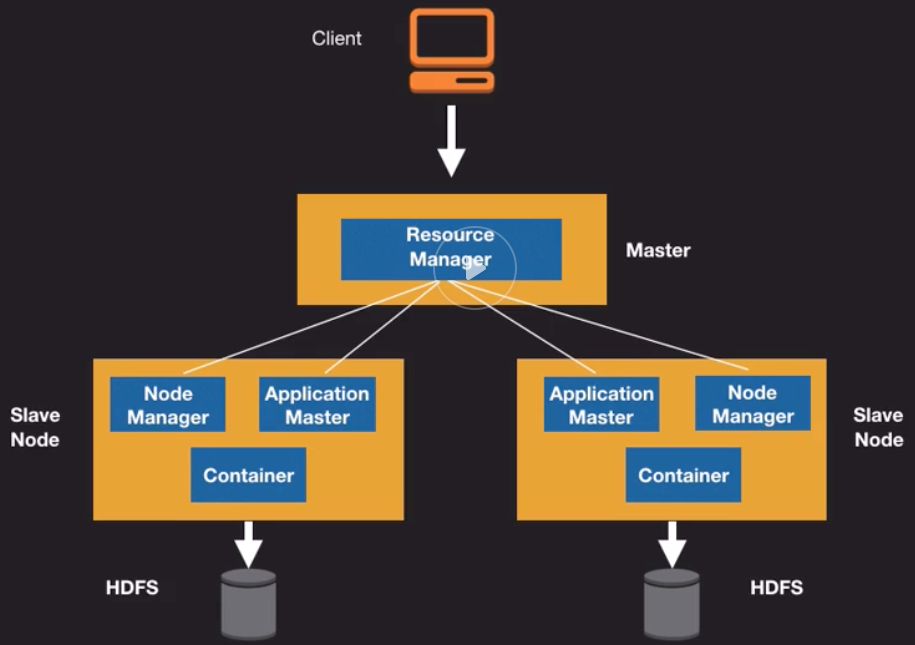
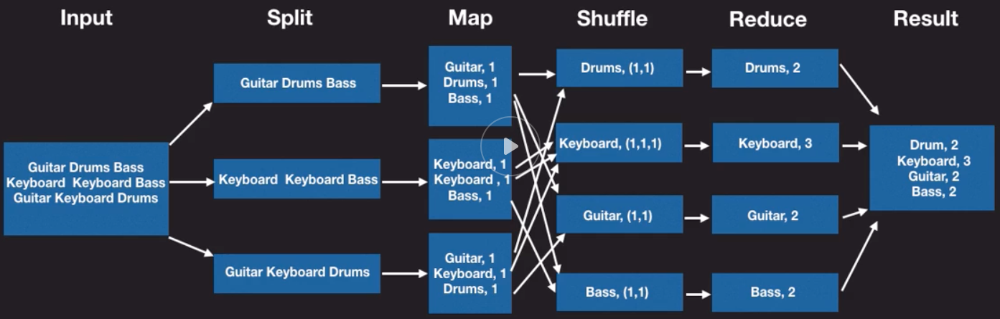
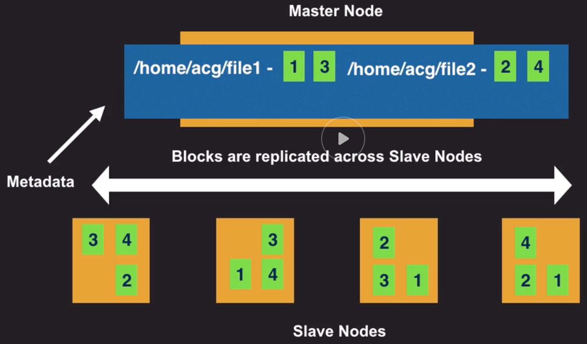

# EMR

## Introduction
- Elastic Map Reduce
- Managed cluster platform
- Process and analyze large amounts of data
- MapReduce
- Uses big data frameworks and open-source projects
    - Apache Hadoop
    - Apache Spark
    - Presto
    - Apache HBase
    - Zeppelin, Ganglia, Pig, Hive, Sqoop, Hue and Oozie
- Use Cases
    - Log processing/analytics
    - Extract, Transform and Load (ETL)
    - Clickstream Analysis
    - Machine Learning

## Apache Hadoop
- It is a framework that allows distributed processing of large data sets across clusters of computers using simple programming models
- Can scale up from single servers to thousands of machines, each offering local computation and storage
- The library itself is designed to detect and handle failures at the application layer
- Architecture
    - Modules
        - Hadoop Common (aka Hadoop Core)
            - Libraries and utilities needed by other hadoop modules
            - Abstraction of the underlying operating system and its file system
            - Contains necessary jar files and scripts required to start Hadoop
        - Hadoop Distributed File System (HDFS)
            - Distributed File System
            - Highly fault-tolerant
            - Data replication
            - High throughput access to data
        - Hadoop YARN
            - Stands for:  "Yet Another Resource Negotiator"
            - Helps with cluster resource-management and job scheduling
        - Hadoop MapReduce
            - Programming framework for Processing very large data sets 
            - Parallel, distributed algorithm on a cluster
            - File System (unstructured)
            - Database (structured)
            - Data locality 
            - MapReduce Job Tasks
                - Map
                    - Splits data into smaller chunks
                    - Processed in parallel
                - Reduce
                    - Outputs of map tasks become input for the reduce task
                    - Data is reduced to create an output file
    - 
    - Map Reduce Phases
        - 

## EMR Architecture
- Master Node
    - Single master node in EMR Cluster
    - Manages the resources of a cluster
- Core Node
    - Same as slave node in Hadoop
    - Run tasks as directed by master node
    - Stores data in HDFS or EMRFS
    - Runs the NodeManager daemon
    - ApplicationMaster
    - "Shrink" operation
- Task Node
    - Slave node
    - Optional
    - No HDFS
- Instance Groups
    - Collections of EC2 instances
    - EMR Cluster can have up to 50 instance groups
- HDFS
    - Provides a global namespace
    - Holds metadata about directories and files
    - Is a block structured file system
        - Individual files are broken down into blocks of a fixed size
    - 
    - Block sizes and files tend to be large
        - Why are block sizes large?
            - Minimize random disk seeks and lateny
    - No limit on large block size, vary from 64 MB to 256 MB
    - Ideal size depends on the data
    - Data is laid sequentially on disk
    - Block sizes can be set per fil
    - Replication factor
        - Set in the hdfs-site.xml file
- Storage Options
    - Instance Store
        - Use if require high I/O performance or high IOPS at low cost
        - D2 and I3 instatnce types
    - EBS for HDFS
        - Volumes do not persist after cluster termination
    - EMR File System
        - Implementation of HDFS which allows clusters to store data on S3
        - Uses data directly on S3 without ingesting into HDFS
    
        