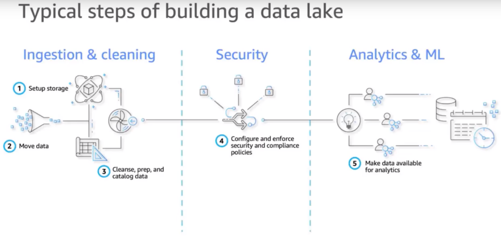
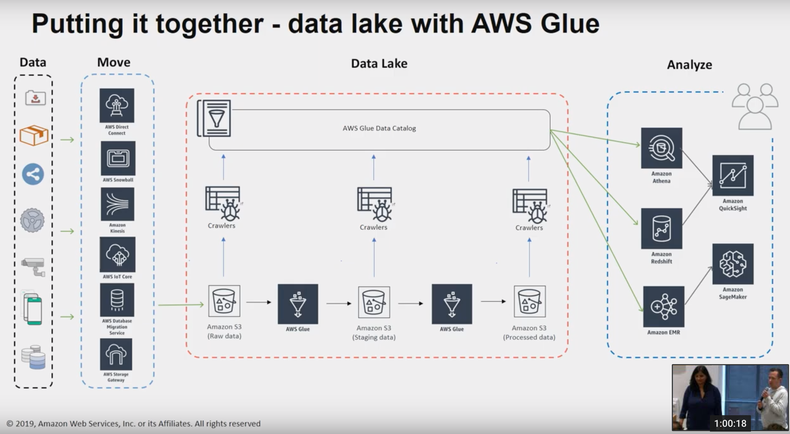
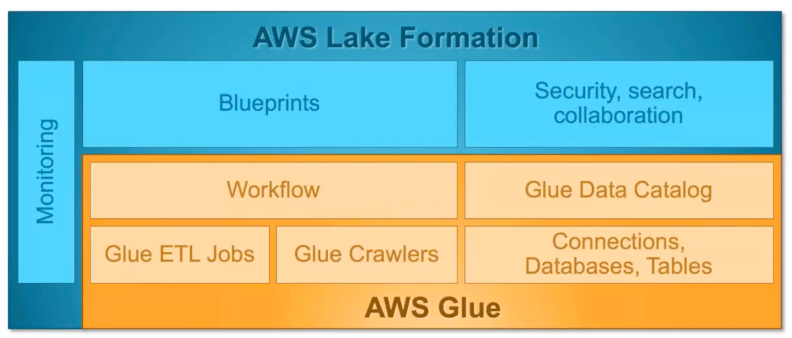

# Building your data lake on AWS
- Think about next 15 years
- data grows 10x every 5 years
- Teams and people accessing data:
    - Data scientists
    - Business users
    - Analysts
    - Applications
- Find right balance between `democratization of data` and `governance & control`
- A data lake is a centralized repository that allows you to store all your structured and unstructured data at any scale

## Concepts of a data lake
- All data in one place (Single source of truth)
- Handles structured, semi-structured, unstructured, raw data
- Supports fast ingestion and consumption
- Schema on read
- Designed for low-cost storage
- Decouples storage and compute
- Supports protection and security rules
- Data lakes have 3 stages:
    1. Landing dock/bronze zone/swamp
        - raw data written as it comes
    2. Pond/Silver zone/refinery
        - staging data, doing some modifications, exploratory analysis
    3. Catalog/Lagoon/Gold zone
        - Ready to be consumed
- Loading, transforming and cataloging is only done once

## Architectural principles
- Build decoupled systems
    - Data-->Store-->Process-->Store-->Analyze-->Answers
- Use the right tool for the right job
- Use event-journal design patterns
    - materialized views/immutable data sets
- ML enable your applications

## Steps in building a data lake
1. Setup storage
2. Move data
3. Cleanse, prep, and catalog data
4. Configure and enforce security and compliance policies
    - Security at column level, row level
    - PII level
    - Audit data access
5. Make data available for analytics
- 
- Sample steps
    - Find Sources
    - Create S3 locations to store data
    - Configure access policies
    - Map data catalog tables to Amazon S3 locations
    - Write ETL jobs to load and clean data
    - Create metadata policies in Glue Catalog
    - Configure acess from analytics services (ex:  hive, presto, etc.)

## S3 is the base
- Secure, highly scalable, durable
- Supports any type of data
- Any format:
    - Unstructured (logs, dump files)
    - Semi-structured (JSON, XML)
    - Structured (CSV, Parquet)
- Supports storage lifecycle integration
    - Standard, Infrequent, Glacier
- Natively supported by big data frameworks (Spark, Hive, Presto, etc.)

## Ways to move data into the Data Lake
- Data movement from your datacenters
    - AWS Direct Connect
    - AWS Snowball
    - AWS Snowmobile
    - AWS Database Migration Service
    - AWS Storage Gateway
- Data movement from real-time sources
    - AWS ioT core
    - Amazon Kinesis Data Firehose
    - Amazon Kinesis Data Streams
    - Amazon Kinesis Video Streams

## AWS Glue:  Serverless data catalog & ETL service
- Automatically discovers data and stores schema
- Data searchable, and available for ETL
- Generates customizable code
- Schedules and runs your ETL jobs
- Serverless, flexible, and built on open standards (Apache Spark)
- Crawlers
    - Automatically build your data catalog and keep it in sync
    - Automatically discover new data, extracts schema definitions
        - Detect schema changes and version tables
        - Detect hive style partitions on Amazon S3
    - Build-in classifiers for popular types; custom classifiers using `Grok expression`
    - Run ad hoc or on a schedule; serverless - only pay when crawler runs
- 
- AWS Glue Components
    - Data Catalog (Discover)
        - Automatic Crawling
        - Apache Hive metastore compatible
        - Integrated with AWS analytic services
    - Serverless Engine (Develop)
        - Apache Spark
        - Python shell
        - Interactive and batch jobs
    - Orchestration (Deploy)
        - Flexible workflows
        - Monitoring and alerting
        - External integrations

## Lake Formation (build a secure data lake in days)
- Lake formation is a set of tools that enable data engineers, security officers & data analysts to build, manage and use your data lake
- Value propositions:
    1. Move, store, catalog, and clean your data faster
    2. Enforce security policies across multiple services
    3. Gain and manage new insights
- 

## Questions for AWS gurus
- Best practices for Data Lake formation?

## Athena
- Athena uses Presto

## Contacts

## References
- https://www.youtube.com/watch?v=25FV_2bj-Mo
- https://aws-quickstart.s3.amazonaws.com/quickstart-demo-47lining-datalake-foundation/doc/data-lake-foundation-on-aws-demo-and-walkthrough.pdf
- https://aws.amazon.com/quickstart/architecture/data-lake-foundation-with-aws-services/
- https://www.youtube.com/watch?v=slaJ6wVVb0c
- https://www.youtube.com/watch?v=TAkcRD6OxPw