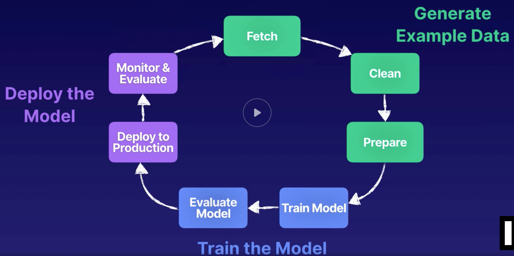

# Data Collection
- Machine Learning Cycle:
    - 
    - Represents Iterative process of Machine learning
- Questions to ask ourselves before beginning:
    - What type of generalization are we seeking?
    - Do we really need ML?
    - How will ML generalization be consumed?
    - What do we have to work with?
        - What kind of data we have?
    - How can I tell if the generalization is working?
- Good Data traits:
    - Large data sets
    - Precise attribute types, feature rich
        - relevant to the problem at hand
    - Complete fields, no missing values
    - Values are consistent
    - Solid distribution of outcomes
    - Fair sampling
- Try to have at least 10x as many data points as total number of features
- Try to find a way to consolidate data into a single data repository

## Brief History of ML
- Arthur Samuel published paper in IBM journal 1959
    - Idea of programming a computer so that it can be programmed to play a better game than the person who wrote the program
    - Program was good enough to beat Samuel himself

## General Data Terminology
- DataSets
    - Data used in ML
    - input data == training data == testing data
    - column == attribute == feature
    - row == observation == sample == data point
    - Formats:
        - json
        - csv
- Structured Data
    - Has a defined schema
    - Ideal data
- Unstructured Data
    - no defined schema or structural properties
    - Ex:  pdfs, images, log files
- Semi-structured
    - Some organizational data
- Types of data repositories:
    - Databases
    - Data warehouses
        - Collect data from different sources
        - Traditionally there's processing before data lands in data warehouse
    - Data lakes
        - Traditionally there's no processing before dumping data

## Machine Learning Data Terminology
- A lot of technobabble in this domain
- Data in ML models is defined as:
    - Labeled Data
        - Data where we already know the target attribute
        - Exs:  
            - Email data where we know whether it is spam or not
            - Images with names associated to them
            - Housing prices
        - Most of the time used for Supervised Learning
    - Unlabeled Data
        - Data with no target attribute
        - Exs:
            - Log files
            - Audio streams
            - news articles
        - Most of the time used for Unsupervised Learning
- Features within our data:
    - Categorical
        - Values associated with a group
        - Qualitative
    - Continuous
        - Values expressed as a measurable number
        - Quantitative
- Text Data (Corpus Data)
- Ground Truth
    - Factual data that has been observed or measured
    - Can be trusted as "truth" data
    - Amazon Sagemaker ground truth
        - Tool that helps build ground truth datasets
        - Allows to easilty create labeled data
- Image Data
    - Datasets with tagged images
    - Free repositories:
        - MNIST data
            - handwritten classified data
            - http://yann.lecun.com/exdb/mnist/
        - Image Net
            - http://www.image-net.org/
- Time Series Data
    - Exs:
        - Stock market prices
        - IOT sensors

## AWS Data Stores
- S3
    - This is where we want to get our ML model
- RDS
- DynamoDB
- Redshift
    - Redshift Spectrum
    - Quicksight 
- Timestream
- DocumentDB
    - A place to migrate your MongoDB data

## AWS Migration Tools
- Data Pipeline
    - Supports different activity objects
    - Can be used as transformation or data moving tool
- DMS
    - Database Migration Service
    - Doesn't support complex transformations
    - Handles heavylifting for resources required to transfer your data
- AWS Glue
    - Fully managed ETL 
    - Creates Meta Data Tables
    - Load data from one Data source to another

## AWS Helper Tools
- EMR
    - Fully Managed Hadoop Cluster ecosystem that runs on multiple EC2 instances
    - Pick and choose different frameworks to run within the cluster
        - Spark
        - Presto
        - Mahout
        - Hive
        - Jupyter
        - TensorFlow
        - Hadoop HDFS
- Athena
    - Serverless platform that allows you to run SQL queries on S3 data

## Sagemaker
- One stop shop for ML within AWS