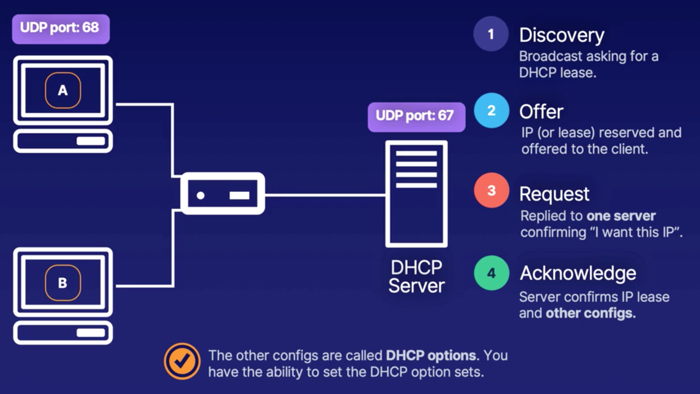
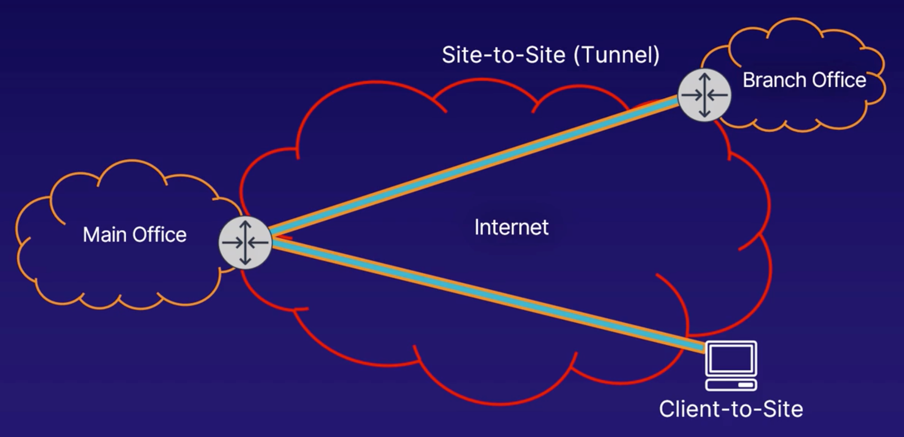
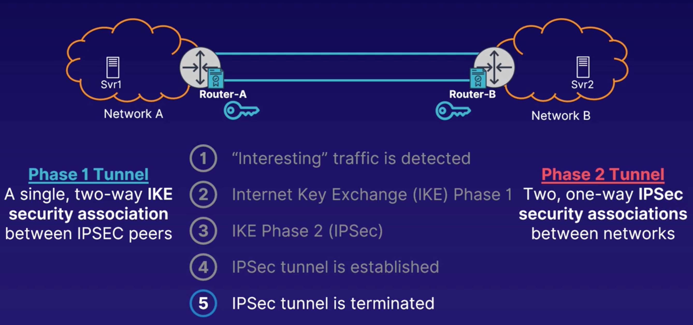
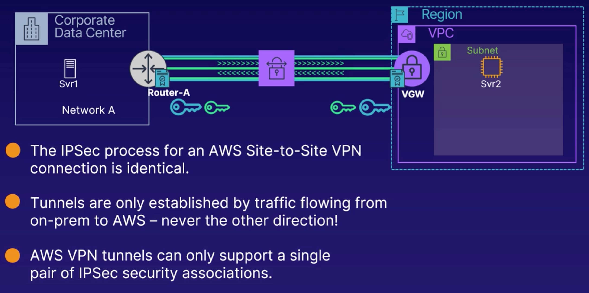
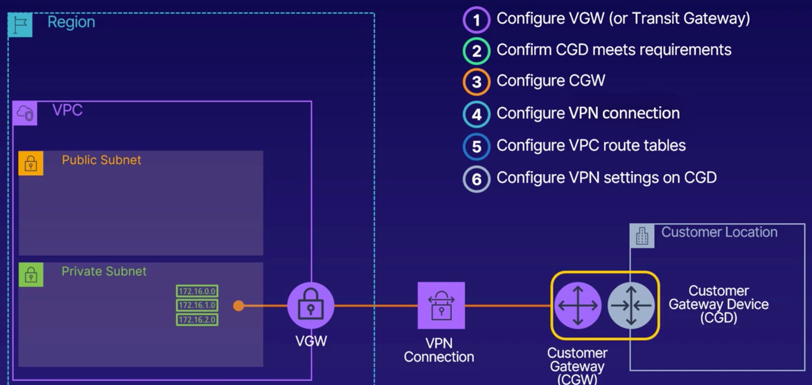
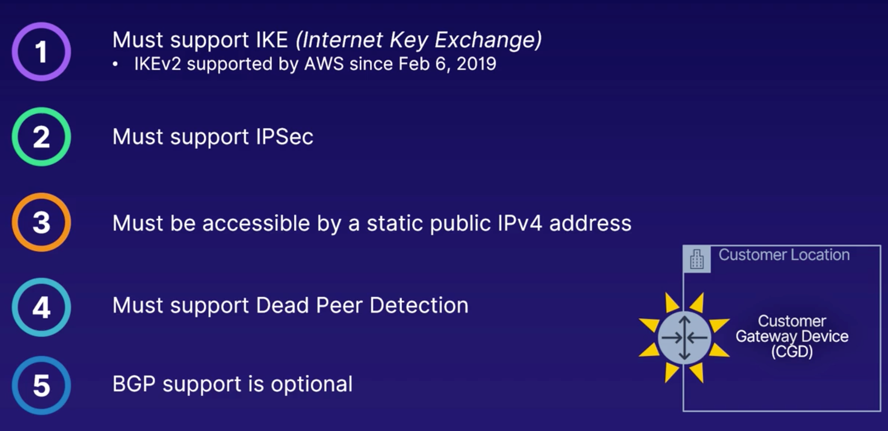
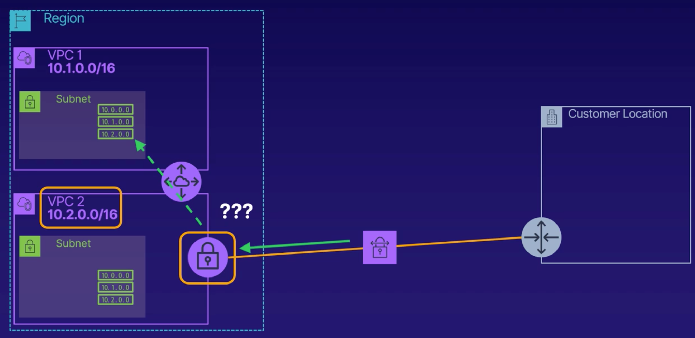
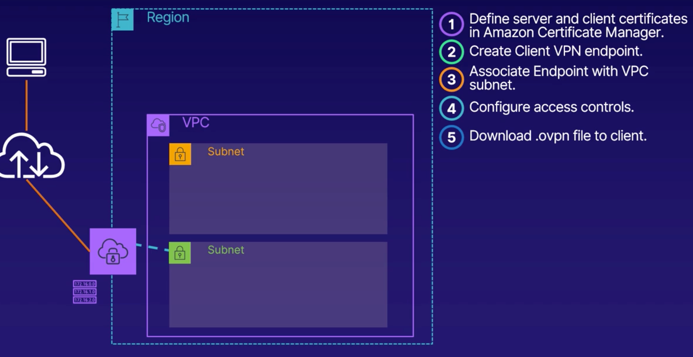

## DNS
- private hosted zones
## VPC and Basic Networking Design
- VPC Gateway sits at the VPC edge
- CIDR block has to be sized between /16 and /28
- SGs are not tied to instance but to an ENI
## Routing Tables
- The most specific routing preffix in a routing table is preferred
    - Ex:  Route for a VPC Endpoint would be preferred over default route of 0.0.0.0/0 to IGW
## Security Groups
- Applicable to EC2 instances, RDS instances, ELBs
- Scoped to a VPC
- SGs are at the object level whereas NACLs are at the subnet level
- Only supports Allow
- Can reference any AWS networking object
## NACLs
- Are subnet-scoped
- Stateless:  don't care about the state of the bucket (inbound vs outbound)
- Support both Allow and Deny
## Virtual Private Gateways (VGW)
- Logical entity highly available by design and attached to the VPC
- Anything that connects to the VGW connects to multiple VPN Endpoints
- *Virtual Private Gateway Example*
- 1 VGW in one VPC can talk to multiple CGWs on the customer site
- Can only use private ASN (Autonomous Service Numbers)
- VGWs only attack to a single AWS VPC at a time but can connect to multiple AWS VPN or Direct Connect connections
- VGWs must be assigned a private ASN in order to support potential BGP route learning
- Once created, a VGW's properties cannot be edited
## Subnet Architecture Types
- 
## Multi-VPC Architecture
- *Shared Services Multi VPC*
## VPC DHCP (Dynamic Host Configuration Protocol)
- Enables devices to request IP addresses and network configurations so they can communicate with one another
- Can assign IP addresses, subnet masks, local gateways, local DNS server, Voice over IP configurations
- *DHCP Overview*
## VPN and IPSec Overview
- VPN Tunnels are logical and not physical
- 2 types of VPN:
    - *Types of VPNs*
    1. Site to Site VPN (Tunnel)
    1. Client to Site VPN
- AWS managed site to site VPN connections only support IPSEC VPNs and IPV4
- Establishing an IPSEC tunnel:
    - Before establishing the connection VPN Endpoint Systems on each network must be pre-configured:
        - Identity of other endpoint
        - Shared authentication method
        - Security Policies
        - "Interesting" traffic (policy-based or route-based)
    - *VPN Sequence of Events*
- *AWS Site to Site VPN Gotchas*

## Customer Gateways
- *AWS Site to Site VPN Components*
- AWS Site to Site Connections Can use Static or Dynamic Route Learning (BGP is only dynamic route learning protocol supported by AWS)
- *Customer Gateway Device Requirements*

## AWS Site to Site VPN
- AWS creates 2 tunnel endpoints in different AZs per VPN Connection
    - Active/Passive, only one used but 2 for DR support in case one tunnel endpoint fails
    - Tunnel configurations for both endpoints must be configured at the CGD (Customer Gateway Device)
- VPN connection charges apply once you create the VPN setup in AWS even if there's no tunnel setup 
- AWS provides downloadable instructions to configure tunnel creation from CGD (Customer Gateway Device)
    - Will contain specifics for 2 tunnel interfaces
- Limitations:
    - VGWs are not VPC Transitive
        - VGWs (Virtual Private Gateways) won't be able to route traffic to another VPC even if that other VPC is connected using VPC Peering
        - *VGWs are not VPC Transitive*
        - Workaround:  Separate VPN connection for each VPC
    - VGW VPN throughput is capped at 1.25 Gbps over all VPN connections
        - Adding more VPN connections won't help because the cap happens at the Virtual Private Gateway
        - You also can only have one VGW per VPC
    - VGW always uses a single VPN tunnel endpoint when returning traffic to a network
    - Each AWS VPN IPSec tunnel only supports a single pair of one-way security associations
        - Solution 1:  Single Policy matching all possible VPN traffic
        - Solution 2:  Switch to Route-based VPN
    - AWS site to site VPN only supports the IPSEC protocol
    - AWS site to site VPN only supports IPv4
    - AWS site to site VPN cannot receive client to site connections

## AWS Client VPN 
- AWS Client VPN is a managed option for securely accessing AWS and on-prem resources using an OpenVPN Client
- *AWS Client VPN Configuration Overview*

## VPC Endpoints
- Only works presently with S3 and dynamoDB
- Helpful for private-only network
- *VPC Endpoint for S3 in a private subnet*
- Endpoints are a region service
- Endpoints aren't extendable across VPC boundaries
- DNS Resolution is needed within the VPC
- Default VPCE policy is unrestricted - can be locked down
- Controlling access to VPCE via NACL is problematic
- VPC Endpoint policy example:
    ```
    {
    "Statement": [
        {
        "Sid": "Access-to-my-bucket-only",
        "Principal": "*",
        "Action": [
            "s3:GetObject",
            "s3:PutObject"
        ],
        "Effect": "Allow",
        "Resource": ["arn:aws:s3:::my-bucket",
                    "arn:aws:s3:::my-bucket/*"]
        }
    ]
    }
    ```
- S3 bucket policy restricting access to VPC endpoint example:
    ```
    {
    "Version": "2012-10-17",
    "Id": "Policy1415115909152",
    "Statement": [
        {
        "Sid": "Access-to-specific-VPCE-only",
        "Principal": "*",
        "Action": "s3:*",
        "Effect": "Deny",
        "Resource": ["arn:aws:s3:::my-bucket",
                    "arn:aws:s3:::my-bucket/*"],
        "Condition": {
            "StringNotEquals": {
            "aws:sourceVpce": "vpce-1a2b3c4d"
            }
        }
        }
    ]
    }
    ```

## Hybrid Connectivity Options
- Software VPN vs Hardware VPN solution
- AWS VPC VPN aka AWS Hardware VPN
    - AWS Managed VPN Solution
- *AWS Managed VPC VPN Connectivity*
    - Solution parts:
        - VGW
        - CGW
        - CPE:  Customer Premise Equipment
        - IPSec
    - Prefer dynamic routing over static routing if router at customer facilities support BGP

