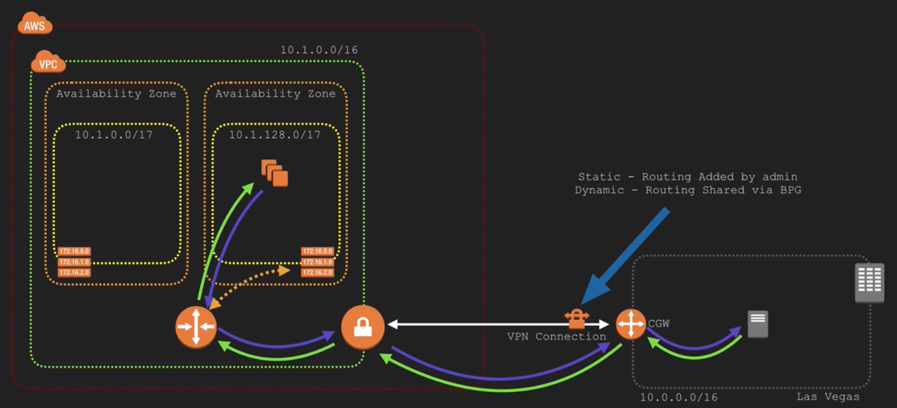
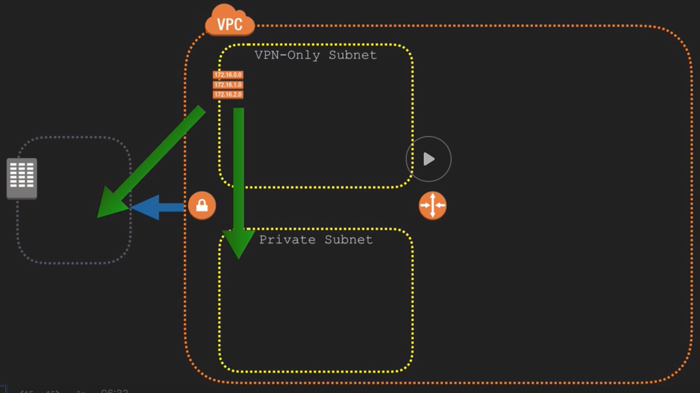
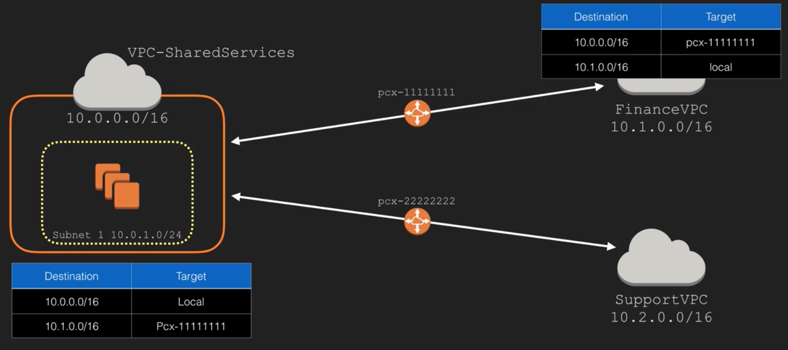
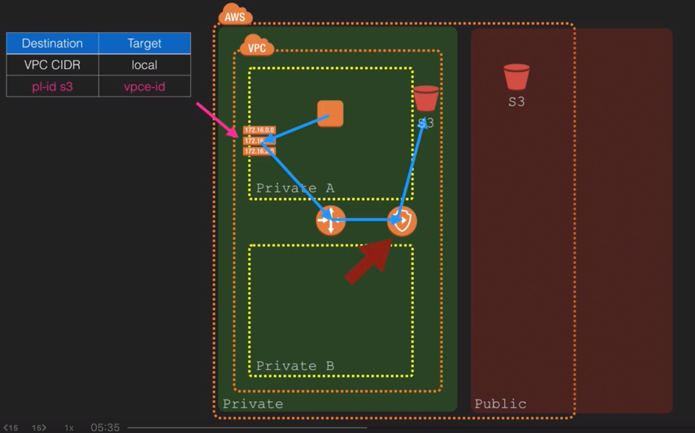
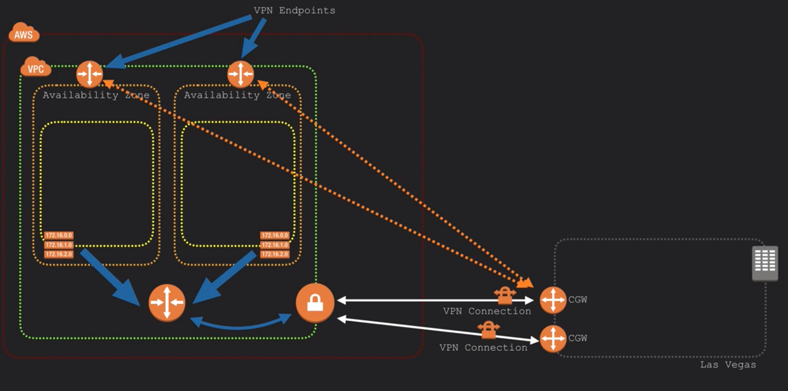

## DNS
- private hosted zones
## VPC and Basic Networking Design
- VPC Gateway sits at the VPC edge
- CIDR block has to be sized between /16 and /28
- SGs are not tied to instance but to an ENI
## Routing Tables
- The most specific routing preffix in a routing table is preferred
    - Ex:  Route for a VPC Endpoint would be preferred over default route of 0.0.0.0/0 to IGW
## Security Groups
- Applicable to EC2 instances, RDS instances, ELBs
- Scoped to a VPC
- SGs are at the object level whereas NACLs are at the subnet level
- Only supports Allow
- Can reference any AWS networking object
## NACLs
- Are subnet-scoped
- Stateless:  don't care about the state of the bucket (inbound vs outbound)
- Support both Allow and Deny
## Virtual Private Gateways (VGW)
- Logical entity highly available by design and attached to the VPC
- Anything that connects to the VGW connects to multiple VPN Endpoints
- *Virtual Private Gateway Example*
- 1 VGW in one VPC can talk to multiple CGWs on the customer site
## Subnet Architecture Types
- 
## Multi-VPC Architecture
- *Shared Services Multi VPC*

## VPC Endpoints
- Only works presently with S3 and dynamoDB
- Helpful for private-only network
- *VPC Endpoint for S3 in a private subnet*
- Endpoints are a region service
- Endpoints aren't extendable across VPC boundaries
- DNS Resolution is needed within the VPC
- Default VPCE policy is unrestricted - can be locked down
- Controlling access to VPCE via NACL is problematic

## Hybrid Connectivity Options
- Software VPN vs Hardware VPN solution
- AWS VPC VPN aka AWS Hardware VPN
    - AWS Managed VPN Solution
- *AWS Managed VPC VPN Connectivity*
    - Solution parts:
        - VGW
        - CGW
        - CPE:  Customer Premise Equipment
        - IPSec
    - Prefer dynamic routing over static routing if router at customer facilities support BGP

