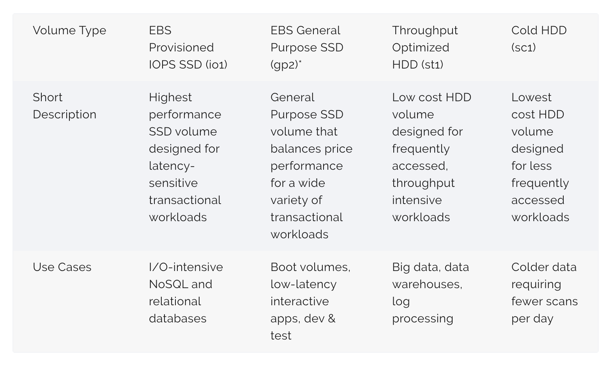
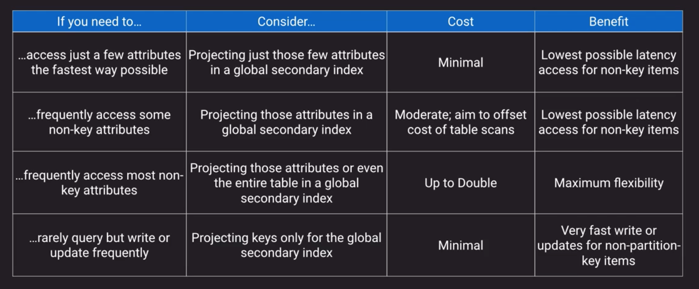
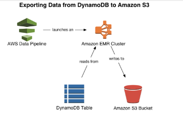
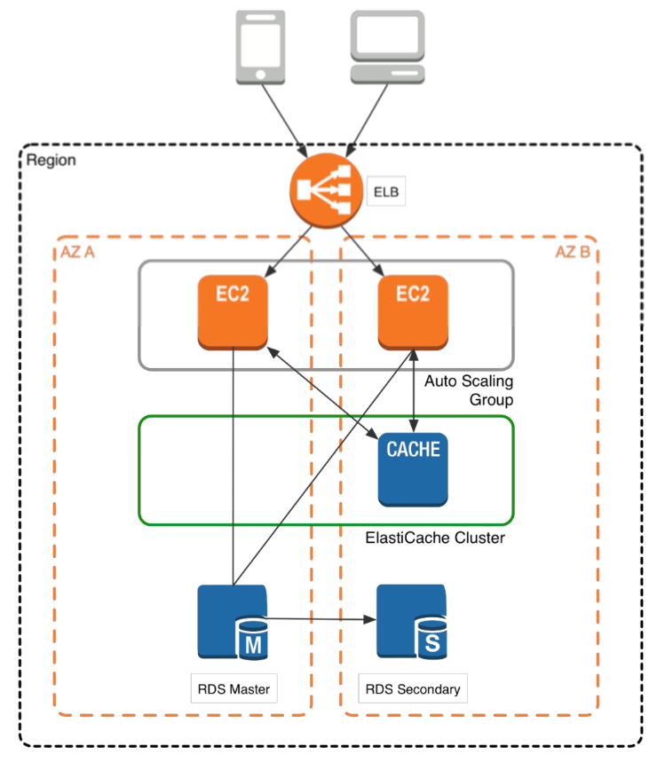

## Data Store Concepts
- Types of Data Stores
    1. Persistent Data Store
        - Data is durable and sticks around after reboots, restarts, or power cycles
        - Exampels:  Glacier, RDS
    2. Transient Data Store
        - Data is just temporarily stored and passed along to another process or persistent store
        - Examples:  SQS, SNS
    3. Ephemeral Data Store
        - Data is lost when stopped
        - Examples:  EC2 instance store, memcached
- IOPS vs Throughput
    - IOPS:  Input/Output Operations per second
        - Measure of how fast we can read and write to a device
    - Throughput:  
        - Measure of how much data can be moved at a time
- Consistency Models
    - ACID
        - Atomic
            - Transactions All or nothing
        - Consistent
            - Transactions cannot be corrupted
        - Isolated
            - Transactions can't mess with one another
        - Durable
            - Completed transaction must stick around
    - BASE
        - Basic Availability
            - Values availability even if stale
        - Soft state
            - Might not be instantly consistent across stores
        - Eventual COnsistency
            - Will achieve consistency at some point
- Stale data
    - Is an artifact of caching, in which an object in the cache is not the most recent version committed to the data source. 

## S3
- Object Store
- Maximum object size is 5TB; largest object in a single PUT is 5GB
- Recommended to use multi-part uploads if larger than 100MB
- Closer to a db than to a file system
    - s3://bucket/finance/april/16/invoice_45675.pdf (this is a key, not a file path!)
- *S3 Consistency Explained*
- *S3 Security*
- Supports versioning, old versions count as billable size until permanently delete
    - Integrated with Lifecycle Management
- Supports Cross-region replication
    - Scenarios:
        - Security
        - Compliance
        - Latency
- Lifecycle Management
    - Optimize storage costs
    - Adhere to data retention policies
- S3 Analytics
    - *S3 Analytics Integration with other Services*
- S3 Encryption at Rest
    - *S3 Encryption at Rest Options*
- *S3 Nifty Tricks*
- Multipart upload advantages:
    - Improved throughput—you can upload parts in parallel to improve throughput.
    - Quick recovery from any network issues—smaller part size minimizes the impact of restarting a failed upload due to a network error.
    - Pause and resume object uploads—you can upload object parts over time. Once you initiate a multipart upload there is no expiry; you must explicitly complete or abort the multipart upload.
    - Begin a upload before you know the final object size—you can upload an object as you are creating it.
- Hosting a static website:
    - Previously only allowed domain prefix when we are creating AWS Route53 aliases for AWS S3 static websites was the “www”, now you can use other subdomains:  Ex:  mydomain.com, downloads.mydomain.com    

## Amazon Glacier
- Cheap, slow to respond, should be seldom accessed
- Meant to be a long-term archive solution
- "Cold Storage"
- Used by AWS Storage Gateway Virtual Tape Library
- Integrated with AWS S3 via Lifecycle Management
- Faster retrieval options if you pay more
- You don't have to use S3 to use glacier, has its own API
- *Core Components of Glacier*
- Archives can be 40TB
- Archives and vault locks are immutable (you can only delete or overwrite)
- Vault lock process:
    1. Create a Glacier Vault Lock
    2. Initiate a Vault Lock
        - Have 24 hours to confirm vault lock
        - You can either abort or complete vault lock, once completed you can never change it
- Archives that have been locked and secured with a vault lock can never be changed

## Amazon EBS
- EBS highlights
    - Think "virtual hard drives"
    - Can only be used with EC2
    - Tied to a single AZ
    - Variety of optimized choices for IOPS, Throughput and cost
    - Support Snapshots
- Instance Stores highlights:
    - temporary
    - directly attached to only one instance
    - faster than EBS
    - ideal for caches, buffers, work areas
    - Data goes away when EC2 instance is stopped or terminated
- EBS Snapshots
    - Cost-effective and easy backup strategy
    - Useful to share data sets with other users or accounts
    - Migrate a system to a new AZ or Region
    - Convert unencrypted volume to an encrypted volume
    - As you take new snapshots they only occupy the diff data between the previous snapshot and the EBS new state when snapshot is taken
    - Snapshots can only be created every 2, 3, 4, 6, 8, 12 or 24 hours
    - Copying a snapshot to a new Region is commonly used for geographic expansion, migration, disaster recovery, etc.
    - EBS snapshots lifecycle policies contain some rules. One of the rules is that when you copy a snapshot created by a policy, the new copy is not influenced by the retention schedule.
- Data lifecycle Manager
    - Schedule snapshots for volumes or instances every X hours
    - Retention rules to remove stale snapshots
- *Use cases for different EBS Volume Types*
- The EBS volume types can be modified in flight without the volume being detached or the instance being restarted. However, there are some limitations that need to be noticed.

## Instance Store
- An instance store provides temporary block-level storage for your instance. This storage is located on disks that are physically attached to the host computer. 
- The instance type determines the size of the instance store available and the type of hardware used for the instance store volumes.
- To backup and migrate an instance store to an EBS volume:
    - Create a new EBS volume and attach the volume to EC2. Migrate the MySQL database to the EBS volume using a disk management or migration tool.
    - Backup the database filestore as is to S3.

## EFS
- Implementation of NFS File Share
- Elastic storage capacity, and pay for only what you use (in contrast to EBS)
- Multi-AZ metadata and data storage
- Configure mount-points in one or many AZs
- Can be mounted from on-premises systems (caution here, make sure to have direct connect, also NFS is not considered safe protocol)
- DataSync Service
    - Keeps on-premise storage in sync with EFS or S3
- around 3x more expensive than EBS
- around 20x  more expensive than S3
- EFS support two throughput modes to choose from for your file system:
    1. Bursting Throughput
        - With Bursting Throughput mode, throughput on Amazon EFS scales as your file system grows. File-based workloads are typically spiky, driving high levels of throughput for short periods of time.
    1. Provisioned Throughput. 
        - Allows applications configured to provision the throughput irrespective of the data stored inside the file system. This means applications with higher throughput requirements can use this mode to achieve higher performance.
        - Keep in mind that Provisioned Throughput is billed separately from the data storage depending on the capacity.
- The encryption of data at rest has to be enabled when the Amazon EFS file system is created. The encryption of data in transit can be enabled when the file system is mounted in EC2 instance
- Encryption of data in transit is enabled by connecting to Amazon EFS using TLS. It is recommend by AWS to use the `mount helper` because it's the simplest option. The helper is in the amazon-efs-utils package which is an open-source collection of Amazon EFS tools.
    - Example command:  ```sudo mount -t efs <EFS_File_System_Id> -o tls /mnt/efs ```
    - It is recommended to create mount targets in each of your VPC's AZ's so that EC2 instances across your VPC can access the file system

## Amazon Storage Gateway
- Virtual machine that you run on-premises with VMWare or HyperV or via a specially configured Dell hardware appliance
- Provides local storage resources backed by AWS S3 and Glacier
- Often used in disaster recovery preparedness to sync to AWS
- Useful in cloud migrations
- *Amazon Storage Gateway Types*
- iSCSI:
    - "Internet Small Computer Systems Interface"
    - Internet Protocol (IP)-based storage networking standard for linking data storage facilities
    - Provides block-level access to storage devices by carrying SCSI commands over a TCP/IP network
    - Used to facilitate data transfers over intranets and to manage storage over long distances
    - It can be used to transmit data over local area networks (LANs), wide area networks (WANs), or the Internet and can enable location-independent data storage and retrieval.
- *Scenario for Volume Gateway Cached Mode*
- Has a feature named:  "bandwidth throttling"
- All gateway-cached volume data and snapshot data is stored in Amazon S3 encrypted at rest using server-side encryption (SSE) and it cannot be visible or accessed with S3 API or any other tools.
- You can take point-in-time snapshots of gateway volumes that are made available in the form of Amazon EBS snapshots.

## Amazon Workdocs
- Amazon's version of dropbox or google drive
- Secure, fully managed file collaboration service
- Can integrate with AD for SSO
- Web, mobile, and native clients
- HIPAA, PCI DSS, and ISO compliance requirements
- Available SDK for creating complimentary apps

## Databases on EC2
- Run any database with full control and ultimate flexibility
- Must manage everything like backups, redundancy, patching, scale
- Good option if you require a db not supported by RDS such as IBM DB2 or SAP HANA
- Good option if it is not feasible to migrate to AWS-managed DB

## Amazon RDS
- Managed DB option for MysQL, MariaDB, PostgreSQL, Amazon Aurora (MySQL, PostgreSQL), Oracle, Microsoft SQL Server
- Best for structured, relational data store needs
- Aims to be a drop-in replacement for existing on-prem instances of same databases
- Automated backups and patching in customer-defined maintenance windows
- Push-button scaling, replication and redundancy
- *RDS Anti-patterns*
- Multi-AZ deployments are not a read scaling solution, you cannot use a standby replica to serve read traffic. The standby is only there for failover.
- Multi-AZ and Read Replicas maintain a copy of database but they are different in nature. Use Multi-AZ deployments for High Availability/Failover and Read Replicas for read scalability.
- MySQL note:  Non-transactional storage engines like MyISAM don't support replication, you must use InnoDB
- *Multi AZ Disaster Recovery*
- In RDS (Relational Database Service) multi-Availability Zone deployment if the primary DB instance fails the canonical name record (CNAME) is changed from primary to standby.
- Best practices include implementing database connection retry at the application layer
- Failovers, as defined by the interval between the detection of the failure on the primary and the resumption of transactions on the standby, typically complete within 1-2 minutes.
- Restoring a DB
    - You can restore a DB instance to a specific point in time, creating a new DB instance. When you restore a DB instance to a point in time, the default DB security group is applied to the new DB instance.
    - Steps to restore a DB instance to a specified time:
        1. Sign in to the AWS Management Console and open the Amazon RDS console at https://console.aws.amazon.com/rds/.
        1. In the navigation pane, choose Databases.
        1. Choose the DB instance that you want to restore.
        1. For Actions, choose Restore to point in time.
            The Launch DB Instance window appears.
        1. Choose Latest restorable time to restore to the latest possible time, or choose Custom to choose a time.
            - If you chose Custom, enter the date and time that you want to restore the instance to.
            - Note:
                - Times are shown in your local time zone, which is indicated by an offset from Coordinated Universal Time (UTC). For example, UTC-5 is Eastern Standard Time/Central Daylight Time.
        1. For DB instance identifier, enter the name of the restored DB instance, and then complete the other options.
        1. Choose Launch DB Instance.
- You need to use the database change (transaction) logs along with the backups to restore your database to a point in time.
- RDS on VMWare:
    - RDS on VMware lets you deploy managed databases in on-premises VMware environments using the Amazon RDS technology.
    - RDS on VMware does not support Amazon Aurora.
    - Requires vSphere v6.5 or higher VMware vSphere Enterprise Plus Edition
    - Features:
        - Patching for databases
        - Multi-AZ
        - backup and retention
    - Amazon RDS on VMware database instances can be easily migrated to Amazon RDS database instances in AWS with no impact to uptime.
        - You just need to promote the read-replica to be the new RDS instance.

## DynamoDB
- DynamoDB is a key value store with a maximum item size of 400KB.
- Managed, multi-AZ NoSQL data store with Cross-Region Replication option
- Eventual consistency usually takes less than a second
- Defaults to eventual consistency reads but can request strongly consistent read via SDK parameter
- Priced on throughput, rather than compute
- Provision read and write capacity in anticipation of need
- Autoscale capacity adjusts per configured min/max reads
    - Flip-side is that it doesn't scale back down
- If you have no idea on your capacity needs you can use on-demand capacity for flexible capacity at a small premium cost
- Option to achieve ACID compliance with DynamoDB Transactions
- DynamoBD terms:
    - A name-value pair is known as an `attribute`
    - An `item` is the whole collection of names+values
    - A `table` is a collection of items
    - Every record has to have a unique identifier or `primary key`
    - Can have a composite primary key with a `partition key` and a `sort key`
    - The primary key is used to generate a fixed hash to figure out the partition where the value gets stored, hence the name of `partition key`
    - *Secondary indexes definitions*
        - Global Secondary index
        - Local Secondary index
    - *Secondary indexes usage scenarios*
    - When you create a secondary index you need to select which attributes will be projected to that index
    - A secondary index resembles a view in RDBMS
    - No more than 20 across all indexes
    - *Secondary indexes Benefit vs Cost Scenarios*  
- Design best practices:
    - We can use global secondary indexes to create table replicas using same partition key and sort key as original table
        - The main table and Global Secondary Index can have different RCU/WCU Limits so we can assign each to different subsets of customers for example
    - We can use Global Seconday Index as a sort of replica table that is optimized for reads (high RCU) while the original table is optimized for writes (high WCU)
    - Replicas are eventually consistent so there will be a time between the update of a table and it being reflected on the Secondary index table
- DynamoDB Streams provide a time ordered sequence of item level changes that are also de-duplicated
- Read Capacity Units
    - A read capacity unit represents one strongly consistent read per second, or two eventually consistent reads per second, for an item up to 4 KB in size.
    - For example, suppose that you create a table with 10 provisioned read capacity units. This allows you to perform 10 strongly consistent reads per second, or 20 eventually consistent reads per second, for items up to 4 KB.
    - Reading an item larger than 4 KB consumes more read capacity units. For example, a strongly consistent read of an item that is 8 KB (4 KB × 2) consumes 2 read capacity units. An eventually consistent read on that same item consumes only 1 read capacity unit.
    - Item sizes for reads are rounded up to the next 4 KB multiple. For example, reading a 3,500-byte item consumes the same throughput as reading a 4 KB item.
- Write Capacity Units
    - A write capacity unit represents one write per second, for an item up to 1 KB in size.
    - For example, suppose that you create a table with 10 write capacity units. This allows you to perform 10 writes per second, for items up to 1 KB in size per second.
    - Item sizes for writes are rounded up to the next 1 KB multiple. For example, writing a 500-byte item consumes the same throughput as writing a 1 KB item.
- Amazon DynamoDB provides fast access to items in a table by specifying primary key values. However, many applications might benefit from having one or more secondary (or alternate) keys available, to allow efficient access to data with attributes other than the primary key. To address this, you can create one or more secondary indexes on a table, and issue Query or Scan requests against these indexes.
- Global Tables
    - Amazon DynamoDB global tables provide a fully managed solution for deploying a multiregion, multi-master database, without having to build and maintain your own replication solution. With global tables you can specify the AWS Regions where you want the table to be available. DynamoDB performs all of the necessary tasks to create identical tables in these Regions and propagate ongoing data changes to all of them.
- Exporting and Importing DynamoDB Data Using AWS Data Pipeline:
    - You can use AWS Data Pipeline to export data from a DynamoDB table to a file in an Amazon S3 bucket. You can also use the console to import data from Amazon S3 into a DynamoDB table, in the same AWS region or in a different region.
    - To export a DynamoDB table, you use the AWS Data Pipeline console to create a new pipeline. The pipeline launches an Amazon EMR cluster to perform the actual export. Amazon EMR reads the data from DynamoDB, and writes the data to an export file in an Amazon S3 bucket
    - *Exporting Data from DynamoDB to S3*  
-  CloudWatch metrics can tell the difference between `provisioned capacity` and `consumed capacity`, which helps understand what is the proper value to the provisioned capacity

## Amazon Redshift
- Stories on name origin:  Edwin Hubble's theory on whether a source of light is going away from us, and also going away from Oracle (red logo)
- Fully managed, clustered peta-byte scale data warehouse
- Extremely cost-effective as compared to some other on-premises data warehouse platforms
- PostgreSQL compatible with JDBC and ODBC drivers available; compatible with most BI tools out of the box
- Features parallel processing and columnar data stores which are optimized for complex queries
- Option to query directly from data files on S3 via Redshift Spectrum
- Data Lake
    - Large repository for a variety of data on top of which you place frameworks or technologies to make use of it
    - Allows you to shorten the distance from when you collect the data to when you can actually make sense of it
    - Simplifies the identification of correlations between disparate data sets
    - *Data Lake overview*
- Workload Management
    - Amazon Redshift workload management (WLM) enables users to flexibly manage priorities within workloads so that short, fast-running queries won't get stuck in queues behind long-running queries.
    - Amazon Redshift WLM creates query queues at runtime according to service classes, which define the configuration parameters for various types of queues, including internal system queues and user-accessible queues. 
    - When you run a query, WLM assigns the query to a queue according to the user's user group or by matching a query group that is listed in the queue configuration with a query group label that the user sets at runtime.

## Amazon Neptune
- Fully managed graph database
- Supports open graph APIs for both Gremlin and Sparql
- Optimized to deal with relationships
    - Examples:
        - Social Networks
        - Product recommendation engines

## Amazon Elasticache
- Full managed implementations of 2 popular in-memory data stores:  Redis and Memcached
- Push-button scalability for memory, writes and reads
- In Memory key/value store-not persistent in the traditional sense...
- Redis you have option to backup in datastore
- Billed by node size and hours of use
- *Use cases*
- *Memcached and Redis comparison*
- VPCs don't support multicast, only unicast
- *ElastiCache Sample High Level Architecture*


## Other Datastore Options
- Amazon Athena
    - SQL Engine overlaid on S3 base on Presto
    - Query raw objects as they sit in an S3 bucket
    - Use or convert your data to Parquet format if possible for a big performance jump
    - Similar in concept to Redshif Spectrum but:
        - *Athena vs Redshift Spectrum*
- Amazon Quantum Ledger Database (Amazon QLDB)
    - Based on blockchain concepts
    - Provides an immutable and transparent journal as a service without having to setup and maintain an entire blockchain framework
    - Centralized design (as opposed to decentralized consensus-based design for common blockchain frameworks) allows for higher performance and scalability
        - Descentralized take time for transactions to replicate among the nodes
    - Append-only concept where each record contributes to the integrity of the chain
    - *Conceptual overview of ledger db*
    - Ledge databases are immutable, you cannot change a record that has been written in a chain
- Amazon Managed Blockchain
    - Fully managed blockchain framework supporting open source frameworks of Hyperledger Fabric and Ethereum
    - Distributed consensus-based concept consisting of a network, members (other AWS accounts), nodes (instances) and potentially applications
    - Uses the Amazon QLDB ordering service to maintain complete history of all transactions
- Amazon Timestream Database
    - Fully managed database service specifically build for storing and analyzing time-series data
    - Alternative to DynamoDB or Redshift and includes some built-in analytics like interpolation and smoothing
    - Use cases:
        - Industrial machinery
        - Sensor Networks
        - Equipment Telemetry
- Amazon DocumentDB
    - compatible with "MongoDB"
    - AWS's invention that emulates the MongoDB API so it acts like MongoDB to existing clients and drivers
    - Fully managed with all the good stuff (multi-AZ HA, sclalable, integrated with KMS, backed up to S3)
    - An option if you currently use MongoDB and want to get out of the server management business
- Amazon ElasticSearch
    - Not to be confused with ElastiCache
    - Mostly a search engine but also a document store 
    - Amazon ElasticSearch Service (ES) components are sometimes referred to as an ELK stack
        - Analytics:  Kibana
        - Intake: LogStash (In AWS you can also use:  Cloudwatch, Firehose, IoT (GreenGrass))
        - Search and Storage:  ElasticSearch
    - Useful as analytics tool

## Comparing DB Options
- *Scenarios and DB Options*

## Pro Tips
- Archiving and backups is often a great "pilot" to build AWS business case
    - low risk and can show cost savings
- Make use of the S3 endpoints within your VPC
- Learn how to properly secure your S3 buckets
- Encrypt, Encrypt, Encrypt
- Consider Aurora for your production MySQL/Maria or PostgreSQL needs
- Consider NoSQL if you don't need relational database features
- Databases on EC2 cost less on the surface than RDS, but remember to factor in management (backups, patching, OS-level hardening)
- There can be a performance hit when RDS backups run if you have only a single AZ instance

## Answering Exam questions Tips
- Read what the question is asking first and then the details to focus the reading on the question
- No other constraints, don't INVENT external constraints based on your own background, don't overthink the solution

## Sample Questions
- In a Requester Pays setup the consumer requires an AWS account
- You have decided to use EFS for sharing files across many EC2 instances and you want to be able to tolerate and AZ failure. You should:
    - Create EFS mount targets in each AZ and configure each EC2 instance to mount the common mount target FQDN (Fully Qualified Domain Name)
- `Glacier Vault Lock` is an immutable way to set policies on a Glacier vault such as retention  or enforcing MFA before delete.
- What DynamoDB features can be utilised to increase the speed of read operations?
    - DynamoDB Accelerator (DAX)
        - works as an in-memory cache in front of dynamoDB
    - Secondary Indexes


## Other resources
- https://d0.awsstatic.com/whitepapers/AWS%20Storage%20Services%20Whitepaper-v9.pdf
- https://d1.awsstatic.com/whitepapers/Multi_Tenant_SaaS_Storage_Strategies.pdf
- https://d0.awsstatic.com/whitepapers/performance-at-scale-with-amazon-elasticache.pdf
- Deep Dive on AWS S3 & Amazon Glacier Storage Management
    - https://www.youtube.com/watch?v=SUWqDOnXeDw
- Deep Dive on Amazon Relational Database Service (RDS)
    - https://www.youtube.com/watch?v=TJxC-B9Q9tQ
- Amazon Elasticache Deep Dive:  Best Practices and Usage Patterns
    - https://www.youtube.com/watch?v=_YYBdsuUq2M
- Deep Dive:  Using Hybrid Storage with AWS Storage Gateway to Solve On-Premises Storage Problems
    - https://www.youtube.com/watch?v=9wgaV70FeaM
