## Data Store Concepts
- Types of Data Stores
    1. Persistent Data Store
        - Data is durable and sticks around after reboots, restarts, or power cycles
        - Exampels:  Glacier, RDS
    2. Transient Data Store
        - Data is just temporarily stored and passed along to another process or persistent store
        - Examples:  SQS, SNS
    3. Ephemeral Data Store
        - Data is lost when stopped
        - Examples:  EC2 instance store, memcached
- IOPS vs Throughput
    - IOPS:  Input/Output Operations per second
        - Measure of how fast we can read and write to a device
    - Throughput:  
        - Measure of how much data can be moved at a time
- Consistency Models
    - ACID
        - Atomic
            - Transactions All or nothing
        - Consistent
            - Transactions cannot be corrupted
        - Isolated
            - Transactions can't mess with one another
        - Durable
            - Completed transaction must stick around
    - BASE
        - Basic Availability
            - Values availability even if stale
        - Soft state
            - Might not be instantly consistent across stores
        - Eventual COnsistency
            - Will achieve consistency at some point
- Stale data
    - Is an artifact of caching, in which an object in the cache is not the most recent version committed to the data source. 

## S3
- Object Store
- Maximum object size is 5TB; largest object in a single PUT is 5GB
- Recommended to use multi-part uploads if larger than 100MB
- Closer to a db than to a file system
    - s3://bucket/finance/april/16/invoice_45675.pdf (this is a key, not a file path!)
- 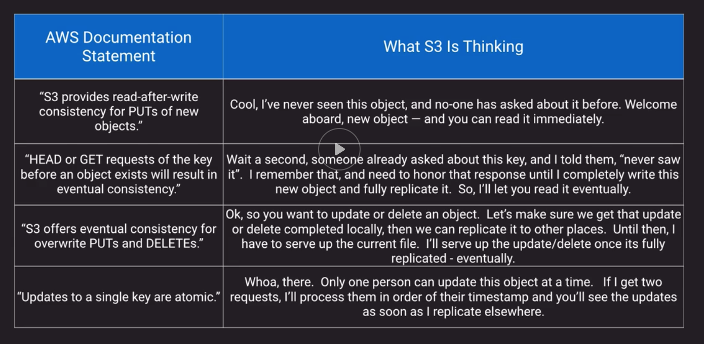
- 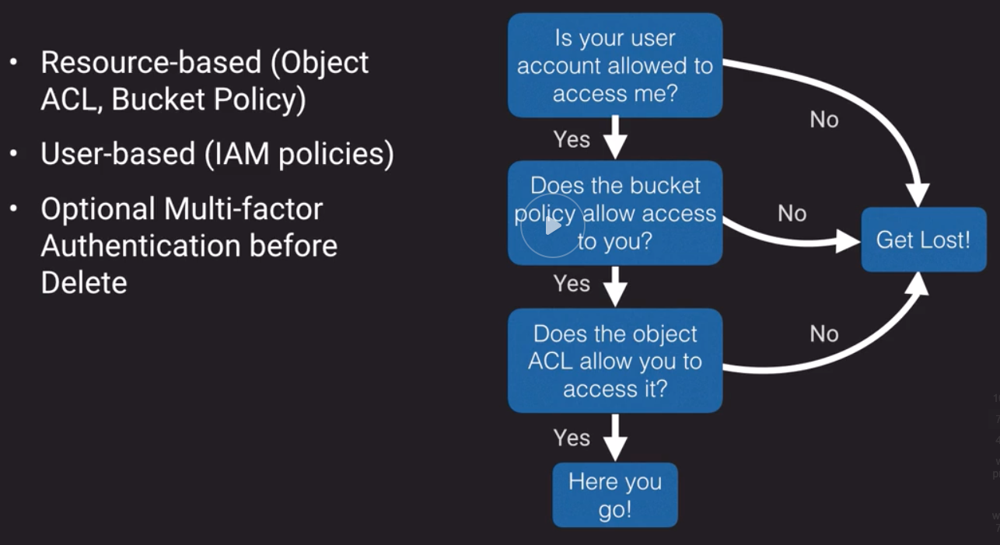
- Supports versioning, old versions count as billable size until permanently delete
    - Integrated with Lifecycle Management
- Supports Cross-region replication
    - Scenarios:
        - Security
        - Compliance
        - Latency
- Lifecycle Management
    - Optimize storage costs
    - Adhere to data retention policies
- S3 Analytics
    - 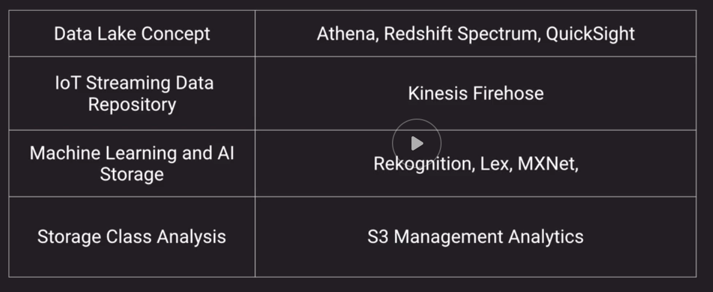
- S3 Encryption at Rest
    - 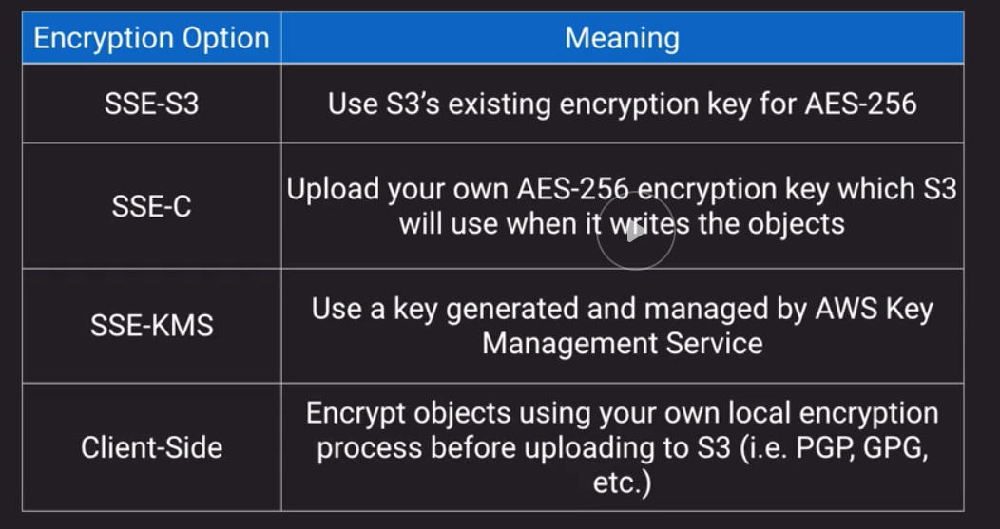
- 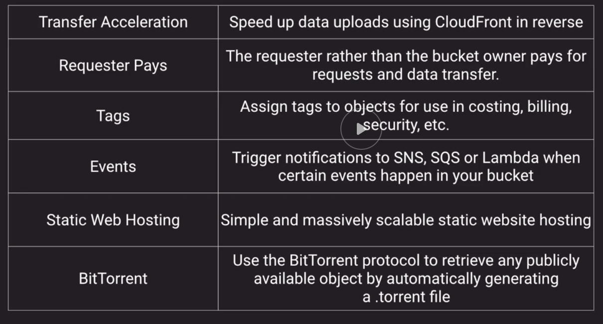

## Amazon Glacier
- Cheap, slow to respond, should be seldom accessed
- Meant to be a long-term archive solution
- "Cold Storage"
- Used by AWS Storage Gateway Virtual Tape Library
- Integrated with AWS S3 via Lifecycle Management
- Faster retrieval options if you pay more
- You don't have to use S3 to use glacier, has its own API
- 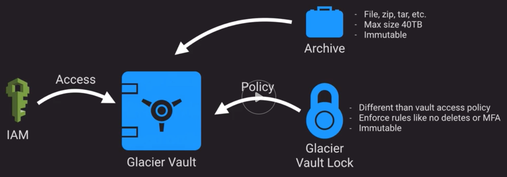
- Archives can be 40TB
- Archives and vault locks are immutable (you can only delete or overwrite)
- Vault lock process:
    1. Create a Glacier Vault Lock
    2. Initiate a Vault Lock
        - Have 24 hours to confirm vault lock
        - You can either abort or complete vault lock, once completed you can never change it
- Archives that have been locked and secured with a vault lock can never be changed

## Amazon EBS
- EBS highlights
    - Think "virtual hard drives"
    - Can only be used with EC2
    - Tied to a single AZ
    - Variety of optimized choices for IOPS, Throughput and cost
    - Support Snapshots
- Instance Stores highlights:
    - temporary
    - directly attached to only one instance
    - faster than EBS
    - ideal for caches, buffers, work areas
    - Data goes away when EC2 instance is stopped or terminated
- EBS Snapshots
    - Cost-effective and easy backup strategy
    - Useful to share data sets with other users or accounts
    - Migrate a system to a new AZ or Region
    - Convert unencrypted volume to an encrypted volume
    - As you take new snapshots they only occupy the diff data between the previous snapshot and the EBS new state when snapshot is taken
- Data lifecycle Manager
    - Schedule snapshots for volumes or instances every X hours
    - Retention rules to remove stale snapshots

## EFS
- Implementation of NFS File Share
- Elastic storage capacity, and pay for only what you use (in contrast to EBS)
- Multi-AZ metadata and data storage
- Configure mount-points in one or many AZs
- Can be mounted from on-premises systems (caution here, make sure to have direct connect, also NFS is not considered safe protocol)
- DataSync Service
    - Keeps on-premise storage in sync with EFS or S3
- around 3x more expensive than EBS
- around 20x  more expensive than S3

## Amazon Storage Gateway
- Virtual machine that you run on-premises with VMWare or HyperV or via a specially configured Dell hardware appliance
- Provides local storage resources backed by AWS S3 and Glacier
- Often used in disaster recovery preparedness to sync to AWS
- Useful in cloud migrations
- 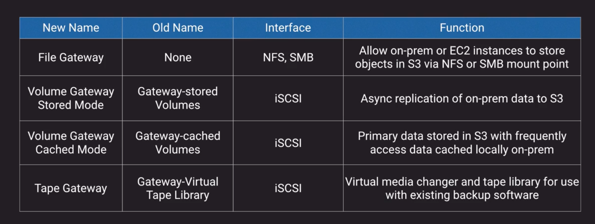
- iSCSI:
    - "Internet Small Computer Systems Interface"
    - Internet Protocol (IP)-based storage networking standard for linking data storage facilities
    - Provides block-level access to storage devices by carrying SCSI commands over a TCP/IP network
    - Used to facilitate data transfers over intranets and to manage storage over long distances
    - It can be used to transmit data over local area networks (LANs), wide area networks (WANs), or the Internet and can enable location-independent data storage and retrieval.
- 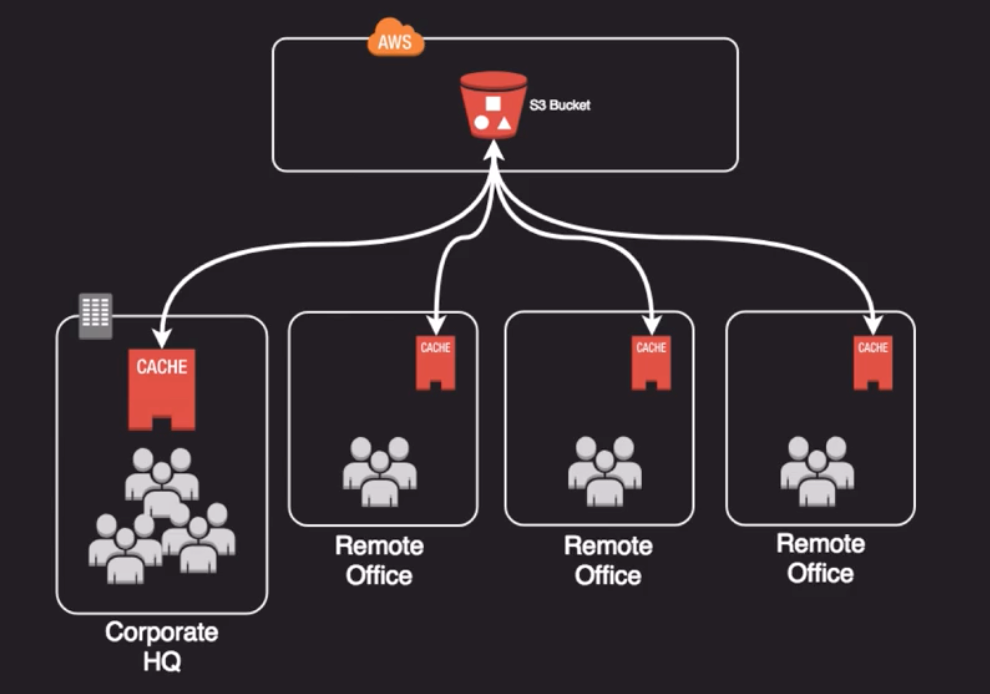
- Has a feature named:  "bandwidth throttling"

## Amazon Workdocs
- Amazon's version of dropbox or google drive
- Secure, fully managed file collaboration service
- Can integrate with AD for SSO
- Web, mobile, and native clients
- HIPAA, PCI DSS, and ISO compliance requirements
- Available SDK for creating complimentary apps

## Databases on EC2
- Run any database with full control and ultimate flexibility
- Must manage everything like backups, redundancy, patching, scale
- Good option if you require a db not supported by RDS such as IBM DB2 or SAP HANA
- Good option if it is not feasible to migrate to AWS-managed DB

## Amazon RDS
- Managed DB option for MysQL, MariaDB, PostgreSQL, Amazon Aurora (MySQL, PostgreSQL), Oracle, Microsoft SQL Server
- Best for structured, relational data store needs
- Aims to be a drop-in replacement for existing on-prem instances of same databases
- Automated backups and patching in customer-defined maintenance windows
- Push-button scaling, replication and redundancy
- 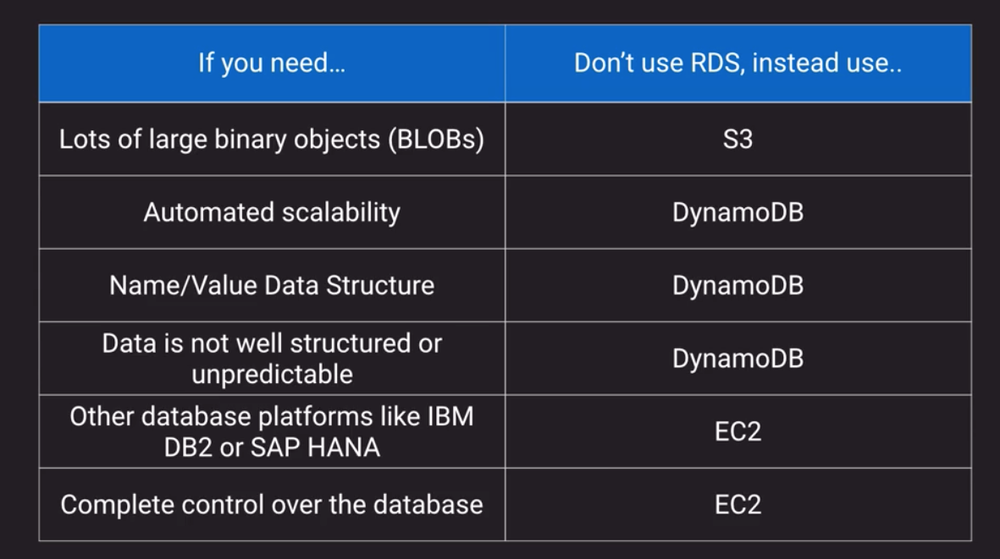
- Multi-AZ deployments are not a read scaling solution, you cannot use a standby replica to serve read traffic. The standby is only there for failover.
- Multi-AZ and Read Replicas maintain a copy of database but they are different in nature. Use Multi-AZ deployments for High Availability/Failover and Read Replicas for read scalability.
- MySQL note:  Non-transactional storage engines like MyISAM don't support replication, you must use InnoDB
- 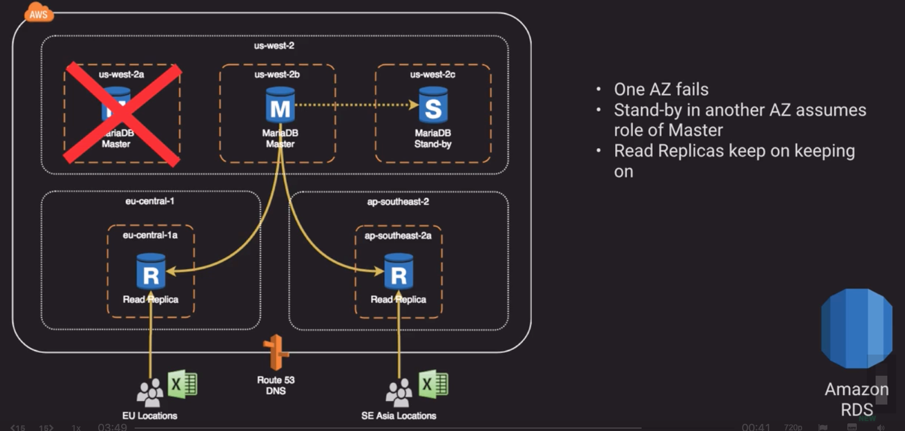

## DynamoDB
- DynamoDB is a key value store with a maximum item size of 400KB.
- Managed, multi-AZ NoSQL data store with Cross-Region Replication option
- Eventual consistency usually takes less than a second
- Defaults to eventual consistency reads but can request strongly consistent read via SDK parameter
- Priced on throughput, rather than compute
- Provision read and write capacity in anticipation of need
- Autoscale capacity adjusts per configured min/max reads
    - Flip-side is that it doesn't scale back down
- If you have no idea on your capacity needs you can use on-demand capacity for flexible capacity at a small premium cost
- Option to achieve ACID compliance with DynamoDB Transactions
- DynamoBD terms:
    - A name-value pair is known as an `attribute`
    - An `item` is the whole collection of names+values
    - A `table` is a collection of items
    - Every record has to have a unique identifier or `primary key`
    - Can have a composite primary key with a `partition key` and a `sort key`
    - The primary key is used to generate a fixed hash to figure out the partition where the value gets stored, hence the name of `partition key`
    - 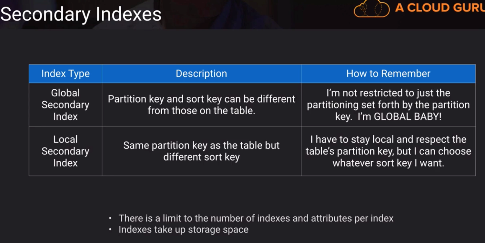
        - Global Secondary index
        - Local Secondary index
    - 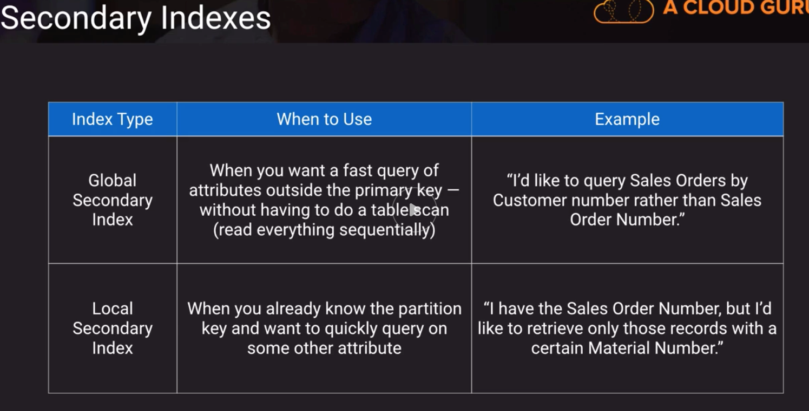
    - When you create a secondary index you need to select which attributes will be projected to that index
    - A secondary index resembles a view in RDBMS
    - No more than 
- Design best practices:
    - We can use global secondary indexes to create table replicas using same partition key and sort key as original table
        - The main table and Global Secondary Index can have different RCU/WCU Limits so we can assign each to different subsets of customers for example
    - We can use Global Seconday Index as a sort of replica table that is optimized for reads (high RCU) while the original table is optimized for writes (high WCU)
    - Replicas are eventually consistent so there will be a time between the update of a table and it being reflected on the Secondary index table
- DynamoDB Streams provide a time ordered sequence of item level changes that are also de-duplicated
- Read Capacity Units
    - A read capacity unit represents one strongly consistent read per second, or two eventually consistent reads per second, for an item up to 4 KB in size.
    - For example, suppose that you create a table with 10 provisioned read capacity units. This allows you to perform 10 strongly consistent reads per second, or 20 eventually consistent reads per second, for items up to 4 KB.
    - Reading an item larger than 4 KB consumes more read capacity units. For example, a strongly consistent read of an item that is 8 KB (4 KB × 2) consumes 2 read capacity units. An eventually consistent read on that same item consumes only 1 read capacity unit.
    - Item sizes for reads are rounded up to the next 4 KB multiple. For example, reading a 3,500-byte item consumes the same throughput as reading a 4 KB item.
- Write Capacity Units
    - A write capacity unit represents one write per second, for an item up to 1 KB in size.
    - For example, suppose that you create a table with 10 write capacity units. This allows you to perform 10 writes per second, for items up to 1 KB in size per second.
    - Item sizes for writes are rounded up to the next 1 KB multiple. For example, writing a 500-byte item consumes the same throughput as writing a 1 KB item.

## Amazon Redshift
- Fully managed, clustered peta-byte scale data warehouse
- Extremely cost-effective as compared to some other on-premises data warehouse platforms
- PostgreSQL compatible with JDBC and ODBC drivers available; compatible with most BI tools out of the box
- Features parallel processing and columnar data stores which are optimized for complex queries
- Option to query directly from data files on S3 via Redshift Spectrum
- Data Lake
    - Large repository for a variety of data on top of which you place frameworks or technologies to make use of it
    - Allows you to shorten the distance from when you collect the data to when you can actually make sense of it
    - Simplifies the identification of correlations between disparate data sets
    - 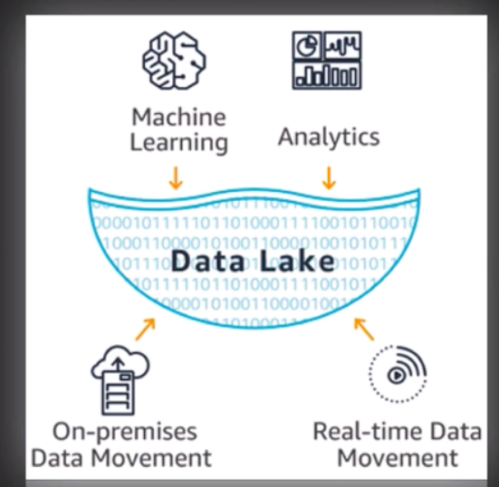
- Workload Management
    - Amazon Redshift workload management (WLM) enables users to flexibly manage priorities within workloads so that short, fast-running queries won't get stuck in queues behind long-running queries.
    - Amazon Redshift WLM creates query queues at runtime according to service classes, which define the configuration parameters for various types of queues, including internal system queues and user-accessible queues. 
    - When you run a query, WLM assigns the query to a queue according to the user's user group or by matching a query group that is listed in the queue configuration with a query group label that the user sets at runtime.

## Amazon Neptune
- Fully managed graph database
- Supports open graph APIs for both Gremlin and Sparql
- Optimized to deal with relationships
    - Examples:
        - Social Networks
        - Product recommendation engines

## Amazon Elasticache
- Full managed implementations of 2 popular in-memory data stores:  Redis and Memcached
- Push-button scalability for memory, writes and reads
- In Memory key/value store-not persistent in the traditional sense...
- Redis you have option to backup in datastore
- Billed by node size and hours of use
- 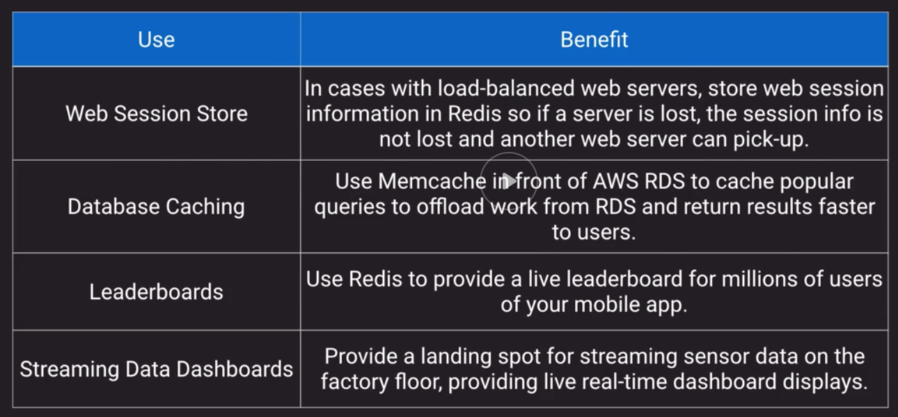
- 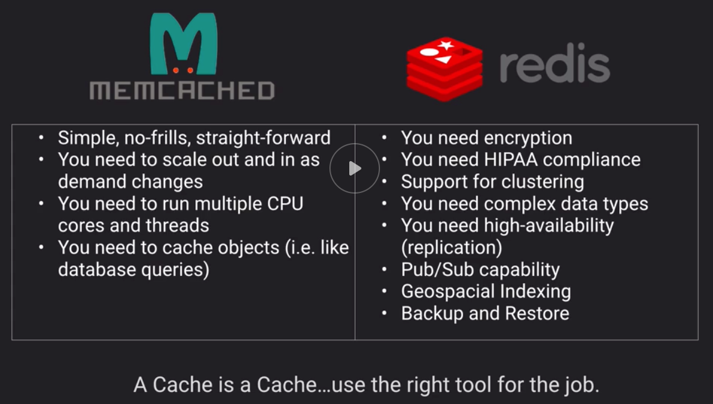
- VPCs don't support multicast, only unicast

## Other Datastore Options
- Amazon Athena
    - SQL Engine overlaid on S3 base on Presto
    - Query raw objects as they sit in an S3 bucket
    - Use or convert your data to Parquet format if possible for a big performance jump
    - Similar in concept to Redshif Spectrum but:
        - 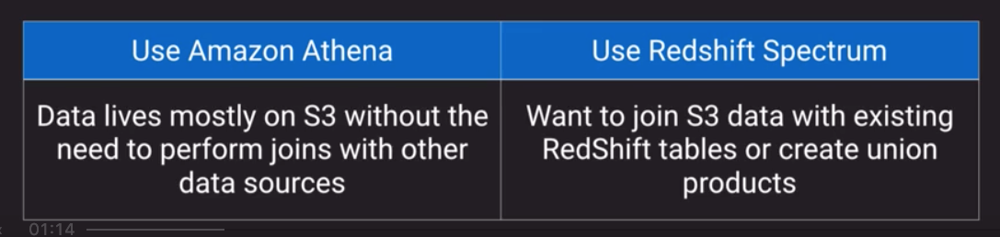
- Amazon Quantum Ledger Database (Amazon QLDB)
    - Based on blockchain concepts
    - Provides an immutable and transparent journal as a service without having to setup and maintain an entire blockchain framework
    - Centralized design (as opposed to decentralized consensus-based design for common blockchain frameworks) allows for higher performance and scalability
        - Descentralized take time for transactions to replicate among the nodes
    - Append-only concept where each record contributes to the integrity of the chain
    - 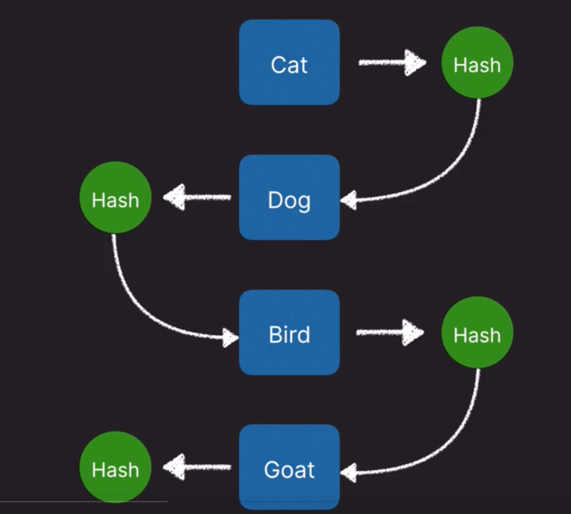
    - Ledge databases are immutable, you cannot change a record that has been written in a chain
- Amazon Managed Blockchain
    - Fully managed blockchain framework supporting open source frameworks of Hyperledger Fabric and Ethereum
    - Distributed consensus-based concept consisting of a network, members (other AWS accounts), nodes (instances) and potentially applications
    - Uses the Amazon QLDB ordering service to maintain complete history of all transactions
- Amazon Timestream Database
    - Fully managed database service specifically build for storing and analyzing time-series data
    - Alternative to DynamoDB or Redshift and includes some built-in analytics like interpolation and smoothing
    - Use cases:
        - Industrial machinery
        - Sensor Networks
        - Equipment Telemetry
- Amazon DocumentDB
    - compatible with "MongoDB"
    - AWS's invention that emulates the MongoDB API so it acts like MongoDB to existing clients and drivers
    - Fully managed with all the good stuff (multi-AZ HA, sclalable, integrated with KMS, backed up to S3)
    - An option if you currently use MongoDB and want to get out of the server management business
- Amazon ElasticSearch
    - Not to be confused with ElastiCache
    - Mostly a search engine but also a document store 
    - Amazon ElasticSearch Service (ES) components are sometimes referred to as an ELK stack
        - Analytics:  Kibana
        - Intake: LogStash (In AWS you can also use:  Cloudwatch, Firehose, IoT (GreenGrass))
        - Search and Storage:  ElasticSearch
    - Useful as analytics tool

## Comparing DB Options
- 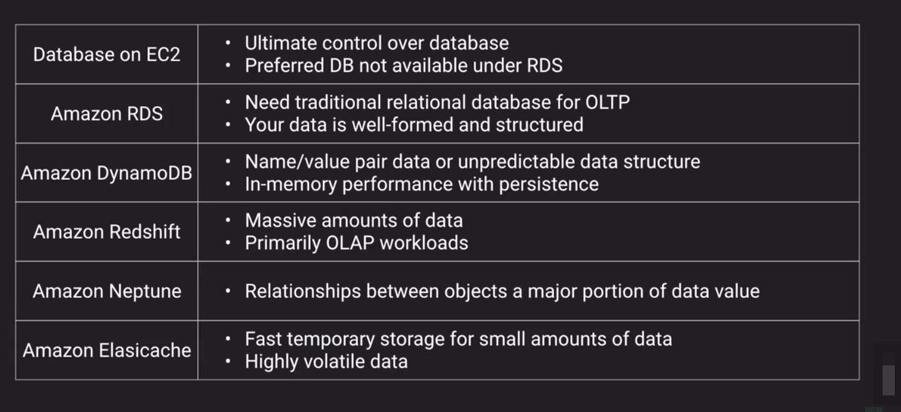

## Pro Tips
- Archiving and backups is often a great "pilot" to build AWS business case
    - low risk and can show cost savings
- Make use of the S3 endpoints within your VPC
- Learn how to properly secure your S3 buckets
- Encrypt, Encrypt, Encrypt
- Consider Aurora for your production MySQL/Maria or PostgreSQL needs
- Consider NoSQL if you don't need relational database features
- Databases on EC2 cost less on the surface than RDS, but remember to factor in management (backups, patching, OS-level hardening)
- There can be a performance hit when RDS backups run if you have only a single AZ instance

## Answering Exam questions Tips
- Read what the question is asking first and then the details to focus the reading on the question
- No other constraints, don't INVENT external constraints based on your own background, don't overthink the solution

## Sample Questions
- In a Requester Pays setup the consumer requires an AWS account
- You have decided to use EFS for sharing files across many EC2 instances and you want to be able to tolerate and AZ failure. You should:
    - Create EFS mount targets in each AZ and configure each EC2 instance to mount the common mount target FQDN (Fully Qualified Domain Name)
- `Glacier Vault Lock` is an immutable way to set policies on a Glacier vault such as retention  or enforcing MFA before delete.
- What DynamoDB features can be utilised to increase the speed of read operations?
    - DynamoDB Accelerator (DAX)
        - works as an in-memory cache in front of dynamoDB
    - Secondary Indexes

## Other resources
- https://d0.awsstatic.com/whitepapers/AWS%20Storage%20Services%20Whitepaper-v9.pdf
- https://d1.awsstatic.com/whitepapers/Multi_Tenant_SaaS_Storage_Strategies.pdf
- https://d0.awsstatic.com/whitepapers/performance-at-scale-with-amazon-elasticache.pdf
- Deep Dive on AWS S3 & Amazon Glacier Storage Management
    - https://www.youtube.com/watch?v=SUWqDOnXeDw
- Deep Dive on Amazon Relational Database Service (RDS)
    - https://www.youtube.com/watch?v=TJxC-B9Q9tQ
- Amazon Elasticache Deep Dive:  Best Practices and Usage Patterns
    - https://www.youtube.com/watch?v=_YYBdsuUq2M
- Deep Dive:  Using Hybrid Storage with AWS Storage Gateway to Solve On-Premises Storage Problems
    - https://www.youtube.com/watch?v=9wgaV70FeaM
