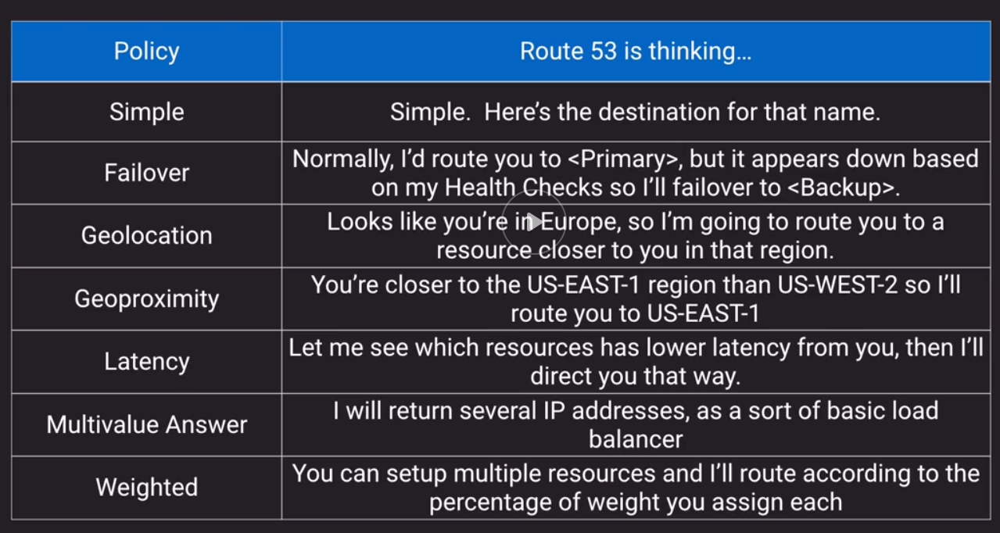
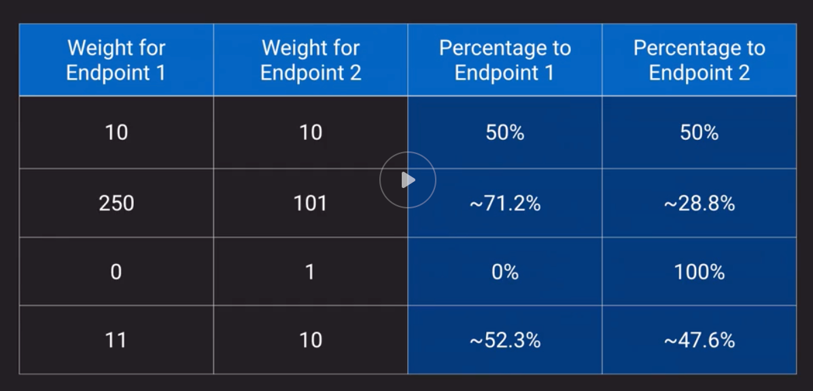

## Concepts
- NAT instances Disable source/destination checks
    - Each EC2 instance performs source/destination checks by default. This means that the instance must be the source or destination of any traffic it sends or receives. However, a NAT instance must be able to send and receive traffic when the source or destination is not itself. Therefore, you must disable source/destination checks on the NAT instance.
- OSI Model
    - Please Do Not Throw Sausage Pizza Away 
        - Physical, Data Link, Network, Transport, Session, Presentation, Application
    - *OSI Model*
    - *OSI MOdel Responsibility Demarcation*
- Unicast
    - Like a direct conversation between 2 people
- Multicast
    - Like somebody shouting with a speaker to everyone
    - Network card starts sending messages to everybody in the network at the Mac Address level
- *TCP vs UDP vs ICMP*
- Ephemeral Ports:
    - Short-lived transport protocol ports used in IP communications
    - Above the "well-known" IP ports (above 1024)
    - aka:  "Dynamic Ports"
    - Syggested range is:  49152-65535 but...
        - Linux kernels generally use 32568 to 61000
        - Windows platforms default from 1025
    - Have NACL and Security Group implications
    - The client is responsible for defining the ephemeral port that the server should talk back on
    - *TCP communication using Ephemeral Ports*
    - *TCP/UDP communication using Ephemeral Ports*
- Reserved IP addresses
    - 5 IPs are reserved in every VPC subnet
        - Example for 10.0.0.0/24:
            - 10.0.0.0:  Network Address
            - 10.0.0.1:  Reserved by AWS for the VPC router
            - 10.0.0.2:  Reserved by AWS for Amazon DNS
            - 10.0.0.3:  Reserved by AWS for future use
            - 10.0.0.255:  VPCs don't support broadcast so AWS reserves this address
        - Example for 192.168.8.16/28
            - 192.168.8.16:  Network Address
            - 192.168.8.17:  Reserved by AWS for the VPC router
            - 192.168.8.18:  Reserved by AWS for Amazon DNS
            - 192.168.8.19:  Reserved by AWS for future use
            - 192.168.8.20 to 192.168.8.30:  Usable
            - 192.168.8.31:  VPCs don't support broadcast so AWS reserves this address
- AWS AZs
    - The Physical to Logical assignment of AZs is done at the Account Level
        - This means that US-West-2A for Account 1 can be mapped to a different physical AZ than US-West-2A for Account 2
- DHCP:  Dynamic Host Configuration Protocol
    - Goal is to assign unique IP addresses to our hosts
    - DHCP Server + DHCP Client
    - When you create a VPC, AWS automatically creates a set of DHCP options and associate them with the VPC. This set includes two options: domain-name-servers=AmazonProvidedDNS, and domain-name=domain-name-for-your-region.
    - AmazonProvidedDNS is an Amazon DNS server, and this option enables DNS for instances that need to communicate over the VPC's internet gateway. The string AmazonProvidedDNS maps to a DNS server running on a reserved IP address at the base of the VPC IPv4 network range, plus two.
    - After you create a set of DHCP options, you can't modify them. If you want your VPC to use a different set of DHCP options, you must create a new set and associate them with your VPC. 
    - You can have multiple sets of DHCP options, but you can associate only one set of DHCP options with a VPC at a time. 
    - After you associate a new set of DHCP options with a VPC, any existing instances and all new instances that you launch in the VPC use the new options.  You don't need to restart or relaunch the instances. 

## Network to VPC Connectivity
- AWS Managed VPN
    - What:  AWS managed IPSec VPN connection over your existing internet
    - When:  Quick and usually simple way to establish a secure tunneled connection to a VPC; redundant link for Direct Connect or other VPC VPN
    - Pros:  Supports static routes or BGP (Border Gateway Protocol, routing protocol used to route traffic across the internet) peering and routing
    - Cons:  Dependent on your internet connection
    - How:  
        - *AWS Managed VPN*
        - *AWS Managed VPN Redundant*
- AWS Direct Connect
    - What:  Dedicated network connection over private lines straight into AWS backbone
    - When:  Require a "big pipe" into AWS; lots of resources and services being provided on AWS to your corporate users
    - Pros:  More predictable network performance; potential bandwidth cost reduction; up to 10 Gbps provisioned connections; Supports BGP peering and routing
    - Cons:  May require additional telecom and hosting provider relationships and/or new network circuits
    - How:  Work with your existing Data Networking Provider; Create Virtual Interfaces (VIF) to connect to VPCs (private VIF) or other AWS service like S3 or Glacier (public VIF)
        - *AWS Direct Connect*
    - Direct Connect Gateway
        -  *Direct Connect Gateway*
        - Direct Connect Gateway is a service that helps on connecting AWS Direct Connect connection over a private virtual interface to one or more VPCs in the same account that are located in the same or different Regions. 
- AWS Direct Connect Plus VPN
    - What:  IpSec VPN connection over private lines
    - When:  Want added security of encrypted tunnel over Direct Connect
    - Pros:  More secure (in theory) than Direct Connect alone
    - Cons:  More complexity introduced by VPN Layer
    - How:  Work with your existing Data Networking Provider
        - *AWS Direct Connect Plus VPN*
- AWS VPN Cloudhub
    - What:  Connect locations in a Hub and Spoke manner using AWS's Virtual Private Gateway
    - When:  Link remote offices for backup or primary WAN access to AWS resources and each other
    - Pros:  Reuses existing Internet connection; Supports BGP routes to direct traffic (for example, use MPLS first then CloudHub VPN as backup)
    - Cons:  Dependent on Internet connection; no inherent redundancy
    - How:  Assign multiple Customer Gateways to a Virtual Private Gateway, each with their own BGP ASN and unique IP ranges
        - *AWS VPN Cloudhub*
- Software VPN
    - What:  You provide your own VPN endpoint and software
    - When:  You must manage both ends of the VPN connection for compliance reasons or you want to use a VPN option not supported by AWS
    - Pros:  Ultimate flexibility and manageability
    - Cons:  You must design for any needed redundancy across the whole chain
    - How:  Install VPN software via Marketplace appliance or on an EC2 instance
        - *Software VPN*
- Transit VPC
    - What:  Common strategy for connecting geographically disperse VPCs and locations in order to create a global network transit center
    - When:  Locations and VPC-deployed assets across multiple regions that need to communicate with one another
    - Pros:  Ultimate flexibility and manageability but also AWS-managed VPN hub-and-spoke between VPCs
    - Cons:  You must design for any needed redundancy across the whole chain
    - How:  Providers like Cisco, Juniper Networks and Riverbed have offerings which work with their equipment and AWS VPC.
        - *Transit VPC*
- AWS Transit Gateway
    - Centralize VPN and Direct Connect (DX)
    - Thousands of VPCs across accounts
    - Spread traffic over many VPN connections
    - https://www.youtube.com/watch?v=9Nikqn_02Oc&feature=youtu.be

## VPC to VPC Connectivity
- VPC Peering
    - What:  AWS-provided network connectivity between 2 VPCs
    - When:  Multiple VPCs need to communicate or access each other's resources
    - Pros:  Use AWS backbone without touching the Internet
    - Cons:  If A is connected to B and B is connected to C, A cannot talk to C via B (transitive peering is not supported)
    - How:  VPC peering request is made; Accepter accepts request (either within Account or across Accounts)
        - *Software VPN*
- AWS PrivateLink
    - What:  AWS-provided network connectivity between VPCs and/or AWS services using interface endpoints (VPC endpoints)
    - When:  Keep private subnets tryly private by using the AWS backbone to reach other services rather than the public internet
    - Pros:  Redundant: uses AWS backbone
    - Cons:  Used to be only available within the region they are created but as of Oct. 2018 they can be accessed over inter-region VCP peering
    - How:  Create Endpoint for needed AWS or marketplace service in all needed subnets; access via the provided DNS hostname
    - *Types of VPC endpoints*
- Internet Gateway
    - Horizontally scaled, redundant and highly available component that allows commumnication between your VPC and the Internet
    - No availability risk or bandwidth constraints
    - If your subnet is associated with a route to the Internet, then it is a public subnet
    - Supports IPv4 and IPv6
    - It fulfills 2 purposes:
        1. Provide route table target for Internet-bound traffic
        2. Perform NAT for instance with public IP addresses
            - Note:  Does not perform NAT for instances with private IPs only
- Egress-Only Internet Gateway
    - On AWS IPv6 addresses are globally unique and are therefore public by default
        - In comparison IPv4 addresses have a private range assigned by RFC1918
            - 10.0.0.0<->10.255.255.255 (10.0.0.0/8)
            - 172.16.0.0<->172.31.255.255 (172.16.0.0/12)
            - 192.168.0.0<-->192.168.255.255 (192.168.0.0/16)
    - Provids outbound internet access for IPv6 addressed instances
    - Prevents inbound access to those IPv6 instances
    - Stateful-forwards traffic from instance to internet and then sends back the response
    - Must create a custom route for ::/0 (represents all IPv6 addresses, just as `0.0.0.0/0` represents all IPv4 addresses) to the egress-only Internet Gateway
    - Use Egress-Only Internet Gateway instead of NAT for IPv6
- NAT Instance
    - EC2 instance from a special AWS-provided AMI
    - Translate traffic from many private IP instances to a single public IP and back
    - Doesn't allow public internet initiated connections into private instances
    - Not supported for IPv6 (Use Egress-Only Gateway)
    - NAT instance must live on a public subnet with route to Internet Gateway
    - Private instances in private subnet must have route to the NAT instance, usually the default route destination of `0.0.0.0/0`
- NAT Gateway
    - Fully-managed NAT service that replaces need for NAT instance on EC2
    - Must be created in a public subnet
    - Uses an Elastic IP for public IP for the life of the Gateway
    - Private instances in private subnets must have route to the NAT Gateway, usually the default route destination of `0.0.0.0/0`
    - Created in specified AZ with redundancy in that zone
    - For multi-AZ redundancy, create NAT Gateways in each AZ with routes for private subnets in each AZ to use the local gateway
    - AWS gurantees 5Gbps bandwidth that can scale up to 45 Gbps
    - Can't use a NAT Gateway to access VPC peering, VPN or Direct Connect, so be sure to include specific routes to those in your route table (`REMEMBER:  MOST SPECIFIC ROUTE IS SELECTED FIRST!`)
- *NAT Instance vs NAT Gateway*

## Routing
- VPCs have an implicit router and main routing table
- You can modify the main routing table or create new tables
- Each route table contains a local route for the CIDR block
- Most specific route for an address wins
- *Routing Example*
    - pl-xxxxxxx (pl stands for private link)
    - vpg-xxxxxxx (vpg stands for virtual private gateway used to connect to on-premises network)
- *Routing Example: One Web Server with multiple Routes*

## Border Gateway Protocol (BGP)
- Popular routing protocol for the internet
- "Propagates" information about the network to allow for dynamic routing
- Required for Direct Connect and optional for VPN
- Alternative of not using BGP with AWS VPC is static routes
- AWS supports BGP community tagging as a way to control traffic scope and route preference
- Required TCP port 179 + ephemeral ports
- Autonomous System Number (ASN) = Unique endpoint identifier
    - Public ASN numbers are controlled by IANA
- Weighting is local to the router and higher weight is preferred part for outbound traffic

## Enhanced Networking
- Generally used for high performance computing use-cases
- Uses single root I/O virtualization (SR-IOV) to deliver higher performance than traditional virtualized network interfaces 
- Might have to install driver if other than Amazon Linux HVM AMI
- 2 variants of network adapters for enhanced networking:
    - Intel 82599 VF (Virtual Function) Interface
        - Speeds up to 10 Gbps for supported instance types.
    - Elastic Network Adapter (ENA)
        - Speeds up to 100 Gbps for supported instance types.
- Placement Groups
    - Idea behind is to have some control on how we can arrange our instances over the physical hardware they live on
    - *Placement Group Comparison*
    - *Placement Group Examples Part 1*
    - *Placement Group Examples Part 2*

## Route 53
- AWS DNS
- DNS service port is 53
- *Routing Policies Definitions*
    - Important to have a default route as "catch all" as sometimes route53 won't be able to determine where the person is coming from
- *Geolocation example* 
    - Used when you want to route traffic based on the location of your users.
- *Geoproximity Routing*
    - Use when you want to route traffic based on the location of your resources
    - Bias can be between -99<->+99
- *Latency Routing*
    - Based on latency between the requester and the datacenter
- *Multivalue Answer Routing*
    - *Multivalue Answer Routing Choosing*
- *Weighted Routing*
    - *Weighted Percentage of Traffic*
    - *Weighted Traffic Examples*
- Helpful linux commands for dns:
    - dig <URL>
    - nslookup <URL>
        - Find IP address of a host
        - Reverse Lookup IP address to domain name

## Cloudfront
- Distributed content delivery service for simple static asset caching up to 4K live and on-demand video streaming
- You should already know how to create a CloudFront distribution and understand edge location concept
- Integrated with Amazon Certificate Manager (ACM) and supports SNI (Server Name Indication)
    - Server Name Indication (SNI) is an extension to the Transport Layer Security (TLS) computer networking protocol by which a client indicates which hostname it is attempting to connect to at the start of the handshaking process.
    - This allows a server to present multiple certificates on the same IP address and TCP port number and hence allows multiple secure (HTTPS) websites (or any other service over TLS) to be served by the same IP address without requiring all those sites to use the same certificate. 
    - It is the conceptual equivalent to HTTP/1.1 name-based virtual hosting, but for HTTPS. 
    - Downside of using SNI is that a few old browsers don't support it
- *Cloudfront Setup Screen*
- *SSL and TLS Evolution*

## Elastic Load Balancers
- Features:
    - Protocol Support
        - Supports routing and load balancing of http, https, TCP, and TLS traffic to EC2 instances
    - Single stable DNS name
        - Using an ELB provides a single stable DNS name for configuration, to support private internal and public-facing external applications
        - Note:  NLB provides a stable set of IP addresses
    - Supports Health Checks
        - Ensure that traffic is not routed to unhealthy or failing instances.  ELBs automatically scale based on CloudWatch metrics.
- *Features and Support by ELB type*
- Their main function is to distribute inbound connections to one or many backend endpoints
- 3 different types:
    1. Application Load Balancer (Layer 7)
    2. Network Load Balancer (Layer 4-TCP layer)
        - Not too many options for routing other than port number
        - TCP connections to backend are persisted for the duration of the connection
        - They excel at speed and throughput
    3. Classic Load Balancer (Layer 4 or Layer 7)
        - Multiple routing options:
            - Host-based routing
            - Path-based routing
            - HTTP header-based routing
            - HTTP method-based routing
            - Query string parameter-based routing
            - Source IP address CIDR-based routing
- Can be used for public or private workloads
- Consume IP addresses within a VPC subnet
    - They can scale and as they do they can consume more IP addresses
- Requirements for each subnet:
    - The subnet must be a public subnet for internet-facing load balancers
    - The subnet must be sized /27 or larger.  You cannot use a /28 or anything smaller for an ELB
    - The subnet must have at least 8 available IP addresses
- *Similarities Between ELBs*
- *Differences Between ELBs*
- *LB routing example*
- Cross-zone load balancing
    - load balance taking into account the number of instances in each AZ
    - does not take into account the instance types
    - *Cross-zone load balancing*
    - Only applicable to the Classic Load Balancer and the Application Load balancer
- ELB Listeners
    - *ELB Listerners*
- ELB Targets
    - The destinations for your traffic
    - Targets are selected destinations where Application Load Balancers and Network Load Balancers send traffic.
    - Targets are associated with target groups and can be different things
    - Target Groups
        - Simply group targets together
        - Allow you to group things together like EC2 instances
        - Makes it easy to specify the same rules across multiple targets
    - Target types:
        - EC2 instances
        - IP address
        - lambda function
    - Targets and target groups are only applicable for ALBs and NLBs
- SSL/TLS with ELBs
    - ALBs and NLBs support SNI or the ability to have multiple certificates per listener
    - CLBs do not support SNI
    - You can manage and apply the certificate to your load balancer manually or use ACM (Amazon Certificate Manager).
    - SSL and TLS use an X.509 certificate
    - To ensure end-to-end encryption you will need to create and manage certificates to EC2 instances
- Steps for target group creation:
    1. Create a launch configuration to define AMI and instance creation rules (ex:  Cloudwatch monitoring frequency)
    1. Create an ASG using launch configuration from previous step
        - Define group size
        - grace period:  to allow instances to launch before pinging them for health checks
        - Scaling policy (keep initial size, CPU usage, etc.)
- To discover the availability of your EC2 instances, an ELB periodically sends pings, attempts connections, or sends requests to test the EC2 instances. These tests are called health checks. The status of the instances that are healthy at the time of the health check is InService. The status of any instances that are unhealthy at the time of the health check is OutOfService.
- When you allow the Auto Scaling group (ASG) to receive the traffic from the ELB, it gets notified when the instance becomes unhealthy and then it terminates it.
    

## Pro Tips
- Direct Connect may be a more complex and costlier option to setup, but it could save big on bandwidth costs
- Explicitly deny as much traffic as you can with NACLs and SG--Principle of Least Privilege
- Think through your VPC layout
- You can use Route53 for your domain even if AWS isn't your registrar
- ELBs provide a useful layer of abstraction (as does Route53 too!)
    - Can be useful for blue/green deployments or rolling updates

## Sample Questions Notes
- MTU (Maximum Transmission Unit) for an EC2 instance:
    - MTU:  The maximum transmission unit of a network connection is the size, in bytes, of the largest permissible packet that can be passed over the connection.
    - The larger the MTU of a connection, the more data that can be passed in a single packet. 
    - Ethernet packets consist of the frame, or the actual data you are sending, and the network overhead information that surrounds it.
    - Ethernet frames can come in different formats, and the most common format is the standard Ethernet v2 frame format. 
    - It supports 1500 MTU, which is the largest Ethernet packet size supported over most of the Internet. 
    - The maximum supported MTU for an instance depends on its instance type. 
    - All Amazon EC2 instance types support 1500 MTU, and many current instance sizes support 9001 MTU, or jumbo frames.
    - Jumbo frames should be used with caution for Internet-bound traffic or any traffic that leaves a VPC. Packets are fragmented by intermediate systems, which slows down this traffic. To use jumbo frames inside a VPC and not slow traffic that's bound for outside the VPC, you can configure the MTU size by route, or use multiple elastic network interfaces with different MTU sizes and different routes.
- You are building an application hosted on AWS for a customer.  The customer has a very old firewall that can only whitelist external destinations via IP address only.  Which solution could you use?
    - ALB with Global Accelerator
    - NLB with EIP
- Direct Connect connections consist of a single connection between your network and AWS with no inherent redundancy.  Additionally, traffic comming from on-prem via a Direct connect is restricted from internet access.  Your device must support 802.1Q VLANs 
- You want to allow your VPC instances to resolve using on-prem DNS.  Can you do this and how/why?
    - Yes, by configuring a DHCP Option Set to issue your on-prem DNS IP to VPC clients
- What are some reasons you might want to use a NAT instance over a NAT Gateway?
    - You want the ability to detach your EIP
    - You want to allow public internet initiated connections to your private instances
    - You want to use Security Groups
- For geolocation routing, you need to be sure you have a default route in the case that the location cannot be determined.
- Only two components allow VPC to Internet communication using IPv6 addresses and those are "Internet Gateways" (inbound) and "Egress-Only Internet Gateways" (outbound).
- Ping uses ICMP, specifically ICMP echo request and ICMP echo reply. It does not rely on TCP or UDP and has no concept of ports so no need for ephemeral ports.
    - Ping Operates on OSI layer 3 (Network) 

## Other resources
- https://d0.awsstatic.com/whitepapers/aws-amazon-vpc-connectivity-options.pdf
- https://d1.awsstatic.com/whitepapers/Networking/integrating-aws-with-multiprotocol-label-switching.pdf
- https://docs.aws.amazon.com/vpc/latest/userguide/security.html
- Connecting many VPCs
    - https://www.youtube.com/watch?v=KGKrVO9xlqI
- Another Day, Another Billion Flows
    - https://www.youtube.com/watch?v=8gc2DgBqo9U
- Deep Dive into the New Network Load Balancer
    - https://www.youtube.com/watch?v=z0FBGIT1Ub4

