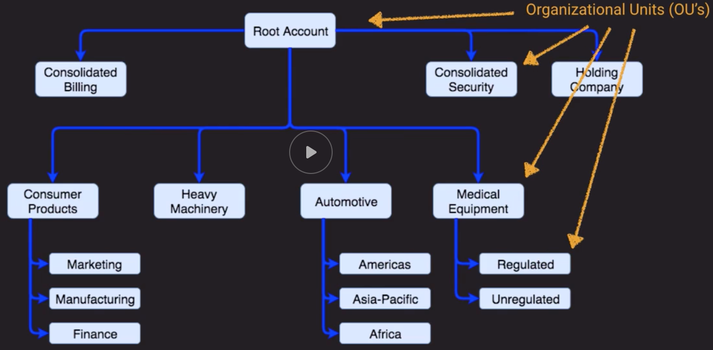

## Concepts
- *Shared Responsibility Model*
- Principle of Least Privilege
    - Give users or services nothing more than those privileges required to perform their intended function
    - And only when they need them
- *Security Facets*
- *Identify Systems Typical Components*
- *Typical Identity Information Flow*
- *SAML2.0 vs OAuth2.0 vs OpenId*
- *AWS Security Compliance*

## IAM Notes
- Principal
    - Use the Principal element in a policy to specify the principal that is allowed or denied access to a resource. 
    - You can specify any of the following principals in a policy:
        - AWS account and root user
        - IAM users
        - Federated users (using web identity or SAML federation)
        - IAM roles
        - Assumed-role sessions
        - AWS services
        - Anonymous users (not recommended)        

## Multi-Account Management
- Most large organizations will have multiple AWS accounts
- Segregation of duties, cost allocation, and increased agility
- Need methods to properly manage and maintain them
- When should you use multiple accounts?
    - Do you require administrative isolation between workloads?
    - Do you require limited visibility and discoverability of workloads?
    - Do you require isolation to minimize "blast radius"?]
    - Do you require strong isolation of recovery an/or auditing data?
- AWS Tools for Account Management
    - AWS Organizations
    - Service Control Policies
    - Tagging
    - Resource Groups
    - Consolidated Billing
        - The usage across all accounts can share the volume pricing discounts and Reserved Instance discounts.
        - The master pays the charges of all the member accounts.
        - Although the owners of the linked accounts aren't charged, they can still see their usage and charges by going to their AWS Bills pages.
        - In order to receive the cost benefit from Reserved DB Instances in Consolidated Billing, all the attributes of DB Instances (DB Engine, DB Instance class, Deployment type, and License Model) in another account should match the attributes of the Reserved DB Instances.

- Examples of Account Setups:
    - *Identity Account Structure*
    - *Logging Account Structure*
    - *Publishing Account Structure*
    - *Information Security Account Structure*
- *Organizations Setup Example*
    - Consolidated Billing allows economies of scale and discounts
    - SCPs cascade down a tree, so if we apply at `Medical Equipment` level it will affect `Regulate` and `Unregulated` accounts
    - Ex of SCP:  Deny ability to change IAM roles or CloudTrail settings

## Network Controls and Security Groups
- Security Groups
    - Virtual firewalls for individual assets (EC2, RDS, AWS Workspaces, etc.)
    - Controls inbound and outbound traffic for TCP, UDP, ICMP, or custom protocols
    - Port or port ranges
    - Inbound rules are by source IP, subnet, or other Security Group
    - Outbound rules are by destination IP, subnet or other Security Group
- Network Access Control Lists (NACLs)
    - Additional layer of security for VPC that acts as a firewall
    - Apply to entire subnets rather than individual assets
    - Default NACL allows all inbound and outbound traffic
    - NACLs are stateless - meaning outbound traffic simply obeys outbound rules - no connection is maintained
    - Can duplicate or further restrict access along with Security Groups
    - Remember ephemeral ports for Outbound if you need them
- Why use SG's and NACLs
    - NACLs provide a backup method of security if you accidentally change your SG to be too permissive
    - Covers the entire subnet so users that create new instances and fail to assign a proper SG are still protected
    - Part of multi-layer Least Privilege concept to explicitly allow and deny

## AWS Directory Services
- *Types of Directory Services Offered*
- *AD Connector vs Simple AD*

## Credential and Access Management
- STS (Security Token Serive) allows us to temporary grant access to applications or users
    - Credentials can be source from IAM, Acive Directory, External Auth Providers
    - *Secure Token Service Flow*
    - `Assume Role` - Returns a set of temporary security credentials (consisting of an access key ID, a secret access key, and a security token) that you can use to access AWS resources that you might not normally have access to. Typically, you use AssumeRole for cross-account access or federation.
    - `GetFederationToken` - Returns a set of temporary security credentials (consisting of an access key ID, a secret access key, and a security token) for a federated user. A typical use is in a proxy application that gets temporary security credentials on behalf of distributed applications inside a corporate network
    - `AssumeRoleWithWebIdentity` requires no AWS credentials to start with; instead, it takes an external identity and uses the trust policy built into the role to elevate AWS access for a short time (max 1h).
- Web Identify Federation Playground
    - https://web-identity-federation-playground.s3.amazonaws.com/index.html
    - Steps:
        1. Authenticate with Identity Provider (Cognito, amazon, google, facebook)
        2. Obtain Temporaty Security Credentials
            - Obtained using AssumeRoleWithWebIdentity request
        3.  Access AWS Resource (Ex:  S3 bucket)
- Token Vending Machine Concept
    - Common way to issue temporary credentials for mobile app development
    - Anonymous TVM:  Used as a way to provide access to AWS services only, does not store user identity
    - Identity TVM:  User for registration and login, and authorizations
    - AWS now recommends that mobile developers use Cognito and the related SDK
- AWS Secrets Manager
    - Store passwords, encryption keys, API keys, SSH keys, PGP keys, etc.
    - Alternative to storing passwords or keys in a "vault" (software or physical)
    - Can access secrets via API with fine-grained access control provided by IAM
    - Automatically rotate RDS database credentials for MySQL, PostgreSQL, and Aurora
    - Better than hard-coding credentials in scripts or applications

## Encryption
- 2 types of encryption:
    1. Encryption at REST
        - Data is Encrypted were it is stored such as on EBS, S3, RDS, SQS queu waiting to be processed, etc.
    2. Encryption in Transit
        - Data is encrypted as it flows through a network or process, such as SSL/TLS for HTTPS or with IPSec for VPN Connections
- Key Management Service (KMS)
    - Key Storage, management, and auditing
    - Tightly integrated into MANY AWS services like lambda, S3, EBS, EFS, DynamoDB, SQS, etc.
    - You can import your own keys or have KMS generate them
    - Control who manages and accesses keys via IAM users and roles
    - Audit use of keys via CloudTrail
    - Differs from Secret Manager as its purpose-built for encryption key management
    - Validates by many compliance schemes (PCI DSS level 1, FIPS 140-2 level 2)
- CloudHSM (HSM:  Hardware Security Module)
    - Dedicated hardware device, single tenanted
    - Must be within a VPC and can access via VPC peering
    - Does not natively integrate with many AWS services like KMS, but rather requires custom application scripting
    - Offload SSL from web servers, act as an issuing CA, enable TDE (Transparent Data Encryption) for Oracle databases
    - *2 Versions of CloudHSM*
    - *CloudHSM vs KMS*
    - You can improve Your Web Server's Security with SSL/TLS Offload in AWS CloudHSM
        - *How SSL/TLS Offload with AWS CloudHSM Works*
- AWS Certificate Manager (for encryption in-transit)
    - Managed service that lets you provision, manage and deploy public or private SSL/TLS certificates
    - Directly integrated into many AWS services like Cloudfront, ELB, and API Gateway
    - Free public certificates to use with AWS Services, no need to register via a 3rd party certificate authority
    - ...but you can import 3rd party certificates for use on AWS
    - Supports wildcard domains (*.domain.com) to cover all your subdomains
    - Managed certificate renewal (no embarrassing "certificate expired" messages for customers)
    - Can create a managed private Certificate Authority as well for internal or proprietary apps, services or devices
- S3
    - Server-side encryption with Amazon S3-managed encryption keys (SSE-S3) employs strong multi-factor encryption. Amazon S3 encrypts each object with a unique key. As an additional safeguard, it encrypts the key itself with a master key that it regularly rotates. Amazon S3 server-side encryption uses one of the strongest block ciphers available, 256-bit Advanced Encryption Standard (AES-256), to encrypt your data.

## Distributed Denial of Service Attacks
- Phishing is a very common way to compromise systems that can later participate in DDoS Attacks
- *Amplification/Reflection Attack*
    - Uses Spoofed Address to overwhelm target server
- Application layer (layer 7) attacks can flood target web server with http get calls and deny access to real customers by bringing server down
- *Mitigating DDoS*
- *Sample Architecture with DDoS Mitigation Controls*

## IDS (Instruder Detection System) and IPS (Intruder Prevention System)
- `Intruder Detection System`:  Watches the network and systems for suspicious activity that might indicate someone trying to compromise a system
- `Intruder Prevention System`:  Tries to prevent exploits by sitting behind firewalls and scanning and analyzing suspicious content for threats
- Normally comprised of a `Collection/Monitoring System` and `Monitoring agents on each system`
- Logs collected or analyzed in Cloudwatch, S3 or third-party tools (Splunk, SumoLogic, etc.) sometimes called a `Security Information and Event Management (SIEM) System`
- *IDS/IPS sample architecture*
- *Cloudwatch vs Cloudtrail*
    - Cloudwatch is more in operations sense and CloudTrail is more in activity sense

## AWS Service Catalog
- Concept comes from ITIL (Information Technology Infrastructure Library:  Set of detailed practices for IT Service Management that focuses on aligning IT Services with the needs of the business)
- Framework allowing administrators to create pre-defined products and landscapes for their users
- Granular control over which users have access to which offerings
- Makes use of adopted IAM roles so users don't need underlying service access
- Allows end users to be self-sufficient while upholding enterprise standards for deployments
- Deployment templates are cloudFormation templates
- Administrators can version and remove products.  Existing running product versions will not be shutdown.
- *AWS Service Catalog Constraints*
- *Service Catalog in Multi-Account Scenario*

## Pro Tips
- Acknowledge concerns and be ready with a process (Cloud Adoption Framework is a good start)
- Leverage assessments and checklists as illustrators of care and best practice
- Migrating to the cloud is often more secure than on-prem due to increased transparency and visibility
- Speak in terms of risk as a continuum rather than an absolute
    - Security in the end is about managing risk, there's never a 100% secure system
- Consider another security-minded certification such as the CISSP.

## Sample Questions Notes
- Remember that Security Groups don't have Deny Rules, NACLs have them, Security Groups only allow
- Remember that SSH data is encrypted and therefore not publicly visible in flight
- Cognito Users are separate from IAM users
- As a best practice, create a trail that applies to all Regions in the AWS partition in which you are working. This is the default setting when you create a trail in the CloudTrail console.
    - Setup CloudTrail in your main region and configure it to log all regions and store logs in a single S3 bucket in your main region.
- Which of the following would be the most effective way of dealing with Layer 7 DDoS attacks?
    - The challenge with layer 7 detection is telling an attack from normal user traffic. CloudFront in conjunction with AWS WAF can be an effective way to create DDoS resilience at Layer 7. Network Load Balancers and NACLs are Layer 4 solutions, and would have no visibility of Layer 7 DDoS. CloudTrail and GuardDuty are focused on the security of the AWS account, and would not be suitable in isolation for securing at Layer 7 Further information.
- IPS (Intruder Prevention System) differs from an IDS (Intrusion Detection System) in that it can automatically take action on intrusions, like blacklist an offending IP address.

## Other resources
- https://d1.awsstatic.com/whitepapers/aws-security-best-practices.pdf
- https://d1.awsstatic.com/aws-answers/AWS_Multi_Account_Security_Strategy.pdf
- https://d1.awsstatic.com/whitepapers/Security/DDoS_White_Paper.pdf
- Best Practices fro Managing Security Operations on AWS
    - https://www.youtube.com/watch?v=gjrcoK8T3To
- Become an IAM Policy Master in 60 Minutes or Less
    - https://www.youtube.com/watch?v=YQsK4MtsELU
- Security Anti-Patterns
    - https://www.youtube.com/watch?v=tzJmE_Jlas0
- Architecting Security and Governance Across a Multi-Account Strategy
    - https://www.youtube.com/watch?v=71fD8Oenwxc
- Managing Multi-Accouint AWS Environments using AWS Organizations
    - https://www.youtube.com/watch?v=fxo67UeeN1A

