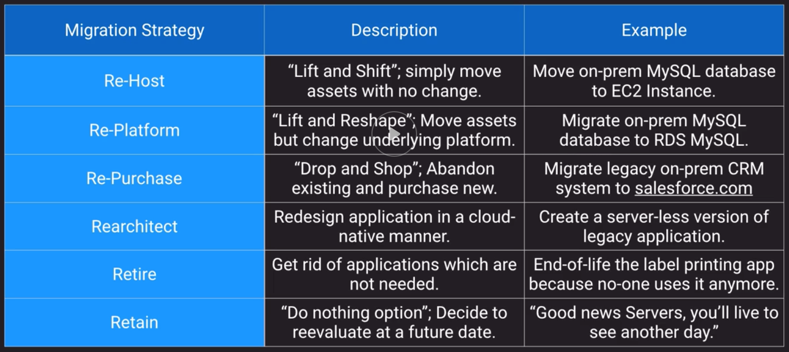
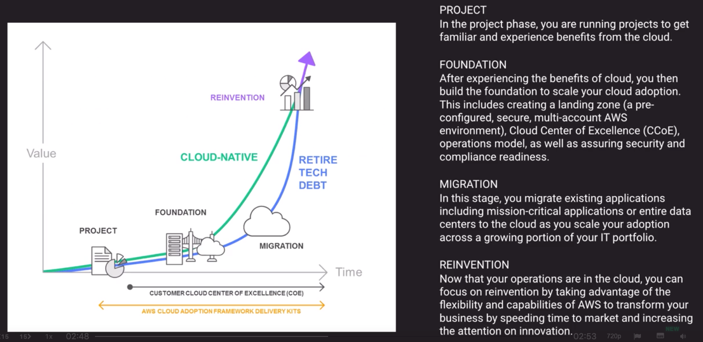
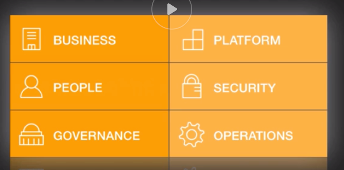
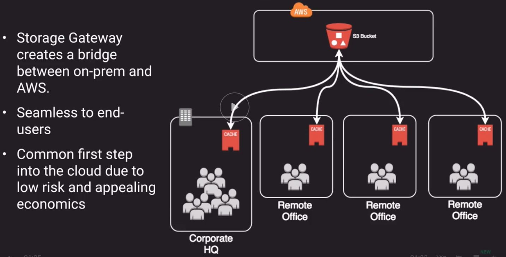
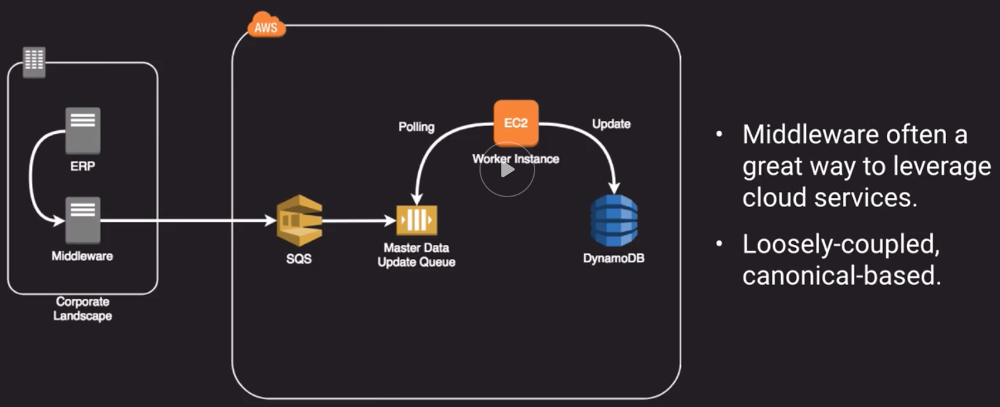
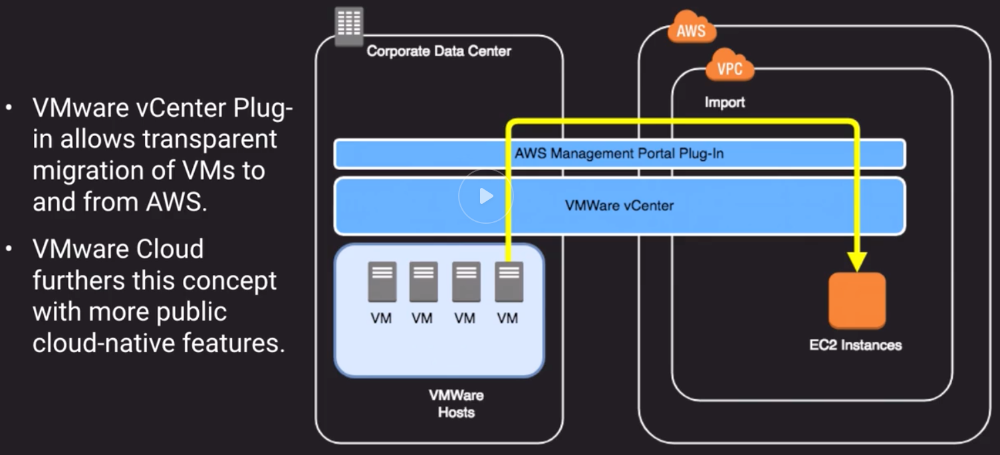
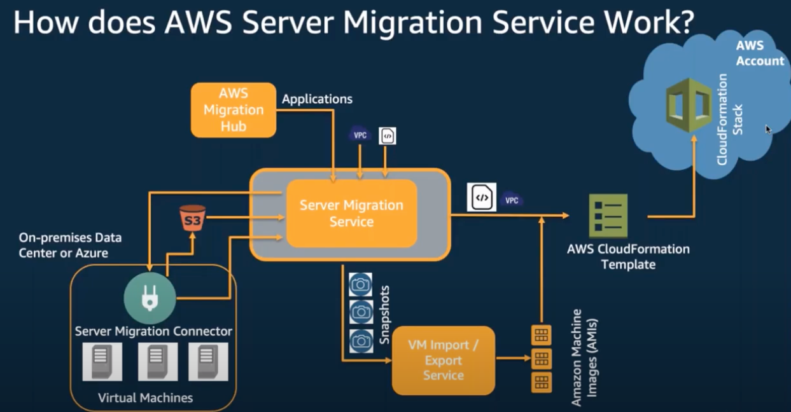
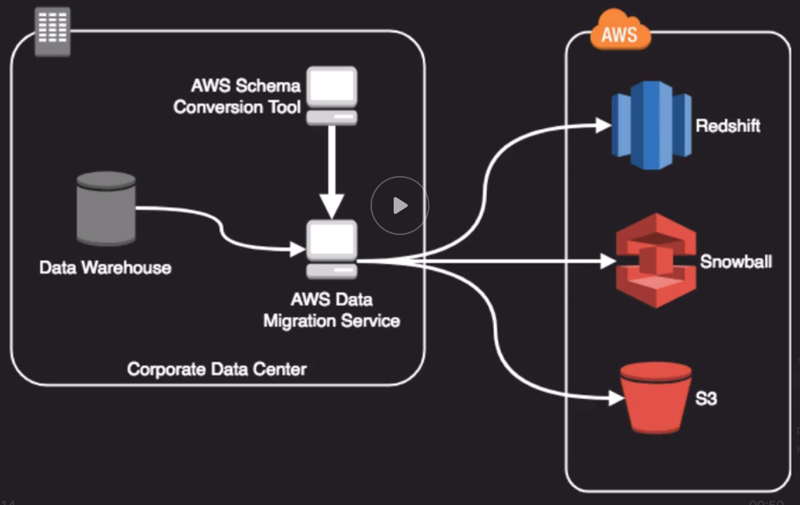
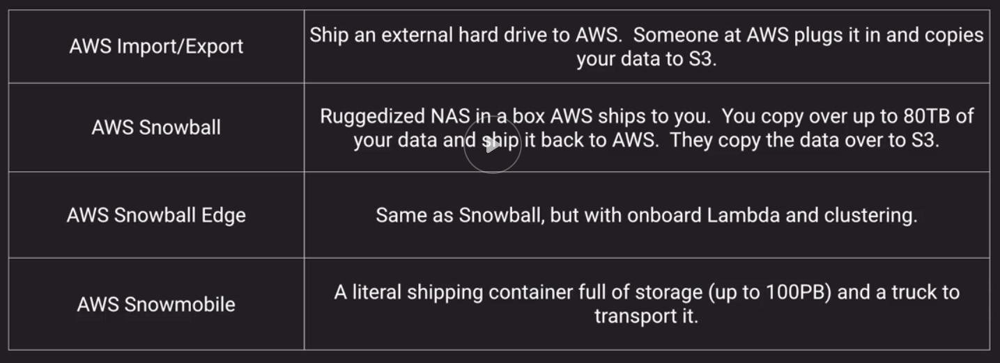
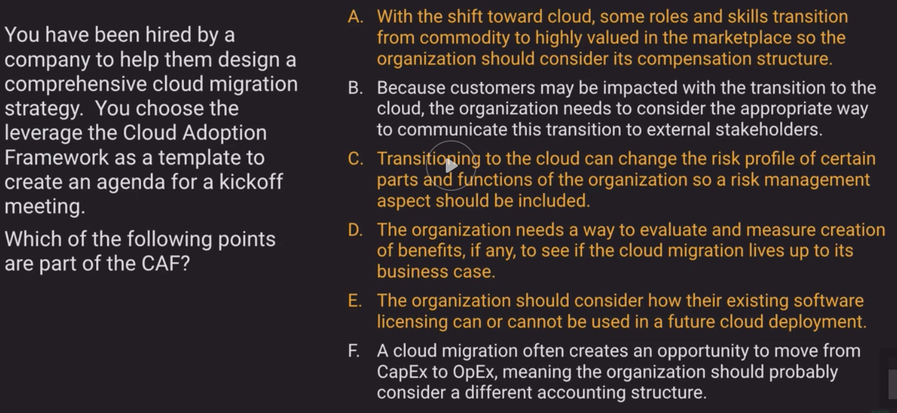

## Migration Strategies
- 
- `Retire` has the least cost

## Cloud Adoption Framework
- Analogous to TOGAF Framework for Enterprise Architecture
    - TOGAF:  The Open Group Architectural Framework
    - Approach for designing, planning, implementing and governing enterprise IT architectures
    - Started development in 1995
    - De facto standard in EA practice
    - Favored enterprise architecture framework for most Fortune 500 companies
    - Enterprise Architecture is not TOGAF...
    - Often misunderstood and victim of unreasonable expectations (similarly to agile development)    
    - Not all TOGAF practitioners are great practitioners
    - TOGAF is not a cookbook
- Architects cannot just "architect", they also have to be boundary spanners and build bridges in the organization!
    - Need excellent communication skills and don't assume that all people are as technical as yourself
- What is a framework?
    - Is some information to help you get your mind around a problem
    - Is open for localization and interpretation
    - Is something you should adapt to your organizational culture
    - It is not a perfect step-by-step recipe to success
- 
- The Cloud Adoption Framework implies that there['s more to cloud adoption than just technology
- To fully unlock the potential benefits of a cloud migration, a holistic approach must be considered
- 

## Hybrid Architectures
- Hybrid Architectures make use of cloud resources along with on-premises resources
- Very common first step as a pilot for cloud migrations
- Infrastructure can augment or simply be extensions of on-prem platforms -VMWare for example (allow us to place VMs either on-prem or in the cloud).
- Ideally, integrations are loosely coupled - meaning each end can exist without extensive knowledge of the other side
- 
- 
- 

## Migration Tools
- Storage Migration
    - AWS Storage Gateway
    - AWS Snowball
- Server Migration Service
    - Automates migration of on-premises VMWare vSphere or Microsoft Hyper-V/SCVMM virtual machines to AWS
    - Replicates VMs to AWS, syncing volumes and creating periodic AMIs
    - Minimizes cutover downtime by syncing VMs incrementally
    - Supports Windows and Linux VMs only (just like AWS)
    - The Server Migration Connector is downloaded as a virtual appliance into your on-rem vSphere or Hyper-V setup
    - 
    - Steps to use SMS:
        1. Go to SMS Connectors Setup Guide and download right connector for your environment (vCenter, SCVMM/HyperV, Azure) whidch can be OVA, VHD or Powershell script.
        2.  For VMWare environment:
            1. Register Connector with SMS Service 
            2. Import the Server Inventory from VmWare to AWS
            3. Select Server to migrate and Create a Replication Job
- Database Migration Service (DMS)
    - DMS along with SCT (Schema Conversion Tool) helps customers migrate databases to AWS RDS or EC2-based databases
    - SCT can copy db schemas for homogenous migrations (same database) and convert schemas for heterogenous migrations (different databases)
    - SCT tools doesn't support No-SQL DBs, only DMS supports them
    - DMS is used for smaller, simpler conversions and also supports MongoDB and DynamoDB.
    - SCT is used for larger, more complex datasets like data warehouses
    - DMS has replication function for on-premises to AWS or to Snowball or S3
    - 
    - Workload Qualification Framework (can be run using prepackaged AMI).
        - Assesses and rates the workload for the entire migraiton, helps estimate effort, helps derive action items (roadmap)
    - Old World to Aurora Migration Playbooks
    - Change Data Capture for Deltas once you move huge datasets with example snowball
- Application Discovery Service
    - Gathers information about on-premises data centers to help in cloud migration planning
    - Often customers don't know the full inventory or status of all their data center assets, so this tool helps with that inventory
    - Collects config, usage and behavior data from your servers to help in estimating TCO of running on AWS
    - Can run as agent-less (VMware environment) or agent-based (non-VMware environment)
    - Only supports those OSes that AWS supports (Linux and Windows)
- AWS Migration Hub
    - Aggregator of all the Migration services with a project view

## Network Migrations and Cutovers
- CIDR Reservations
    - Ensure your IP addresses will not overlap between VPC and on-premise
    - VPCs support IPv4 netmasks range from `/16` to `/28`
        - ```/16 = 255.255.0.0 = 65,536 addresses```
        - ```/28 = 255.255.255.240 = 16 addresses```
    - Remember:  5 IPs are reserved in every VPC subnet that will take up addresses
        - For example in `/28` you're only lelft with 11 addresses
- Network Migrations
    - Most organizations start with a VPN connection to AWS
    - As usage grows, they might choose Direct Connect but keep the VPN as a backup
    - The transition from VPN to Direct Connect can be relatively seamless using BGP
    - Once Direct Connect is set-up, configure both VPN and Direct Connect within the same BGP prefix
    - From the AWS side, the Direct Connect path is always preferred
    - You need to be sure the Direct Connect path is the preferred route from your network to AWS and not VPN (through BGP weighting or static routes)

## Snow Family
- Evolution of AWS import/export process
- Designed to move massive amounts of data to and from AWS
- Data transfer is as fast or as slow as you're willing to pay a common carrier (UPS, DHL, FedEx, etc.)
- Encrypted at rest
- 

## Pro Tips
- Technology is often a minor part of a cloud migration project
- Project management discipline is a must - don't underestimate this
    - Cadences
    - Decision-making process
    - Measurement method
- Adapt the CAF (Cloud Adoption Framework) for your own organization's culture 
- Leverage the CAF to get buy-in by acknowledging the enterprise nature of cloud migrations
- Become a diplomat, educator, boundary spanner
    - The role of an Enterprise Architect is above all to be a boundary spanner

## Sample Questions Notes
- 
- You just completed setup of your Direct Connect connection to AWS and want to transition over from your VPN but leave the VPN as a backup. What are some tasks to be done for minimal disruption? 
    - Configure both the VPN and Direct Connect with the same BGP prefix.
    - Update BGP weighting on your customer-side router to a higher weight than the VPN connection.
- You are migrating from an Oracle on-prem database to an Oracle RDS database. Which of these describes this migration properly?
    - Homogenous migration (when we migrate between the same databases.)
- A VPC endpoint enables you to connect to certain AWS services without the data travelling over the Internet. This is done by routing the traffic within the Amazon VPC network. "API Gateway", "Kinesis Data Streams" and "DynamoDB" are all services that can be connected to via VPC endpoints, however the "Amazon MQ" service is currently only available by using an Internet Gateway. 
- The Cloud Adoption Framework focuses on the early stages of cloud adoption. Therefore, any reinvention of business processes is not inherently considered part of the CAF.
- Sun Solaris is not a supported OS for AWS and thus not able to be migrated using AWS SMS.
- You have decided to migrate your on-prem legacy Informix database to Amazon Aurora. How might this be facilitated most efficiently?
    - Manually create the target schema on Aurora then use Data Pipeline with JDBC to move the data.
    - Informix is not supported by either the Data Migration Service or Schema Conversion Tool so the only choice among these options is manually creating the schema.
- Given a VPC CIDR of 10.0.0.0/16 and subnet CIDR block of 10.0.0.0/24, what would you expect the DNS address to be for DHCP clients in that subnet given default settings?
    - 10.0.0.2
    - The IP address of the DNS in a VPC is always the base of the subnet range plus two.

## Other resources
- https://d1.awsstatic.com/whitepapers/Migration/aws-migration-whitepaper.pdf
- https://d1.awsstatic.com/whitepapers/aws_cloud_adoption_framework.pdf
- https://d1.awsstatic.com/whitepapers/Migration/migrating-applications-to-aws.pdf
- https://d1.awsstatic.com/whitepapers/AWS-Cloud-Transformation-Maturity-Model.pdf
- How to Assess your organization's readiness to migrate at scale (reinvent:2017)
    - https://www.youtube.com/watch?v=id-PY0GBHXA
- AWS re:Invent 2017: Migrating Databases and Data Warehouses to the Cloud: Getting St (DAT317)
    - https://www.youtube.com/watch?v=Y33TviLMBFY
- AWS re:Invent 2017: Deep Dive: Using Hybrid Storage with AWS Storage Gateway to Solve On-Premises Storage Problems (STG309)
    - https://www.youtube.com/watch?v=9wgaV70FeaM
- https://aws.amazon.com/blogs/apn/category/aws-server-migration-service/
- https://aws.amazon.com/blogs/compute/how-to-migrate-multi-tier-environments-using-the-aws-server-migration-service/

