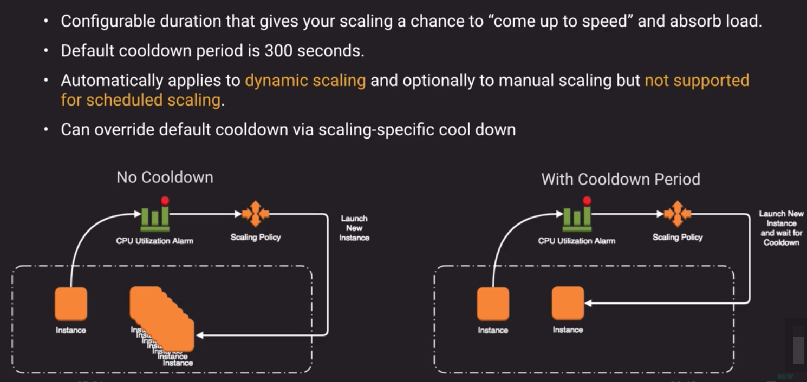
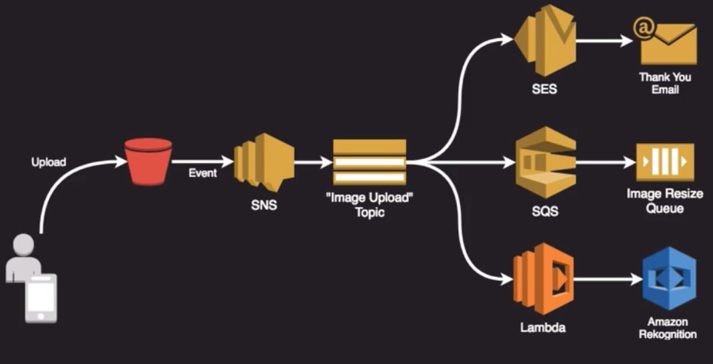

## Concepts
- Loosely Coupled Architecture
    - Layers of abstraction
    - Permits more flexibility
    - Interchangeable components
    - More atomic functional units
    - Can scale components independently
- *Horizontal vs Vertical Scaling*
- *Scale-Out Scale-In Scale-Up Scale-Down*

## Auto-Scaling
- 
- EC2 Auto-Scaling Group
    - Automatically provides horizontal scaling (scale-out) for your landscape
    - Triggered by an event or scaling action to either launch or terminate instances
    - Availability, cost and system metrics can all factor into scaling
    - 4 scaling options:
        1. Maintain - keep specific or minimum number of instances running
        2. Manual - Use maximum, minimum, or specific number of instances
        3. Schedule - Increase or decrease instances based on schedule
        4. Dynamic - Scale based on real-time metrics of the systems
- Launch Configurations
    - Specify VPC and subnets for scaled instances
    - Attach to an ELB
    - Define a Health Check Grace Period
    - Define size of group to stay at initial size OR Use Scaling Policy which can be based from metrics
- 
- 
- 
- 
- Predictive Scaling
    - Can dynamically scale based on learning your load and calculating expected capacity

## Kinesis
- Collection of services for processing streams of various data
- Data is processed in "shards" - with each shard able to ingest 1000 records per second
    - Shard can be thought as "lines in a highway", the more shards the more traffic can go through
    - Each shard is given a partition key
- A default limit of 500 shards, but you can request an increase to unlimited shards
- Record consists of Partition key, sequence number and data blob (up to 1 MB)
- Transient Data Store - Default retention of 24 hours, but can be configured for up to 7 days
- Types of Streams:
    - 
    - 
    - 
- Kinesis Data Analytics
    - Allows us to do analytics on the data as it is coming in against streams
- 
- 
    - When writing to a shard in a Kinesis Data Stream, each shard supports ingestion of up to 1 MB of data per second or 1,000 records written per second. 
    - When reading from a shard, each shard supports output of 2 MB of data per second. 
    - You choose an initial number of shards to allocate for your Kinesis Data Stream, then can update your shard allocation over time. 
    - Increasing your shard allocation enables your application to easily scale from thousands of records to millions of records written per second.

## DynamoDB Scaling
- *DynamoDB Scaling*
- Max item limited to 400kb to make performance deterministic
- *DynamoDB Terminology*
- Under the cover dynamo scales out by adding partitions
- *DynamoDB Partition Calculation Formula*
- *DynamoDB Partition Calculation Example*
- *DynamoDB Partition Calculation Example RCU WCU Allocation*
    - Total RCU and WCU is equally allocated across partitions
    - AWS allows some burst capacity but it should be avoided
- It is beneficial to have a partition key that has a degree of variability in it to equally spread the load across the different partitions
- *DynamoDB Hot Partition or Hot Key Example*
    - In this scenario we might be consuming all of the write/read capacity against the hot partition very quickly
    - In this scenario it is better to use the sensorId as the partition key
- *DynamoDB Auto Scaling*
    - We can scale up when we reach a certain target level utilization
    - Auto Scaling uses target tracking method to try to stay close to target utilization
    - Currently does not scale down it table's consumption drops to zero
        - DynamoDB does not know if it is not being used or the demand is gone for good
        - Workaround #1:  Send requests to the table until it scales down
        - Workaround #2:  Manually reduce the max capacity to be the same as minimum capacity
    - AutoScaling also supports Global Secondary Indexes - think of them like a copy of the table
- On-Demand Scaling for DynamoDB
    - Alternative to Auto-Scaling
    - Useful if you can't deal with scaling lag or truly have no idea of the anticipated capacity requirements
    - Instantly allocates capacity as needed with no concept of provisioned capacity
    - Costs more than traditional provisioning and auto-scaling
- DynamoDB Accelerator (DAX)
    - *DAX overview*
    - Cache in front of dynamoDB that can move from milliseconds response times to microseconds response times 
    - Good use cases of DAX:
        - Require fastest possible reads such as live auctions or securities trading
        - Read-intense scenarios where you want to offload the reads from DynamoDB
        - Repeated reads against a large set of DynamoDB data
    - Bad use cases of DAX:
        - Write-intensive applications that don't have many reads
        - Applications where you use client caching methods

## Cloudfront Part #2
- Can deliver content to your users faster by caching `static` and `dynamic` content at edge locations
- Dynamic content is achieved using HTTP cookies forwarded from your origin
- Supports Adobe Flash Media Server's RTMP protocol but you have to choose RTMP delivery method
- Web distributions `also support media streaming and live streaming` but use http or https
- Origins can be S3, EC2, ELB or another web server
- Multiple origins can be configured
- Use behaviors to configure serving up origin content based on URL paths
- 
- Invalidation Requests
    - Simply delete the file from the origin and wait for the TTL to expire
    - Use the AWS Console to request invalidation for all content or a specific path such as /images/*
    - Use the Cloudfront API to submit an invalidation request
    - Use third-party tools to perform CloudFront invalidation (Cloudberry, Ylastic, CDN Planet, Cloudfront Purge Tool)
- Zone Apex Support
    - Just your domain name without any www or subdomain in front of it
- Geo-restrictions
    - Support white-listing and black-listing

## Amazon SNS
- Enables a Publish/Subscribe design pattern
- Topics = A channel for publishing a notification
- Subscription = Configuring an endpoint to receive messages published on a topic
- Endpoint protocols include:  http(s), email, SMS, SQS, Amazon Device Messaging (push notifications) and Lambda
- *Fan Out Architecture using SNS*
    - Very useful for architecture where you have several processes that can run in parallel

## Amazon SQS
- Reliable, highly-scalable, hosted message queuing service
- Available integration with KMS for encrypted messaging
- Transient storage - default 4 days, max is 14 days
- Optionally supports First-In First-Out queue ordering
- Maximum message size is 256kb but you can scale up to 2 GB by using a special Java SQS SDK (basically stores message in S3 and creates a pointer in SQS to that S3 object)
- Amazon MQ
    - Managed implementation of Apache ActiveMQ (message broker)
    - Fully managed and highly available within a region
    - Fully supports the ActiveMQ API and also supports JMS, NMS, MQTT (for IoT implementations), WebSocket
    - Designed as a drop-in replacement for on-premise message brokers
    - Use MQ if you want an easy low-hassle path to migrate from existing message brokers to AWS
- Advice:  Use SQS instead of Amazon MQ if you're creating a new application from scratch
- Immediately after a message is received, it remains in the queue. To prevent other consumers from processing the message again, Amazon SQS sets a visibility timeout, a period of time during which Amazon SQS prevents other consumers from receiving and processing the message. The default visibility timeout for a message is 30 seconds. The minimum is 0 seconds. The maximum is 12 hours.
- For standard queues, the visibility timeout isn't a guarantee against receiving a message twice.
- At-least-once delivery
    - Amazon SQS stores copies of your messages on multiple servers for redundancy and high availability. On rare occasions, one of the servers that stores a copy of a message might be unavailable when you receive or delete a message.
    - If this occurs, the copy of the message isn't deleted on that unavailable server, and you might get that message copy again when you receive messages. Design your applications to be idempotent (they should not be affected adversely when processing the same message more than once).

## AWS Lambda, Serverless Application Manager and EventBridge
- AWS Lambda
    - Allows you to run code on-demand without the need for infrastructure
    - Supports node.js, python, java, Go, and C#
    - Extremely useful option for creating serverless architectures
    - Code is stateless and executed on an event basis (SNS, SQS, S3, DynamoDB Streams, etc.)
        - Even-driven architectures
    - No fundamental limits to scaling a function since AWS dynamically allocates capacity in relation to events
- AWS Serverless Application Model (SAM)
    - Open Source framework for building serverless apps on AWS
    - Uses YAML as the configuration language
    - Includes AWS CLI-like functionality to create, deploy and update serverless apps using AWS services such as lambda, dynamoDB and API Gateway
    - Enables local testing and debugging of apps using a lambda-like emulator via docker
    - Extension of CloudFormation so you can use everything CLoudFormation can provide by way of resources and functions
- AWS Serverless Application Repository
    - https://serverlessrepo.aws.amazon.com/applications
- 

## Amazon EventBridge
- Designed to link variety of AWS and 3rd party apps to rule logic for launching other event-based actions
- Example of third party apps that can be integrated with EventBridge:
    - Zendesk
    - DataDog
    - pagerduty
    - sugarcrm
    - onelogin

## Simple Workflow Service (SWF)
- Managed status tracker more than a true workflow system, you can't really drag and design flows
- Create distributed asynchronous systems as workflows
- Supports both sequential and parallel processing
- Tracks the state of your workflow which you interact and update via API
- Best suited for human-enabled workflows like an order fulfillment or procedural requests
- AWS recommends new applications - look at Step Functions over SWF
- 2 main components:
    1. Activity Worker
        - Program that you write that interacts with the AWS SWF service to get takss, process tasks and return results
    2. Decider
        - Program that controls coordination of tasks such as their ordering, concurrency and scheduling
- Workers don't trigger stuff, they use a process called long-polling to know when is their turn
- 

## Step Functions and Batch
- AWS Step Functions
    - Managed Workflow and orchestration platform
    - Scalable and highly available
    - Define your app as a state machine
    - Create tasks, sequential steps, parallel steps, branching paths or timers
    - Uses the Amazon State Language which is a declarative JSON 
    - Apps can interact and update the stream via Step Function API
    - Visual interface describes flow and realtime status
    - Detailed logs of each step execution
    - State Machine:
        - Fancy name for different states that an object can assume through a process
- AWS Batch
    - Management tool for creating, managing and executing batch-oriented tasks using EC2 instances
    - Steps for setting up AWS Batch:
        1. Create a Compute Environment:  Managed or Unmanaged, Sport or On-Demand, vCPUs
        2. Create a Job Queue with priority and assigned to a Compute Environment
        3. Create a Job Definition:  Script or JSON, environment variables, mount points, IAM role, container image, etc.
        4. Schedule the Job
- 

## Elastic Map Reduce
- 
- AWS EMR is just a Managed Hadoop framework for processing huge amounts of data
- Also supports:  Apache Spark, HBase, Presto and Flink
- Most commonly used for log analysis, financial analysis or extract, translate and loading (ETL) activities where you have a massive amount of data to process
- Commong EMR terms:
    - a `Step` is a programmatic task for performing some process on the data (ex:  count words)
    - a `Cluster` is a collection of EC2 instances provisioned by EMR to run your steps
    - [Components of AWS EMR](images/emr_components.png)
- [Sample EMR Process](images/sample_emr_process.png)

## Pro Tips
- Elasticity will drive most benefit from the cloud
- Think Cloud-First designs if you're in a Green Field scenario even if you're deploying on-prem
- If you're in a "Brown-Field" situation, create roadmaps for cloud-first enablers like distributed applications, federated data and SOA
- Be careful to not let elasticiy cover for poor development methods
- Microservice concepts help achieve scalability via decoupling, simplification and sepration of concerns

## Sample Questions Notes
- Autoscaling Launch configurations cannot be edited
- Step Scaling Policies don't have a cool down period, they rather have a warm-up period where you can specify how long to allow your new instances to come up before another step scale can be triggered
- Detailed monitoring allows granularity of 1 minute measurements, basic monitoring has a granularity of 5 minutes
- You are designing a DynamoDB datastore to record electric meter readings from millions of homes once a week. We share on our website weekly live electric consumption charts based of this data so the week must be part of the primary key. How might we design our datastore for optimal efficiency?
    - Use a table per week to store the data.
    - General design principles in Amazon DynamoDB recommend that you keep the number of tables you use to a minimum. For most applications, a single table is all you need. However, for time series data, you can often best handle it by using one table per application per period.
- After an EMR cluster is terminated, what happens to the data stored as HDFS?
    - It is Deleted
    - Data stored on HDFS in an EMR cluster is ephemeral so it will be deleted when a cluster is terminated. If persistance is required, S3 might be an option using the EMRFS file system.
- When developing a Amazon Kinesis Data Stream application, what is the recommended method to read data from a shard?
    - KCL (Kinesis Client Library)
    - Although data can be read (or consumed) from shards within Kinesis Streams using either the Kinesis Data Streams API or the Kinesis Client Library (KCL), AWS always recommend using the KCL. The KPL (Kinesis Producer Library) will only allow writing to Kinesis Streams and not reading from them. You can not interact with Kinesis Data Streams via SSH.
- What is the main benefit of loosely coupled architectures for scalability?
    - More atomic functional units.
    - Loosely couple architectures have several benefits but the main benefit in terms of scalability is atomic functional units. These discrete units of work can scale independently.
- We have setup an autoscaling group using Dynamic scaling based on CPU utilization. During times of heavy spikes in demand, our fleet is unable to keep up with demand initially but eventually settles in. What how might we address this most cost effectively?
    - Reduce the cooldown time to allow scaling to be more dramatic and responsive.
- In CloudFront, Behaviors permit which of the following scenarios?
    - Behaviors allow us to define different origins depending on the URL path. This is useful when we want to serve up static content from S3 and dynamic content from an EC2 fleet for example for the same website.
- What are the main uses of Kinesis Data Streams?
    - Kinesis Data Streams can immediately accept data that has been pushed into a stream, as soon as the data is produced, which minimises the chances of data loss at the producer stage. The data does not need to be batched first. They can also extract metrics, generate reports and perform analytics on the data in real-time, therefore the first two options are correct. Kinesis Data Streams is not a long term storage solution as the data can only be stored within the shards for a maximum of 7 days. Also, they can't handle the loading of the streamed data directly into data stores such as S3. Kinesis Firehose is required for this type of operation.
- Based on past statistics of our web traffic, we observe that we sometimes get traffic spikes on Monday morning. What is the most cost-effective type of scaling should we use for this scenario?
    - Dynamic
    - You might be tempted to use Scheduled given the traffic patterns but this might scale needlessly if we do not get that traffic spike. The most efficient way would be Dynamic based on some metric like connections, CPU or network I/O.

## Other resources
- Maker Lab Example using Kinesis Streams and Firehose to find out if twitter likes cats
    - https://acloud.guru/series/acg-projects/view/107
- https://d1.awsstatic.com/whitepapers/aws-web-hosting-best-practices.pdf
- https://d0.awsstatic.com/whitepapers/aws-scalable-gaming-patterns.pdf
- https://d0.awsstatic.com/whitepapers/performance-at-scale-with-amazon-elasticache.pdf
- https://d1.awsstatic.com/whitepapers/cost-optimization-automating-elasticity.pdf
- https://d0.awsstatic.com/whitepapers/architecture/AWS_Well-Architected_Framework.pdf
- https://d1.awsstatic.com/whitepapers/microservices-on-aws.pdf
- AWS re:Invent 2017: Scaling Up to Your First 10 Million Users (ARC201)
    - https://www.youtube.com/watch?v=w95murBkYmU
- AWS re:Invent 2017: Learn to Build a Cloud-Scale WordPress Site That Can Keep Up wit (STG324)
    - https://www.youtube.com/watch?v=dPdac4LL884
- AWS re:Invent 2017: Elastic Load Balancing Deep Dive and Best Practices (NET402)
    - https://www.youtube.com/watch?v=9TwkMMogojY

