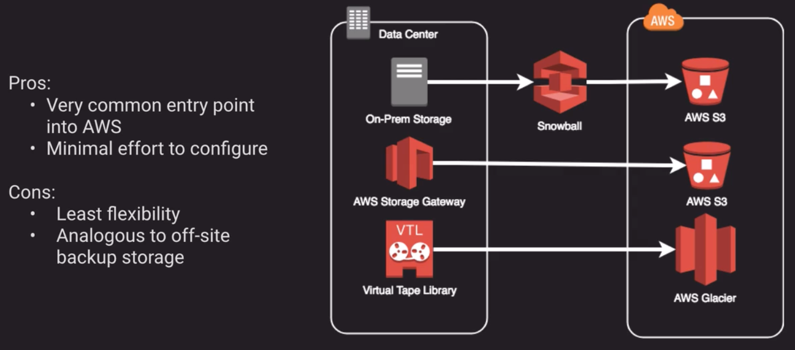
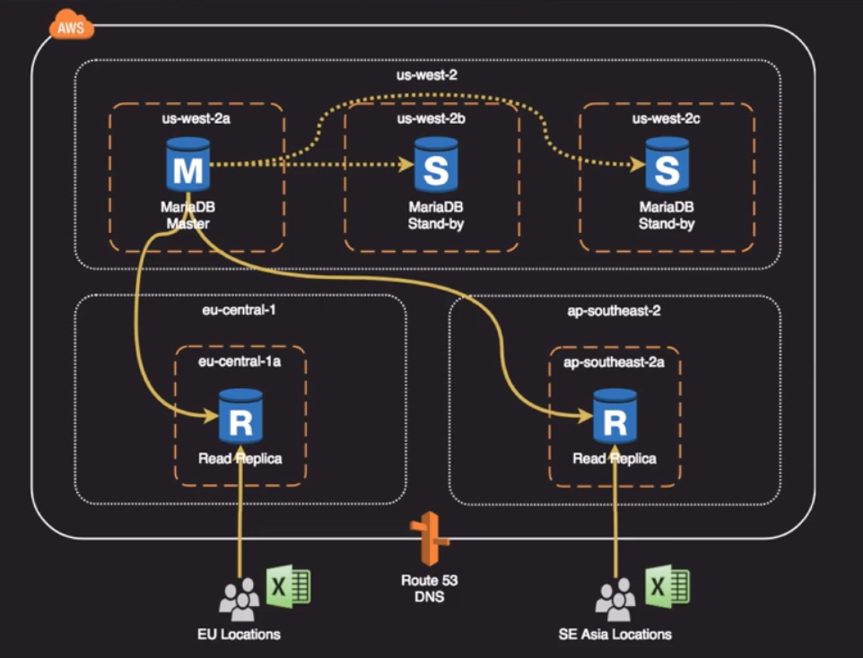

## Concepts
- 
- "Everything fails all the time" (Werner Vogels, Amazon CTO)
- We need to architect for everything to fail
- High Availability (HA)
    - Designing in `redundancies` to reduce the chance of impacting service levels
- Fault Tolerance
    - Designing in the ability to `absorb problems` without impacting service levels
    - Ability to tolerate faults
        - Can be very expensive and sometimes cost prohibitive
- Service Level Agreement (SLA)
    - An agreed `goal or target` for a given service on its performance or availability
- Recovery Time Objective (RTO)
    - Time that it takes after a disruption to restore business processes to their service levels
    - `T` is for Time
- Recovery Point Objective (RPO)
    - Acceptable amount of data loss measured in time
    - `P`is for the data that gets "poof"
- 
- 
- 
    - Human error is always another category

## Disaster Recovery Architectures
- 
- 
- 
- 
- 
    - Strictly speaking DNS records do have a TTL so once health checks trigger a change in route53 they might be some downtime

## Storage HA Options
- EBS Volumes
    - Annual Failure rate less than 0.2% compared to commodity hard drive at 4% (Given 1000 EBS volumes, expect around 2 to fail per year)
    - Availability target of 99.999%
    - Replicated automatically `within a single AZ`
        - `Vulnerable to AZ failure.  Plan accordingly`
    - Easy to snapshot, which is stored on S3 and multi-AZ durable
    - You can copy snapshots to other regions as well
    - Supports RAID (`R`edundant `A`rray of `I`ndependent `D`isks) configurations
        - RAID-0 
            - is not fault tolerant but it is very fast
        - RAID-5 
            - you need 3 or more disks
            - Most common setup used
            - Parity is distributed amongst all disks
        - AWS recommends RAID-0 and RAID-1 with their EBS volumes because EBS volumes are accessed over a network and writing those parity bits sucks a lot of IO
        - 
    - 
- S3
    - Standard Storage Class (99.99% availability = 52.6 minutes/year)
    - Standard Infrequent Access (99.9% availability = 8.76 hours/year)
    - One-zone Infrequent Access (99.5% availability = 1.83 days/year)
    - Eleven 9's of durability (99.999999999 %)
        - All the Storage classes have this same durability, except that one-zone IA only has 1 zone durability
    - Standard & Standard-IA have multi-AZ durability; one-zone only as single AZ durability
    - Backing service for EBS snapshots and many other AWS services
- Amazon EFS
    - Implementation of the NFS file system
    - True file system as opposed to block storage (EBS) of object storage (S3)
    - File locking, strong consistency, concurrently accessible
    - Each file object and metadata is stored across multiple AZs
    - Can be accessed from all AZs concurrently
    - Mount targets are highly available
    - 
- Other Options
    - Amazon Storage Gateway
        - Good way to migrate on-premise data to AWS for offsite backup
        - Best for continuous sync needs
    - Snowball
        - Various options for migrating data to AWS based on volume
        - Only for batch transfers of data
    - Glacier
        - Safe offsite archive storage
        - Long-term storage with rare retrieval needs
    - 

## Compute Options
- HA Approaches for Compute
    - Up-to-date AMIs are critical for rapid fail-over
    - AMIs can be copied to other regions for safety or DR staging
    - Horizontally scalable architectures are preferred because risk can be spread across multiple smaller machines versus one large machine
    - Reserved instances is the only way to guarantee that resources will be available when needed
    - Auto Scaling and Elastic Load Balancing work together to provide automated recovery by maintaining minimum instances
    - Route53 Health Checks also provide "self-healing" redirection of traffic
 -   

## Database HA Options
- HA Approaches for Databases
    - If possible, choose DynamoDB over RDS because of inherent fault tolerance
    - If DynamoDB can't be used, choose Aurora because of redundancy and automatic recovery features
    - If Aurora can't be used, choose multi-AZ RDS
    - Frequent RDS snapshots can protect against data corruption or failure - and they won't impact performance of multi-AZ deployment.
    - Regional replication is also an option, but will not be strongly consistent
    - If database is on EC2 then you'll have to design HA yourself
    - 
        - Dotted lines represent synchronous replication
        - Continuous lines represent asynchronous replication and this is why they are called `eventually consistent replicas`
    - 
    - 
        - If we loose a whole region then we can promote one of the Read Replicas to the Master
        - We have to promote it to a single instance first and then reconfigure it to do multi-AZ
        - Promoting a read replica to a master is usually a big deal, so better to do it automatically
        - If we were using Aurora the promotion of the Read Replica would be completely automatic
    - For high-availability scenarios in Aurora AWS recommends that you create one or more Aurora Replicas. These should be of the same DB instance class as the primary instance and in different Availability Zones for your Aurora DB cluster.
- HA Notes for Redshift
    - Currently, Redshift does not support multi-AZ deployments
    - Best HA option is to use a multi-node cluster which support data replication and node recovery
    - A single node Redshift cluster does not support data replication and you'll have to restore from a snapshot on S3 if a drive fails
- HA Notes for ElastiCache
    - Memcached
        - Because Memcached does not support replication, a node failure will result in data loss
        - Use multiple nodes in each shard to minimize data loss on node failure
        - Launch multiple nodes across available AZs to minimize data loss on AZ failure
    - Redis
        - Use multiple nodes in each shard and distribute the nodes across multiple AZs
        - Enable multi-AZ on the replication group to permit automatic failover if the primary node fails
        - Schedule regular backups of your Redis cluster

## Network HA Options
- By creating subnets in the available AZs, you create multi-AZ presence for your VPC
- Best practice is to create at least 2 VPN tunnels into your Virtual Private Gateway
- Direct Connect is not HA by default, so you need to establish a secondary connection via another Direct Connect (ideally with another provider) or use a VPN
- Route 53's Health Checks provide basic level of redirecting DNS resolutions
- Elastic IPs allow you flexibility to change out backing assets without impacting name resolution
- For multi-AZ redundancy of NAT Gateways, create gateways in each AZ with routes for private subnets to use the local NAT Gateway

## Pro Tips
- Failure Mode and Effects Analysis (FMEA)
    - A systematic process to examine:
        1. What could go wrong
        2. What impact it might have
        3. What is the likelihood of it occurring
        4. What is our ability to detect and react
        5. What should we do about it to reduce the risk or position ourselves to react to it
    - Severity * Probability * Detection = Risk Priority Number
        - Some people use formula:  Severity * Probability + Detection = Risk Priority Number  

## Sample Questions Notes
- Restoring from a VTL (Virtual Tape Library) can take several hours so it can impact the desired RTO
- Amazon RDS Read Replicas for MySQL and MariaDB now support Multi-AZ deployments. Combining Read Replicas with Multi-AZ enables you to build a resilient disaster recovery strategy and simplify your database engine upgrade process. 
    - Amazon RDS Read Replicas enable you to create one or more read-only copies of your database instance within the same AWS Region or in a different AWS Region. Updates made to the source database are then asynchronously copied to your Read Replicas. In addition to providing scalability for read-heavy workloads, Read Replicas can be promoted to become a standalone database instance when needed. 
    - Amazon RDS Multi-AZ deployments provide enhanced availability for database instances within a single AWS Region. With Multi-AZ, your data is synchronously replicated to a standby in a different Availability Zone (AZ). In the event of an infrastructure failure, Amazon RDS performs an automatic failover to the standby, minimizing disruption to your applications.
- ELB can have cross-zone load balancing enabled to that traffic is distributed equally across all targets regardless of the AZ in which they are located
- If you absolutely want to make sure that you have resources when you need then you should purchase Reserved Instances
- Read Replicas in RDS don't have auto-failover capability, they're available but you have to implement the switch yourself either manually or with a script.  In Aurora however they do have auto-failover.
- An electromagnetic pulse (EMP) from a sun flare takes out the electrical grid.  What type of disaster is this?
    - Infrastructure
        - Failure of utilities or adverse environmental conditions are considered infrastructure disasters
- Your client has defined an RPO and RTO of 24 hours for their 2GB database. What general approach would you recommend to fulfill these requirements most cost-effectively?
    - Backup and Restore
        - With the relatively small data size and generous RTO/RPO, a simple backup and restore process would work well.
- Your client is seeking recommendations to help reduce the risk of underlying hardware failure on AWS. Which might you recommend? (Choose 2)
    - Make use of horizontal scaling over vertical scaling where possible
    - Make use spread placement groups
- Which is false about Redshift in the context of fault tolerance?
    - Redshift multi-node clusters are multi-AZ by default.
        - Redshift currently only supports single-AZ deployments but you can run multiple clusters in different AZs.
- You need an in-memory cache but you want it to be able to survive an AZ failure. Which option is best?
    - Elasticache for Redis
        - Elasticache for Redis supports multi-AZ configurations while Memcached does not.

## Other resources
- https://d1.awsstatic.com/whitepapers/Storage/Backup_and_Recovery_Approaches_Using_AWS.pdf
- https://d1.awsstatic.com/whitepapers/getting-started-with-amazon-aurora.pdf
- https://d1.awsstatic.com/whitepapers/architecture/AWS-Reliability-Pillar.pdf
- Models of Availability
    - https://www.youtube.com/watch?v=xc_PZ5OPXcc
- How to Design a Multi-Region Active-Active Architecture
    - https://www.youtube.com/watch?v=RMrfzR4zyM4
- Disaster Recovery with AWS: Tiered Approaches to Balance Cost with Recovery Directives
    - https://www.youtube.com/watch?v=a7EMou07hRc

