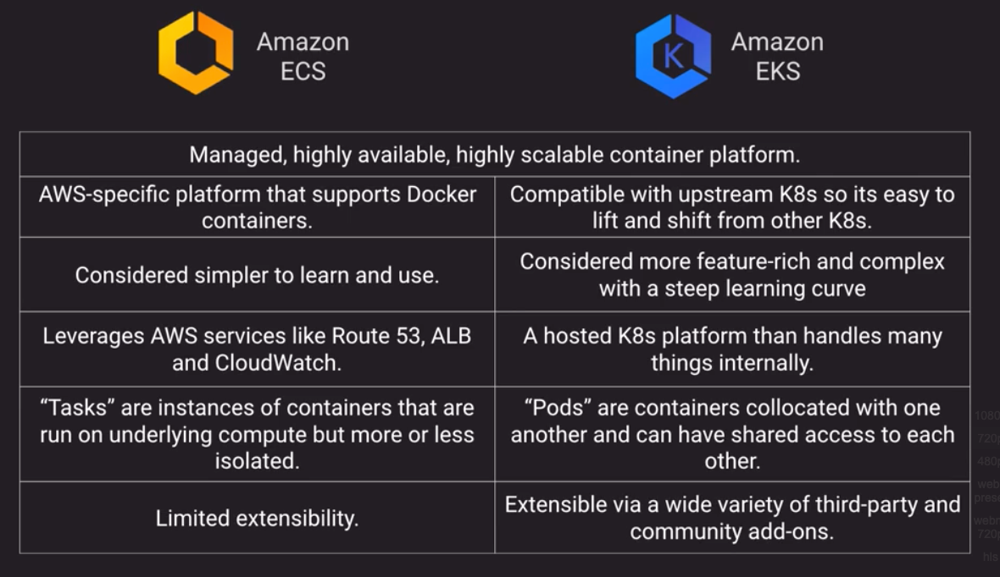

## Types of Deployments
- *Types of Deployments*
- *Rolling Deployment*
- *A/B Testing Deployment*
- Canary Release
    - Canary release is a technique to reduce the risk of introducing a new software version in production by slowly rolling out the change to a small subset of users before rolling it out to the entire infrastructure and making it available to everybody.
- *Blue Green Deployment*
    - The goal of blue/green deployments is to achieve `immutable infrastructure`, where you don't make changes to your application after it's deployed, but redeploy altogether
    - Blue Green Methods
        - Update DNS with route 53 to point to a new ELB or instance
        - Swap ASG already primed with new version instances behind the ELB
        - Change ASG launch configuration to use new AMI version and terminate old instances
            - Launch Configuration cannot be modified so you'll have to create a new one and associate it to the ELB
        - Swap environment URL of Elastic Beanstalk
        - Clone stack in AWS OpsWorks and update DNS
    - Blue Green Anti-patterns (Situations that are not ideal candidates for Blue-Green deployments)
        - Data store schema is too tightly coupled to the code changes
            - to avoid issues make sure that schema changes are both forward and backward compatible
        - The upgrade requires special upgrade routines to be run during deployment
            - rollback is not trivial
        - Off-the-shelf products might not be blue-green friendly

## Continuous Integration and Continuous Deployment
- Grace Hopper pioneered the idea that programming languages should be machine independent which lead to dev of COBOL
- CI:  Continuous Integration
    - Merge code changes back to main branch as frequently as possible with automated testing as you go
- Continuous Delivery
    - You have automated your release process to the point you can deploy at the click of a button
- Continuous Deployment
    - Each code change that passes all stages of the release process is releases to production with no human intervention required
- *Typical Development Lifecycle*
- CI/CD Considerations
    - Objective is to create smaller, incremental compartmentalized improvements and features
    - Lowers deployment risk and tries to limit negative impact
    - Test automation game must be STRONG
    - Feature toggle patterns useful for dealing with in-progress features not ready for release (versus more traditional branching strategies)
    - Microservice architectures lend themselves well to CI/CD practices
- AWS Development Lifecycle Tools
    - AWS CodeCommit
        - Hosted Git Repository
    - AWS CodeBuild
        - Helps us compile code, run tests and create deployment packages
    - AWS CodeDeploy
        - Deploys deployment packages on EC2, lambda, Elastic Beanstalk, ECS
    - AWS CodePipeline
        - Orchestration mechanism that helps us do all these things together
    - AWS X-Ray
        - Helps us do debugging in distributed and serveless application scenario
    - AWS CodeStar
        - It is to our development processes what Fargate is to ECS, has templates that are more turnkey and avoid a lot of manual work

## Elastic Beanstalk
- Orchestration service to make it push-button easy to deploy scalable web landscapes
- Wide range of supported platforms - from Docker to PHP to Java to Node.js
- Multiple environments within application (DEV, QA, PROD, etc.)
- Great for ease of deployment, but not great if you need lots of control and flexibility
- *Elastic Beanstalk Deployment Options*
    - Special Option to swap the URLs and point to the new version, if we have problems we can swap the URLs back
- You simply upload code and Elastic Beanstalk automatically handles the deployment, from capacity provisioning, load balancing, auto-scaling to application health monitoring. Meanwhile we can retain full control over the AWS resources used in the application and can access the underlying resources at any time.

## CloudFormation
- Infrastructure As Code
- Using JSON or YAML, you can model and provision entire landscapes
- Repeatable, automatic deployments and rollbacks
- Nest common components for reusability
- Supports over 500 Resource Types (components of AWS Services)
- Want more?  Supports custom resources via SNS or Lambda
- Concepts:
    - Templates:  The JSON or YAML text file(s) that contain the instructions for builing out the AWS environment
    - Stacks:  The entire environment described by the template and created, updated, and deleted as a single unit
    - Change Sets:  A summary of proposed changes to your stack that will allow you so see how those changes might impact your existing resources before implementing them. 
- Stack Policies
    - Designed to protect specific resources within your stak from being unintentionally deleted or updated
    - We can add a stack policy via the console or CLI when creating a stack
    - Adding a Stack Policy to an existing stack can only be done via CLI
    - Once applied, a Stack Policy cannot be removed but it can be modified only via CLI (cannot be modified using the console)
    - *Stack Policy Example*
    - By default they protect everything so we have to explicitly allow Updates to all the resources
- Best practices
    - AWS provides Python "helper scripts" which can help you install software and start services on your EC2 instances
    - Use CloudFormation to make changes to your landscape rather than going directly into the resources
    - Make use of Change Sets to identify potential trouble spots in your updates
    - Use Stack Policies to explicitly protect sensitive portions of your stack
    - Use a version control system such as CodeCommit or GitHub to track changes to templates
- Template anatomy
    - AWSTemplateFormatVersion
    - Description
    - Metadata
    - Parameters
    - Mappings
    - Conditions
        -  Includes statements that define when a resource is created or when a property is defined. For example, you can compare whether a value is equal to another value. Based on the result of that condition, you can conditionally create resources. If you have multiple conditions, separate them with commas
        - You might use conditions when you want to reuse a template that can create resources in different contexts, such as a test environment versus a production environment. In your template, you can add an EnvironmentType input parameter, which accepts either prod or test as inputs. For the production environment, you might include Amazon EC2 instances with certain capabilities; however, for the test environment, you want to use reduced capabilities to save money. With conditions, you can define which resources are created and how they're configured for each environment type.
        - Conditions are evaluated based on input parameter values that you specify when you create or update a stack. Within each condition, you can reference another condition, a parameter value, or a mapping. After you define all your conditions, you can associate them with resources and resource properties in the Resources and outputs sections of a template.
    - Transform
    - Resources
    - Outputs

## Elastic Container Service
- *ECS/EKS Comparison*
- *ECS Launch Types*

## API Gateway
- Managed, high availability service to front-end REST APIs
- Backed with custom code via lambda, as a proxy for another AWS Service of any other HTTP API on AWS or elsewhere
- Regionally based, private or edge optimized (deployed via CloudFront)
- Support API keys and usage plans for user identification, throttling or quota management
- Using Cloudfront behind the scenes and custom domains and SNI are supported
- Can be published as products and monetized on AWS marketplace
- Can Cache responses
- There are multiple mechanisms that can be used to control access to the API in API gateway.:
    - `Resource policies` let you create resource-based policies to allow or deny access to your APIs and methods from specified source IP addresses or VPC endpoints. It can be configured in the API Gateway console:
    - `Standard AWS IAM roles` and policies offer flexible and robust access controls that can be applied to an entire API or individual methods.
    - `Lambda authorizers` are Lambda functions that control access to REST API methods using bearer token authentication as well as information described by headers, paths, query strings, stage variables, or context variables request parameters.
    - `Amazon Cognito user pools` let you create customizable authentication and authorization solutions for your REST APIs.
- *API Gateway Parts*
    - Method Request/Method Response are part mainly deal with API gateways and they are the API's interface with the API's frontend (a client), whereas Integration Request and Integration Response are the API's interface with the backend.

## Management Tools
- AWS Config
    - Allows you to assess, audit and evaluate configurations of your AWS resources
    - Very useful for Configuration Management as part of an ITIL program
    - Creates a baseline of various configuration settings and files on systems and then tracks variations against that baseline over time
    - AWS Config Rules can check resources for certain desired conditions and if violations are found, the resources is flagged as "noncompliant"
    - Examples of Config Rules:
        - Is backup enabled on RDS?
        - Is CloudTrail enabled on the AWS account?
        - Are EBS volumes encrypted?
- AWS Opworks
    - Managed instance of either Chef or Puppet-2 very popular automation platforms
    - Provide configuration management to deploy code, automate tasks, configure instances, perform upgrades, etc.
    - Has 3 offerings:
        1. Opsworks for Chef Automate
        2. OpsWorks for Puppet Enterprise
        3. Opsworks Stacks
            - AWS creation and uses an embedded Chef solo client installed on EC2 instances to run Chef recipes
            - Supports EC2 instances and on-prem servers as well with an agent
            - Stacks are collections of resources needed to support a service or application
            - Layers represent components of the application delivery hierarchy
            - EC2 instances, RDS instances and ELBs are examples of layers
            - Stacks can be cloned - but only within the same region
            - OpsWorks is a global service.  But when you create a stack, you must specify a region and that stack can only control resources in that region
                - Ex:  You can't manage an EC2 instance created in EU-Central-1 from OpsWorks stack created for US-East-2     
    - Opsworks for Chef Automate and Puppet Enterprise are fully managed implementation of each respective platform

## AWS System Manager 
    - Centralized console and toolset for a wide variety of system management tasks
    - Designed for managing a large fleet of systems - tens of hundreds
    - Main worker component is the SSM Agent which is installed on your instances 
    - SSM agent installed by default on recent AWS-provided base AMIs for Linux and Windows
    - Managed AWS-based and on-premises based systems via the agent
    - AWS System Manager Services:
        - Inventory
            - Collects information from managed instances about OS, application, instance metadata.
            - Example:  Which instances have Apache HTTP Server 2.2.x or earlier?
         - State Manager
            - Allows to specify groups of machines that have one configuration or another 
            - Example:  Create state for web servers with any server that have an old server of Apache and put them in `Pre-Upgrade State` and anything with current version can be in `Post-Upgrade State`
        - Parameter Store
            - Shared secure storage for config data, connection strings, passwords, etc. 
            - Example:  Store and retrieve RDS credentials to append to a config file upon boot
        - Insight Dashboards
            - Account-level view of Cloudtrail, Config, Trust Advisor 
            - Example:  Single viewport for any exceptions on config compliance
        - Resource Groups
            - Group resource through tagging for organization
            - Ex:  Create a dashboard for all assets belonging to our Production ERP landscape
        - Maintenance Windows
            - Define schedules for instances to patch, update apps, run scripts and more
            - Ex:  Define hours of 00:00 to 02:00 as maintenance windows for Patch Manager
        - Automation
            - Auomating routine maintenance tasks and scripts
            - Ex:  Stop DEV and QA instances every Friday and restart Monday morning
        - Run Command
            - Run commands and scripts without logging in vis SSH or RDP
            - Ex:  Run a shell script on 53 different instances at the same time
        - Patch Manager
            - Automates process of patching instances for updates
            - Ex:  Keep a fleet at the same patch level by applying new security patches during next Maintenance Window
            - Baselines
                - Purpose:  Act as a gate-keeper to allow certain patches to come through and be automatically applied if they meet certain criteria
                - *Patch Manager Windows Baselines Example*
        - System Manager Documents
            - Define the actions the System Manager performs
            - JSON or YAML files
            - Include different steps or parameters
            - *System Manager Document Types* 

## Enterprise Apps
- Business Applications and End-User Computing
    - Amazon Workspaces
        - Desktop as a Service
    - Amazon Appstream
        - Application hosting
    - *Amazon Workspaces vs Amazon Appstream* 
        - Everyting in both lives on AWS infrastructure and be tightly managed and controlled
        - Use Cases:  
            - Highly regulated industries where security and confidentiality is a concern.  Can be used to keep all data in a protected VPC and off local PCs
            - Remote or seasonal workers such as a distributed call center.  Gives remote workers virtual desktops or hosted applications and let them use their own PCs
            - Allow customers to demo your product without them having to download and install it locally
    - AWS Connect
        - Fully managed cloud-based contact center solution with configurable call handling, inbound and outbound telephony, interactive voice response, chatbot technology and analytics
        - Can work in conjunction with Lex to get Voice Response (Build Conversation Bots)
        - Can integrate with other enterprise applications like Customer Relationship Management (CRM) Systems such that when inbound call they can look at caller id and popup screen with information on the caller
    - Amazon Chime
        - Online meeting and video conference service, similar to zoom or skype.
        - Supports usual conferencing features like desktop sharing, group chat, VOIP, and session recording
    - Amazon Workdocs
        - Online document storage and collaboration platform, similar to dropbox or google drive for corporations
        - Supports version management, sharing documents, and collaborative edits
    - Amazon WorkMail
        - Fully managed email and calendar as a service
        - Compatible with Microsoft Exchange (Outlook can be used as a client), IMAP, Android, and iOS mail clients
    - Amazon WorkLink
        - Provide secure access to internal web applications for mobile devices
        - When mobile user requests an app, it's rendered on a secure machine then the image is sent to the mobile client
        - Kind of one-step below a full VPN connection but aims to be very easy to use
    - Alexa for Business
        - Deploy Alexa functionality and skills internally in your enterprise
        - Management functionality more appropriate for an enterprise organization than buying and provisioning individual Alexa devices
        - Ex:  Alexa is this conference room booked for the next hour, Alexa what was our net sales YTD this time last year

## Machine Learning Landscape
- *AWS Machine Learning Landscape* 
- 3 layers of offerings:
    - Application Services
    - Platform Services
    - Frameworks & Infrastructure
- Amazon Comprehend
    - Every feature is available as a REST API
    - Fully managed Natural Language Processing (NLP) service that finds insights and relationships within text
    - Continuously trained
    - Example:  Sentiment analysis of social media posts
    - Core Capabilities:
        - Keyphrase Extraction
        - Sentiment Analysis (only English and Spanish)
        - Syntax Analysis
        - Entity Recognition
            - examples of entities:  People, Places, Locations, etc.
            - Only available in English
        - Language Identification API 
        - Topic Modeling
    - *AWS Comprehend Analysis Example*
- Amazon Forecast
    - Pour in some time series data and it can analyze the data and give you some predictions about what the future might look like
- Amazon Lex
    - Backbone of Alexa
    - Can translate something that someone says into a context or an intent
    - Example:  Create a customer service chatbot to automatically handle routine requests
- Amazon Personalize
    - Recommendation engine as a service based on demographic and behavioral data
    - Example:  Provide potential upsell products at checkout during a web transaction
- Amazon Polly
    - Text-2-speech service supporting multiple languages, accents and voices
    - Example:  Provide dynamically generated personalized voice response for inbound callers
- Amazon Rekognition
    - Image and video analysis to parse and recognize objects, people, activities and facial expressions
    - Example:  Provide an additional form of employee authentication though facial recognition as they scan an access badge
- Amazon Textract
    - Kind of like a high power OCR Engine
    - Extracts text, context and metadata from scanned documents
    - Example:  Automatically digitize and process physical paper forms
- Amazon Transcribe
    - Speech-to-text as a service
    - Example:  Automatically create transcripts of recorded presentations
- Amazon Translate
    - Translate text to and from many different languages, similar to google translate
    - Example:  Dyanmically create localized web content for users based on their geography

## Pro Tips
- Blue/Green is not just for nimble webapps in the cloud  

## Sample Questions Notes
- We never want to refer to ELBs by their IP address, we should refer to them by their FQDN or Alias because they can resolve to many different IP addresses
- A VPC route table cannot control traffic to a public ELB
- If we're using an ELB it makes no sense to assign EIPs to instances behind ELB
- A Stack Policy cannot be removed and can only be updated using the CLI
- Which of the following are not valid CloudFormation template sections:
    - Options
- You are responsible for managing landscapes in multiple regions. You want to use OpsWorks Stacks to help in that management. Which of the following are false?
    - OpsWorks allows you to clone stacks within the same region and to other regions.
- Which AWS service can help orchestration of a continuous delivery process?
    - AWS CodePipeline
- You are helping a customer build a CloudFormation template. During the stack creation, you need to get a software license key from a third-party via API call. What resource would you use?
    - AWS::CloudFormation::CustomResource
- Your company has strict change management processes in place that require extensive review of potential impacts of changes. What CloudFormation feature would be useful for this?
    - Change Sets
- Which of the following components are not part of Amazon ECS?
    - File Storage
    - Notes:
        - Service Discovery makes it easy for containers within an ECS cluster to discover and connect with each other, using Route 53 endpoints. Task Definitions define the resource utilisation and configuration of tasks, using JSON templates. Task Scheduling allows you to run batch processing jobs run on a schedule. File Storage is not a component of ECS. Storage within ECS is handled by EBS volumes attached to the underlying EC2 instances and not by ECS itself.
- Your organization does not have a good software QA process in place and its difficult to anticipate how your app will perform in production. What deployment method presents the lowest risk in this situation?
    - Canary Release
    - Notes:
        - A Canary Release is a way to introduce a new version of an application into production with limited exposure.
- Which of these are NOT benefits of Continuous Delivery?
    - Automated software releases to production
    - Notes:
        - Continuous Deliver differs from Continuous Deployment in that Delivery still includes a manual check before release to production. 
- AWS CodeDeploy provides all of the following deployment features except: (Choose 2)
    - Answers:
        - Monitoring
        - Scaling
    - Notes:
        - AWS CodeDeploy does not provide Scaling or Provisioning of the deployment. Elastic Beanstalk, CloudFormation and OpsWorks can do this.
- Your client has decided to use Elastic Beanstalk to facilitate deployments. They want shortest deployment time above all other considerations. Which deployment option should they choose?
    - All at Once
    - Notes:
        - All at Once deployment offers the shortest deployment time but it will incur downtime as the instances are upgraded.
- Creating a new AMI, assigning it to a new Launch Configuration and then updating an existing Auto Scaling Group is an example of this upgrade method:
    - Disposable Upgrade

## Other resources
- Introduction course to CloudFormation from ACG
    - https://learn.acloud.guru/course/intro-aws-cloudformation/dashboard
- https://d1.awsstatic.com/whitepapers/DevOps/infrastructure-as-code.pdf
- https://d1.awsstatic.com/whitepapers/DevOps/practicing-continuous-integration-continuous-delivery-on-AWS.pdf
- https://d1.awsstatic.com/whitepapers/overview-of-deployment-options-on-aws.pdf
- AWS re:Invent 2017: Deep Dive on AWS CloudFormation (DEV317)
    - https://www.youtube.com/watch?v=01hy48R9Kr8
- AWS re:Invent 2017: Moving to Containers: Building with Docker and Amazon ECS (CON310)
    - https://www.youtube.com/watch?v=Qik9LBktjgs
- AWS re:Invent 2017: Continuous Integration Best Practices for Software Development T (DEV322)
    - https://www.youtube.com/watch?v=GEPJ7Lo346A

