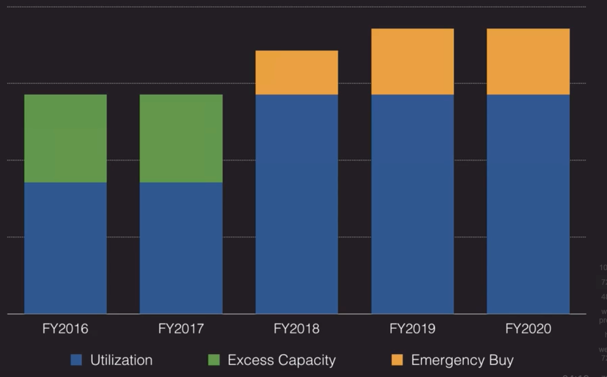

## Concepts
- CapEx (Capital Expense)
    - Money spent on long-term assets like property, buildings and equipment (laptops, datacenter)
    - Most of the time CapEx budgeting is a complete guess
    - *CapEx Budgeting Example with Excess Capacity* 
    - *Capex Budgeting Example with Higher Demand Capacity*
- OpEx (Operational Expense)
    - Money spent for on-going costs for running the business.  Usually considered variable expenses, they can choose to scale back and pay less or use more and pay more
    - Uses variable cost, you buy capacity as you need it
    - Pay per use models
- Total Cost of Ownership (TCO)
    - A comprehensive look at the entire cost model of a given decision or option, often including both hard costs and soft costs
- Return on Investment (ROI)
    - The amount an entity can expect to receive back within a certain amount of time given an investment
- Be careful with RCO and ROI because it tends to "be a trap"
    - Many organizations don't have a good handle on their full on-prem data center costs (power, cooling, fire suppression, etc.)
    - Soft costs are rarely tracked or even understood as a tangible expense (difficulty or extra time to maintain something or overhead)
    - When moving to the cloud you have to consider the learning curve will be different from person to person
    - Suggestion:  Get help from the folks in the financial and accounting department to help build TCOs and ROIs that are based on facts

## Cost Optimization Strategies
- Appropriate Provisioning
    - Provision the resources that you need and nothing more
    - Consolidate where possible for greater density and lower complexity (multi-database RDS, containers)
    - Cloudwatch can help by monitoring utilization
    - *RDS Savings with Consolidation example* 
- Right-Sizing
    - Using lowest-cost resource that still meets the technical specifications
    - Architecting for most consistent use of resources is best versus spikes and valleys
    - Loosely coupled architectures using SNS, SQS, Lambda and DynamoDB can smooth demand and create more predictability and consistency
- Purchase Options
    - For permanent applications or needs, Reserved Instances provide the best cost advantage
    - Spot instances are best for temporary horizontal scaling
    - EC2 fleets lets you define target mix of On-Demand, Reserved and Spot Instances
    - *EC2 Instance pricing comparison example* 
- Geographic Selection
    - AWS pricing can vary from region to region
    - Consider potential savings by locating resources in a remote region if local access is not required
    - Route53 and Cloudfront can be used to reduce potential latency of a remote region
- Managed Services
    - Leverage managed services such as MySQL RDS over self-managed options such as MySQL on EC2
    - Cost savings gained through lower complexity and manual intervention
    - RDS, Redshift, Fargate, and EMR are great examples of fully-managed services that replace traditionally complex and difficult installations with push-button ease.
- Optimized Data Transfer
    - Moving data in doesn't cost anything
    - Data going out and between AWS regions can become a significant cost component
    - Direct connect can be a more cost-effective option given data volume and speed 

## Tagging and Resource Groups
- Tags   
    - `THE NUMBER ONE BEST THING` you can do to help manage your AWS assets!
    - Tags are just arbitrary name/value pairs that you can assign to virtually all AWS assets to serve as metadata
    - Tagging strategies can be used for Cost Allocation, Security, Automation, and many other uses
        - For example, we can use a tag in an IAM policy to implement access controls to certain resources
    - Enforcing standardized tagging can be done via AWS Config Rules or custom scripts 
        - For example, EC2 instances not properly tagged are stopped or terminated nightly
    - Most resources can have up to 50 tags
- Resource Groups
    - Resource Groups are groupings of AWS assets defined by tags
    - Just a logical grouping
    - Create custom consoles to consolidate metrics, alarms, and config details around given tags
    - Common Resource Groupings:
        - Environments (DEV, QA, PROD)
        - Project Resources
        - Collection of resources supporting key business processes
        - Resources allocated to various departments or cost centers

## Spot Instances and Reserved Instances
- Reserved Instances
    - Purchase (or agree to purchase) usage of EC2 instances in advance for a significant discount over on-demand pricing
    - Provides capacity reservation when used in a specific AZ (example:  in DR scenarios)
    - AWS billing automatically applies discounted rates when you launch an instance that matches your purchased RI
    - EC2 has 3 RI types:  Standard, Convertible, and Scheduled, can also be bought on RDS, Aurora, etc.
    - Can be shared across multiple accounts withing Consolidated Billing
    - If you find you don't need your RI's, you can try to sell them on the Reserved Instance Marketplace.
    - *Standard vs Convertible RIs* 
    - Reserved instances cannot be changed from one region to another, only between AZ's in the same region
- RI Attributes
    - Instance Type - designates CPU, memory, networking capability
    - Platform - Linux, SUSE Linux, RHEL, Microsoft Windows, Microsoft SQL Server
    - Tenancy - Default (shared) tenancy or Dedicated Tenancy
    - Availability Zone (Optional) - if AZ is selected, RI is reserved and discount applies to that AZ (Zonal RI).  `If no AZ is specified, no reservation is created` but the discount is applied to any instance in the family in any AZ in the region (Regional RI)
        - Note:  You can change a Zonal RI to Regional RI via the console or ModifyReservedInstances API
- RI Size Flexibility
    - Only available for Linux/Unix Regional RIs with default tenancy.  Not available for Windows, RHEL or SLES
    - *RI Size Flexibility Example* 
- Spot Instances
    - Excess EC2 capacity that AWS tries to sell on an market exchange basis
    - Customer creates a Spot Request and specifies AMI, desired instance types, and other key information
    - Customer defines the highest price willing to pay for instance.  If capacity is constrained and others are willing to pay more, your instance might get terminated or stopped
    - Spot request can a "fill and kill" (one time only), "maintain", or "duration-based"
    - For "One Time Request" whenever the price gets above my price point the instance gets `terminated and ephemeral data is lost` 
    - For "Request and Maintain", instance can be configured to Terminate, Stop or Hibernate until price point can be met again so I can avoid loosing my data
    - The price and demand can fluctuate between AZs, ideally to think about architectures that allow you to spin off in any AZ
    - *Dedicated Instance vs Dedicated Host* 

 ## Cost Management Tools   
- AWS Budgets
    - Allows you to set pre-defined limits and notifications if nearing a budget or exceeding the budget
    - Can be based on cost, usage, reserved instance utilization or reserved instance coverage
    - Useful as a method to distribute cost and usage awareness and responsibility to platform users
- Consolidated Billing
    - Enable a single Payer account that's locked down to only those who need access
    - Economies of scale by bringing together resource consumption across accounts
    - *Economies of Scale Example* 
- Trusted Advisor
    - Provides automated checks in the follwowing areas:  Cost optimization, Performance, Security, Fault Tolerance, Service Limits
    - Runs a series of checks on your resources and proposes suggested improvements
    - Can help recommend cost optimization adjustments like reserved instances or scaling adjustments
    - Core checks are available to all customers
    - Full trusted Advisor benefits require a Business or Enterprise support plan

## Pro Tips
- Be extra careful around the TCO and ROI minefield
- Be careful with case studies where the interests of a vendor are being promoted
- The real benefit of a Cloud Migration is in Agility and Flexibility.  Cost alone is typically not the strongest business case
    - When you go to the cloud at the beginning your costs are most probably going to rise
- Think of cost optimization as a long-term effort - don't spend too much time on trying to micro-manage it upfront
- Implement a Tagging Strategy out of the gate!
- Be aggressive in formulating a pilot project: large-scale benefits make for dramatic business cases, where small-scale wins can easily be ignored.

## Sample Questions Notes
- Some ideas to reduce cost:
    - Create an EBS snapshot lifecycle process to delete outdated snapshots
    - Use S3 lifecycle feature to transition infrequently accessed data to different storage classes
    - Note:  Consolidating smaller RDS instances into single larger RDS instance does not guarantee to save money
- Which statement is true about Dedicated Instances and Dedicated Hosts?
    - Dedicated instances can run as Spot instances
        - Dedicated Instances are available as on-demand, reserved and spot instances.
    - Dedicated Hosts reserve capacity
        - Dedicated Hosts reserve capacity because you are paying for the whole physical server that cannot be allocated to anyone else.
- You have some extra unused RIs in one AZ but need in another AZ. If you want to make use of them in the other AZ, what can you do? 
    - If these are Regional RIs, you do not need to do anything.
    - If these are Zonal RIs, you first need to modify the zone.
- Your company is evaluating the financial implications of a cloud migration. What should be your first step?
    - Get a clear understanding of current costs
- What is the primary AWS value proposition around cost?
    - AWS offers agility without large upfront investments.
        - The primary value proposition around cost for AWS is that it creates the opportunity for agility using a pay-as-you-go model
- Which of these services can most directly help with right sizing your landscape? (Choose 2)
    - AWS Trusted Advisor 
    - AWS CloudWatch  
- What expectation should you NOT set with your stakeholders about a cloud migration?
    - Overall costs will decrease as soon as we start using cloud assets.
- Choose the features of Consolidated Billing.
    - Multiple standalone accounts are combined and may reduce your overall bill
    - A single bill is issued containing the charges for all AWS Accounts
    - Account charges can be tracked individually
- Consolidated Billing offers what potential economy-of-scale benefit?
    - Leveraging tiered pricing.
- Your application has to process a very volatile inconsistent flow of data inbound in order. Which of the following options would be most reliable and cost-effective?
    - Use SQS to receive the inbound messages and use a single reserved instance to process them.
        - A buffering pattern is useful in smoothing demand. We can do this with SQS using FIFO to satisfy the in order requirement. 

## Other resources
- https://d1.awsstatic.com/whitepapers/architecture/AWS-Cost-Optimization-Pillar.pdf
- https://d1.awsstatic.com/whitepapers/total-cost-of-operation-benefits-using-aws.pdf
- https://d1.awsstatic.com/whitepapers/introduction-to-aws-cloud-economics-final.pdf
- AWS re:Invent 2017: Building a Solid Business Case for Cloud Migration (ENT203)
    - https://www.youtube.com/watch?v=CcspJkc7zqg
- AWS re:Invent 2017: Running Lean Architectures: How to Optimize for Cost Efficiency (ARC303)
    - https://www.youtube.com/watch?v=XQFweGjK_-o
- AWS re:Invent 2017: How Hess Has Continued to Optimize the AWS Cloud After Migrating (ENT218)
    - https://www.youtube.com/watch?v=1Z4BfRj2FiU
