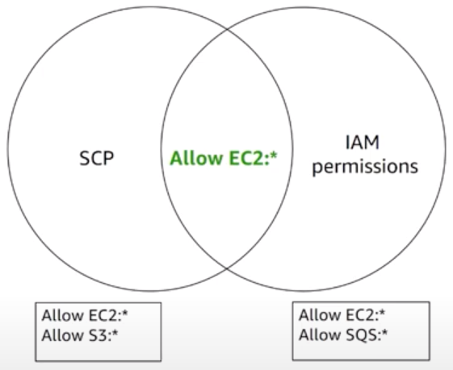
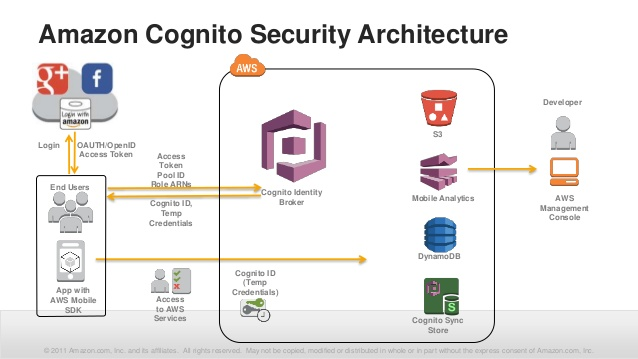
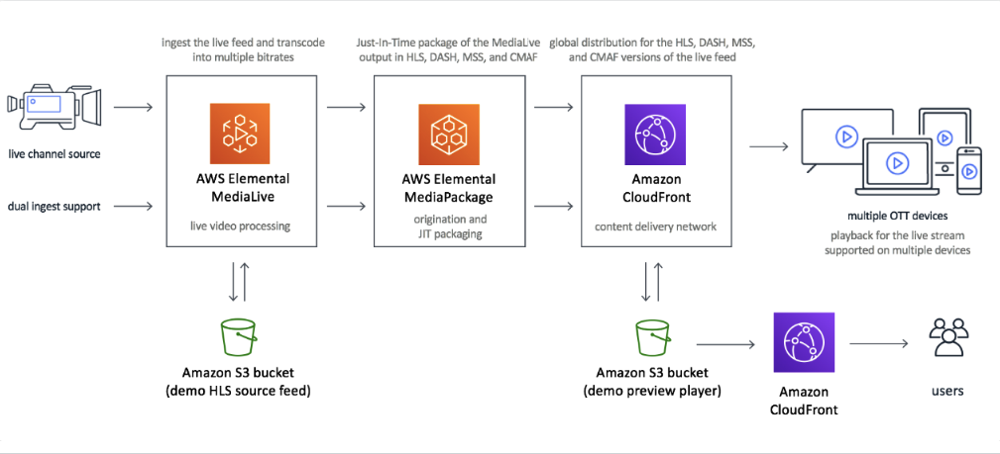

## AWS Organizations
- If you receive a single bill monthly for multiple accounts, you're using AWS Organizations.  This is a "legacy" mode supporting only consolidated billing features.  You must migrate your organization to use advanced governance and management capabilities.
    - Note:  After All Features is enabled, it cannot be changed back.
- Concepts and Terms
    - Organization:  All of the accounts that you manage and control in the organization
        - There's a service access report under Organization Activity that displays last accessed services
    - AWS Account:  Smallest unit of management in the Organization
        - Can only sit in one organization at a time
    - Master Account:  Account used to create the organization
        - Payer account
        - Used as a central management and governance hub
    - Organizational Unit (OU): Set of AWS accounts logically grouped within an organization
        - You can nest OUs inside other OUs to form a hierarchical structure
        - An Organizational Unit can have AWS accounts and other Organizational Units as members. This makes the whole structure similar to a tree. The accounts are organized in a hierarchical, tree-like structure.
        - An OU can have only one parent. 
        - An AWS account can be a member of only one OU.
        - One thing to note is that user cannot move an OU to another place from console or CLI command. So user has to create a new OU and move accounts to it
    - Policy:  Document describing controls to be applied to a selected set of accounts
- Capabilities
    - Manage and define your organization and accounts
        - Create new AWS accounts programatically
        - Group accounts into OUs for management
        - Centrally provision accounts (AWS Cloudformation Stacksets)
        - Tag AWS Accounts
        - Manage service quotas (limits) for new accounts (using AWS Service Quotas)
    - Control Access and permissions
        - Deploy console and CLI access to accounts (AWS Single Sign-on)
        - Define permissions based on membership in an organization (aws:PrincipalOrgId condition key)
        - Author fine-grained permission guardrails across accounts (Service Control Policies)
            - SCPs define the maximum available permissions for IAM entities in an account but do not grant specific permissions
            - Can be attached to the root, OUs and individual accounts
            - 
            - Authoring SCPs
                - Whitelisting - only allow specific actions
                - Blacklisting - block specific actions
                    - Requires and Allow:* to avoid denying access to all servies
                    - Typical evaluation:  Explicit Deny -->Implicit Deny all-->Explicit Allow
                - Sample scenarios:  Deny launching resources outside of specific region(s)
    - Audit, monitor, and secure your environment
        - Aggregate AWS Config data in a central location for compliance auditing of your accounts
        - Centrally create, provision, and modify web application firewalls to secure your applications (AWS Firewall Manager)
        - Accept business agreements for organization accounts (AWS Arttifact)
        - Allow organization-wide notification publishing (AWS Cloudwatch Events)
        - Centrally enable audit logging
            - Ensure that all of your AWS accounts have audit logging enabled centrally
            - Prevent auditing from being modified in an account
            - Have all audit logs consolidated in one central place
    - Share resources across accounts
        - Centrally define critical resources and make them available to your logically isolated workloads in accounts
        - AWS Service Catalog
        - AWS Resource Access Manager (RAM)
            - Amazon VPC Transit Gateways and subnets
            - AWS License Manager configurations
            - Amazon Route 53 resolver rules
    - Centrally Manage Costs and billing
        - Consolidate usage across all accounts into a single bill

## Restricting Access to Amazon S3 Content by Using an Origin Access Identity (OAI)
- To restrict access to content that you serve from Amazon S3 buckets, follow these steps:
    1. Create a special CloudFront user called an origin access identity (OAI) and associate it with your distribution.
    2. Configure your S3 bucket permissions so that CloudFront can use the OAI to access the files in your bucket and serve them to your users. Make sure that users can’t use a direct URL to the S3 bucket to access a file there.
- After you take these steps, users can only access your files through CloudFront, not directly from the S3 bucket.
- In general, if you’re using an Amazon S3 bucket as the origin for a CloudFront distribution, you can either allow everyone to have access to the files there, or you can restrict access. If you restrict access by using, for example, CloudFront signed URLs or signed cookies, you also won’t want people to be able to view files by simply using the direct Amazon S3 URL for the file.
- For more details see:  https://docs.aws.amazon.com/AmazonCloudFront/latest/DeveloperGuide/private-content-restricting-access-to-s3.html

## WAF
- AWS WAF is a web application firewall that helps protect your web applications or APIs against common web exploits that may affect availability, compromise security, or consume excessive resources.
-  You can get started quickly using Managed Rules for AWS WAF, a pre-configured set of rules managed by AWS or AWS Marketplace Sellers. The Managed Rules for WAF address issues like the OWASP Top 10 security risks.
- With AWS WAF, you pay only for what you use. The pricing is based on how many rules you deploy and how many web requests your application receives. There are no upfront commitments.
- You can deploy AWS WAF on Amazon CloudFront as part of your CDN solution, the Application Load Balancer that fronts your web servers or origin servers running on EC2, or Amazon API Gateway for your APIs.

## EC2
- Linux Amazon Machine Images use one of two types of virtualization: paravirtual (PV) or hardware virtual machine (HVM). The main differences between PV and HVM AMIs are the way in which they boot and whether they can take advantage of special hardware extensions (CPU, network, and storage) for better performance.
- For the best performance, we recommend that you use current generation instance types and HVM AMIs when you launch your instances.
- T2 instances are Burstable Performance Instances that provide a baseline level of CPU performance with the ability to burst above the baseline. The baseline performance and ability to burst are governed by CPU Credits. T2 instances accumulate CPU Credits when they are idle, and consume CPU Credits when they are active. T2 instances are the lowest-cost Amazon EC2 instance option designed to dramatically reduce costs for applications that benefit from the ability to burst to full core performance whenever required.
- Cluster placement groups are recommended for applications that benefit from low network latency, high network throughput, or both, and if the majority of the network traffic is between the instances in the group.
- Enhanced networking uses single root I/O virtualization (SR-IOV) to provide high-performance networking capabilities on supported instance types.
- EC2 instance types
    - An instance type is an available configuration of CPU, memory, storage, and networking capacity
    - F1
        - Field Programmable Gate Array, reprogramming of chips after manufactured
    - I3 
        - High Speed Storage (IOPS)
    - G3
        - Graphics Intensive
    - H1
        - High Disk Throughput
            - Data transfer rate to/from the storage media
    - T3
        - Lowest cost, general purpose (Think T2 Micro)
        - Web Servers
    - D2 
        - Dense Storage
    - R5
        - RAM
        - Memory Optimized
    - M5 
        - Main Choice for General Purpose
    - C5
        - Compute-Optimized
    - P3
        - General purpose GPU
        - Pics for Graphics
    - X1
        - Memory Optimized
        - Extreme Memory
        - X1e was specifically created to run high performance databases
    - Z1D
        - High Compute Capacity and high memory footprunt
    - A1
        - ARM-based workloads
    - U-6tb1
        - Bare Metal
    - FIGHTDRMCPXZAU
    - The numbers of the instance types represent the generation

## AWS Batch
- As a fully managed service, AWS Batch enables you to run batch computing workloads of any scale. The key components of AWS Batch are as below:
    1. Jobs: A unit of work (such as a shell script, a Linux executable, or a Docker container image) that you submit to AWS Batch.
    1. Job Definitions: A job definition specifies how jobs are to be run; you can think of it as a blueprint for the resources in your job.
    1. Job Queues: When you submit an AWS Batch job, you submit it to a particular job queue, where it resides until it is scheduled onto a compute environment.
    1. Compute Environment: A compute environment is a set of managed or unmanaged compute resources that are used to run jobs.

## Amazon Cognito
- *Using Cognito to Obtain temporary credentials*
    - If you're allowing unauthenticated users, you can retrieve a unique Amazon Cognito identifier (identity ID) for your end user immediately. If you're authenticating users, you can retrieve the identity ID after you've set the login tokens in the credentials provider

## AWS Elemental MediaLive/MediaPackage
- AWS provides a live streaming solution that combines AWS Elemental MediaLive and AWS Elemental MediaPackage with Amazon CloudFront to build a highly resilient and scalable architecture that delivers your live content worldwide.
- *AWS Live Streaming Video Architecture*
- GetHLSStreamingSessionURL API is called to retrieve the HLS streaming session URL. When you have the HLS streaming session URL, provide it to the video player which will be able to play the video.

## Other resources
- https://d1.awsstatic.com/whitepapers/AWS_Serverless_Multi-Tier_Architectures.pdf