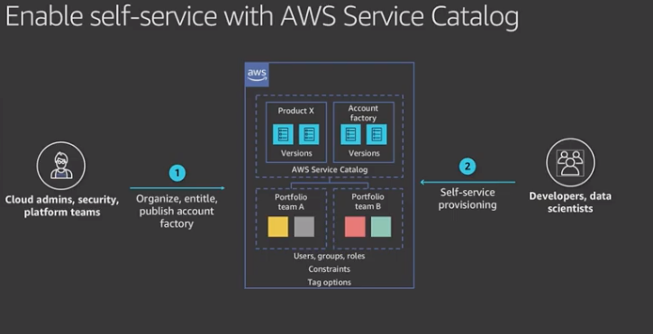

- Amazon's priorities during design are in the following order:
    1. Security
    2. Durability
    3. Availability
    4. Speed

- Control Tower features:
    - Setup and AWS landing zone
    - Centralize identity and access
    - Establish guardrails
    - Automate compliant account provisioning
    - manage continuously via a dashboard to monitor compliance

- AWS Service Catalog
    - Allows you to get to the notion of immutable infrastructure (recreate infra whenever there's a new deployment)
    - 
    - Porfolio is a collection of cloudformation templates or products
    - Application stacks are called products
        - A product is a collection of services such as storage databases that you want your users to be able to provision
    - Admins tend to organize portfolios by teams

- Tools to Operate with agility and control
    - Monitor resources and applications
        - Amazon Cloudwatch
    - Audit user activity and resource configurations
        - AWS Cloudtrail
        - AWS Config
    - Manage resources and take operational action
        - AWS Systems Manager
    - Optimize to reduce cost and improve security posture
        - AWS Trusted Advisor
        - AWS Cost and Usage Report
        - AWS Cost Explorer

