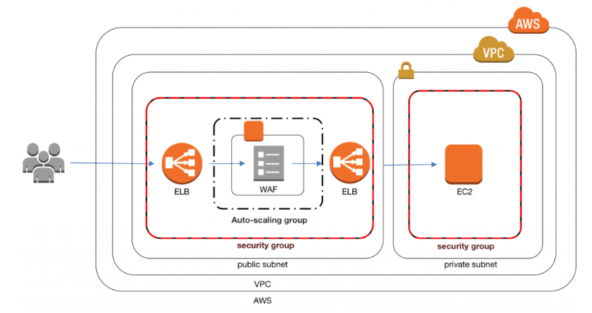
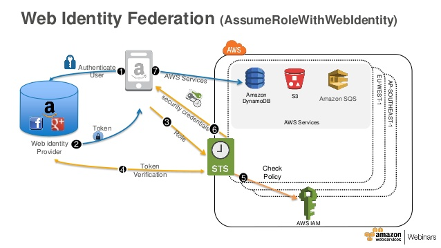
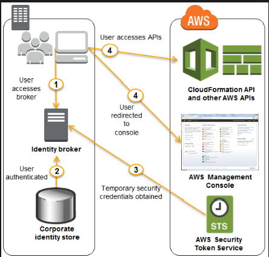

1. Your company asked you to create a mobile application. The application is built to work with DynamoDB as the backend and Javascript as the frontend. During the usage of the application, you notice that there are write contention issues in the application. How can you effectively manage DynamoDB write throughput?
    - Answer:  Autoscale DynamoDB to meet the requirements.
        - AAmazon DynamoDB auto scaling uses the AWS Application Auto Scaling service to dynamically adjust provisioned throughput capacity on your behalf, in response to actual traffic patterns. This enables a table or a global secondary index to increase its provisioned read and write capacity to handle sudden increases in traffic, without throttling. When the workload decreases, Application Auto Scaling decreases the throughput so that you don't pay for unused provisioned capacity.

1. An agile team just starts using AWS and the team leader wants them to move the legacy Java-based software to the AWS platform in 2 weeks. The requirement is that the new environment must be highly available and the infrastructure is managed as code and version controlled. Besides, the team has good experiences of Chef so they want to use that knowledge during the migration. Which actions should the team perform to meet the needs? Select 2.
    - Answers:
        - Use several CloudFormation templates to build up infrastructure such as VPC, NAT Gateway, Bastion, and Route53. Version control it using CodeCommit.
        - Use a nested CloudFormation template to create an OpsWorks stack. The resource type is “AWS::OpsWorks::Stack”. Add a Java layer in the stack. Make sure that the Scaling configuration is turned on

1. As AWS grows, most of your clients' main concerns seem to be about security, especially when all of their competitors also seem to be using AWS. One of your clients asks you whether having a competitor who hosts their EC2 instances on the same physical host would make it easier for the competitor to hack into the client's data. Which of the following statements would be the best choice to put your client's mind at rest?
    - Answer:  Different instances running on the same physical machine are isolated from each other via the hypervisor.
    - Notes:
        -  It is the hypervisor that hosts the VMs responsible for ensuring that the VMs are isolated from each other despite being hosted on the same underlying hypervisor.

1. You are building a large-scale confidential documentation web server on AWS, and all of the documentation for it will be stored on S3. One of the requirements is that it cannot be publicly accessible from S3 directly, and you will need to use CloudFront to accomplish this. Which of the methods listed below would satisfy the requirements as outlined? Choose an answer from the options below
    - Answer:  Create an Origin Access Identity (OAI) for CloudFront and grant access to the objects in your S3 bucket to that OAI only.

1. A customer is running a multi-tier web application farm in a virtual private cloud (VPC) that is not connected to their corporate network. They are connecting to the VPC over the Internet to manage all of their Amazon EC2 instances running in both the public and private subnets. They have only authorized the bastion-security-group with Microsoft Remote Desktop Protocol (RDP) access to the application instance security groups, but the company wants to further limit administrative access to all of the instances in the VPC. Which of the following Bastion deployment scenarios will meet this requirement?
    - Answer:  Deploy a Windows Bastion host with an elastic IP address in the public subnet, and allow RDP access to the bastion from only the corporate public IP addresses.

1.  You have been tasked with creating file level restore on your EC2 instances. You already have the access to all the frequent snapshots of the EBS volume. You need to be able to restore an individual lost file on an EC2 instance within 15 minutes of a reported loss of information. The acceptable RPO is several hours. How would you perform this on an EC2 instance? Choose an answer from the options below
    - Answer:  Create a volume from the source snapshot and attach the EBS volume to the same EC2 instance at a different mount location, browse the file system on the newly attached volume and select the file that needs to be restored, copy it from the new volume to the original source volume.

1. Your company is in the process of developing a next generation pet collar that collects biometric information to assist families with promoting healthy lifestyles for their pets. Each collar will push 30kb of biometric data in JSON format every 2 seconds to a collection platform that will process and analyze the data providing health trending information back to the pet owners and veterinarians via a web portal. Management has tasked you to architect the collection platform ensuring the following requirements are met
    1. Provide the ability for real-time analytics of the inbound biometric data
    2. Ensure that the processing of the biometric data is highly durable, elastic and parallel
    3. The results of the analytic processing should be persisted for data mining
    4. Which architecture outlined below will meet the initial requirements for the collection platform?
    - Answer:  Utilize Amazon Kinesis to collect the inbound sensor data, analyze the data with Kinesis Analytics and save the results to a Redshift cluster using EMR.
    - Notes:
        - The main point to consider here is that the information is to be analyzed in real-time, the solution should be highly durable, elastic and be processed in parallel, and the result should be persisted for data mining after the analysis. Whenever the question requires real-time processing of data, always think about using Amazon Kinesis!

1. A developer is trying to get a new DevOps role and preparing for a technical task for the interview. The requirement is that a simple pipeline should be built up within 1 week for a RESTful web service which contains several endpoints. For the pipeline, he decides to use AWS CodePipeline. For the application, he wants to use T2 Micro EC2 instances as they belong to free tier. In order to show a breadth of skills, he would like to use certain orchestration tool such as OpsWorks or CloudFormation to deploy the App. He has used Chef for some open source projects before. What below option is the best for him to do in a short time?
    - Firstly, configure an OpsWorks stack, layer and instance. Secondly, in CodePipeline, choose a S3 bucket as the source which can be a zip file for the app and set up the existing OpsWorks stack as the deployment provider. Then the app can be deployed to your stack automatically.
    - Notes:
        - As the developer has some Chef experiences, it is the best to use OpsWorks if available. This can save some time for his preparations for the assignment. Moreover, CodePipeline does support OpsWorks as a deployment target.
        - One thing to notice is that the OpsWorks stack/layer/instance should already exist when CodePipeline is being configured.
    
1. Your task is to set up an Active Directory service for a customer so that they can use Microsoft Active Directory with the newly-deployed AWS services. After reading the AWS documentation for this, you discover that three options are available to set up the AWS Directory Service. You call the customer to collect more information about their requirements, and they tell you that they have 1,000 users on their AD service and want to be able to use their existing on-premises directory with AWS services. 
Which of the following options would be the most appropriate to set up the AWS Directory Service for your customer?
    - Answer:  AD Connector
    - Notes:
        - For the exam, remember the usage of the following AD options:
            - SimpleAD: Microsoft Active Directory compatible directory from AWS Directory Service and supports common features of an active directory.
            - Active Directory Schema is used for defining users alone. 
            - AD Connector: Service used for connecting your on-premises Microsoft Active Directory to the AWS cloud.
        - AD Connector is a directory gateway with which you can redirect directory requests to your on-premises Microsoft Active Directory without caching any information in the cloud.

1.  You have two different groups to analyze data of a petabyte-scale data warehouse using Redshift. Each query issued by the first group takes approximately 1-2 hours to analyze the data while the second group's queries only take between 5-10 minutes to analyze data. You don’t want the second group's queries to wait until the first group's queries are finished. You need to design a solution so that this does not happen. Which of the following will be the best and cheapest solution to solve this dilemma? Choose an answer from the options below:
    - Answer:  Create two separate workload management groups and assign them to the respective groups.
    - Notes:
        - Whenever the question gives you scenario where, in Redshift, there are two processes - one fast and one slow, and you are asked to ensure that there is no impact on the queries of a process, always think about creating two separate workload management groups.
        - Amazon Redshift workload management (WLM) enables users to manage priorities flexibly within workloads so that short, fast-running queries won't get stuck in queues behind long-running queries.
        - Amazon Redshift WLM creates query queues at runtime according to service classes, which define the configuration parameters for various types of queues, including internal system queues and user-accessible queues. From user's perspective, a user-accessible service class and a queue are functionally equivalent. For consistency, this documentation uses the term queue to mean a user-accessible service class as well as a runtime queue.

1. You have just developed a new mobile application that handles analytics workloads on large-scale datasets that are stored on Amazon Redshift. Consequently, the application needs to access Amazon Redshift tables. Which of the following methods would be the best, both practically and security-wise, to access the tables? Choose the correct answer from the options below
    - Answer:  Use roles that allow a web identity federated user to assume a role that allows access to the Redshift table by providing temporary credentials.
    - Notes:
        - When a service, user, or application needs to access any AWS resource, always prefer creating an IAM Role over creating an IAM User.

1. Your company has HQ in Tokyo and branch offices all over the world and is using a logistics software with a multi-regional deployment on AWS in Japan, Europe and USA. The logistic software has a 3-tier architecture and currently uses MySQL 5.6 for data persistence. Each region has deployed its own database. In the HQ region you run an hourly batch process reading data from every region to compute cross-regional reports that are sent by email to all offices. This batch process must be completed as fast as possible, to quickly optimize logistics. How do you build the database architecture in order to meet the requirements?
    - Answer:  For each regional deployment, use RDS MySQL with a master in the region and a read replica in the HQ region.
    - Notes:
        - The read replica in the HQ region is updated asynchronously, this way, generating the reports would be very quick, and it does not affect the performance of the databases in their respective master region.

1. A legacy application with license is attached to a single MAC address. Since an EC2 instance can receive a new MAC address while launching new instances, how can you ensure that your EC2 instances can maintain a single MAC address for licensing? Choose the correct option.
    - Answer:  Create an ENI and assign it to the EC2 instance. The ENI will have a static MAC address and can be detached and reattached to a new instance if the current instance becomes unavailable.
    - Notes:
        - Tip: Whenever a question has a scenario where you need to use fixed MAC address for EC2 instances, always think about using Elastic Network Interface (ENI).
        - If a static MAC address is assigned to an ENI, it remains unchanged. As long as the EC2 has that ENI, it's MAC address will not change.
        - If one of your instances serving a particular function fails, its network interface can be attached to a replacement or hot standby instance pre-configured for the same role in order to rapidly recover the service. For example, you can use a network interface as your primary or secondary network interface to a critical service such as a database instance or a NAT instance. If the instance fails, you (or more likely, the code running on your behalf) can attach the network interface to a hot standby instance. Because the interface maintains its private IP addresses, Elastic IP addresses, and MAC address, network traffic begins flowing to the standby instance as soon as you attach the network interface to the replacement instance. Users experience a brief loss of connectivity between the time the instance fails and the time that the network interface is attached to the standby instance, but no changes to the VPC route table or your DNS server are required.

1. Your company has just set up a new document server on its AWS VPC, and it has four very important clients that it wants to give access to. These clients also have VPCs on AWS and it is through these VPCs that they will be given access to the document server. In addition, each of the clients should not have access to any of the other clients' VPCs. Choose the correct answer from the options below
    - Answer:  Set up VPC peering between your company's VPC and each of the clients' VPCs.
    - Notes:  
        - In this scenario, you are asked how resources from 4 VPCs can access resources from another VPC. This is a use case of "Star-Shaped" VPC peering. In this configuration, VPCs that have non-overlapping CIDR with your VPC, are peered for the intent of accessing the resources using their private IP addresses.

1.  A company has a library of on-demand MP4 files needing to be streamed publicly on their new video webinar website. The video files are archived and are expected to be streamed globally, primarily on mobile devices. Which of the following architectures can be implemented as a solution to this requirement?  Select 2 answers.
    - Answers:
        - Provision streaming EC2 instances which use S3 as the source for the HLS on-demand transcoding on the servers. Provision a new CloudFront download distribution with the WOWZA streaming server as the origin.
        - Upload the MP4 files to S3 and create an Elastic Transcoder job that transcodes the MP4 source into HLS chunks. Store the HLS output in S3 and create an on-demand video streaming CloudFront distribution with download option to serve the HLS file to end users.
    - Notes:
        - In exam, if the question presents a scenario, where the media is to be streamed globally in MP4 format, on multiple platform devices, always think about using Elastic Transcoder
        - In the on-demand streaming case, your video content is stored in Amazon S3. Viewers can choose to watch it at any desired time. A complete on-demand streaming solution typically makes use of Amazon S3 for storage, AWS Elemental MediaConvert for file-based video processing, and Amazon CloudFront for delivery.
        - Once uploaded, you may need to convert your video into the size, resolution, or format needed by a particular television or connected device. AWS Elemental MediaConvert will take care of this for you. MediaConvert takes content from S3, transcodes it per your request, and stores the result back in S3. Transcoding processes video files, creating compressed versions of the original content to reduce its size, change its format, or increase playback device compatibility.You can also create assets that vary in resolution and bitrate for adaptive bitrate streaming, which adjusts the viewing quality depending on the viewer's available bandwidth. AWS Elemental MediaConvert outputs the transcoded video to an S3 bucket.
        - The next step is global delivery with Amazon CloudFront. CloudFront caches content at the edges for low latency and high throughput video delivery.  This delivery can be made in two different ways. You can deliver the entire video file to the device before playing it, or you can stream it to the device.
 
 1. A company needs to configure a NAT instance for its internal AWS applications to be able to download patches and package software. Currently, they are running a NAT instance that is using the floating IP scripting configuration to create fault tolerance for the NAT. The NAT instance needs to be built with fault tolerance in mind. What is the best way to configure the NAT instance with fault tolerance?  Choose the correct answer from the options below:
    - Answer:  Create a NAT instance in a public subnet with application running in private subnet in an AZ. Create a similar architecture in another AZ; create a route from the private subnet to each NAT instance residing in these AZ's for fault tolerance.

1.  Your company has received a contract to replace a legacy enterprise file sharing system for a large media house. As of now, the company is using an on-premise private file sharing solution which is integrated with its directory service and uses a web-based intranet application to share files. With growing remote staff the company needs support for mobile devices so that remote staff can work offline as well. Please suggest a valid option to architect the system with given requirements.
    - Answer:  Use the AWS WorkDocs and integrate it with the on-premise directory server using the AD Connector

1. A 3-tier e-commerce web application is current deployed on-premises and will be migrated to AWS for greater scalability and elasticity. The web server currently shares read-only data using a network distributed file system. The app server tier uses a clustering mechanism for discovery and shared session state that depends on IP multicast. The database tier uses shared-storage clustering to provide database failover capability, and uses several read slaves for scaling. Data on all servers and the distributed file system directory is backed up weekly on a separate backup server. Which AWS storage and database architecture meets the requirements of the application?
    - Answer:  Web servers store read-only data in S3, and copy from S3 to root volume at boot time. App servers share state using a combination of DynamoDB and IP unicast. Database use RDS with multi-AZ deployment and one or more Read Replicas. Backup web and app servers backed up weekly via snapshots. Use the snapshots to create the AMIs ( data copied to EC2 instances from the dedicated backup servers ) , database backed up via DB snapshots.

1. You have a legacy application running that uses an m4.large instance size and cannot scale with Auto Scaling, but only has peak performance 5% of the time. This is a huge waste of resources and money so your Senior Technical Manager has set you the task of trying to reduce costs while still keeping the legacy application, having lesser memory requirements, running on a long-term as it should. Which of the following will best accomplish the task your manager has assigned you? Choose the correct answer from the options below:
    - Answer:  Use a "t2.medium - 3 yr RI" burstable performance instance
    - Notes:
        - T2 instances are Burstable Performance Instances that provide a baseline level of CPU performance with the ability to burst above the baseline.
        - T2 instances are a good choice for a variety of general-purpose workloads including micro-services, low-latency interactive applications, small and medium databases, virtual desktops, development, build and stage environments, code repositories, and product prototypes.

1. The Dynamic Host Configuration Protocol (DHCP) provides a standard for passing configuration information to hosts on a TCP/IP network. You can have multiple sets of DHCP options, but you can associate only one set of DHCP options with a VPC at a time. You have just created your first set of DHCP options, associated it with your VPC but now realize that you have made an error in setting them up and you need to change the options. Which of the following options do you need to take to achieve this? Choose the correct answer from the options below
    - Answer:  You must create a new set of DHCP options and associate them with your VPC.
    - Notes:  
        - Once you create a set of DHCP options, you cannot modify them. You must create a new set of DHCP options and associate it with your VPC.
        - You can have multiple sets of DHCP options, but you can associate only one set of DHCP options with a VPC at a time. If you delete a VPC, the DHCP options set associated with the VPC are also deleted.

1. The company you work for has a huge amount of infrastructure built on AWS. However, there has been some concerns recently about the security of this infrastructure, and an external auditor has been given the task of running a thorough check of all of your company's AWS assets. The auditor will be in the USA while your company's infrastructure resides in the Asia Pacific (Sydney) region on AWS. Initially, he needs to check all of your VPC assets, specifically, security groups and NACLs You have been assigned the task of providing the auditor ( already an IAM user ) with a login to be able to do this. Which of the following would be the best and most secure solution to provide the auditor with so he can begin his initial investigations? Choose the correct answer from the options below
    - Answer:  Create an IAM Role with the read only permissions ( AssumeRole ) to access the AWS VPC infrastructure and assign that role to the auditor.
    - Notes:
        - Generally, you should refrain from giving high-level permissions and give only the required permissions. In this case, option C fits well by just providing the relevant access which is required.
        - You can use IAM roles to delegate access to your AWS resources. With IAM roles, you can establish trust relationships between your trusting account and other AWS trusted accounts.

1. You are a software engineer and are creating a new web service in AWS. The service is about daily schedules where end users are able to configure and fetch. It contains an AngularJs front end that deals with data in a DynamoDB table called "UserScheduleData" with read and write permissions. You plan to use API gateway and Lambda to handle with the backend service. During development, you also need to do integration testings frequently using curl for the API endpoints. You have created a role “ScheduleRoleLambda” for the lambda itself. What below options should you perform to make sure that the lambda contains the necessary permissions? Select 3
    - Answers:
        - “ScheduleRoleLambda” should have a policy for Cloudwatch Logs including CreateLogGroup, CreateLogStream and PutLogEvents.
        - Invoke permissions are needed to the permissions policy associated with your Lambda function so that the API Gateway can call the lambda function
        - An inline policy to allow DynamoDb access is needed for “ScheduleRoleLambda”. The resource should be the arn of “UserScheduleData” and the action should contain "dynamodb:GetItem" and "dynamodb:PutItem".
    - Notes:
        - Every lambda needs this permission to create log group, log stream and put log events.

1. You're building a mobile application game. The application needs permissions for each user to communicate and store data in DynamoDB tables. What is the best method for granting each mobile device that installs your application to access DynamoDB tables for storage when required? Choose the correct answer from the options below
    - Create an IAM role with the proper permission policy to communicate with the DynamoDB table. Use web identity federation, which assumes the IAM role using AssumeRoleWithWebIdentity, when the user signs in, granting temporary security credentials using STS.

1. In an attempt to cut costs your accounts manager has come to you and tells you that he thinks that if the company starts to use consolidated billing that it will save some money. He also wants the billing set up in such a way that it is relatively simple, and it gives insights into the environment regarding the utilization of resources. Which of the following setups would satisfy your account manager's needs?  Choose two answers from the options below
    - Answers:
        - Use multiple VPC's for the different department ( eg: sales, marketing etc.) and tag the resources within the department
        - Use one Payer Account and many linked accounts

1. Which of the given options are best suited for auto scaling a WAF solution on EC2 in AWS?
    - Answer:  The EC2 instance running your WAF software is included in an Auto Scaling group and placed in between two Elastic load balancers.
    - Notes: 
        - This is known as `WAF Sandwich` and helps protect your EC2 instances from being overwhelmed by malicious traffic (DDoS)
        - *WAF Sandwich* 

1. A company is designing a high availability solution for a customer. This customer requires that their application needs to be able to handle an unexpected amount of load and allow site visitors to read data from a DynamoDB table, which contains the results of an online polling system. At any given time as many as 5,000 requests need to be handled by the application. How can this application be developed cost-effectively?
    - Answer:  Use the JavaScript SDK and build a static HTML page, hosted inside of an Amazon S3 bucket; use CloudFront and Route 53 to serve the website, which uses JavaScript client-side language to communicate with DynamoDB.

1. You are migrating an existing application to AWS cloud that would be communicating with EC2 instances in the VPC. You need to make this application highly available. The application currently relies on hard coded host names for communication between the various tiers. You have migrated the application and configured multi-tier using the internal elastic load balancer for serving traffic. The load balancer host name is "demo-app.us-east-1.elb.amazonaws.com". The current hard coded host name in your application for internal communication between your multi-tier application is "demolayer.example.com". How can you architect a solution for high availability?
    - Answer:  Create a PRIVATE resource record set using Route53 with a host name of "demolayer.example.com" and an ALIAS record to "demo-app.us-east-1.elb.amazonaws.com"
    - Notes:  
        - Since demolayer.example.com is an internal DNS record, the best way is Route 53 to create an internal resource record. One can then point the resource record to the create ELB.
        - While ordinary Amazon Route 53 resource record sets are standard DNS resource record sets, alias resource record sets provide an Amazon Route 53–specific extension to DNS functionality. Instead of an IP address or a domain name, an alias resource record set contains a pointer to a CloudFront distribution, an Elastic Beanstalk environment, an ELB Classic or Application Load Balancer, an Amazon S3 bucket that is configured as a static website, or another Amazon Route 53 resource record set in the same hosted zone. 

1. When it comes to KMS, which of the following best describes how the AWS Key Management Service works? Choose the correct answer from the options below
    - Answer:  AWS KMS supports two kinds of keys — master keys and data keys. Master keys can be used to directly encrypt and decrypt up to 4 kilobytes of data and can also be used to protect data keys. The data keys are then used to encrypt and decrypt customer data.

1. A company is building an AWS Cloud Environment for a financial regulatory firm. Part of the requirements is being able to monitor and respond to all the changes in an environment and track all the traffic sent to and from the environment. What steps you need to take to make sure that all the requirements for monitoring the financial architecture are satisfied? [Choose two]
    - Answers:
        - Configure an IPS/IDS to listen and block all suspected bad traffic coming into and out of the VPC. Configure CloudTrail with CloudWatch Logs to monitor all changes within an environment.
        - Have an IPS/IDS system in place such as Palo Alto Networks, that monitors, filters, and alerts of all potential hazard traffic sent to and from the VPC.
    - Notes:  
        - IPS/IDS is not supported in promiscuous mode (packet sniffing)
        - IPS: Intrusion Prevention Systems
        - IDS: Intrustion Detection Systems

1. You have acquired a new contract from a client to move all of his existing infrastructures onto AWS. You notice that he is running some of his applications using multicast, and he needs to keep it running as such when it is migrated to AWS. You discover that multicast is not available on AWS, as you cannot manage multiple subnets on a single interface on AWS and a subnet can only belong to one availability zone. Which of the following would enable you to deploy legacy applications on AWS that require multicast? Choose 2 options
    - Answers:
        - Provide Elastic Network Interfaces between the subnets.
        - Create a virtual overlay network that runs on the OS level of the instance.

1. A company has three accounts under consolidated billing. "Production" is the payer account and "Development" and "Staging" are the linked accounts. The development account has purchased three reserved instances with instance type of m4.large in Availability Zone us-east-1a. However, no instance is running on the development account, but has five m4.large instances  running in the staging account which is also in Availability Zone 1a. Who can receive the benefit of the reserved instance pricing? Choose the correct answer from the options below.
    - Answers:
        - The reserved instance pricing will be applied to three m4.large instances in the staging account because the staging account is running an instance that matches the reserved instance type.

1. A company has developed a Ruby on Rails content management platform. Currently, OpsWorks with several stacks for dev, staging, and production is being used to deploy and manage the application. Now, the company wants to start using Python instead of Ruby. How should the company manage the new deployment such that it should be able to revert back to the old application with Ruby if the new deployment starts adversely impacting the existing customers? Choose the correct answer from the options below
    - Answer:  Create a new stack that contains a new layer with the Python code. Route only a small portion of the production traffic to use the new deployment stack. Once the application is validated, slowly increase the production traffic to the new stack using the Canary Deployment. Revert to the old stack, if the new stack deployment fails or does not work.

1. Your application is having very high traffic, so you have enabled autoscaling in multi-availability zone to suffice the needs of your application but you observe that one of the availability zones is not receiving any traffic. What can be wrong here?
    - Answer:  Availability zone is not added to Elastic load balancer
    - Notes:
        - In order to make sure that all the EC2 instances behind a cross-zone ELB receive the requests, make sure that all the applicable availability zones (AZs) are added to that ELB.
        - When you add an Availability Zone to your load balancer, Elastic Load Balancing creates a load balancer node in the Availability Zone. Load balancer nodes accept traffic from clients and forward requests to the healthy registered instances in one or more Availability Zones.

1.  An AWS customer is deploying an application that is composed of an auto scaling group of EC2 Instances. The customer's security policy requires that every outbound connection from these instances to any other service within the customers Virtual Private Cloud must be authenticated using a unique X.509 certificate that contains the specific instance ID. 
Which of the following configurations will support these requirements?
    - Answer:  Configure the AutoScaling group to send an SNS notification of the launch of a new instance to the AWS Certificate Manager. Create a signed certificate using AWS Certificate Manager (ACM).
    - Notes:  
        - ACM and KMS work together.
        - Certificate manager (ACM) creates certificate and KMS helps to creates public Key and a private key
        - To configure website or application at https protocol we need to apply these keys.
        - CM is tightly linked with AWS Certificate Manager Private Certificate Authority. You can use ACM PCA to create a private certificate authority (CA) and then use ACM to issue private certificates. These are SSL/TLS X.509 certificates that identify users, computers, applications, services, servers, and other devices internally. 

1. You are given a task with moving a legacy application from a virtual machine running inside your datacenter to an Amazon VPC. Unfortunately, this app requires access to a number of on-premise services and no one who configured the app still works for your company. Even worse, there’s no documentation for it. How can you move the application from on-premises to VPC ?
Choose 3 options the below:
    - Answers:
        - An AWS Direct Connect link between the VPC and the network housing the internal services.
        - An IP address space that does not conflict with the one on-premises
        - A VM Import of the current virtual machine.
    - Notes:
        - The scenario requires you to connect your on-premise server/instance with Amazon VPC. When such scenarios are presented, always think about services such as Direct Connect, VPN, and VM Import and Export as they help either connecting the instances from different location or importing them from one location to another.

1. Your company has recently extended its data center into a VPC on AWS to add burst computing capacity as needed. Members of your Network Operations Center need to be able to go to the AWS Management Console and administer Amazon EC2 instances as necessary. You don’t want to create new IAM users for each member and make those users sign in again to the AWS Management Console. Which option below will meet the needs of your NOC members?
    - Answer:  Use your on-premises SAML 2.0-compliant identity provider (IDP) to grant the members federated access to the AWS Management Console via the AWS single sign-on (SSO) endpoint
    - *Federated Access using SAML 2.0*

1. You are designing an SSL/TLS solution that requires HTTPS clients to be authenticated by a web server using client certificate authentication. Which of the following options would you consider for configuring the web server infrastructure?
(Choose 2 options from the list given below, each one being an independent solution to the scenario)
    - Answers:
        - Configure ELB with TCP listeners on TCP/443 and place the Web servers behind it.
        - Configure your Web servers with EIP’s. Place the Web servers in a Route53 Record Set and configure health checks against all Web servers.
    - Notes:
        - The ELB TCP (443) listener that relays requests to the backend instances as-is. This terminates the client certificate on the web server instances rather than the ELB.

1. You are designing a connectivity solution between on-premises infrastructure and Amazon VPC. Your servers on-premises will be communicating with your VPC instances. You will be establishing IPSec tunnels over the internet. You will be using Virtual Private Gateways and terminating the IPsec tunnels on AWS-supported customer gateways.
You need to use IPSec tunnels for your connectivity between your on-premises environment and your VPC instances.
Which of the following statements are correct ( choose 4 )?
    - Answers:
        - Data encryption across the Internet
        - Protection of data in transit over the Internet
        - Peer identity authentication between Virtual Private Gateway and customer gateway is achieved as it is imperative for its implementation.
        - Data integrity protection across the Internet
    - Notes:
        - IPSec is designed to provide authentication, integrity, and confidentiality of the data that is being transmitted. IPSec operates at network layer of the OSI model. Hence, it only protects the data that is in transit over the internet.

1. You are designing an intrusion detection prevention (IDS/IPS) solution for a customer's web application in a single VPC. You are considering the options for implementing IDS/IPS protection for traffic coming from the Internet. Which of the following options would you consider?
Choose 2 options from the below
    - Answers:
        - Implement IDS/IPS agents on each Instance running In VPC
        - Implement a reverse proxy layer in front of web servers and configure IDS/IPS agents on each reverse proxy server.
    - Notes:
        - The main responsibility of Intrusion Detection Systems (IDS) / Intrusion Prevention Systems (IPS) is to (a) detect the vulnerabilities in your EC2 instances, (b) protect your EC2 instances from attacks, and (c) respond to intrusion or attacks against your EC2 instances.
        - The IDS is an appliance that is installed on the EC2 instances that continuously monitors the VPC environment to see if any malicious activity is happening and alerts the system administration if such activity is detected. IPS, on the other hand, is an appliance that is installed on the EC2 instances that monitors and analyzes the incoming and outgoing network traffic for any malicious activities and prevents the malicious requests from reaching to the instances in the VPC.

1.  You are designing a photo-sharing mobile app. The application will store all pictures in a single Amazon S3 bucket. Users will upload pictures from their mobile device directly to Amazon S3 and will be able to view and download their own pictures directly from Amazon S3. You want to configure security to handle the potential users in the most secure manner possible.
What should be done by your server-side application, when a new user registers on the photo-sharing mobile application?
    - Answer:  Record the user’s Information in DynamoDB and create a role in IAM with appropriate permissions. When the user uses their mobile app create temporary credentials using the AWS Security Token Service ‘AssumeRole’ function, store these credentials in the mobile app’s memory and use them to access Amazon S3. Generate new credentials the next time the user runs the mobile app.
    - Notes:
        - This scenario requires the mobile application to have access to S3 bucket. There are potentially millions of users and a proper security measure should be taken. In such question, where mobile applications needs to access AWS Resources, always think about using funtions such as "AssumeRole", "AssumeRoleWithSAML", and "AssumeRoleWithWebIdentity". See the following diagram that explains the flow of actions while using "AssumeRole".
        - *Web Identity Federation (AssumeRoleWithWebIdentity)*
        - You can let users sign in using a well-known third-party identity provider such as login with Amazon, Facebook, Google, or any OpenID Connect (OIDC) 2.0 compatible provider. You can exchange the credentials from that provider for temporary permissions to use resources in your AWS account. This is known as the web identity federation approach to temporary access. When you use web identity federation for your mobile or web application, you don't need to create custom sign-in code or manage your own user identities. Using web identity federation helps you keep your AWS account secure because you don't have to distribute long-term security credentials, such as IAM user access keys, with your application.

1. You have an application running on an EC2 Instance which will allow users to download files from a private S3 bucket using a pre-signed URL. Before generating the URL, the application should verify the existence of the file in S3. How should the application use AWS credentials to access the S3 bucket securely?
    - Answer:  Create an IAM role for EC2 that allows list access to objects in the S3 bucket. Launch the instance with the role, and retrieve the role’s credentials from the EC2 Instance metadata
    - Notes:
        - An IAM role is similar to a user. In that, it is an AWS identity with permission policies that determine what the identity can and cannot do in AWS. However, instead of being uniquely associated with one person, a role is intended to be assumable by anyone who needs it. If a user is assigned a role, access keys are created dynamically and provided to the user
        - You can use roles to delegate access to users, applications, or services that don't normally have access to your AWS resources.

1. You are designing a social media site and are considering how to mitigate distributed denial-of-service (DDoS) attacks. Which of the below can be used to notify and mitigate the attacks? (Choose 3 options)
    - Answers:
        - Use an Amazon CloudFront distribution of static content.
        - Use an Elastic Load Balancer with Auto Scaling Groups at the web Application layer to deny direct internet traffic to Amazon Relational Database Service (RDS) tiers.
        - Create a Amazon CloudWatch alarm to alert for high network in and CPU utilization.
    - Notes:
        - Some of the recommended techniques for mitigating the DDoS attacks are 
            1. build the architecture using the AWS services and offerings that have the capabilities to protect the application from such attacks. e.g. CloudFront, WAF, Autoscaling, Route53, VPC etc.
            2. defend the infrastructure layer by over-provisioning capacity, and deploying DDoS mitigation systems.
            3. defend the application layer by using WAF, and operating at scale by using autoscale so that the application can withstand the attack by scaling and absorbing the traffic.
            4. minimizing the surface area of attack
            5. obfuscating the AWS resources

1. A benefits enrollment company is hosting a 3-tier web application running in a VPC on AWS which includes a NAT (Network Address Translation) instance in the public Web tier. There is enough provisioned capacity for the expected workload for the new fiscal year benefit enrollment period plus some extra overhead. Enrollment proceeds nicely for two days and then the web tier becomes unresponsive, upon investigation using CloudWatch and other monitoring tools. It is discovered that there is an extremely large and unanticipated amount of inbound traffic coming from a set of 15 specific IP addresses over port 80 from a country where the benefits company has no customers. The web tier instances are so overloaded that benefit enrolment administrators cannot even SSH into them. Which activity would be useful in defending against this attack?
    - Answer:  Create an inbound NACL (Network Access control list) associated with the web tier subnet with deny rules to block the attacking IP addresses
    - Notes:
        - always think about two options: Security groups and Network Access Control List (NACL). Security Groups operate at the individual instance level, whereas NACL operates at subnet level. You should always fortify the NACL first, as it is encounter first during the communication with the instances in the VPC.

1. Your fortune 500 company has undertaken a TCO analysis evaluating the use of Amazon S3 versus acquiring more hardware. The outcome was that all employees would be granted access to use Amazon S3 for storage of their personal documents. Which of the following will you need to consider so you can set up a solution that incorporates single sign-on from your corporate AD or LDAP directory?
Choose 3 options from the below
    - Answers:
        - Setting up a federation proxy or identity provider
        - Using AWS Security Token Service to generate temporary tokens
        - Configuring IAM role
    - Notes:
        - In questions like this where an application, or user needs to be given access using Single Sign On (SSO), following steps are very important:
            1. setting up a identity provider for federated access
            2. authenticating users using corporate data store / active directory-user-attributes/
            3. getting temporary access tokens / credentials using AWS STS
            4. creating the IAM Role that has the access to the needed AWS Resources
 
1. Your company policies require encryption of sensitive data at rest. You are considering the possible options for protecting data while storing it at rest on an EBS data volume, attached to an EC2 instance. Which of these options would allow you to encrypt your data at rest?
Choose 3 options from the below
    - Answers:  
        - Implement third party volume encryption tools
        - Encrypt data inside your applications before storing it on EBS
        - Encrypt data using native data encryption drivers at the file system level

1. You are migrating a legacy client-server application to AWS. The application responds to a specific DNS domain (e.g. www.example.com) and has a 2-tier architecture, with multiple application servers and a database server. Remote clients use TCP to connect to the application servers. The application servers need to know the IP address of the clients in order to function properly and are currently taking that information from the TCP socket. A decision is made to use multi-AZ RDS MySQL instance for the database. During the migration, you can change the application code but you have to file a change request.
How would you implement the architecture on AWS In order to maximize scalability and high-availability?
    - Answer:  File a change request to implement Proxy Protocol Support. In the application use an ELB with a TCP Listener and Proxy Protocol enabled to distribute load on two application servers in different AZs.
    - Notes:  
        - AWS ELB has support for Proxy Protocol. It simply depends on a humanly readable header with the client's connection information to the TCP data sent to your server. As per the AWS documentation, the Proxy Protocol header helps you identify the IP address of a client when you have a load balancer that uses TCP for back-end connections. Because load balancers intercept traffic between clients and your instances, the access logs from your instance contain the IP address of the load balancer instead of the originating client. You can parse the first line of the request to retrieve your client's IP address and the port number.

1. You have an application that analyzes images within files. For each of the files in the input stream, the application writes to some number of output files. The number of input files processed each day is high and concentrated within a few hours of the day.
You currently have an EC2 instance with a single large EBS volume that hosts the input data. It takes almost 20 hours per day to sync the monolithic EBS volume.
What service(s) could be used to reduce the sync time and improve the availability of the solution?
    - Answer:  Use S3 to store I/O files. Use SQS to distribute elaboration commands to a group of hosts working in parallel. Then use Auto Scaling to dynamically size the group of hosts depending on the length of the SQS queue.
    - Notes:
        - Since a single EBS volume cannot be attached to multiple instances, using EBS volume seems an illogical choice

1. You require the ability to analyze a customer’s clickstream data on a website so they can do the behavioral analysis. Your customer needs to know what sequence of pages and ads their customer clicked on. This data will be used in real time to modify the page layouts as customers click through the site to increase stickiness and advertising click-through. Which option meets the requirements for captioning and analyzing this data?
    - Answer:  Push web clicks by session to Amazon Kinesis and analyze behavior using Kinesis workers
    - Notes:  
        - Whenever the question presents a scenario where the application needs to do analysis on real time data such as clickstream (i.e.massive real-time data analysis), most of the time the best option is Amazon Kinesis. It is used to collect and process large streams of data records in real time.

1. An AWS customer runs a public blogging website. The site users upload two million blog entries a month. The average blog entry size is 200 KB. The access rate to blog entries drops to negligible 6 months after publication and users rarely access a blog entry 1 year after publication. Additionally, blog entries have a high update rate during the first 3 months following publication, this drops to no updates after 6 months. The customer wants to use CloudFront to improve his user’s load times. Which of the following recommendations would you make to the customer?
    - Answer:  Create a CloudFront distribution with S3 access restricted only to the CloudFront identity and partition the blog entry’s location in S3 according to the month it was uploaded to be used with CloudFront behaviors.
    - Notes:  
        - CloudFront allows you to configure caching based on a URL path pattern when you create a new distribution. By partitioning the S3 bucket by the month the blog post was created you can control the CloudFront caching behavior of the distribution to optimize cost.
        - This question is based on making the best use of CloudFront's Cache Behavior. You need to understand two things about CloudFront for such scenario: (1) CloudFront is a service that is designed to give geographically distributed users the fast access to the content by maintaining the content in the cache that is maintained at multiple edge locations, and (2) using the cache-behavior of CloudFront, you can control the origin and path of the content, time to live (TTL), and control the user access using trusted signers.

1. Your company is getting ready to do a major public announcement of a social media site on AWS. The website is running on EC2 instances deployed across multiple Availability Zones with a Multi-AZ RDS MySQL Extra Large DB Instance. The site performs a high number of small reads and writes per second and relies on an eventual consistency model.
After comprehensive tests, you discover that there is read contention on RDS MySQL. Which of the following are the best approaches to meet these requirements (assuming we do not need to factor in cost of development time)? 
    - Answers:  
        - Deploy ElasticCache in-memory cache running in each availability zone.
        - Add an RDS MySQL read replica in each availability zone.
    - Notes:  
        - ElastiCache is a in-memory caching solution which reduces the load on the database and improves the read performance.
        - Read Replicas are used to elastically scale out beyond the capacity constraints of a single DB instance for read-heavy database workloads. Hence, improving the read performance.
        - You can create one or more replicas of a given source DB Instance and serve high-volume application read traffic from multiple copies of your data, thereby increasing aggregate read throughput.

1. A company is running a batch analysis every hour on their main transactional DB running on an RDS MySQL instance to populate their central Data Warehouse running on Redshift. During the execution of the batch their transactional applications are very slow. When the batch completes they need to update the top management dashboard with the new data. The dashboard is produced by another system running on-premises that is currently started when a manually-sent email notifies that an update is required. The on-premises system cannot be modified because is managed by another team.
How would you optimize this scenario to solve performance issues and automate the process as much as possible?
    - Answer:  Create a RDS Read Replica for the batch analysis and SNS to notify the on-premises system to update the dashboard.
    - Notes:
        - There are two architectural considerations here. (1) you need to improve read performance by reducing the load on the RDS MySQL instance, and (2) automate the process of notifying to the on-premise system
        - When the scenario asks you to improve the read performance of a DB instance, always look for options such as ElastiCache or Read Replicas. And when the question asks you to automate the notification process, always think of using SNS. 

1.  You are implementing a URL whitelisting system for a company that wants to restrict outbound HTTPS connections to specific domains from their EC2-hosted applications. You deploy a single t2.micro EC2 instance running proxy software and configure it to accept traffic from all subnets and EC2 instances in the VPC. You configure the proxy to only pass through traffic to domains that you define in its whitelist configuration.
You have a nightly maintenance window or 10 minutes where all instances fetch new software updates. Each update is different and is about 200MB in size and there are 500 instances In the VPC that routinely fetch updates. After a few days you notice that some machines are failing to successfully download some, but not all of their updates within the maintenance window. The download URLs used for these updates are correctly listed in the proxy’s whitelist configuration and you are able to access them manually using a web browser on the instances. What might be happening?
Choose 2 answers form the options below
    - Answers:
        - You are running the proxy on an undersized EC2 instance type so network throughput is not sufficient for all instances to download their updates in time.
        - You are running the proxy on an inappropriate size EC2 instance  and it's network throughput is being throttled by a t2.micro EC2 instance.
    - Notes:
        - In this case there is no setup issue, but most-likely it is the proxy instance that is a bottleneck and under-performing or inconsistently performing. As the proxy instance is not part of any auto-scaling group, it's size must be definitely the issue.

1. To serve Web traffic for a popular product, your chief financial officer and the IT director have purchased 10 large Reserved Instances (RIs) - r5.2xlarge, evenly spread across two availability zones. Route 53 is used to deliver the traffic to an Elastic Load Balancer (ELB). After several months, the product grows even more popular and you need additional capacity. As a result, your company purchases two c5.2xlarge RI. You register the two c5.2xlarge instances with your ELB and quickly find while all the instances are at 100% of their capacity, the c5.2xlarge instances have a significant capacity that is unused. Which of the following is the most cost-effective solution that uses EC2 capacity most effectively?
    - Answer:  Use a separate ELB for each instance type and distribute the load to ELBs with Route53 Weighted Routing.
    - Notes:
        - In this question, the problem is that the newly added c5.2xlarge instances are not fully utilized. This is happening because the load is spread evenly across all the instances. There is no logic to determine how much traffic is to be routed to which instance types.
        - Hence, there is a need to add some logic where higher (more-weighted) traffic should be routed to c5.2xlarge instances and light-weighted to the other instances. Route 53's weighted routing policy does exactly like this, so you should look for this option.

1.  A read-only news reporting site with a combined web and application tier and a database tier that receives large and unpredictable traffic demands must be able to respond to these traffic fluctuations automatically. Which AWS services should be used meet these requirements?
    - Answer:  Stateless instances for the web and application tier that are in an auto scaling group, synchronized using Elasticache Memcached and monitored with CloudWatch.  RDS configured with read replicas for the backend.
    - Notes:
        - Hint: Always see if any of the options contain caching solution such as ElastiCache, CloudFront, or Read Replicas, and (2) whether to use stateless or stateful instances.
        - Stateful instances are not suitable for distributed systems, as they retain the state or connection between client and web server, database remains engaged as long as the session is active. Hence, it increases the load on the server as well as database. Stateless instances, however are distributed and easy to scale in/scale out. Hence, the stateless application tend to improve the performance of a distributed application.
        - multi-AZ RDS does not improve read performance

1. You are running a news website in the EU-west-1 region that updates every 15 minutes. The website has a worldwide audience. It uses an Auto Scaling group behind an Elastic Load Balancer and an Amazon RDS database. Static content resides on Amazon S3 and is distributed through Amazon CloudFront. Your Auto Scaling group is set to trigger a scale up event at 60% CPU utilization, you use an Amazon RDS extra large DB instance with 10,000 Provisioned IOPS. Its CPU utilization is around 80%. While freeable memory is in the 2 GB range. Web analytics reports show that the average load time of your web pages is around 1.5 to 2 seconds but your SEO consultant wants to bring down the average load time to under 0.5 seconds. Which of the following option would NOT help to improve page load times for your users? 
    - Answer:  Lower the scale up trigger of your Auto Scaling group to 30% so it scales more aggressively.
    - Notes:  When the questions asks for performance improvement solution for read heavy application, always see if any of the options contain caching solution such as ElastiCache, CloudFront, or Read Replicas.

1. A large real-estate brokerage is exploring the option of adding a cost-effective location-based alert to their existing mobile application. The application backend infrastructure currently runs on AWS. Users who opt into this service will receive alerts on their mobile device regarding real-estate offers in proximity to their location. For the alerts to be relevant, delivery time needs to be in the low minute count. The existing mobile app has 5 million users across the US. Which one of the following architectural suggestions would you make to the customer?
    - Answer:  SQS ( buffer storage ) would be used to capture the device location details which would be used as the input for the Mobile application. EC2 instances will retrieve the relevant offers from DynamoDB. SNS Mobile Push will be used to send offers to the mobile application.
    - Notes:
        - When the question has considerations for scalability, always think about DynamoDB as it is the most recommended database solution to handle huge amount of data/records. For automated notifications, always think about SNS.
        - SQS is a highly scalable, cost effective solution for carrying out utility tasks such as holding the location of millions of users, (b) it uses highly scalable DynamoDB, and (c) it uses the cost effective AWS SNS Mobile Push service to send push notification messages directly to apps on mobile devices.

1. A newspaper organization has an on-premises application which allows the public to search its back catalog and retrieve individual newspaper pages via a website written in Java. It also has a commercial search application, nearing it's end of life. They have scanned the old newspapers into JPEGs which is of a total size of 17TB and used Optical Character Recognition (OCR) to populate a commercial search product. The organization wants to migrate its archive to AWS, produce a cost-efficient architecture, and still be designed for availability and durability. Which of the below options is the most appropriate?
    - Answer:  Use S3 to store and serve the scanned files. Use CloudSearch for query processing, and use Elastic Beanstalk to host the website across multiple availability zones.
    - Notes:
        - Tip: Whenever a storage service that can store large amount of data with low cost, high availability, and high durability, always think about using S3. 
        - With Amazon CloudSearch, you can quickly add rich search capabilities to your website or application. You don't need to become a search expert or worry about hardware provisioning, setup, and maintenance. With a few clicks in the AWS Management Console, you can create a search domain and upload the data that you want to make searchable, and Amazon CloudSearch will automatically provision the required resources and deploy a highly tuned search index.

1. A company is building a voting system for a popular TV show, viewers watch the performances then visit the show’s website to vote for their favorite performer. It is expected that in a short period of time after the show is finished the site will receive millions of visitors. The visitors will the first login to the site using their Amazon.com credentials and then submit their vote. After the voting is completed the page will display the vote totals. The company needs to build a site to handle the rapid influx of traffic, while maintaining good performance.
Which of the design patterns below should they use?
    - Answer:  Use CloudFront and an Elastic Load Balancer in front of an auto-scaled set of web servers, the web servers will first login with Amazon service to authenticate the user, the web servers will process the users vote and store the votes into an SQS queue using IAM Roles for EC2 Instances to gain permissions to the SQS queue. A set of application servers will then retrieve the items from the queue and update the 'vote totals' into a DynamoDB table.
    - Notes:
        - When the application needs to handle the data coming from millions of users, always think about using DynamoDB. Also, to provide the global users with high performance content access, you need to consider CloudFront, and  you need to set the appropriate IAM Role for the front end / web servers to give access to DynamoDB tables.
        - DynamoDB on-demand is a flexible new capacity mode for DynamoDB capable of serving thousands of requests per second without capacity planning.

1. You are developing a new mobile application and are considering storing user preferences in AWS. This would provide a more uniform cross-device experience to users using multiple mobile devices to access the application. The preference data for each user is estimated to be 50KB in size. Additionally, 5 million customers are expected to use the application on a regular basis. The solution needs to be quick, highly available, scalable and secure. How would you design a solution to meet the above requirements?
    - Answer:  Setup a DynamoDB table with an item for each user having the necessary attributes to hold the user preferences. The mobile application will query the user preferences directly from the DynamoDB table. Utilize STS. Web Identity Federation, and DynamoDB Fine Grained Access Control to authenticate and authorize access.
    - Notes:
        - Tip: Whenever the application needs to (a) support millions of users and scalability is most important, always think about DynamoDB, and (b) give mobile apps the access to AWS resource/service, always think about federated acccess using Web Identity Provider and "AssumeRoleWithWebIdentity" API.

1. Your team has a Tomcat-based Java application you need to deploy into development, test and production environments. After some research, you opt to use Elastic Beanstalk due to its tight integration with your developer tools and RDS due to its ease of management. Your QA team lead points out that you need to roll a sanitized set of production data into your environment on a nightly basis. Similarly, other software teams in your organization want access to that same restored data via their EC2 instances in your VPC. What of the following would be the optimal setup for persistence and security that meets the above requirements?
    - Answer: Use the ElasticBeanstalk to deploy your application in various environments. Create your RDS instance separately, controlled by automation, and pass it's DNS name to your app's DB connection string as an environment variable. Create a security group for client machines and add it as a valid source for DB traffic to the security group of the RDS instance itself.
    - Notes:
        - You should always use the DNS endpoint of the RDS instance, not IP address
        - To decouple your database instance from your environment, you can run a database instance in Amazon RDS and configure your application to connect to it on launch. This enables you to connect multiple environments to a database, terminate an environment without affecting the database, and perform seamless updates with blue-green deployments.

1. You are looking to migrate your Development and Test environments to AWS. You have decided to use separate AWS accounts to host each environment. You plan to link each accounts bill to a Master AWS account using Consolidated Billing. To make sure you keep within the budget, you would like to implement a way for administrators in the Master account to have access to stop, delete and/or terminate resources in both the Dev and Test accounts. Identify which of the options will allow you to achieve this goal.
    - Answer:  Create IAM users in the Master account with the "AssumeRole" permissions. Create cross-account roles in the Dev and Test accounts that have full Admin permissions and grant the Master account access.
    - Notes:
        - Tip: Remember that you always create roles in the account whose resources are to be accesses. In this example that would be Dev and Test. Then you create the users in the account who will be accessing the resources and give them that particular role. In this example, the Master account should create the users.

 1. Your customer is willing to consolidate their log streams, access logs, application logs, security logs, etc. in one single system. Once consolidated, the customer wants to analyze these logs in real-time based on heuristics. From time to time, the customer needs to validate heuristics, which requires going back to data samples extracted from the last 12 hours? What is the best approach to meet your customer’s requirements?
    - Answer:  Send all the log events to Amazon Kinesis. Develop a client process to apply heuristics on the logs
    - Notes:
        - Whenever the scenario - just like this one - wants to do real-time processing of a stream of data, always think about Amazon Kinesis. Also, remember that the records of the stream are available for 24 hours.

1. A team is developing a feature that needs to recognize Celebrities. By using the App, clients are able to upload photos and search celebrities among the photos by clicking a button. Or they can upload a bunch of photos and search the times that a given celebrity has appeared. The team wants to run the App in AWS at a lower cost. Which option is the most efficient one to implement while still ensuring availability and stability?
    - Answer:  Use the AWS Rekognition service. Implement the App in a lambda to call Rekognition API “RecognizeCelebrities” to fetch the information required in a JSON format. Process the information in Lambda and return the result to end-users. Use S3 for clients to upload photos.
    - Notes:
        - Amazon Rekognition can recognize thousands of celebrities in a wide range of categories, such as entertainment and media, sports, business, and politics. With Amazon Rekognition, you can recognize celebrities in images and in stored videos. You can also get additional information for recognized celebrities.
        - As the question asks for a lower cost while still ensuring availability and stability. Lambda should be considered first. Lambda can autoscale without manual operations. More importantly, it is very efficient to develop a web app without considering a lot about OS, patching, etc

1. You are running a successful multitier web application on AWS and your marketing department has asked you to add a reporting tier to the application. The reporting tier will aggregate and publish status reports every 30 minutes from user-generated information that is being stored in your web application’s database. You are currently running a Multi-AZ RDS MySQL instance for the database tier. You also have implemented Elasticache as a database caching layer between the application tier and database tier. Select the answer that will allow you to successfully implement the reporting tier with as little impact as possible to your database.
    - Answer:  Launch a RDS Read Replica connected to your Multi AZ master database and generate reports by querying the Read Replica.
    - Notes:
        - In question is asking you to design a reporting layer with least impact on the database. If the reporting queries are fired on the database instance, the performance of the database instance would surely get impacted. Since querying for the report would be a read heavy operation, the best solution is to create the read replicas of the database instance and query on them rather than on the database instance. This way, the existing database instance will have the least impact
        - The synchronously replicated standby RDS MySQL instance maintained through Multi-AZ cannot be accessed
        - Querying on ElastiCache may not always give you the latest and entire data, as the cache may not always be up-to-date

1. A web company is looking to implement an intrusion detection and prevention system for their deployed VPC. This platform should have the ability to scale to thousands of instances running inside of the VPC. How should they architect their solution to achieve these goals?
    - Answer:  Create the second VPC where the scalable virtualized IDS/IPS platform resides and route all traffic from this second VPC to the primary application VPC 
    - Notes:
        - There are couple of ways of designing the IDS/IPS systems: (1) install the IDS/IPS agents on each instance in the VPC, and (2) create a separate Security-VPC with only IDS/IPS instances, and route the incoming traffic via this VPC to the other VPC that contains the other EC2 resources.
        - You can use this to connect multiple Virtual Private Clouds (VPCs) that might be geographically disparate and/or running in separate AWS accounts, to a common VPC that serves as a global network transit center. (aka transit VPC)
        - Intrusion Detection Systems (IDS) analyze network traffic for signatures that match known cyberattacks. Intrusion Prevention Systems (IPS) also analyzes packets, but can also stop the packet from being delivered based on what kind of attacks it detects — helping stop the attack.
            - The main difference between them is that IDS is a monitoring system, while IPS is a control system.

1. A web-startup runs its very successful social news application on Amazon EC2 with an Elastic Load Balancer, an Auto-Scaling group of Java/Tomcat application-servers, and DynamoDB as a data store. The main web application best runs on m2 x large instances since it is highly memory- bound. Each new deployment requires the semi-automated creation and testing of a new AMI for the application servers which takes quite a while and is therefore only done once per week. Recently, a new chat feature has been implemented in Node.js and waits to be integrated into the architecture. First tests show that the new component is CPU bound. Since the company has some experience with using Chef, they decided to streamline the deployment process and use AWS OpsWorks as an application lifecycle tool to simplify management of the application and reduce the deployment cycles. What configuration in AWS OpsWorks is necessary to integrate the new chat module in the most cost-efficient and flexible way?
    - Answer:  Create one AWS OpsWorks stack create two AWS OpsWorks layers, create one custom recipe.
    - Notes:
        - The scenario here requires that you need to manage the application that is created with java, node.js, and DynamoDB using AWS OpsWorks. The deployment process should be streamlined and the deployment cycles should be reduced.
        - As the java and node.js have different resource requirements, it makes sense to deploy them on different layers. It would make the maintenance easier as well.
        - An AWS OpsWorks Stack defines the configuration of your entire application: the load balancers, server software, database, etc. You control every part of the stack by building layers that define the software packages deployed to your instances and other configuration details such as Elastic IPs and security groups

1. Your firm has uploaded a large amount of aerial image data to S3. In the past, in your on-premises environment, you used a dedicated group of servers to process this data and used Rabbit MQ – An open source messaging system to get job information to the servers. Once processed the data would go to the tape and be shipped offsite. Your manager told you to stay with the current design, and leverage AWS archival storage and messaging services to minimize cost. Which of the following options is correct?
    - Answer:  Setup Auto-Scaled workers triggered by queue depth that use spot instances to process messages in SQS. Once data is processed, change the storage class of the S3 objects to Glacier.
    - Notes:
        - The most suggestive hint in this question is that it asks you to leverage AWS archival storage and messaging services. Hence, you should look for options Glacier and SQS.
    
1. A corporate web application is deployed within an Amazon Virtual Private Cloud (VPC) and is connected to the corporate data center via an IPsec VPN. The application must authenticate against the on-premises LDAP server. After authentication, each logged-in user can only access an Amazon Simple Storage Service(S3) keyspace specific to that user. Which two approaches can satisfy these objectives?
Choose 2 options from the below
    - Answers:
        - The application authenticates against LDAP and retrieves the name of an IAM role associated with the user.  The application then calls the IAM Security Token Service (STS) to assume that IAM role ( including the ARN ). The application then uses the temporary credentials to access the appropriate S3 bucket.
        - Develop an identity broker that authenticates against LDAP and then calls IAM Security Token Service (STS) to get IAM federated user credentials. The application calls the identity broker to access the appropriate S3 bucket with these credentials
    - Notes:
        - With this information, it is important to first authenticate the users using LDAP, get the IAM Role name, then get the temporary credentials from STS, and finally, access the S3 bucket using those credentials. And second, create an IAM Role that provides access to S3.
        *Federated Access with Identity Broker*
        - The broker is responsible for mapping the employee identifier in to a set of AWS credentials.
    
1. Your company is planning to develop an application in which the front end is in .Net and the backend is in DynamoDB. It is expected that there would be an intermittent high load on the application. How could you ensure the scalability and cost-effectiveness of the application to reduce the load on the DynamoDB database? Choose an answer from the below options.
    - Answer:  Use SQS to hold the database requests instead of overloading the DynamoDB database. Then have a service that asynchronously pulls the messages and writes them to DynamoDB.
    - Notes:
        - When the idea comes for scalability then SQS is the best option. Normally DynamoDB is scalable, but since one is looking for a cost-effective solution, the messaging in SQS can assist in managing the situation mentioned in the question.

1. A team has just received a task to build an application that needs to recognize faces in streaming videos. They will get the source videos from a third party which use a container format (MKV).
The APP should be able to quickly address faces through the video in real time and save the output in a suitable manner for downstream to process. As recommended by the AWS Solutions Architect colleague, they would like to develop the service using AWS Rekognition. Which below options are needed to accomplish the task? Select 3.
    - Answers:
        - A Kinesis video stream for sending streaming video to Amazon Rekognition Video. This can be done by using Kinesis “PutMedia” API in Java SDK. The PutMedia operation writes video data fragments into a Kinesis video stream that Amazon Rekognition Video consumes.
        - An Amazon Rekognition Video stream processor to manage the analysis of the streaming video. It can be used to start, stop, and manage stream processors according to needs.
        - A Kinesis data stream consumer to read the analysis results that Amazon Rekognition Video sends to the Kinesis data stream. It can be an Amazon EC2 instance by adding to one of Amazon Machine Images (AMIs). The consumer can be autoscaled by running it on multiple Amazon EC2 instances under an Auto Scaling group.
    - Notes:
        - For facial recognition in live videos, it is different from that in photos. Kinesis is required to meet the needs of real time process. Amazon Rekognition Video uses Amazon Kinesis Video Streams to receive and process a video stream. The analysis results are output from Amazon Rekognition Video to a Kinesis data stream and then read by your client application. Amazon Rekognition Video provides a stream processor (CreateStreamProcessor) that you can use to start and manage the analysis of streaming video.

1. A company has maintained a MySQL database on-premises and is considering migrating the database to AWS. They require the database instance in AWS to keep synchronizing with the on-premises one. Then after a while, the on-premises database will be decommissioned after the AWS RDS instance has been tested thoroughly by the QA team. Amazon Database Migration Service has been chosen to implement this migration. For this data migration task, which below options are necessary that you must perform? Select 3.
    - Answers:
        - Allocate a replication instance in Database Migration Service console that handles with the migration processing. Ensure that the instance has a proper instance type with enough CPU and Memory resources to perform the migration task
        - Specify a source and a target database endpoint. Use the on-premises database as the source endpoint and an Amazon Relational Database Service (Amazon RDS) DB instance as the target endpoint. Select the database engine for both source and target as “MySQL”.
        - Create a task or set of tasks to define what tables and replication processes to be used. For migration type, select “migrate existing data and replicate ongoing changes”.
    - Notes:
        - DMS wizard process requires the following:
            - allocate a replication instance that performs all the processes for the migration
            - specify a source and a target database
            - create a task or set of tasks to define what tables and replication processes you want to use.

1. A team has a website that provides the latest real estate news to subscribers. It has included a Java frontend, backend and a MySQL database to store user information. They have a plan to migrate the MySQL database to PostgreSQL database to use some features that MySQL does not have. At the same time, the development lead has raised extra requirements:
    1. Only migrate users that have recent activities for the past 12 months. It is known that the MySQL table “user_info” has a column “user_activity” to track the activity date and time.
    2. For a table called “latest news”, two columns starting with “test” should be removed.
    3. Add a prefix to several tables
    - Answer:  DMS can handle the task of migration from MySQL to PostgreSQL. And all tasks can be achieved by specifying Table Selection and Transformations using JSON.
    - Notes:
        - The first task can be achieved by using a "Selection Rule".
        - The second task can be achieved by using the JSON template for "Transformation Rules" (action:  remove-column)
        - The third task can also be achieved by using the JSON template for "Transformation Rules" (action:  add-prefix)

1. A data analysis engineer has an old on-premise database for his meteorology analysis for years. This database is growing too big and becoming less responsive. He prefers to migrate it to AWS DynamoDB and he already has the mapping rules in place. However he has been told that the database type is unsupported by AWS Database Migration Service. He can export the data to CSV format files from the old database. How can the data analysis engineer migrate the data to AWS DynamoDB successfully?
    - Answer:  Upload the exported CSV files to S3 at first. Then create S3 source endpoint and DynamoDB target endpoint in AWS DMS console. When the S3 source endpoint is configured, add the table mapping rule with a JSON table structure. Create a Replication Task to move the data from the source endpoint to target endpoint.
    - Notes:
        - In most cases, when someone is migrating to a new database, he has access to source database and can use the database directly as a source. Sometimes, however, he might not have access to the source directly. In other cases, the source is really old, or possibly unsupported. In these cases, if he can export the data in CSV format, he can still migrate, or replatform, the data. In this question, DMS does not support this database type however the CSV files can be used after being uploaded to S3. AWS Database Migration Services (AWS DMS) added support for using Amazon S3 as a source for database migration.
        - If S3 is the source endpoint, an external table definition is required. An external table definition is a JSON document that describes how AWS DMS should interpret the data from Amazon S3. The maximum size of this document is 2 MB. If a source endpoint is created using the AWS DMS Management Console, JSON file can be entered directly into the table mapping box
        - Data Pipeline does not deal with the table mappings. Data Pipeline is suitable for data backup instead of database migration.

1. A large company starts to use AWS organizations with consolidated billing feature to manage its separate departments. The AWS operation team has just created 3 OUs (organization units) with 2 AWS accounts each. To be compliant with company-wide security policy, CloudTrail is required for all AWS accounts which is already been set up. However after some time, there are cases that users in certain OU have turned off the CloudTrail of their accounts. What is the best way for the AWS operation team to prevent this from happening again?
    - Answer:  Update the AWS Organizations feature sets to “All features” and then create a Service Control Policies (SCP) to Prevent Users from Disabling AWS CloudTrail. This can be achieved by a deny policy with cloudtrail:StopLogging denied.
    - Notes:
        - AWS Organizations has provided two feature sets:
            1. Consolidated billing – This feature set provides shared billing functionality, but does not include the more advanced features of AWS Organizations.
            2. All features – The complete feature set that is available to AWS Organizations. It includes all the functionality of consolidated billing, plus advanced features that give you more control over accounts in your organization. For example, when all features are enabled the master account of the organization has full control over what member accounts can do. The master account can apply SCPs to restrict the services and actions that users (including the root user) and roles in an account can access, and it can prevent member accounts from leaving the organization.

1. A big company has used AWS Organizations to manage its various AWS accounts by using several organization units. The organization master account is in charge of running of the whole organization. One child AWS account belongs to the data analysis department. The company has recently made some organization adjustments and needs to remove the data analysis department from the existing AWS Organizations. However error happened when the data analysis AWS administrator tried to leave the organization as a member account in AWS console. Which below options are possible reasons for the failure? Select 2.
    - Answers:
        - The member account does not enable IAM user access to billing. This setting controls the access to Account Settings, Payment Methods, and Report pages.
        - The IAM user of the member account does not have the permission of “organizations:DescribeOrganization” or “organizations:LeaveOrganization” so that it is blocked by IAM policy.
    - Notes:
        - You can remove a member account only after you enable IAM user access to billing in the member account.   
        - You can remove an account from your organization only if the account has the information required for it to operate as a standalone account.
        - There are some minimum IAM policy requirements for Leaving an Organizations as a Member Account:
            - organizations:DescribeOrganization (console only).
            - organizations:LeaveOrganization – Note that the organization administrator can apply a policy to your account that removes this permission, preventing you from removing your account from the organization.
            - If you sign in as an IAM user and the account is missing payment information, the IAM user must have the permissions aws-portal:ModifyBilling and aws-portal:ModifyPaymentMethods.

1. As an AWS Administrator, you have set up an ELB within a couple of Availability Zones. You have set up a web application on this setup. You notice that the traffic is not being evenly distributed across the AZ’s. What can be done to alleviate this issue? Choose an answer from the below options.
    - Answer:  Disable sticky sessions on the ELB.
    - Notes:
        - The load balancer uses a special cookie to track the instance for each request to each listener. When the load balancer receives a request, it first checks to see if this cookie is present in the request. If so, the request is sent to the instance specified in the cookie. If there is no cookie, the load balancer chooses an instance based on the existing load balancing algorithm. A cookie is inserted into the response for binding subsequent requests from the same user to that instance. The stickiness policy configuration defines a cookie expiration, which establishes the duration of validity for each cookie.

1. In Cloudfront what is the Origin Protocol policy that must be chosen to ensure that the communication with the origin is done either via http or https. Choose an answer from the options below
    - Answer:  Match Viewer
    - Notes:
        - If the Origin Protocol Policy is set to Match Viewer, the CloundFront communicates with the origin using HTTP or HTTPS depending on the protocol of the viewer request

1. An IOT company needs to develop a product that is able to quickly count the number of persons in a given area. They have used wireless sensors and a Node.js backend in AWS EC2 (ap-southeast-2 region with 3 availability zones). As the data is very sensitive which will be analyzed by a third party company, they need the backend to be highly available. The backend EC2 needs to connect to the internet to download patches. Other than that, for security reasons, EC2 should only open SSH port to a jumphost. For the below descriptions, which one is the best?
    - Answer:  For each availability zone, create a public subnet and a private subnet. Create a NAT gateway in each public subnet and for the route table in private subnet, add a route from 0.0.0.0/0 to the NAT gateway. Add a bastion host in one public subnet and for EC2 instances, only open port 22 for the inbound traffic from the security group of the bastion host.
    - Notes:
        - As in the scenario, high availability is a must. We should consider using public/private pairs in all three availability zones ap-southeast-2a, ap-southeast-2b and ap-southeast-2c. Then create a NAT gateway in each public subnet as NAT gateway is within the scope of an availability zone. This can ensure that even when an availability zone is out of service, other NAT gateways can still server internet traffic. In terms of the Bastion host, it should be put in a public subnet and EC2 security group should allow the SSH access (port 22) for the inbound traffic from the Bastion host security group.

1. You are designing a multi-platform,multi-port web application for AWS. The application will run on EC2 instances and will be accessed from PCs, tablets, and smartphones. Supported accessing platforms are Windows. MACOS, IOS, and Android. Separate sticky session and SSL certificate setups are required for different platform types. Which of the following describes the most cost-effective and performance efficient architecture setup?
    - Answer:  Set up an Application Load Balancer with Server Name Indicator ( SNI ) support, for handling the separate SSL certificates for each of the device platform.
    - Notes:
        - Originally, Application Load Balancers used to support only one certificate for a standard HTTPS listener (port 443) and you had to use Wildcard or Multi-Domain (SAN) certificates to host multiple secure applications behind the same load balancer. The potential security risks with Wildcard certificates and the operational overhead of managing Multi-Domain certificates presented challenges.With SNI support you can associate multiple certificates with a listener and each secure application behind a load balancer can use its own certificate.  You can use host conditions to define rules that forward requests to different target groups based on the host name in the host header (also known as host-based routing). This enables you to support multiple domains using a single load balancer.
        -  Server Name Indication (SNI) is an extension to the TLS protocol by which a client indicates the hostname to connect to at the start of the TLS handshake.  SNI is supported only in ALB.

1. You're consulting for a company that is migrating its legacy application ( built on TCP ) to the AWS cloud. In order to apply high availability, you've decided to implement Elastic Load Balancer and Auto Scaling services to serve traffic to this legacy application.
The legacy application is not a standard HTTP web application but is a custom application with custom codes that is run internally for the employees of the company you are consulting.
The ports required to be open are port 80 and port 8080. Which listener configuration would you create? Choose an answer from the options below:
    - Answer:  Configure the load balancer with the following ports: TCP:80 and TCP:8080 and the instance protocol to TCP:80 and TCP:8080
    - Notes:
        - Since the application is a custom application and not a standard HTTP application, hence you need to have the TCP ports open. Hence option A is the right option.
        - Before you start using Elastic Load Balancing, you must configure one or more listeners for your Classic Load Balancer. A listener is a process that checks for connection requests. It is configured with a protocol and a port for front-end (client to load balancer) connections, and a protocol and a port for back-end (load balancer to back-end instance) connections.
        The Classic Elastic Load Balancer supports the following protocols:
            - HTTP
            - HTTPS (secure HTTP)
            - TCP
            - SSL (secure TCP)

1. A software development team just finished the phase 1 of a web service that provides NBA news to subscribers. The web service has used a dedicated VPC which has only IPv4 CIDR (10.0.0.0/16) with two public subnets and two private subnets. A NAT gateway is put into each public subnet for outbound internet traffic. The EC2 instances are put into private subnets with a route that connects all internet-bound IPv4 traffic to the relevant NAT gateway. The product is getting more and more popular and needs IPv6 to support some new features. Which below options are required for the new support for IPv6? Select 3.
    - Answers:
        - Associate an Amazon-provided IPv6 CIDR block with existing VPC and subnets. In the VPC and subnets console, choose “Add IPv6 CIDR”.
        - For public subnets, create a route that routes all IPv6 traffic from the subnet to the internet gateway. For private subnets, create a route that routes all internet-bound IPv6 traffic to an egress-only internet gateway.
        - Assign IPv6 addresses to EC2 instances from the IPv6 address range that is allocated to the subnet.
    - Notes:
        - Your VPC can operate in dual-stack mode — your resources can communicate over IPv4, or IPv6, or both. IPv4 and IPv6 communication are independent of each other.
        - You cannot disable IPv4 support for your VPC and subnets; this is the default IP addressing system for Amazon VPC and Amazon EC2.
        - The below steps are required:
            1. Associate an IPv6 CIDR Block with Your VPC and Subnets
            1. Update Your Route Tables
            1. Update Your Security Group Rules
            1. Change Your Instance Type if it does not support IPv6
            1. Assign IPv6 Addresses to Your Instances
            1. Configure IPv6 on your instances (If your instance was launched from an AMI that is not configured to use DHCPv6)

1. You are responsible for a legacy web application whose server environment is approaching end of life You would like to migrate this application to AWS as quickly as possible, since the application environment currently has the following limitations:
The VM’s single 10GB VMDK is almost full. The virtual network interface still uses the 10Mbps driver, which leaves your 100Mbps WAN connection completely underutilized. It is currently running on a highly customized Windows VM within a VMware environment; You do not have the installation media. This is a mission critical application with an RTO (Recovery Time Objective) of 8 hours. RPO (Recovery Point Objective) of 1 hour. How could you best migrate this application to AWS while meeting your business continuity requirements?
    - Answer:  Use VM Import/Export to import the VM as an EBS snapshot and attach to EC2.
    - Notes:
        - VM Import/Export offers several ways to import your virtual machine into Amazon EC2. VM Import/Export enables you to easily import virtual machine images from your existing environment to Amazon EC2 instances and export them back to your on-premises environment.

1. An administrator in your company has created a VPC with an IPv4 CIDR block 10.0.0.0/24. Now they want to expand the existing VPC size because there is a requirement to host more resources in that VPC. Which of the below requirement can be used to accomplish this? Choose an answer from the below options.
    - Answer:  Expand your existing VPC by adding secondary IPv4 IP ranges (CIDRs) to your VPC
    - Notes:
        - An existing CIDR for a VPC is not modifiable, however, you can add additional CIDR blocks, i.e. up to four secondary IPv4 CIDR blocks to an already existing VPC.

1. A company has a legacy based software which needs to be transferred to the AWS cloud. The legacy based software has a dependency on the license which is based on the MAC Address. What would be a possible solution to ensure that the legacy based software will work properly always and not lose the MAC address at any point in time? Choose an answer from the below options.
    - Answer:  Use a VPC with instances having an elastic network interface attached that has a fixed MAC Address.

1. Your customer has recently completed a Proof of Concept (PoC) and now wants you to recommend a database solutions in AWS. The PoC deployed 100 sensors to measure street noise and air quality for 3 months. During the PoC your peak IOPS was 10, and the database received 30 GB worth of key-value sensor data per month. You are required to provide an architecture for 100,000 sensors initially, and accommodate future scaling needs. The sensor data must be retained for a least two years to compare year over year improvements. Which AWS storage solution requires the least amount of change to the application?
    - Answer:  DynamoDB
    - Notes: 
        - The key point here is that the data is being sent key-value pairs from the sensors. Whenever you see key-value, you should immediately think of the Amazon no-SQL database DynamoDB. DynamoDB has nearly infinite capacity, sub-second latency, and designed to ingest large amounts of data.
        - RDS has a limit of 16 TB

1. AWS Directory Service provides multiple directory choices for customers who want to use existing Microsoft AD or Lightweight Directory Access Protocol (LDAP)–aware applications in the cloud. It also offers those same choices to developers who need a directory to manage users, groups, devices, and access. Simple AD is a Microsoft Active Directory–compatible directory from AWS Directory Service that is powered by Samba 4. Which below scenarios are suitable for Simple AD? Choose 3.
    - Answers: 
        - For a small project, a standalone directory in the cloud is needed, where the operators can create and manage user identities and manage access to applications. The operators want to use many familiar Active Directory–aware applications and tools that require basic Active Directory features.
        - For the directory service in AWS, the security manager requires that it can be backed up via daily automated snapshots with point-in-time recovery enabled
        - With limited budget, a startup company requires a directory service to be setup with basic Active Directory compatibility that supports Samba 4–compatible applications.
    - Notes:
        - Simple AD is a subset of the features offered by AWS Managed Microsoft AD. It has included the ability to manage user accounts and group memberships, create and apply group policies, securely connect to Amazon EC2 instances, and provide Kerberos-based single sign-on (SSO).
        - Many of the applications and tools that you use today that require Microsoft Active Directory support can be used with Simple AD.
        - User accounts in Simple AD allow access to AWS applications such as Amazon WorkSpaces, Amazon WorkDocs, or Amazon WorkMail.
        - You can manage AWS resources through IAM role–based access to the AWS Management Console. 
        - Daily automated snapshots enable point-in-time recovery.
        - Simple AD supports maximum 5000 users. Simple AD is available in two sizes:
            1. Small - Supports up to 500 users (approximately 2,000 objects including users, groups, and computers).
            1. Large - Supports up to 5,000 users (approximately 20,000 objects including users, groups, and computers).

1. Your company has set up a new central server in a VPC. There is a requirement for other teams who have their servers located in different VPC's in the same region having distinctive CIDR blocks for each one to connect to the central server having a non conflicting CIDR block. Which of the below options is best suited to achieve this requirement?
    - Answer:  Set up VPC Peering between the central server VPC and each of the teams VPCs.

1. Company ABC has used on-premises AD administrative tools to manage resources. The company wants to enable all employees to use on-premises credentials to sign in to the AWS Management Console to access and manage its various AWS resources ( eg: AWS Workspaces etc..) To achieve this, they have successfully created AWS Microsoft AD directory that is connected to their on-premises AD via a forest trust relationship. Which below items are still required? Select 3.
    - Answers:
        -  In AWS apps & services section for the AWS Microsoft AD directory, enable all services. This is used to activate the access for services include Amazon WorkSpaces, Amazon WorkMail, RDS SQL Server and AWS Management Console.
        - Enable AWS Management Console access for the AWS Microsoft AD directory and get the URL that can be used to connect to the console. For example, the AWS Management Console URL is “https://example-corp.awsapps.com/console”.
        - Assign on-premises users and groups to IAM roles.
    - Notes:  
        - Using AWS Managed Microsoft AD directory, you can easily enable the access to multiple AWS applications and services such as the AWS Management Console, Amazon WorkSpaces, and Amazon RDS for SQL Server. More importantly, your users can access the application or service with their existing AD credentials

1. An IOS developer is creating a simple notes APP that includes functions such as notes creation, retrieval, and deletion for an authenticated user.  The mobile application also require sign-up and sign-in functionality. The notes service is exposed by an API through API Gateway. The developer would like to implement authorization in the API so that it can identify the authenticated user and perform operations in the context of that user, such as Create Note and Delete Note. How could he implement the authorization by AWS Cognito?
    - Answers:
        - In Amazon Cognito, create a User Pool and Identity Pool. Connect the Identity Pool with the User Pool. The Identity Pool shall return an access token if the user signs in successfully. The token can be used to invoke API for the notes service
    - Notes:
        - Amazon Cognito has key components of user pools and identity pools, which can be used in several scenarios. User pools are user directories that provide sign-up and sign-in options. And Identity pools provide AWS credentials to grant your users access to other AWS services.
        - In this question, the App needs the Cognito to implement the function of authorization for the API in API gateway. It requires both the User pools and Identity Pools. In the first step your app user signs in through a user pool and receives user pool tokens after a successful authentication. Next, your app exchanges the user pool tokens for AWS credentials through an identity pool

1. Your company has an on-premises multi-tier PHP web application, which recently experienced downtime due to a large burst In web traffic due to a company announcement. Over the coming days, you are expecting similar announcements to drive similar unpredictable bursts, and are looking to find ways to quickly improve your infrastructures ability to handle unexpected increases in traffic.
The application currently consists of a 2 tier web tier which consists of a load balancer and several Linux Apache web servers as well as a database tier which hosts a Linux server hosting a MySQL database.
Which of the below scenario will provide full site functionality, while helping to improve the ability of your application in the short timeframe required?
    - Answer:  Offload traffic from on-premises environment by setting up a CloudFront distribution and configure CloudFront to cache objects from a custom origin. Choose to customize your object cache behaviour, and select a TTL that objects should exist in cache.
    - Notes:
        - In this scenario, the major points of consideration are: (1) your application may get unpredictable bursts of traffic, (b) you need to improve the current infrastructure in shortest period possible, and (3) your web servers are on premise.
        - CloudFront is AWS’s highly scalable, highly available content delivery service, where it can perform excellently even in case of sudden unpredictable burst of traffic, (b) the only change you need to make is make the on-premises load balancer as the custom origin of the CloudFront distribution. 
        - You can have CloudFront sit in front of your on-premise web environment, via a custom origin. This would protect against unexpected bursts in traffic by letting CloudFront handle the traffic from the cache, thus removing some of the load from the on-premise web servers.
        - If you have dynamic content, then it is best to have the TTL set to 0.
        - Using a TTL of 0 primarily means, that CloudFront delegates the authority for cache control to the origin, i.e. the origin server decides whether or not, and if for how long CloudFront caches the objects; please note specifically, that a GET request with an If-Modified-Since header doesn't necessarily mean that the object itself is retrieved from the origin, rather the origin can (and should) return the HTTP status code 304 - Not Modified where applicable:

1. Your application provides data transformation services. Files containing data to be transformed are first uploaded to Amazon S3 and then transformed by a fleet of spot EC2 instances. Files submitted by your premium customers must be transformed with the highest priority. How should you implement such a system?
    - Answer:  Use two SQS queues, one for high priority messages, the other for default priority. Transformation instances first poll the high priority queue; if there is no message, they poll the default priority queue.
    - Notes:
        - The chosen answer decouples the components of a distributed application, so the application is not impacted due to using spot instances, (b) it is a much cheaper option compared to using DynamoDB tables, and more importantly (b) it maintains a separate queue for the high priority messages which can be processed before the default priority queue.

1. There is a requirement to split a VPC with a CIDR block of 10.0.0.0/24 into two CIDR blocks, each of which should give 128 IP addresses (including the 5 fixed IP reserved by AWS). Can this be done and if so, how will the allocation of the IP addresses be configured? Choose the correct answer from the below options.
    - Answer:  One subnet will use CIDR block 10.0.0.0/25 (for addresses 10.0.0.0 - 10.0.0.127) and the other will use CIDR block 10.0.0.128/25 (for addresses 10.0.0.128 - 10.0.0.255).

1. A mobile App developer just made an App in both IOS and Android that has a feature to count step numbers. He has used AWS Cognito to authorize users with a user pool and identity pool to provide access to AWS DynamoDB table. The App uses the DynamoDB table to store user subscriber data and number of steps. Now the developer also needs Cognito to integrate with Google to provide federated authentication for the mobile application users so that user does not need to remember extra login access.  What should the developer do to make this happen for the IOS and Android App?
    - Answer:  Amazon Cognito Identity pools (federated identities) support user authorization through federated identity providers—including Amazon, Facebook, Google, and SAML identity providers. The developer just needs to set up the federated identities for Google access
    - Notes:
        - https://thenewstack.io/understanding-aws-cognito-user-and-identity-pools-for-serverless-apps/

1. A software engineer is developing a web App using Sinatra, which is a free and open source software web application library and domain-specific language written in Ruby. He wants to develop that in AWS Elastic Beanstalk however it seems that Sinatra is not a supported built-in platform which can be used. He does not want to use docker either for this. Can he create a customised environment for the App in Elastic Beanstalk? Choose 2 options
    - Answers:
        - Yes, He can build a custom AMI in advance with Sinatra installed and configured on it. Create an ElasticBeanStalk environment and then modify the EC2 image ID with the customized AMI.
        - Yes. He can create his own platforms on Ubuntu, Red Hat Enterprise or Amazon Linux and customize his instances with Sinatra. A Packer template will be used. When creating Elastic Beanstalk environment, select the customized platform.
    - Notes:
        - Elastic Beanstalk supports custom platforms now. A custom platform lets you develop an entirely new platform from scratch, customizing the operating system, additional software, and scripts that Elastic Beanstalk runs on platform instances.
        - The custom image can be built from one of the supported operating systems of Ubuntu, RHEL, or Amazon Linux. In order to simplify the creation of these specialized Elastic Beanstalk platforms, machine images are now created using the Packer tool.

1. One full stack engineer is developing an application to process images and videos from a highly scaled web site. The incoming traffic is very unbalanced and unstable during the day. When the traffic rises up, it may require maximum 10 m4.xlarge EC2 instances. However the requirement may drop down to 1 m4.xlarge instance. The processing for the application takes time and this may result in the delay of web application response. He prefers to deploy the App in Elastic Beanstalk. Which option should the engineer choose?
    - Answer:  Deploy the application in one Elastic Beanstalk web server environment. Make sure that the environment uses a load-balancing, autoscaling configuration. Therefore, it can auto scale depending on the traffic level.
    - Notes:
        - Since the traffic is very unbalanced, we need to consider using an elastic load balancer for the same.

1. A big company has a service to process gigantic clickstream data sets which are often the result of holiday shopping traffic on a retail website, or sudden dramatic growth on the data network of a media or social networking site. It is becoming more and more complex to analyze these clickstream datasets for its on-premise infrastructure. As the sample data set keeps growing, fewer applications are available to provide a timely response. The service is using a Hadoop cluster with Cascading. How can they migrate the applications to AWS in the best way? 
    - Answer:  Put the source data to a Kinesis stream and migrate the processing service to an AWS EMR cluster with Cascading. Enable EMR to directly read and query data from Kinesis streams. Write the output to Redshift.
    - Notes:
        - The application needs to process data timely therefore Kinesis stream should be considered first. After a click event happens, a message should be put into Kinesis stream in real time. Moreover, Cascading is a proven, highly extensible application development framework for building massively parallelized data applications on EMR. By using EMR, the application does not need to change a lot for the migration.
        - Users can run periodic, batched analysis of Amazon Kinesis streams in what are called iterations. Because Amazon Kinesis stream data records are retrieved by using a sequence number, iteration boundaries are defined by starting and ending sequence numbers that Amazon EMR stores in a DynamoDB table. For example, when iteration0 ends, it stores the ending sequence number in DynamoDB so that when the iteration1 job begins, it can retrieve subsequent data from the stream. This mapping of iterations in stream data is called checkpointing.

1. A development team has got a new assignment to maintain and process data in several DynamoDb tables and S3 buckets. They need to perform sophisticated queries and operations across DynamoDB and S3. For example, they would export rarely used data from DynamoDB to Amazon S3 in order to reduce the storage costs while preserving low latency access required for high velocity data. The team has rich Hadoop and SQL knowledge. What is the best way to accomplish the assignment?
    - Answer:  Use an EMR cluster as it uses Hadoop Hive which is a SQL-based engine. Create external tables in EMR for DynamoDB table and S3 buckets. Use SQL-based command to export/import data.
    - Notes:  
        - Data pipelines are not able to perform complicated SQL commands
        - EMR can be used to efficiently export DynamoDB tables to S3, import S3 data into DynamoDB, and perform sophisticated queries across tables stored in both DynamoDB and other storage services such as S3.

1. A middle sized company is planning to migrate its on-premises servers to AWS. At the moment, they have used various licenses including windows operating system server, SQL Server, IBM Db2, SAP ERP, etc. After migration, the existing licenses should continue to work in EC2. The IT administrators prefer to use a centralized place to control and manage the licenses so that potential non-compliant license usages are prevented. For example, the license of SQL Server Standard only allows 50 vCPUs, which means a rule is needed to limit the number of SQL Servers in EC2. Which option is correct for the IT administrators to use?
    - Answer:  Define license rules in AWS License Manager for the required licenses. Enforce the license rules in EC2 and track usage in AWS License Manager console.
    - Notes:  
        - Using License Manager along with AWS Systems Manager, you can manage licenses on physical or virtual servers hosted outside of AWS.
        - AWS License Manager is a central place to manage licenses in AWS EC2 and on-premises instances. It contains 3 parts to use:
            1. Define licensing rules.
            1. Enforce licensing rules.
            1. Track usage.
        - AWS License Manager currently integrates with Amazon EC2, allowing you to track licenses for default (shared-tenancy) EC2 instances, Dedicated Instances, Dedicated Hosts, Spot Instances and Spot Fleet, and Auto Scaling groups.
        - License Manager tracks a variety of software products from Microsoft, IBM, SAP, Oracle, and other vendors.

1. An outsourcing company is working on a government project. The security is very important to the success of the application. The application is developed mainly in EC2 with several application load balancers. CloudFront and Route53 are also configured. The major concern is that it should be able to be protected against DDoS attack. The company decides to activate the AWS Shield Advanced feature. To this effect, it has hired an external consultant to 'educate' it's employees on the same. For the below options, which ones help the company to understand the AWS Shield Advanced plan? Select 3.
    - Answers:
        - AWS Shield Advanced plan is able to protect application load balancers, CloudFront and Route53 from DDoS attacks
        - 24*7 support by the DDoS Response team. Critical and urgent priority cases can be answered quickly by DDoS experts. Custom mitigations during attacks are also available.
        - Real time notification of attacks are available via Amazon CloudWatch. Historical attack reports are also provided
    - Notes:
        - AWS Shield has two plans - AWS Shield Standard and AWS Shield Advanced.
        - AWS Shield Standard activates automatically at no additional charge. AWS Shield Standard defends against most common, frequently occurring network and transport layer DDoS attacks that target your applications.
        - AWS Shield Advanced:  For higher levels of protection against attacks. It has a subscriber fee which is $ 3000 per month.
        - AWS Shield Advanced provides enhanced detection for attack traffic directed toward your protected Elastic IP address, Elastic Load Balancing (ELB), Amazon CloudFront, AWS Global Accelerator or Amazon Route 53 resources. 
        - AWS Shield Advanced also detects application layer attacks like HTTP floods or DNS query floods by baselining traffic on your resource and identifying anomalies.

1. An Artificial Intelligence startup company has used lots of EC2 instances. Some instances use the SQL Server database while others use Oracle. As the data needs to be kept secure, regular snapshots are required. They want SQL Server EBS volume to take a snapshot every 12 hours. However, for Oracle, it only needs a snapshot every day. Which option below is the best one that the company should choose?
    - Answer:  Add different tags for SQL Server and Oracle EBS volumes. In the AWS Data Lifecycle Management console, create two management policies based on the tags. Add a 12 hours schedule to SQL Server lifecycle policy and a 24 hours schedule to Oracle lifecycle policy
    - Notes:
        - Amazon Data Lifecycle Manager (Amazon DLM) should be considered if automating snapshot management is required (https://docs.aws.amazon.com/AWSEC2/latest/UserGuide/snapshot-lifecycle.html).  One thing to note is that DLM policy uses Tags to choose EBS volumes

1. Your company produces customer commissioned one-of-a-kind skiing helmets, combining high-fashion with custom technical enhancements. The current manufacturing process is data rich and complex. It includes assessments to ensure that the custom electronics and materials used to assemble the helmets are to the highest standards.
The current assessments are a mixture of human and automated checks. You have been tasked with adding a new set of assessments to model the failure modes of the custom electronics using GPUs across a cluster of servers with low latency networking. 
What architecture would allow you to automate the existing process through a hybrid approach while ensuring the architecture can support future iterations?
    - Answer:  Use Amazon Simple Workflow (SWF) to manage assessments, movement of data, and metadata. Use an autoscaling group of G3 instances in a placement group.
    - Notes:
        - Tip: Whenever the scenario in the question mentions about high graphical processing servers with low latency networking, always think about using G3 instances. And, when there are tasks involving human intervention, always think about using SWF.

1. There is a requirement for a company to transfer large amounts of data between AWS and an on-premise location. There is an additional requirement for low latency and high consistency traffic to AWS. Out of these given requirements, how would you design a hybrid architecture? Choose the correct answer from the below options.
    - Answer:  Provision a Direct Connect connection to an AWS region using a Direct Connect partner.
    - Notes:
        - Whenever the scenario in the question requires the use of low latency transfer of data between AWS/VPC and on premise servers/database, always think about provisioning AWS Direct Connect.

1. You’re running an application on-premises due to its dependency on non-x86 hardware and want to use AWS for data backup. Your backup application is only able to write to POSIX-compatible block-based storage. You have 624TB of data and would like to mount it as a single folder on your file server. Users must be able to access portions of this data while the backups are taking place. What backup solution would be most appropriate for this use case?
    - Answer:  Use Storage Gateway and configure it to use Gateway Cached volumes.

