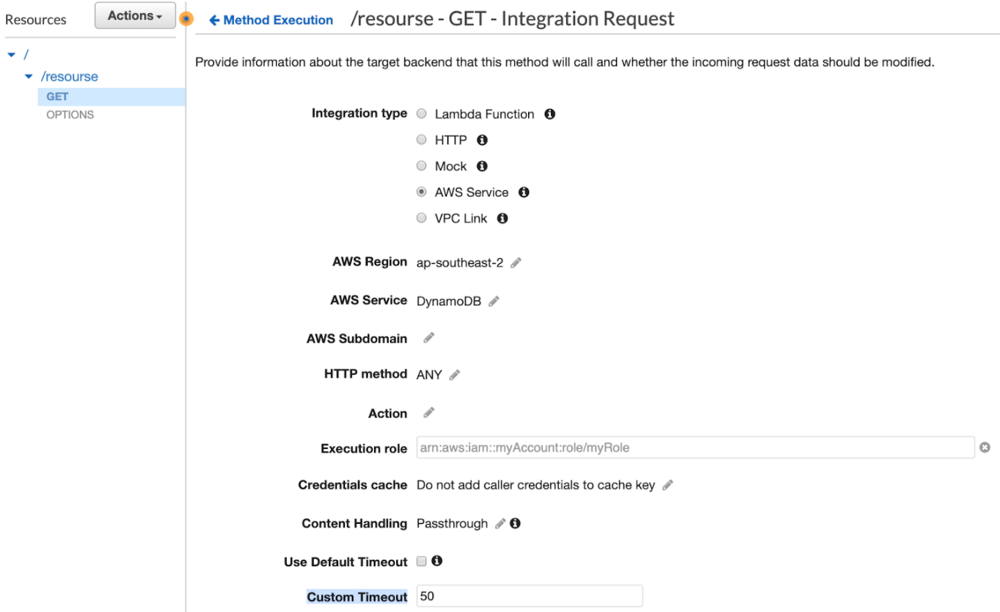
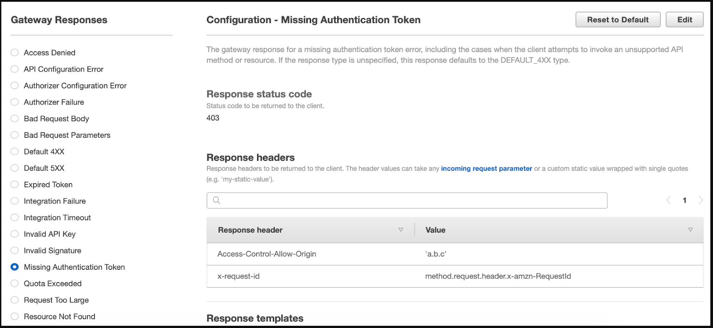
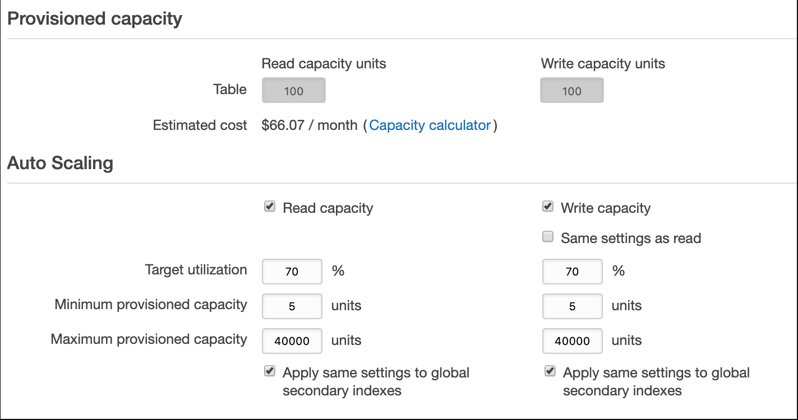

1.  You implement a REST API using a Lambda Function. The API is exposed through AWS API gateway. The Lambda Function calls a third-party service to retrieve the data. But this third-party service may not respond in time. You already increased the timeout of the Lambda Function to be 15 minutes. However, sometimes users still get an HTTP 504 error after about 30 seconds. Which of the following options is the most possible reason?
    - Answer:  The maximum of integration timeout for AWS API Gateway is 29 seconds. Although the timer for Lambda Function does not expire yet, the API Gateway already hits its limitation.
        - The integration timeout is 50 milliseconds - 29 seconds for all integration types. And the limit cannot be increased.

1. You have deployed a REST API in Amazon API Gateway. And the API integrates with a DynamoDB table. The table has a large amount of data and for certain queries, it may take over 10 seconds to finish. You want to set a custom timeout of 5 seconds for the API so that users do not have to wait a long time for the response. How should you implement this?
    - Answer:  In the integration request of the API gateway, uncheck the “Use Default Timeout” box and configure the custom timeout to be 5 seconds.
        - 

1. You are developing a REST API in Amazon API Gateway. The API integrates with a Lambda Function. You found that when clients hit the API using an unsupported method, the API Gateway has returned a Missing Authentication Token (403) response. As the response does not provide much information, you want to customize the response. For example, you want to change the error code to 404 and add some custom HTTP headers. How would you implement this?
    - Answer:  In AWS API Gateway console, choose Gateway Responses under the API and select the 403 response. Add custom headers and modify the response status code to 404
        - Users can select the particular Missing Authentication Token 403 gateway response under the API and customize it as below screenshot:
            - 

1. You implement an API in AWS API Gateway. The API integrates with a Lambda Function which returns the query results from a RDS database. For security purposes, you want the API to allow traffic only from a VPC endpoint since it should be used internally. The VPC endpoint ID is vpc-11bb22cc. What is the best method to implement this?
    - Answer:  Implement the below policy in the API Gateway Resource Policy:
    ```
    {
        "Version": "2012-10-17",
        "Statement": [
            {
                "Effect": "Allow",
                "Principal": "*",
                "Action": "execute-api:Invoke",
                "Resource": [
                    "arn:aws:execute-api:region:account-id:api-id/*"
                ]
            },
            {
                "Effect": "Deny",
                "Principal": "*",
                "Action": "execute-api:Invoke",
                "Resource": [
                    "arn:aws:execute-api:region:account-id:api-id/*"
                ],
                "Condition" : {
                    "StringNotEquals": {
                        "aws:SourceVpce": "vpce-11bb22cc"
                    }
                }
            }
        ]
    }
    ```

1.  You are developing a mobile application. As it is a proof of concept, you want to deliver the project as soon as possible and you prefer using a serverless pattern. The whole application contains the presentation tier, the logic tier and the data tier. The component in the presentation tier is the mobile application running on a user device. For the logic tier and data tier, which services should you use as the serverless mobile backend?
    - Answer:  The logic tier is Amazon API Gateway with AWS Lambda. The API Gateway endpoints are secured via Amazon Cognito user pools. Amazon DynamoDB is used for the data tier.
        - Notes:
            - Amazon RDS MySQL is not a pure serverless service. Users still need to configure the database instance type, storage and provisioned IOPS
            - AWS ECS is not a serverless service. In this scenario, Amazon API Gateway with AWS Lambda is the most appropriate for the logic tier.
            - AWS Auto Scaling Group and Amazon DocumentDB are not serverless services

1.  You have built a web API in AWS using API Gateway, AWS Lambda, and DynamoDB. For the DynamoDB table, the read and write capacities have been provisioned as 100. Recently, you find that there are ProvisionedThroughputExceededException for some client requests. And it mainly happens when the traffic is high during the daytime. Which of the following actions can help to reduce the number of exceptions? (Select TWO.) 
    - Answers:
        - In the DynamoDB table, enable auto scaling for the read and write capacities.
        - Configure an SQS queue to asynchronously control the traffic to the DynamoDB table. The extra messages are put in the queue first before they reach the table.
    - Notes:  
        - Users can directly enable DynamoDB auto scaling rather than configure it manually using Cloudwatch alarms 
        - Adding retries can potentially increase the traffic and it does not help to reduce the number of exceptions.
        - 

1.  You create a Lambda Function to process clients’ queries from a web application. The workload is time sensitive so that you want the Lambda function to finish processing and respond as quickly as possible. You prefer allocating more resources such as memories or CPUs to the Lambda Function however you are unsure how many resources are being used at the moment. Which action can help you to get the current resource usage status and allocate more resources?
    - Answer:  Check CloudWatch Logs to get the max memory used and allocate more memory if needed.
    - Notes:
        - A user can define the amount of memory available to the function during execution. Choose an amount between 128 MB and 3,008 MB in 64-MB increments.  Lambda allocates CPU power linearly in proportion to the amount of memory configured. At 1,792 MB, a function has the equivalent of one full vCPU (one vCPU-second of credits per second).
        - You can get the max memory used by each lambda call from the Cloudwatch logs
        - Although Lambda Function is serverless, users are still responsible for monitoring the running status and allocating more resources if needed. 
        - 

1.  You are developing a new Lambda Function that processes various requests. Sometimes there are throttling errors when the function doesn't have enough concurrency. The function may also return systems errors if there are exceptions during the processing. For these failed events, you do not want to discard them directly. Instead, you would like to save them for further processing. Which method can you use to achieve this requirement? (Select TWO.)
    - Answers:
        - Send the failed events to an Amazon SQS queue for further processing.
        -  Configure an SNS topic that relays the failed events to one or more destinations such as an email address.
    - Notes:
        - When asynchronous invocations to a Lambda Function fail, Lambda can send the events to an Amazon SQS queue or an Amazon SNS topic. 
        - The DLQ can be an SQS queue or an SNS topic

1. With an internet connection in place, you have deployed a new Lambda Function and a RDS MySQL database. As the Lambda Function needs to communicate with the RDS database to fetch data, you configure the Lambda Function to access the VPC and the private subnet that the database is using. However, after that, the Lambda Function has lost the internet connection. How would you resolve this problem?
    - Answer:  In the VPC private subnet, route the outbound traffic to a NAT gateway in a public subnet.

1. You are developing an application using a microservices architecture. Some serverless AWS services such as Lambda, SQS and DynamoDB are used. One Lambda Function is deployed to reset users’ password but it does not run frequently. When the function is inactive and called, it may take a longer time for it to handle the requests. You want to reduce the processing time for the function. Which method is the best one to address the issue?
    - Answer:  Configure a CloudWatch Event rule and select the Lambda Function as its target. The event is executed every minute to warm up the function so that the function stays active.

1. You are developing an application using a microservices architecture. Some serverless AWS services such as Lambda, SQS and DynamoDB are used. One Lambda Function is deployed to reset users’ password but it does not run frequently. When the function is inactive and called, it may take a longer time for it to handle the requests. You want to reduce the processing time for the function. Which method is the best one to address the issue?
    - Answer:  Configure a CloudWatch Event rule and select the Lambda Function as its target. The event is executed every minute to warm up the function so that the function stays active.
    - Notes:
        - If the Lambda Function is not used for a long time, AWS may recycle the container. And if there are new requests to the function, AWS needs to deploy the container again for the function. In order to pre warm the Lambda function, the best way is to call it using a schedule. 


