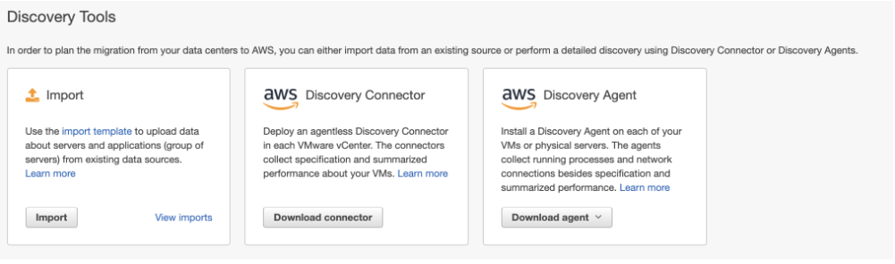
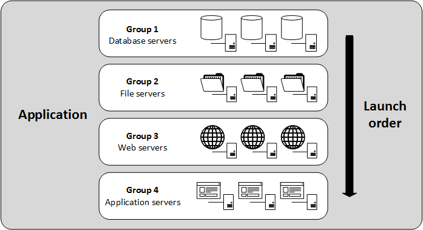

1.  You were hired as an AWS Architect in a company to help on migrating legacy applications from on-premise to AWS. The team is trying to use AWS Migration Hub to visualize the migrating process. The first step is using discovery tools to get valuable server data such as performance summary and performance time series. The team has good SQL experiences so they hope that AWS Athena can be used to analyze the imported data. Given that the legacy applications are installed in Linux CentOS 5.7 physical servers, which discovery tool is the best for you to use?
    - Install AWS Discovery Agent on the servers which transmit data to AWS Application Discovery Service. Then in Migration Hub, enable the Data Exploration in Amazon Athena.
        - AWS Migration Hub is a central place where the migration process can be visualized including the discovery phase. There are several discovery tools that are provided.

1.  Your company owns a large number of on-premise virtual machines managed in VMware vCenter. In order to plan the migration from local servers to AWS, you have installed AWS Discovery Connector in the VMware vCenter Server that helps collecting information about the virtual machines. The Discovery Connector has already registered with the Application Discovery Service successfully. Which data can be discovered by the Discovery Connector? (Select TWO.)
    - Average number of read and write I/O operations per second.
    - Average free RAM expressed in MB.
    - NOTE:  Discovery Connector belongs to agentless discovery. It can collect static configuration and utilization data including CPU, RAM, and Disk I/O.

1. Your team is working on the migration of Java applications to AWS. You plan to use AWS Application Discovery Agent to fetch the server data and then import it to AWS Migration Hub. However it is found that the Agent does not support the Ubuntu 18.04 operating system on the Linux servers. The Agent only supports lower versions such as Ubuntu 14.04 and 16.04. You still need to provide the server data to the Migration Hub. What approach is the best way for you to take?
    - Import details of the Linux servers environment directly into Migration Hub via import template.
    - 
        - Discovery Connector is only used for VMware vCenter. And Discovery Agent does not support all operating systems. For the situations that Discovery Connector and Discovery Agent cannot be used, users can upload data directly with import template. 

1. You work in an Ecommerce company and most of the existing online trading applications are deployed in VMware. In order to migrate the servers smoothly to AWS, you propose using AWS Server Migration Service. When using the tool, it may include the following stages after the Server Migration Connector is configured:
1, Upload VMDK to the S3 bucket.
2, Create an AMI for the point-in-time copy.
3, For the root device of virtual machine, backup data to S3 bucket using aws s3 sync.
4, Schedule the migration job.
5, Convert VMDK to Amazon EBS snapshot.
Which sequence is correct to describe the migration process?
    - Answer:  4 -> 1 -> 5 -> 2
    - 

1.  Your company’s on-premise servers belong to different stacks including web servers, file servers, database servers and application servers. Your team is in charge of the migration to AWS via AWS Server Migration Service. Your manager asks you to configure the servers into groups in order to better manage the replication jobs. Other than that, after the servers are successfully migrated, the instances should be automatically launched by CloudFormation templates. How should you achieve this requirement?
    - Answer:  Organize the servers into an application in AWS Server Migration Service. Divide the application into groups. Configure the launch settings for CloudFormation.
        - AWS Server Migration Service uses applications to manage groups of servers. The application can be divided into groups to allow users to launch tiers of servers. 
        - 

1.  You need to migrate a multi-tier web application from on-premise to AWS as smoothly as possible. The web application includes a frontend on Apache and PHP, plus a database running on MySQL. All the services are deployed in VMware virtual machines. You have already set up VPC and subnets in one AWS region. And you are ready to start migrating the application. Which approach is the best one for you to take?
    - Answer:  Use AWS Database Migration Service to replicate MySQL database to Aurora. Configure Server Migration Service Connector appliance in VMware vCenter and initiate a replication job. Launch EC2 instance using the new AMI and change DNS records accordingly.

1. You are an AWS solutions architect and in charge of a migration project from local servers to AWS. AWS Server Migration Service has been configured to replicate a large number of VMware virtual machines to EC2 AMI. SMS already helps generating CloudFormation templates during the migration of applications. You also manually created several CloudFormation templates to create AWS resources including EC2. You wish to use a service to centrally manage the resources created by CloudFormation templates. And users can choose certain products and deploy them quickly. The service should also integrate with IAM to provide access control. Which method is the best for you to take?
    - Create portfolio and products in AWS Service Catalog. Use IAM permissions to grant users access to the portfolio.
        - Create portfolio and products in AWS Service Catalog. Use IAM permissions to grant users access to the portfolio.

1. You lead a project to migrate local Oracle database to AWS RDS. You plan to use AWS Database Migration Service for the project as users can easily configure it to continuously replicate data. As the Oracle database is used for financial services, the data security is very important. You already created a replication instance in AWS DMS. How does the replication instance encrypt the stored data to keep it secure?
    - Data in the replication instance is encrypted by KMS. The master key is aws/dms by default or a custom managed key (CMK)

1. Your company is a traditional trading company and the local database has huge amount of data. The database needs to be migrated to AWS as soon as possible. Considering the limited network speed in the region, it may take months to transfer all the data to the cloud. You need to work out a plan to migrate the database faster and safer. Which approach is the best one for you to take?
    - Use the Snowball Edge device to load the data to an S3 bucket, then configure a replication job in AWS Database Migration Service to migrate the data to the target DB.

1. A company needs to migrate its data from local server to AWS S3. The total amount of data is about 50TB. The data needs some advanced machine learning analysis before being migrated to AWS. The migration project should finish as fast as possible and it is unacceptable to finish it in months. The data at rest should also be encrypted during the migration. What is the best way to achieve this requirement?
    - Use multiple Snowball Edge Compute Optimized product. Perform machine learning analysis at remote location and transfer the data. After the equipment is shipped back, AWS is able to store the data in S3.
        - Snowball Edge is suitable as it is a data migration and edge computing device. For the scenarios that need processing abilities, either a single / multiple  Snowball Edge Compute Optimized device(s) should be used.  Snowball Edge devices have two options - Compute Optimized and Storage Optimized.

