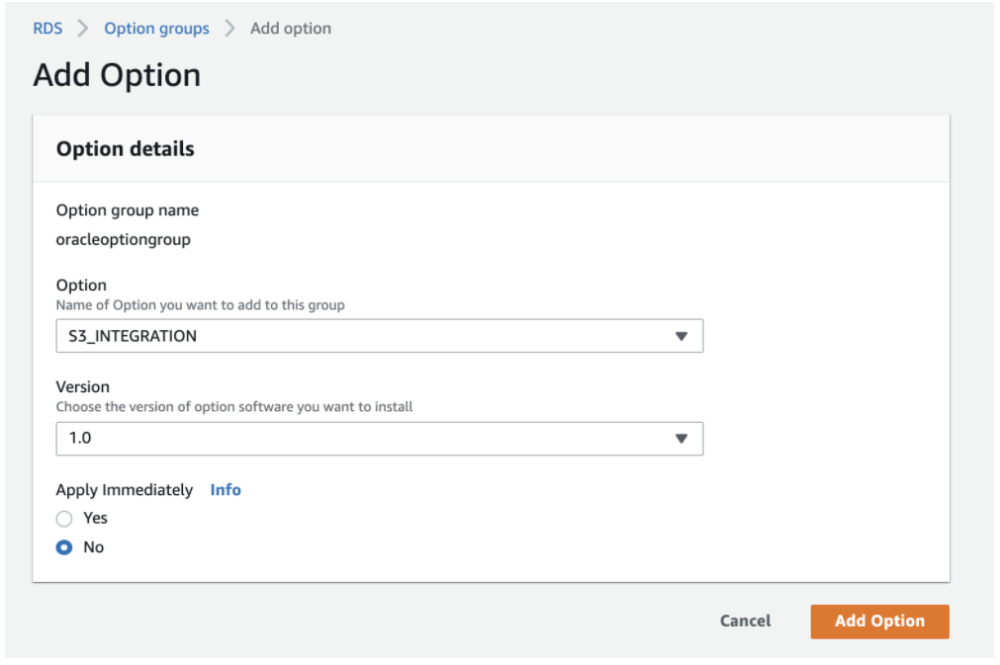
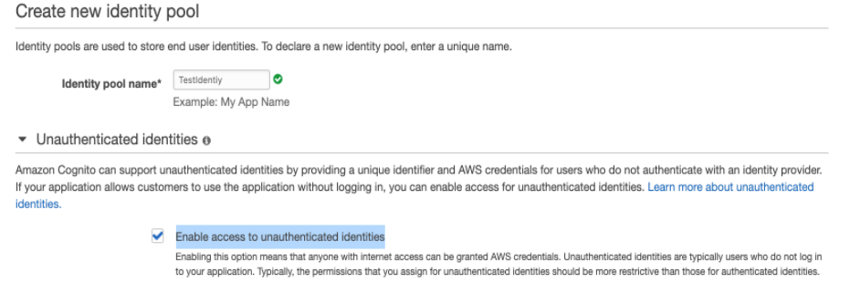
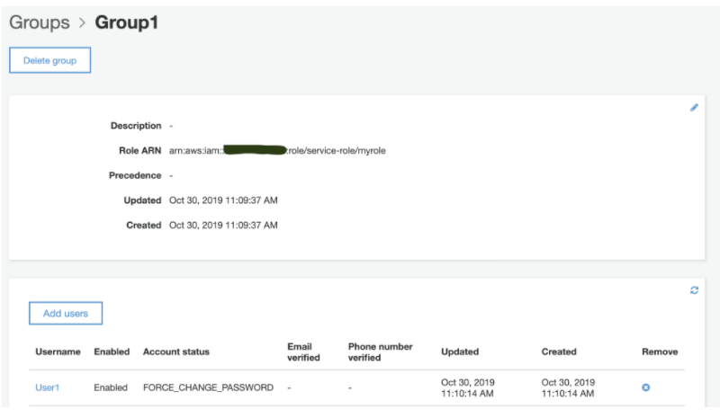
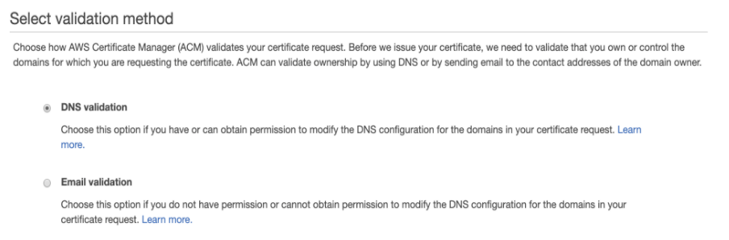

1. You are in charge of maintaining an Oracle database in RDS. The development team tells you that the database instance needs to communicate with a new S3 bucket. For example, it should be able to save the backup files to S3, and at the same time, it can fetch Oracle Data Pump files from the same bucket when required. In order to connect the database instance with the particular S3 bucket successfully, which options are the prerequisites? (Select TWO.)
    - Answers:
        - Configure an IAM role with a policy that allows to read and write the S3 bucket objects. Associate the role with the RDS instance.
        - Create an option group that includes the S3_INTEGRATION option. Associate the DB instance with the option group.
    - 


1. In your organization, your DevOps team is in charge of provisioning resources in an AWS account. Tim was a team member and created a Customer Managed Key in KMS several months ago. The default key policy is removed, and the key policy is as below:
    ```
    {
    "Version": "2012-10-17",
    "Id": "key-consolepolicy-1",
    "Statement": [
        {
        "Sid": "Enable IAM User Permissions",
        "Effect": "Allow",
        "Principal": {"AWS": "arn:aws:iam::111122223333:user/Tim"},
        "Action": "kms:*",
        "Resource": "*"
        }
    ]
    }
    ```
    As Tim leaves the company, his accounts are deleted including the above IAM user. As a result, the CMK becomes unmanageable for other users to view or use. How should you deal with this problem? 
    - Answer:   Contact AWS Support to regain access to the CMK. 
        - Even the root user cannot manage it now
            - It is better to use the default key policy which is the following:
                - 
                ```
                    {
                        "Sid": "Enable IAM User Permissions",
                        "Effect": "Allow",
                        "Principal": {"AWS": "arn:aws:iam::111122223333:root"},
                        "Action": "kms:*",
                        "Resource": "*"
                    }
                ```  
                - The above policy allows the following options:
                    1. You cannot delete your AWS account's root user, so allowing access to this user reduces the risk of the CMK becoming unmanageable. 
                    1. IAM policies by themselves are not sufficient to allow access to a CMK. However, you can use them in combination with a CMK's key policy if the key policy enables it. Giving the AWS account full access to the CMK does this; it enables you to use IAM policies to give IAM users and roles in the account access to the CMK.
                    1. The default key policy created by the console allows you to choose IAM users and roles in the account and make them key administrators. Key administrators have permissions to manage the CMK, but do not have permissions to use the CMK in cryptographic operations.

1. A company has a new S3 bucket which stores very sensitive files. These objects are supposed to be used only by limited IAM admin users. Other IAM users or roles should not have access. Users in other AWS accounts can not assume any role to read the S3 objects either. You plan to use the S3 bucket policy to apply the security rules. Which option is the most secure one? 
    - Answer:
        - 
        ```
        {
            "Version": "2012-10-17",
            "Statement": [{
                "Effect": "Deny",
                "NotPrincipal": {"AWS": [
                    "arn:aws:iam::444455556666:user/Admin",
                    "arn:aws:iam::444455556666:root"
                ]},
                "Action": "s3:*",
                "Resource": [
                    "arn:aws:s3:::BUCKETNAME",
                    "arn:aws:s3:::BUCKETNAME/*"
                ]
            }]
        }
        ```
            - Explicit deny should be considered as it takes the highest priority even if the action is explicit allowed somewhere else.
                - Remember:  If you DENY access to something somewhere and then something else allows access, the DENY will override the ALLOW 

1. As an AWS Solutions Architect, you need to configure an identity service in AWS based on SAML. Since you already have a SAML identity provider outside of AWS, you plan to use the same IdP to manage user identities. In order to create the SAML identity provider in IAM, the below steps may be required:
1, Configure the SAML IdP with relying party trust.
2, Use AWS CLI assume-role-with-web-identity to return a set of temporary security credentials for authentication.
3, Get the SAML metadata document from the IdP.
4, Create a SAML IAM identity provider from AWS console or CLI.
5, In IdP, configure SAML Assertions for the authentication response.
Which one describes the correct sequences?
    - Answer:  3-->4-->1-->5
        1. Before you can create an IAM identity provider, you need the SAML metadata document that you get from the IdP, This document includes the issuer's name, expiration information, and keys that can be used to validate the SAML authentication response (assertions) that are received from the IdP.
        1. Sign into the IAM console, select provider type (`SAML` or `OpenID Connect`), give it a name, add metadata document (for SAML)

1. Your team is developing an Android app. You need to use an Amazon Cognito Identity Pool to create unique identities for the app users and federate them with the identity provider from Google. You also want to allow unauthenticated guest access for the application. Guests can get temporary tokens for limited access. How would you implement the guest access using Amazon Cognito?
    - Enable the unauthenticated access in Cognito Identity Pool. Guest users can request an identity ID via the GetId API.
    - 

1. You create an EBS snapshot for an application in non-production AWS account A. The snapshot is encrypted by a customer managed key (CMK-A). In order to deploy the same application in the production AWS account B, you need to create an AMI using the snapshot and launch an EC2 instance. The IAM admin user in the account B is allowed to use CMK-A. However, the production EC2 instance has to use its own customer managed key (CMK-B) to encrypt the EBS volume. Which solution is the best?
    - Created a encrypted version of the snapshot (without CMK-A) and then create an AMI using the encrypted snapshot. Launch an EC2 instance using the AMI and encrypt the EBS volume with CMK-B.
        - Because when creating snapshots, the new snapshot can be encrypted with a new CMK. AWS CLI command copy-snapshot uses the option of --kms-key-id to specify the CMK.

1. You use AWS Cognito User Pool to configure a user directory for an application. You want to separate different users as readers, contributors, and editors of the app. For example, the readers can only read contents from AWS S3 buckets, contributors are able to put contents into Amazon S3 buckets and editors have the permissions to publish contents through an API in Amazon API Gateway. Which method is the best to achieve this requirement in AWS Cognito?
    - In Amazon Cognito User Pool, create groups and assign IAM roles to them. Add users to the groups to assign the required permissions.
        - In Amazon Cognito User Pool, you can configure users in groups which enable you to better manage the permissions. Each group can be linked with an IAM role ARN
        - 

1. Your team creates a Customer Managed Key (CMK) in KMS in an AWS account (111122223333). The key is supposed to be used by another account (444455556666) for encryption and decryption operations. At the moment, it is known that only IAM user Bob and IAM role Admin in the account (444455556666) need access. More IAM entities may need the access in the future. Which configurations are required in together to achieve this requirement? (Select TWO.)
    - Answers:
        - Edit the Principal of the key policy as below:
        ```
        "Principal": {
                "AWS": [
                    "arn:aws:iam::444455556666:role/Admin",
                    "arn:aws:iam::444455556666:user/Bob"
                ]
            }
        ```
        - In account 444455556666, allow the KMS encryption and decryption actions as below:
            ```
            "Resource":
            "arn:aws:kms:us-west-2:111122223333:key/1234abcd-12ab-34cd-56ef-1234567890ab"
            ```
    - In this scenario, the key policy determines who can have access to the CMK. The IAM policy determines who does have access to the CMK. Neither the key policy nor the IAM policy alone is sufficient—you must change both.


1. You work in a DevOps team and your team maintains several applications deployed in AWS. At the moment, there are dozens of server certificates stored in IAM. These certificates are used for different purposes and have different expiry date. You have to renew the certificates before they expire otherwise the services will be impacted. You want to use another approach to renew and manage these certificates. Which method is the best?
    - Answer:  Provision and manage the server certificates in AWS Certificate Manager (ACM). The certificates requested from ACM are automatically renewed
    - Notes:
        - For the imported server certificates in IAM, there is no IAM console to manage them. This is one major disadvantage of managing certificates in IAM.
        - You cannot migrate the certificates from IAM to ACM directly. There is no such console to do that. For ACM, you can import third party certificates to the service.
        - IAM supports deploying server certificates in all Regions, but you must obtain your certificate from an external provider for use with AWS. You cannot upload an ACM certificate to IAM. Additionally, you cannot manage your certificates from the IAM Console.

1. You start to use AWS Certificate Manager to manage certificates. And some existing certificates in IAM will not be used or will be replaced by the new ones in ACM. You just create a new public server certificate for a domain name called www.example.com. However, the status of the certificate is “Pending validation”. Which option can be used by ACM as a validation approach? (Select TWO.)
    - Answers:
        - Use DNS to validate the domain ownership. You can insert ACM generated CNAME records into your DNS database
        - ACM sends emails to the contact addresses of the domain name. You can validate the domain owner in the email.
    - 

