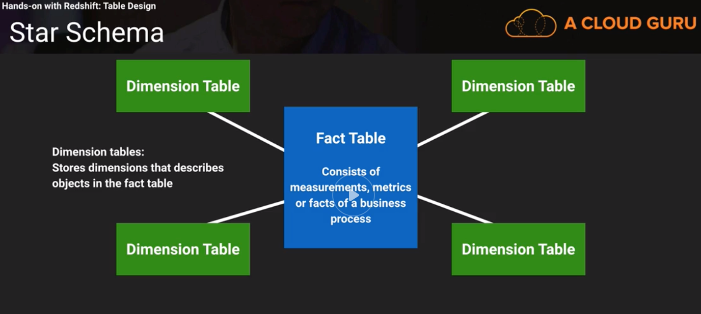

## Datawarehousing Concepts
- Fact Table
    - Has all the primary keys of the dimensions and associated measures (price, commission)
    - Ex:  Transaction table, sales price, quantity and other measurable data
    - Measures are used to evaluate the profits/loss game
    - Hold measurable data about a business
- Dimension
    - Hold descriptive attributes related to the fact data
    - Driving tables that provide descriptive information for all measurements recorded in the fact
    - Have to be loaded first because you cannot sell a product that doesn't exist
    - Are relatively very small in number in comparison to Fact tables
    - Ex:  Product models, colors, sizes, etc.
- Star Schema
    - 

## References
- Step by step getting started guide:
    - https://docs.aws.amazon.com/redshift/latest/gsg/getting-started.html
- Data modeling in Redshift
    - https://www.blendo.co/amazon-redshift-guide-data-analyst/data-modeling-table-design/
- Columnar Storage:
    - https://docs.aws.amazon.com/redshift/latest/dg/c_columnar_storage_disk_mem_mgmnt.html
- ETL with AWS Glue:
    - https://aws.amazon.com/glue/
- AWS Redshift utilities
    - https://github.com/awslabs/amazon-redshift-utils
- Advanced table design Playbooks for Redshift:
    - https://aws.amazon.com/blogs/big-data/amazon-redshift-engineerings-advanced-table-design-playbook-distribution-styles-and-distribution-keys/
    - https://aws.amazon.com/blogs/big-data/amazon-redshift-engineerings-advanced-table-design-playbook-compound-and-interleaved-sort-keys/

## SQL Client
- AWS Console query editor
    - https://console.aws.amazon.com/redshift/
- SQL Workbench/J

## General Notes on Redshift
- Amazon Redshift is a relational database management system (RDBMS), so it is compatible with other RDBMS applications. Although it provides the same functionality as a typical RDBMS, including online transaction processing (OLTP) functions such as inserting and deleting data, Amazon Redshift is optimized for high-performance analysis and reporting of very large datasets.
- Amazon Redshift is based on PostgreSQL 8.0.2.
- Amazon Redshift consists of a number of nodes where each one is an actual computing node on Amazon AWS, with dedicated resources like memory, CPU and disk space
- Nodes create an Amazon Redshift Cluster over high-speed network connections
- One node is denoted the Leader and the rest act as Compute nodes.
- The leader is responsible for distributing the data across the different compute nodes to achieve the desired performance
- Each compute node has its disk storage divided into slices. 
    - At least 2 on each compute node
    - Data distributed on slices is queries in parallel on each compute node.
    - When a table is created, and data is loaded into it, Redshift distributes its data across the different compute nodes and slices of a cluster.
- When data is distributed unevenly across your computing nodes, some of them have to work more than the other. That is not desirable; you do not want underutilized compute nodes. So you should aim for an as much as a uniform distribution of your data.
- Distribution is per table. So you can select a different distribution style for each of the tables you are going to have in your database.
- Distribution Styles:
    1. Even Distribution
        - The Leader node distributes the data of a table evenly across all slices, using a round robin approach.
    2. Key Distribution
        - Data is distributed across slices by the Leader node matching the values of a specific column
        - One distribution key per table
    3. All Distribution
        - Leader node distributes the table to all the computing nodes. A copy of the table is maintained on all nodes which means that the storage needed for the table is multiplied by the number of nodes
        - For tables that are reasonably sized (a few million rows or less)
        - Data that does not change frequently
    - ```select relname, reldiststyle from pg_class where relname like 'YOUR_TABLE_NAME;```
- Sort Keys
    - These columns are being used as data is loaded into the table to sort it accordingly. During this process some metadata is also generated, e.g. the min and max values of each block are stored and can be accessed directly without iterating the data every time a query executes.
    - 2 different types of sort keys:
        1. Compount Sort Keys
        2. Interleaved Soft Keys
            - put an equal weight to each of the included columns in the sort key.
            - Used when there's no dominant column in your queries
    - As you load more data on your sorted tables performance deteriorates over time
        - To fix this problem you need to vacuum your tables

## Acronyms
- MPP:  Massive Parallel Processing