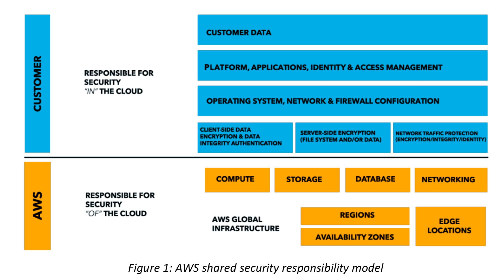

## AWS Well-Architected Framework (July 2018)
- 5 pillars of Well Architected Framework:
    - Cost Optimization
    - Operational Excellence
    - Reliability (think SRE:  Site Reliability Engineering)
    - Performance Efficiency
    - Security
- Eggshell security describes a practice in which organizations depend on a traditional model of a “hardened outer layer of defenses and a network that is essentially wide open, once the attacker has made it past perimeter defenses.”

- Security Design Principles:
    - Implement a strong identity foundation
        - Principle of Least Privilege
    - Enable Traceability
    - Apply Security at all layers
    - Automate Security best practices
    - Protect data in transit and at rest
    - Keep people away from data
    - Prepare for security events

- Security in the cloud is composed of 5 areas:
    1. Identity and access management
        - Approaches:
            - Protecting AWS credentials
                - Don't use root user credentials
                - Use Federation with existing identity providers
                - Password policy
                - Protect API credentials very carefully and exchange them for temporary credentials whenever possible.
                - Use the AWS Security Token Service (AWS STS) to generate and manage temporary credentials used in software that must authenticate to AWS APIs.
                - Key AWS Services:
                    - IAM
                    - AWS STS
                    - IAM profiles for AWS services (ex:  EC2 instances)
            - Fine-grained authorization
                - Establishing a principle of least privilege
                - AWS Organizations should be used to centrally manage AWS accounts.
                - Key AWS Services:
                    - IAM
                    - AWS Organizations
    2. Detective controls
        - Approaches:
            - Capture and analyze logs
                - Customize the delivery of AWS CloudTrail and other service-specific logging to capture API activity globally and centralize the data for storage and analysis
                - Use Amazon CloudWatch Logs to monitor, store, and access your log files
                - Key AWS Services:
                    - AWS GuardDuty
                    - AWS Config
                    - Amazon CloudWatch Logs
                    - Amazon Simple Storage Service (S3) and Amazon Glacier
                    - Amazon Athena
            - Integrate auditing controls with notification and workflow
                - A best practice for building a mature security operations team is to deeply integrate the flow of security events and findings into a notification and workflow system such as a ticketing system, a bug/issue system, or other security information and event management (SIEM) system.
                - This best practice applies not only to security events generated from log messages depicting user activity or network events, but from changes detected in the infrastructure itself.
                - Key AWS Services:
                    - AWS Config Rules
                    - Amazon Cloudwatch and Cloudwatch Logs
                    - Amazon CloudWatch API and AWS SDKs
                    - Amazon Inspector
    3. Infrastructure protection
        - Approaches:
            - Protecting network and host-level boundaries
                - You can define a publicly routable subnet by having a route that goes to an internet gateway attached to the VPC. 
                - You can configure the NACL to narrow the scope of traffic allowed.
                - When implementing a VPC design, keep in mind some key considerations for the IP address range that you choose for the VPC.
                - Key AWS Services:
                    - Amazon VPC Security Groups
                    - AWS Shield
                    - AWS WAF
                    - AWS Firewall Manager
                    - AWS Direct Connect 
            - System security configuration and maintenance
                - Automate deployments and maintenance and remove operator access to reduce your surface area
                - Much of this can be achieved using AWS Systems Manager features for EC2 management, and AWS CloudFormation for infrastructure.
                - Key AWS Services:
                    - AWS Systems Manager
                    - Amazon Inspector
                    - AWS Cloudformation
            - Enforcing service-level protection
                - You can protect AWS service endpoints by defining policies using IAM. 
                - Some resources have their own resource- level policies. For example, Amazon S3 has bucket policies to define administrators and users of the keys in AWS KMS.
                - Key AWS Services:
                    - IAM
                    - KMS
                    - S3
                    - Amazon Simple Notification Service (Amazon SNS) topics allows you to set a policy statement on each topic
    4. Data protection
        - Approaches:
            - Data classification
                - By using resource tags, IAM policies, AWS KMS, and AWS CloudHSM, you can define and implement your policies for data classification.
                - Key AWS Services:
                    - Resource Tagging
                    - AWS KMS
            - Encryption/tokenization
                - Tokenization is a process that allows you to define a token to represent an otherwise sensitive piece of information (for example, a token to represent a customer’s credit card number).
                - Encryption is a way of transforming content in a manner that makes it unreadable without a secret key necessary to decrypt the content back into plain text. 
                - Key AWS Services:
                    - AWS KMS
                    - AWS CloudHSM
            - Protecting data at rest
                - Key AWS Services:
                    - AWS KMS
                    - AWS S3
                    - EBS
                    - Glacier
            - Protecting data in transit
                - AWS Certificate Manager (ACM) service provides you the ability to manage and deploy public and private certificates for your workloads.
                - You can leverage VPN connectivity into your VPC or across your VPCs to facilitate encryption of traffic.
                - Key AWS Services:
                    - ACM
                    - Elastic Load Balancing
                    - Amazon CloudFront
            - Data backup/replication/recovery
                - Amazon Glacier is a secure, durable, and extremely low-cost cloud storage service for data archiving and long-term backup. 
                - Ensure that you have a process defined for the recovery of your content. 
                - You should plan and run a game day scenario to test and ensure that your approach is effective in the event of a disaster.
                - Consider storing backups in a different AWS account with a different set of credentials to protect against human error or a compromise of the primary account.
                - Key AWS Services:
                    - S3
                    - Amazon S3 Cross-Region Replication
                    - Amazon S3 lifecycle polices and versioning
                    - Amazon EBS snapshot operations
    5. Incident response
        - Putting in place the tools and access ahead of a security incident, then routinely practicing incident response through game days, will help you ensure that your architecture can accommodate timely investigation and recovery.
        - Approaches:
            - Clean Room
                - Forensics often requires capturing the disk image or "as-is" configuration of an operating system, you can use EBS snapshots and the Amazon EC2 APIs to capture the data and state of systems under investigation. 
                - Security practitioners can use CloudFormation to quickly create a new, trusted environment in which to conduct deeper investigation.
                - Key AWS Services:
                    - IAM
                    - CloudFormation
                    - CloudTrail
                    - Cloudwatch Events
                    - Step Functions
                        - Coordinate a sequence of steps to automate an incident response process.
        - Run a lessons learned session and takeaways after every incident (postmortem)

## Amazon Web Services: Overview of Security Processes
- 
- AWS is responsible for securing the underlying infrastructure that supports the cloud, and you’re responsible for anything you put on the cloud or connect to the cloud
- The amount of security configuration work you have to do varies depending on which services you select and how sensitive your data is. However, there are certain security features—such as individual user accounts and credentials, SSL/TLS for data transmissions, and user activity logging—that you should configure no matter which AWS service you use.
- While customers can’t visit our data centers or offices to see this protection firsthand, we provide several reports from third-party auditors who have verified our compliance with a variety of computer security standards and regulations
- Note that in addition to protecting this global infrastructure, AWS is responsible for the security configuration of its products that are considered managed services. Examples of these types of services include Amazon DynamoDB, Amazon RDS, Amazon Redshift, Amazon Elastic MapReduce, Amazon WorkSpaces, and several other services.
- For EC2 instances, you’re responsible for management of the guest OS (including updates and security patches), any application software or utilities you install on the instances, and the configuration of the AWS- provided firewall (called a security group) on each instance.
- AWS recommends using multi-factor authentication (MFA) with each account, requiring the use of SSL/TLS to communicate with your AWS resources, and setting up API/user activity logging with AWS CloudTrail.
- AWS data centers are housed in nondescript facilities. Physical access is strictly controlled both at the perimeter and at building ingress points by professional security staff utilizing video surveillance, intrusion detection systems, and other electronic means.
- When a storage device has reached the end of its useful life, AWS procedures include a decommissioning process that is designed to prevent customer data from being exposed to unauthorized individuals.

