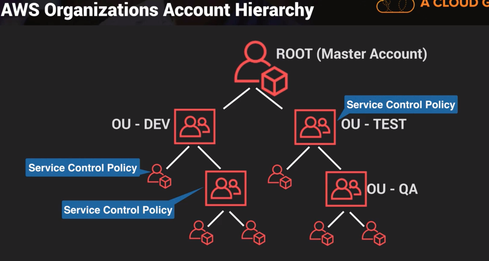

## IAM Recap
- Key to passing Security Specialty Certification is understanding IAM inside out, especially policies
- IAM features:
    - Centralized control of your AWS account
    - Shared access to your AWS account
    - Granular permissions
    - Identity Federation (active directory, Facebook, linkedIn, etc)
    - Multifactor Authentication
    - Provides temporary access for users/devices and services where necessary 
    - Allows to setup your own password rotation policy
    - Integrates with many different AWS services
    - Supports PCI DSS Compliance
- Critical Terms:
    - Users
        - End users (think people)
    - Groups
        - A collection of users under a set of permissions
    - Roles
        - You create roles and can then assign them to AWS resources
        - Secure way to grant permissions to entities that you trust
        - Roles support the following Trusted Identities:
            - AWS Service
            - Another AWS account
            - Web Identity (Cognito or any OpenId Connect provider:  Amazon, Facebook, Google, etc.)
            - SAML 2.0 Federation 
    - Policies
        - Document that defines one or more permissions

## Root User Scenario
- Scenario:  Previous system administrator leaves the company in bad terms
    - Actions to take in regards the root account:
        - Change root user password
        - Remove MFA and then request a new code and add it again   
            - Note:  An idea is to take a photo of your QR code and keep it in S3 in case you loose your phone and you need the reactivate it in a different phone
        - If that person had access keys+secret access keys you should delete them
            - You should never use access key+secret access key on your root account
            - Do it through IAM, through ussers and give them least privilege
        - Check existing users, last activity and if any are suspicious, delete them
        - Create a new strong password policy

## IAM Policies 101
- IAM is global and applies to all areas of AWS
- IAM Policies
    - Specify what you are allowed to do with any AWS resource
    - They are global and apply to all areas of AWS
    - You can attach policies to users, groups or roles
        - These users, groups, and roles are subject to the permissions you define in the policy
    - 3 types of Identity-based policies:
        1. AWS managed policies
            - Standalone policy that is created and administered by AWS
            - They can change (minor changes though)!
            - Exs:  
                - AdministratorAccess policy that can do anything except access billing
                - PowerUserAccess policy can do everything except manage IAM
        2. Customer managed policies
        3. Inline policies
            - Useful if you want to maintain a strict one-to-one relationship between a policy and the principal entity that it is applied to.
- Types of Policies again:
    1.  Identity-based policies – Identity-based policies are attached to an IAM identity (user, group of users, or role) and grant permissions to IAM entities (users and roles). If only identity-based policies apply to a request, then AWS checks all of those policies for at least one Allow.

    2.  Resource-based policies – Resource-based policies grant permissions to the principal entity (account, user, role, or federated user) specified as the principal. The permissions define what the principal can do with the resource to which the policy is attached. If resource-based policies and identity-based policies both apply to a request, then AWS checks all the policies for at least one Allow.
        - They can even block root for specific accounts.

    3.  IAM permissions boundaries – Permissions boundaries are an advanced feature that sets the maximum permissions that an identity-based policy can grant to an IAM entity (user or role). When you set a permissions boundary for an entity, the entity can perform only the actions that are allowed by both its identity-based policies and its permissions boundaries. Permissions boundaries do not affect the permissions granted by a resource-based policy.

    4.  AWS Organizations service control policies (SCPs) – Organizations SCPs specify the maximum permissions for an organization or organizational unit (OU). The SCP maximum applies to entities in member accounts, including each AWS account root user. If an SCP is present, identity-based and resource-based policies grant permissions to entities only if those policies and the SCP allow the action. If both a permissions boundary and an SCP are present, then the boundary, the SCP, and the identity-based policy must all allow the action.

    5.  Session policies – Session policies are advanced policies that you pass as parameters when you programmatically create a temporary session for a role or federated user. To create a role session programmatically, use one of the AssumeRole* API operations. When you do this and pass session policies, the resulting session's permissions are the intersection of the IAM entity's identity-based policy and the session policies. To create a federated user session, you use an IAM user's access keys to programmatically call the GetFederationToken API operation. A resource-based policy has a different effect on the evaluation of session policy permissions. The difference depends on whether the user or role's ARN or the session's ARN is listed as the principal in the resource-based policy. For more information, see Session Policies.

## Policy Specification Basics
- Contain 4 parts:  
    - PARC:
        - Principal
            - The Entity that is allowed or denied access to the resource
            - Indicated by ARN (Amazon Resource Name)
            - With IAM policies the principal element is implicit (user, group, role)
            - You use principal with policies that are attached to resources (ex:  S3 bucket policy)
            - Anonymous User (Everyone):   ```"Principal": "*"``` or   ```"Principal" : { "AWS" : "*" }```
        - Action
            - `Action` and `NotAction`
        - Resource
            - `Resource` and `NotResource`
        - Condition
            - 
            - https://docs.aws.amazon.com/IAM/latest/UserGuide/reference_policies_elements_condition_operators.html 
            - Examples:
            ```
                {
                "Version": "2012-10-17",
                "Statement": {
                    "Effect": "Allow",
                    "Action": "iam:*AccessKey*",
                    "Resource": "arn:aws:iam::ACCOUNT-ID-WITHOUT-HYPHENS:user/*",
                    "Condition": {"IpAddress": {"aws:SourceIp": "203.0.113.0/24"}}
                }
                }
            ```

## AWS Policy Evaluation Logic
- By default, all requests are implicitly denied. (Alternatively, by default, the AWS account root user has full access.)
- An explicit allow in an identity-based or resource-based policy overrides this default.
- If a permissions boundary, Organizations SCP, or session policy is present, it might override the allow with an implicit deny.
- An explicit deny in any policy overrides any allows.
- 
- 
- 
- 
    - The resource access definition is required in both accounts

## S3 bucket policies
- Are attached only to S3 buckets
- Specify what actions are allowed or denied on the bucket
- Use Cases:
    - Simple way to gran cross-account access to your S3 environment without using IAM roles
    - Your IAM inline policies might hit the character limits:
        - 2,048 characters for user policy size
        - 10,240 characters for role policy size
        - 5,120 characters for group policy size
        - Note:  Whitespaces are not counted!
    - You prefer to keep access control policies in the S3 environment
        - Ex:  To manage access to an individual bucket
- An explicity DENY ALWAYS overrides an ALLOW
    - If you DENY something to all users and then want to allow it for one user the DENY will win and the one user won't be able to be allowed
- Bucket policies override IAM policies, however the DENY prevails nowhere it is set

## S3 ACLs
- Legacy access control mechanism that predates IAM
- AWS recommends to use IAM policies and S3 bucket policies
- Valid use case is when you need to apply policies on the objects themselves given that bucket policies can only be aplied at the bucket level
- When giving public access to an object via an ACL anybody will be able to acess it from a browser regardless on what IAM policies or bucked policies I create to try to block the access.  

## Conflicting Policies - The Key to Passing the Exam
- Example:  What happens if an IAM policy conflicts with an S3 policy which conflicts with an S3 ACL?
- Whenever an AWS principal (user, group or role) issues a request to S3, the authorization decision depends on the union of all the IAM policies, S3 bucket policies, and s3 ACLs that apply
- With least-privilege decisions ALWAYS default to DENY
- An explicit DENY ALWAYS trumps an ALLOW
    - If you DENY access to something somewhere and then something else allows access, the DENY will override the ALLOW
    - 

## Forcing Encryption Using S3
- Only allow S3 bucket access if using https
``` yaml
    "Condition": {
        "Bool": {
            "aws:SecureTransport": "true"
        } 
    }
```

## Cross Region Replication
- Replicates objects from one region to another
- By default it is done using SSL
- You can replicate objects from a source bucket to only one destination bucket.  After S3 replicates an object, the object cannot be replicated again.
- The source and destination buckets must have versioning enabled
- The source and destination buckets must be in different AWS regions
- Amazon S3 must have permissions to replicated objects from that source bucket to the destination bucket on your behalf
- For different AWS accounts:
    - The IAM role must have permissions to replicate objects in the destination bucket
    - Use Case:  Cloudtrail audits, log everything to an S3 bucket in each account and turn cross region replication to replicate audit logs to another AWS account 
- Delete markers are replicated, deleted versions of files are not
- Versioning must be enabled

## Forcing S3 to use Cloudfront
- We don't want users to access the bucket using S3 bucket URL
- You have to restrict bucket access in cloudfront Origin and create an OAI (Origin Access Identity) which is a special cloudfront user, and you want to update the S3 bucket policy so that cloudfront can access it.
    - Changes can take 4-48 hours
- The advantage of going through Cloudfront is that customer can control traffic afterwards by integrating WAF with cloudfront

## Using SSL certificates with Cloudfront
- Custom SSL certificates in cloudfront must be stored in ACM in the us-east-1 region (North Virginia)


## Securing S3 using pre-signed URLs
- Typically done using the SDKs, can also be done using the CLI
- You can access objects using pre-signed URLs
- They exist for a certain length of time in seconds (default is 1 hour, can be modified using `--expires-in`)

## Security Token Services (STS) with Active Directory
- Grants users limited and temporary access to AWS resources. Users can come from 3 sources:
    1. Federation (typically Active Directory)
        - Uses SAML
        - No need for IAM credentials (same username+password of Windows network)
    2. Federation with Mobile Apps 
        - Ex:  OpenId Providers (Facebook, Amazon, Google)
    3. Cross Account Access
        - Users from one AWS account can access resources in another
- Key terms:
    - Federation:  Combining or joining a list of users in one domain with a list of users in another domain
    - Identity Broker:  a service that allows you to take an identity from point A and join it (federate it) to point B
    - Identity Store:  Services like Active Directory, Facebook, Google, etc.
    - Identity:  represents a user
- 
    - Always authenticates against the Identity Store first (AD, Facebook, etc)
    - Identity Broker calls GetFederationToken function using IAM credentials (call includes IAM policy and duration)
    - STS returns 4 values to the application:  access key, secret access key, token, and duration

## Web Identity Federation
- Amazon Cognito 
    - Sign up, Sign-in, and guest user access to your apps
    - Access for guest users
    - Acts as Identity Broker between your application and Open Id providers
    - Synchronizes user data for multiple devices

## Cognito User Pools
- User Pools are user directories
- Users can sign'in directly or indirectly via an identity provider
- Successful authentication generates a number of JWTs (JSON Web Tokens)
- Identity pools (federated identities) enable you to create unique identities for your users and federate them with identity providers. With an identity pool, you can obtain temporary, limited-privilege AWS credentials to access other AWS services. 
    - Assigning roles to users who have authenticated using a separate identity provider
    - They map a user from an identity provider to an IAM role
    - They deal more with permissions
    - Exchanges JWT tokens received from Identity Providers via the user pool for AWS credentials

## Glacier Vault Lock
- Data is stored in archives (single file or multiple files stored in a .tar or .zip file)
- Vaults are containers which store one or more archives
- A vault lock policy allows you to configure and enforce compliance controls for individual Glacier Vaults
- Use Cases:
    - Configure WORM (Write once Read many)
    - Create data retention policies
- Vault lock policies are immutable
- Steps:
    1. Initiate the lock by attaching a vault lock policy to your vault (in progress state)
    2. 24 hours to validate the lock policy and abort if it doesn't work as expected, once validated it is immutable

## AWS Organizations
- Account Management Service which allows you to consolidate multiple AWS accounts into an Organization that you can manage centrally
- Consolidated billing
- You can organize your accounts into groups/OUs for access control
    - Ex:  One OU for development, other one for production
- You can attach policy-based controls (called Service Control Policies)
- Service Control Policy:
    - Used to centrally control the use of AWS services across multiple accounts
    - Applies to all OUs and accounts below the OU to which it is attached
        - Permissions Boundary
            - A permissions boundary is an advanced feature in which you use a managed policy to set the maximum permissions that an identity-based policy can grant to an IAM entity.
    - Can deny access only, they cannot allow
    - Restrict actions to users, groups, roles in those accounts (including root)
    - Overrides any account local configuration permissions
    - Ex:  Service Control Policy to restrict the ability to disable CloudTrail logging
- 
