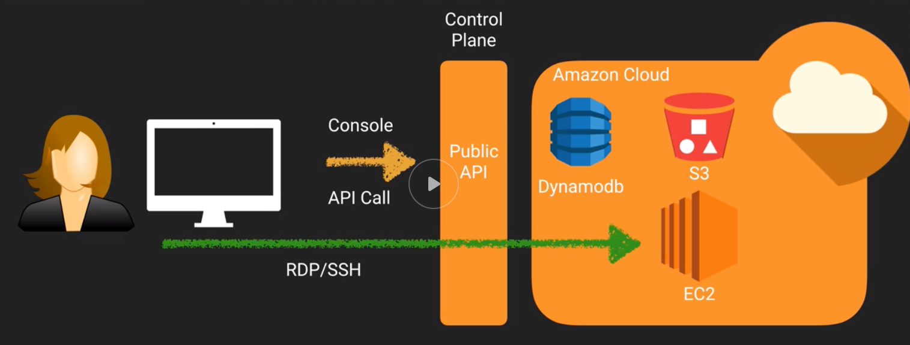
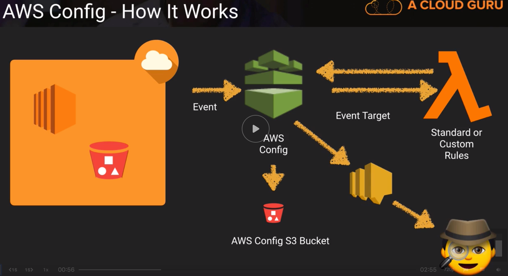

# Logging and Monitoring

## CloudTrail Turning it On
- 
- CloudTrail logs AWS API calls (for supported services)
- CloudTrail does not log RDP/SSH calls
- CloudTrail Enables:
    - After-the-fact incident investigation (forensics)
    - Near-realtime intrusion detection
    - Industry & regulatory compliance
- What is logged by Cloudtrail:
    - Metadata around API calls
        - The identity of the API caller
        - The time of the API call
        - The source IP address of the API caller
    - The request parameters
    - The response elements returned by the service
- CloudTrail event logs:
    - Sent to an S3 bucket
    - You manage the retention in S3 (ex:  lifecycle management policies)
    - Delivered every 5 minutes to S3 with up to 15 minutes delay (it can take up to 15 minutes for CloudTrail to log an item)
    - Notifications available (ex:  somebody creates an S3 bucket, starts an EC2 instance, etc.)
        - You can configure a CloudTrail trail to use an Amazon SNS topic. CloudTrail will send an SNS notification when log files are written to the Amazon S3 bucket. 
    - Can be aggregated across regions
    - Can be aggregated across accounts
        - Best security practice:  Have a separate AWS account for cloudtrail log aggregation
    - Enabled by default for last 90 days
        - Default is stored in S3 bucket that is not visible
    - To determine whether a log file was modified, deleted, or unchanged after CloudTrail delivered it, you can use CloudTrail log file integrity validation. 
        - When you enable log file integrity validation, CloudTrail creates a hash for every log file that it delivers. Every hour, CloudTrail also creates and delivers a file that references the log files for the last hour and contains a hash of each. This file is called a digest file. CloudTrail signs each digest file using the private key of a public and private key pair. After delivery, you can use the public key to validate the digest file. CloudTrail uses different key pairs for each AWS region.
        - The digest files are delivered to the same Amazon S3 bucket associated with your trail as your CloudTrail log files.

## CloudTrail - Protecting your logs
- Question:  If Cloudtrail logs contain metadata and not application data, why should you consider securing them?
    - They can contain Personal Identifiable data such as usernames and even team memership.  They can also contain detailed configuration information such as DynamoDB table and key names. 
- Question:  How do we stop unauthorized access to log files?
    - Use IAM policies and S3 bucket policies to restrict access to the S3 bucket containing the log files
    - Use SSE-S3 (SSE:  "Server-Side Encrypt") or SSE-KMS to encrypt log data
- Question:  How do we restrict log access to only employees with a security responsibility?
    - Place employees who have a security role, into an IAM group with attached policies that enable access to the logs.
- Question:  How can we be notified that a log file has been created, and then validate that its not been modified?
    - Configure SNS notifications and log file validation on the 'Trail'.  Develop a solution that when triggered by SNS will validate the logs using the provided digest file.  Also:  Lambda function that compares digest files with actual logs.  The hash still cannot be tampered because the private key is managed directly by AWS.
- Question:  How can we prevent logs from being deleted?
    - Restrict delete access with IAM and bucket policies.  Configure S3 MFA Delete.  Validate that logs have not been deleted using log file validation.  Note:  Delete Actions in S3 buckets can be blocked for everyone, including the root user.
- Question:  How can we ensure that logs are retained for X years in accordance with our compliance standards?
    - By default logs will be kept indefinitely.  Use S3 Object Lifecycle Management to remove the files after the required period of time, or move the files to AWS Glacier for more cost effective long term storage.

## Cloudwatch 101
- Amazon Cloudwatch is a monitoring service for AWS cloud resources and the applications you run on AWS
- Enables:
    - Resource Utilization, operational performance monitoring
    - Log aggregation and basic analysis
- Provides:
    - Real-time monitoring within AWS for resources and applications (disk IO, network throughput, etc.)
    - Hooks to event triggers
- 3 key components:
    1. Cloudwatch
        - Real time
        - Metrics
        - Alarms
            - Define thresholds that trigger alarm and actions on what to do when alarm is triggered
        - Notifications
        - Custom metrics
            - Ex:  Create custom metric around RAM utilization using python, install script in EC2 instance
            - https://aws.amazon.com/premiumsupport/knowledge-center/cloudwatch-custom-metrics/
    2. Cloudwatch Logs
        - Pushed from some AWS services
        - Pushed from your applications/systems
        - Stored indefinitely (not directly accessible from S3)
        - Cloudwatch Agent has to be installed
    3. Cloudwatch Events
        - Allows to create event-driven security to respond to things automatically
        - Near real-time stream of system events
        - Events
            - AWS Resources state change
            - AWS CloudTrail (API Calls)
            - Custom events (code)
        - Rules
            - Match incoming events and route them to one or more targets
        - Targets
            - AWS Lambda functions, SNS topics, SQS queues, kinesis streams...
- Question:  How do we control who can access Cloudwatch and what they can do?
    - Use IAM policies to restrict access to cloudwatch and the actions they can perform
- Question:  How are unauthorized users prevented from accessing Cloudwatch?
    - Users need to be authenticated with AWS and have the appropriate permissions set via IAM policies to gain access

## AWS Config 101
- AWS Config is a fully managed service that provides you with an AWS resource inventory, and configuration change notifications to enable security and governance
- It is recording what is going on inside our AWS environment all the time
- You can go back in time and see for example what were the security group rules 2 weeks ago
- Allows us to audit and see the state of our AWS environment at any given time and any given region
- Very similar to Cloudtrail in some aspects
- Enables:
    - Compliance Auditing
    - Security Analysis
    - Resource Tracking
- Provides:
    - Configuration Snapshots and logs config changes of AWS resources
    - Automated compliance checking
- Key Components:
    - Config Dashboard
    - Config Rules
        - Managed
        - Custom
    - Resources
    - Settings
- Has to be turned on for each region separately
- Terminology
    - Configuration Items
        - Point-in-time attributes of resource
    - Configuration Snapshots 
        - Collection of Config Items
    - Configuration Stream
        - Stream of changed Config Items
    - Configuration History
        - Collection of config items for a resource over time
    - Configuration Recorder
        - The configuration of Config that records and stores config items
        - Setup:
            - Logs config for account in region
            - Stores in S3
            - Notifies SNS
- Recommendation:
    - Enable across all regions as well as Cloudtrail
    - Whenever there's a non-compliance it provides you a link to the cloudtrail event that originated the non-compliance
    - Restrict access to specific users to Config (avoid malicious users from disabling certain compliance rules)
    - Use CloudTrail to monitor access to Config (example of someone stopping the config recorder)
- 
- Compliance checks:
    - Trigger
        - Periodic (runs on frequency you choose)
        - Configuration changes (Runs whenever there are changes to your specified resources)
    - Managed Rules (out of the box provided by AWS)
- Permissions required:
    - IAM role with the following (The AWS Console has option to create these for you):
        - Read only permissions to the recorded resources
        - Write access to S3 logging bucket
        - Publish access to SNS

## Hands-on:  How to setup an alert if the root user logs in
- Steps:
    1. Create a trail in cloudtrail
    2. From within cloudtrail Turn on cloudtrail+cloudwatch logs integration (will set up a new log group in cloudwatch and create a new role to allow cloudtrail to create log streams and deliver cloudtrail events to the cloudwatch Logs log group)
    3. From within Cloudwatch select the new log group a "Create a new Metric Filter" with the following Filter pattern:
    ```{ $.userIdentity.type = "Root" && $.userIdentity.invokedBy NOT EXISTS && $.eventType != "AwsServiceEvent" }```
    4. Create an alarm when filter is triggered indicating alarm threshold and actions desired.

## AWS Cloud HSM
- You pay an hourly fee for each active HSM in your account
- It is not a heavy topic in the exam
- The AWS CloudHSM service helps you meet corporate, contractual and regulatory compliance requirements for data security by using dedicated Hardware Security Moducle (HSM) appliances within the AWS cloud. (dedicated hardware instead of multi-tenant)
- Enables:
    - Control of data
    - Evidence of control
    - Meet tough compliance controls
- Provides:
    - Secure key storage
    - Cryptographic operations
    - Tamper-resistant hardware security module
- Compliant with FIPS 140-2
- You control the keys (AWS does not have access to them)
- AWS can only administer the appliance, not the HSM partitions where the keys are stored
- You can have both symmetric and assymetric keys (KMS only supports symmetric)
- Tampering:
    - If the CloudHSM detects physical tampering the keys will be destroyed
    - If the CloudHSM detects 5 unsuccessful attempts to access an HSM partition as Crypto Officer (CO) the HSM appliance erases itself
    - If the CloudHSM detects 5 unsuccessful attempts to access an HSM with Crypto User (CU) credentials, the user will be locked and must be unlocked by a CO
    - Only a CryptoOfficer can create new users
- Monitoring:
    - Use CloudTrail to log API calls including those made to CloudHSM

## AWS Inspector vs AWS Trusted Advisor
- AWS Trusted Advisor is an application that draws upon best practices learned from AWS’ aggregated operational history of serving hundreds of thousands of AWS customers. Trusted Advisor inspects your AWS environment and makes recommendations for saving money, improving system performance, or closing security gaps.
    - The recommendations are prepackaged and not configurable by users
    - Users can only specific items (ex:  specific Security Group) that they would like to exclude from recommendations
    - To unlock all features a support plan upgrade is required
- AWS Inspector is a purely security, identity and compliance tool
- Trusted Advisor has some security but also has other stuff
- Trusted Advisor can monitor the following:
    - Cost Optimization
    - Performance
    - Security
    - Fault Tolerance
    - Service Limits
- Amazon Inspector assessments check for security exposures and vulnerabilities in your EC2 instances.
- Full Trusted Advisor is only available for business and enterprise companies.
- Rules packages for AWS Inspector:
    - Common Vulnerabilities and Exposures (CVE)
    - CIS (Center of Internet Security) Operating System Security Configuration Benchmarks
    - Security Best Practices
    - Network Reachability
- What does Inspector do:
    - Monitor the network, file system and process activity within the specified target
    - Compare what it sees to security rules
    - Report on security issues observed within a target during run
    - Report findings and advise remediation

## Logging with AWS
- AWS Services that log:
    - AWS CloudTrail
        - Log all AWS API calls
    - AWS Config
        - Log configuration of AWS environment, point in time logging tool
    - VPC Flow Logs
        - Monitor all network traffic of your ENIs within a VPC
    - AWS Cloudwatch Logs


## TODOS 
- Read FAQs on Cloudfront and CloudTrail (They make around 60% of the exam!)
    - https://aws.amazon.com/cloudwatch/faqs/
    - https://aws.amazon.com/cloudtrail/faqs/
- Read FAQs on ConfigL
    - https://aws.amazon.com/config/faq/

## Resources
- https://www.youtube.com/watch?v=QbA0859qNI8


