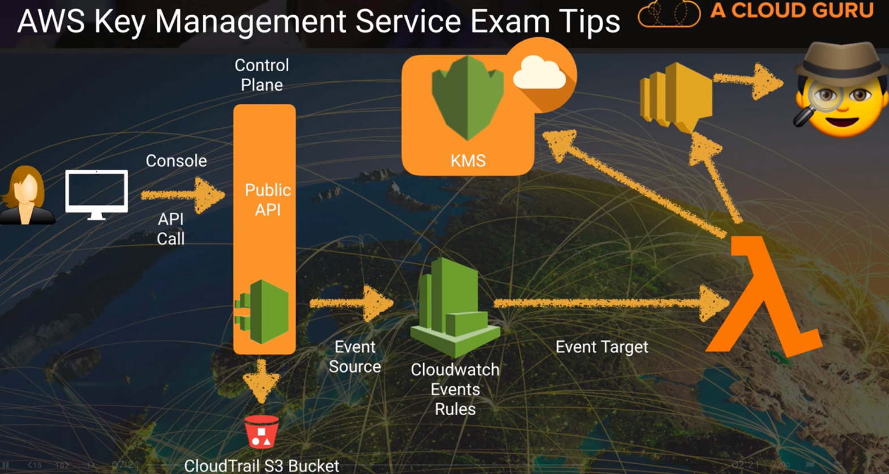
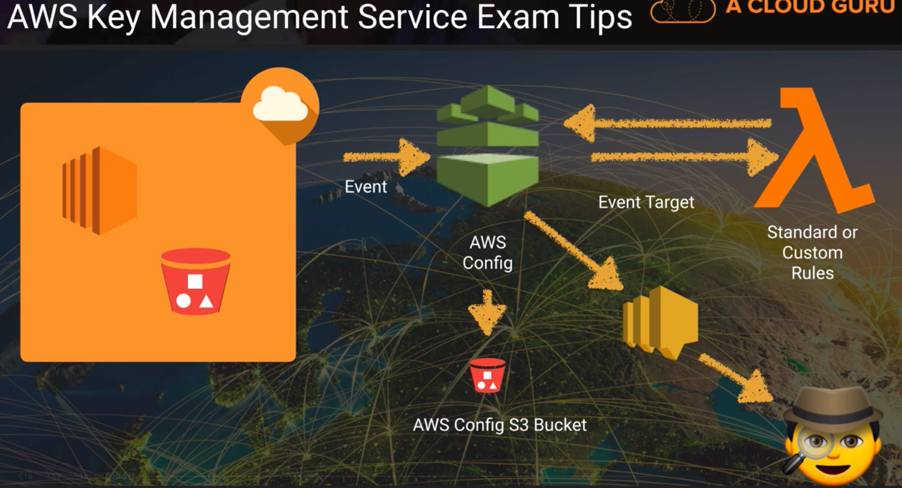
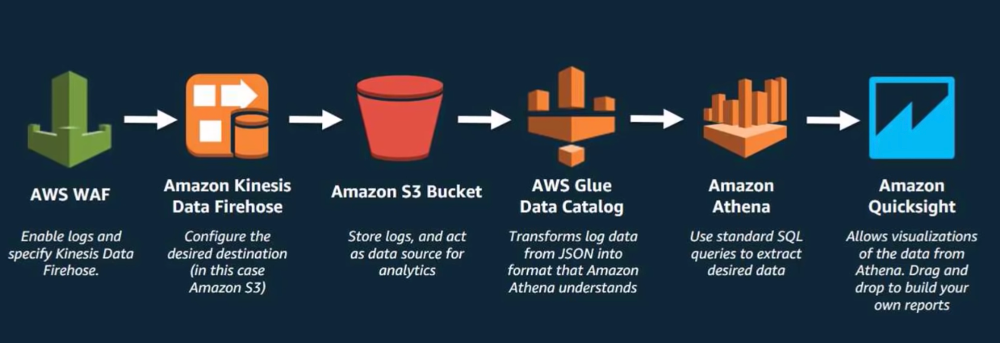
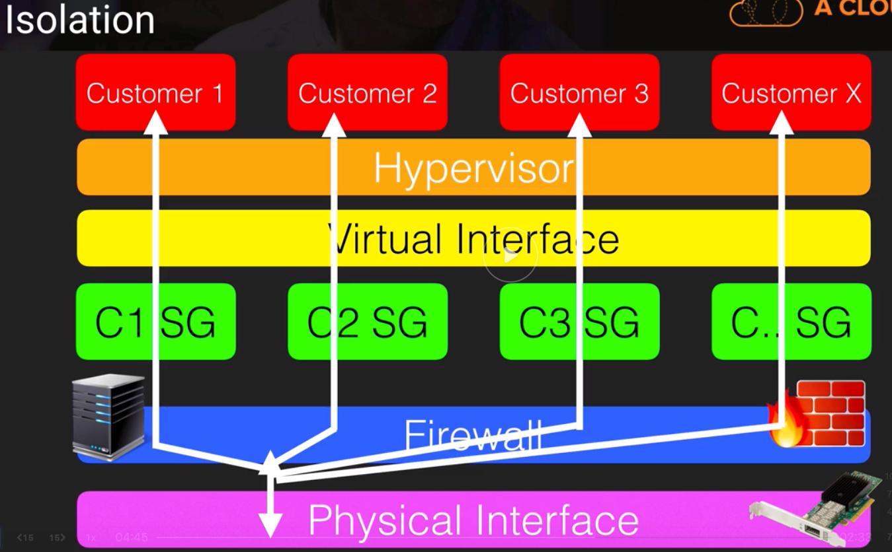

# Infrastructure Security

## KMS
- AWS Key Management Service is a managed service that makes it easy for you to create and control the encryption keys used to encrypt your data and uses Hardware Security Modules (HSMs) to protect the security of your keys
- KMS is integrated with other services including:  EBS, S3, Amazon Redshift, Amazon Elastic Transcoder, Amazon Workmail, RDS, etc.
- CMK:  Customer Master Key
    - 2 types:
        - AWS CMK
        - Customer-Managed CMK
    - Consists of the following attributes:
        - alias
        - creation date
        - description
        - key state (enabled, disabled, scheduled for deletion, waiting for import of key material)
        - key material (either customer provided or AWS provided)
    - Can NEVER be exported
- One AWS-managed CMK is available for each service that is integrated with AWS KMS
- KMS is a regional service so the keys can only be used within resources available in the same region as the key
- AdminAccess Users will be able to access all resources encrypted with any specific key
    - All other users will require kms decrypt permissions with that specific key to access the resource
- You can add permissions to other accounts to use your CMKs
- To setup a Customer managed Master Key:
    - Create Alias and Description
    - Choose material origin ...
        - KMS
        - External
        - Custom Key Store (HSM)
    - Define Key Administrative Permissions
        - IAM users/roles that can administer (but not use) the key through the KMS API
    - Define Key Usage Permissions
        - IAM users/roles that can use the key to encrypt and decrypt data
- You can import a symmetric 256-bit key from your key management infrastructure into KMS and use it like any other customer master key.
- https://docs.aws.amazon.com/kms/latest/developerguide/importing-keys-encrypt-key-material.html
- https://aws.amazon.com/premiumsupport/knowledge-center/invalidciphertext-kms/
- SHA:  Secure Hash Algorithm
    - Is a cryptographic hashing algorithm used to determine the integrity of a particular piece of data
    - SHA2 is the successor of SHA1
        - Variants of SHA2 (These variations differ in terms of output size, internal state size, block size, message size, and rounds):
            - SHA-224
            - SHA-256
            - SHA-384
            - SHA-512
            - SHA-512/224
            - SHA-512/256
    - The SHA0 algorithm was unable to protect against these types of attacks which is why it is no longer used. Additionally, SHA1 has also been deemed quite vulnerable to collision attacks which is why all browsers will be removing support for certificates signed with SHA1 by January 2017.
- You cannot enable automatic key rotation for a CMK with imported key material
- You can manually rotate a CMK with imported key material
    - To do so, create a new CMK and then import the new key material into that CMK
- It takes 7 days to delete CMKs
- Deleting key material for a customer generated key makes all data encrypted under the customer master key (CMK) unrecoverable unless you later import the same key material into the CMK. The CMK is not affected by this operation
- Why import your own key material?
    - Prove that randomness meets your requirements (compliance)
    - Extend your existing processed to AWS
    - To be able to delete key material wihtout a 7-30 days wait.  Then be able to import them again
    - To be resilient to AWS failure by storing keys outside AWS.
- How to import your own key material
    1. Create a CMK with now key material
    2. Download a public key (wrapping key) and import token
    3. Use openssl to generate encrypted key material
    4. Imported encrypted key material along with import token
- Considerations for imported key material:
    - Availability and durability is different
    - Secure key generation is up to you
    - No automatic rotation
    - Ciphertexts are not portable between CMKs
- Setups to monitor KMS:
    - 
    - 

## KMS Policies and Grants
- https://docs.aws.amazon.com/kms/latest/developerguide/policy-conditions.html

## KMS Key Rotation Options
- Extensive re-use of encryption keys is not recommended
- It is best practice to rotate keys on a regular basis
- The frequency of key rotation is dependent upcon local laws, regulations, and corporate policies
- The method of rotation depends on the type of key you are using:
    - AWS managed
        - Rotates automatically every 3 years
        - When the CMK is due for rotation, a new backing key is created and marked as the active key for all new requests
        - The old backing key remains available to decrypt any existing ciphertext files that were encrypted using the old key
        - AWS handles everything for you
        - You cannot manage rotation yourself
        - AWS managed keys cannot be deleted
    - Customer managed
        - Once a year automatically (key rotation is disabled by default)
        - KMS generates new cruptographic material for the CMK every year
        - The CMK's old backing key is still available so it can be used to decrypt data that it previously encrypted
        - Can be rotated manually by just creating a new CMK and change your applications or aliases to use the new CMK
        - Keys can be deleted but be careful, once they're gone you can no longer decrypt the data that was encrypted with the deleted key
            - Better to disable instead of deleting it
    - Customer managed with imported key material
        - Automatic key rotation is NOT available
        - The only option is to rotate the keys manually
            - Create a new CMK, then change your applications or aliases to use the new CMK
        - Keys can be deleted but be careful!

## Using your own key pairs
- Commands to generate private and public keys on macos:
```bash
$ openssl genpkey -algorithm RSA -out private_key.pem -pkeyopt rsa_keygen_bits:2048
$ openssl rsa -pubout -in private_key.pem  -out public_key.pem
```
- Remember that Public and Private keys are analogous to padlock + key, many people can have the same padlock that I give to them but I should NEVER share the key to open them (private key)
- To ssh to specific EC2 instance with public IP:  `18.221.84.193` using the private key that I associate it with my public key that I provided for this EC2 instance:
```bash
$ ssh ec2-user@18.221.84.193 -i private_key.pem
```
- You cannot import directly a public key into KMS and instead you have to import a key material origin
- For FULL control of your keys in KMS you'll have to use Cloud HSM

## Using KMS with EBS
- We can use KMS to encrypt EBS Volumes
- Once you encrypt a volume with a KMS key it will always remain encrypted with that key and this cannot be changed
- To change encryption for an encrypted or un-encrypted volume:
    1. Create snapshot
    2. Create an AMI from snapshot
    3. Copy AMI and encrypt it (select your key)
    4. Launch new EC2 instance from this AMI
- You can copy AMIs between regions and change key during copying but KMS key has to exist in destination region

## Envelope Encryption
- You can use a CMK to encrypt and decrypt up to 4 KB (4096 bytes) of data. Typically, you use CMKs to generate, encrypt, and decrypt the data keys that you use outside of AWS KMS to encrypt your data.
- Here are the steps to implement Envelope Encryption:
    1.  Create a new CMK, or re-use an existing CMK. This can be done the AWS Console, or with CLI using create-key.
    2.  Use generate-data-key to get a data key.
    3.  This returns the plain text data key, and also an encrypted (with the specified CMK) version of the data key. The encrypted version is referred to as a CipherTextBlob. Store the returned CipherTextBlob (we will need it later). The CipherTextBlob has metadata which tells KMS which CMK was used to generate it. Store this CipherTextBlob.
    4.  Use the plain-text data key to encrypt any amount of data.
    5.  Throw away the plain-text data key, but be sure to store the CipherTextBlob along side the encrypted data.
    6.  To decrypt, use the Decrypt API, sending it the CipherTextBlob from step (3).
    7.  The above step will return the plain text data key (the same one we threw away). Use this key to decrypt the data.
    8.  Throw away the plain-text data key.
    9.  To encrypt more data, repeat steps 6, 7, 8 except use the plain text key to encrypt instead of decrypt.

## EC2 & Key Pairs
- You can view the public key by going to `/home/ec2-user/.ssh/authorized_keys`
- You can also view the public key by using the EC2 instance metadata:  `curl http://169.254.169.254/latest/meta-data/public-keys/0/openssh-key`
- You can have multiple public keys attached to an EC2 instance
- You can have multiple users who have different public/private key pairs
- You can add roles to existing EC2 isntances without terminating them
- Deleting a key pair in the console will not delete it from the instance or the instance's metadata
- If you loose a KP (public or private), simply take a snapshot of the EC2 instance and then deploy it as a new instance 
    - This will append a new public key to the  `/home/ec2-use/.ssh/authorized_keys`
    - You can then go in to that file and delete the outdated public keys
- Because you cannot export keys from KMS and because Amazon is involved in the generation of keys, you cannot use KMS with SSH for EC2
- With CloudHSM you can export keys

## AWS Martetplace Security Products
- You can purchase preconfigured AMIs from the AWS marketplace
- Scenario usage example:  Get an IPS AMI that protects by learning attack style, blocking anyone trying to RDP into the machine for example and learning their patterns
- Different revenue models:  Free, Hourly, Monthly, BYO (Bring your own license)
- CIS:  Center for Internet Security (whitepapers on steps taken to harden different OS)
    - https://learn.cisecurity.org/benchmarks

## AWS WAF & AWS Shield
- AWS WAF is a web application firewall that lets you monitor the HTTP and HTTPs requests that are forwarded to Amazon Cloudfront or an ALB.  AWS WAF also lets you control access to your content
- WAF ONLY integrates with ALBs, Cloudfront and Amazon API Gateway, it does not integrate with EC2 directly, nor route53 or any other services
- You can configure conditions such as what IP addresses are allowed to make this request or what query string parameters need to be passed for the request to be allowed and then the application load balancer or cloudfront will either allow this content to be received or to give an HTTP 403 status code (Forbidden access)
- At its most basic level, AWS WAF allows 3 different behaviours:
    1. Allow all requests except the ones that you specify
    2. Block all requests except the ones that you specify
    3. Count the requests that match the properties that you specify
        - monitoring and "make up my mind later"
- You can define conditions by using characteristics of web requests such as follows:
    - IP addresses that requests originate from
    - Country that requests originate from
    - Values in request headers
    - Strings that appear in requests, either specific strings or string that match regex patterns
    - Length of requests
    - Presence of SQL code that is likely to be malicious (SQL injection)
    - Presence of a script that is likely to be malicious (cross-site scripting)
- WAF operates at layer 7 (Application Layer), Shield is a DDoS mitigation
- Sample CloudFormation template for WAF configuration:  `https://s3.amazonaws.com/cloudformation-examples/community/common-attacks.json`
- ALB WAFs are regional where as cloudfront WAFs are global
- WAF Samples from AWS:  `https://aws.amazon.com/waf/preconfiguredrules/`
- Application Load Balancers integrate with WAF at a regional level, cloudfront at a Global level
- You need to associate your rules to AWS resources in order to be able to make it work
- You can use AWS WAF to protect websites not hosted in AWS via Cloudfront.  (Cloudfront supports custom origins outside of AWS)
- IPs can be blocked at /8, /16, /24, and /32 level
- IPv4 and IPv6 are supported
- AWS Shield
    - Turned on by default
    - $3000/month if you want the advanced option
    - Advanced gives you an incident response team and in-depth reporting
    - You won't pay if you are a victim of an attack
- WAF Visibility and Analytics
    - Cloudwatch Metrics
        - Metrics on every rule (allowed, blocked, counted, passed)
    - Sampled Web Metrics
        - Automatically Available for every rule
        - Includes details of every request, along with all rules that match the request
    - Full Logs (New feature)
        - Provide detailed logs for every request
        - Optionally enabled for your WebACL
        - Streaming logs available through Amazon Kinesis Data Firehose
            - Kinesis Data Firehose supports multiple destinations:
                - S3
                - Redshift
                - Elastic Search
                - Splunk
        - Logs every request, contains all request headers, along with RuleIds that matched
        - You can exclude certain fields from logs
    - 

## EC2 dedicated instances vs dedicated hosts
- Dedicated Instances:
    - You pay for the instances, but they get placed on whatever dedicated hardware Amazon decides.
    - Charged by the instance
- Dedicated hosts:
    - You pay for the entire physical server and can, in effect, run instances on it as you please.
    - Charged by the host
- Both dedicated instances and dedicated hosts have dedicated hardware
- If you have specific regulatory requirements or licensing conditions, choose dedicated hosts.
- Dedicated instances may share the same hardware with other AWS instances from the same account that are not dedicated
- Dedicated hosts give you much better visibility into things like sockets, cores and host id.

## AWS Hypervisors
- A hypervisor or virtual machine monitor (VMM) is computer software, firmware or hardware that creates and runs virtual machines.  A computer on which a hypervisor runs one or more virtual machines is called a host machine, and each virtual machine is called a guest machine.
- EC2 currently runs most instances on Xen hypervisors.  Xen hypervisors can have guest operating systems running as Paravirtualization (PV) or using Hardware Virtual Machine (HVM)
- HVM guests are fully virtualized.  The VMs on top of the hypervisors are not aware that they are sharing processing time with other VMs.
- PV is a lighter form of virtualization and it used to be quicker
- Performance gap between HVM and PV has now closed and AWS recommends using HVM over PV where possible.  It is also worth noting that Windows EC2 instances can only be HVM where as linux can be both PV and HVM
- Eventually all new instance types will use the Nitro Hypervisor, but in the near term, some new instance types will use Xen depending on the requirements of the platform
- Paravirtualized guests rely on the hypervisor to provide support for operations that normally require privileged access, the guest OS has no elevated access to the CPU
    - The CPU provides 4 separate privilege modes:
        1. Ring 0
            - Most privileged
            - where the host OS executes (Xen hypervisor runs here)
        2. Ring 1
            - Where guest OS runs
            - Least privileged
        3. Ring 3
            - WHere applications run
- Memory scrubbing:
    - EBS automatically resets every block of storage used by the customer, so that one customer's data is never unintentionally exposed to another
    - Memory allocated to guests is also scrubbed (set to zero) by the hypervisor when it is unallocated to a guest.
    - The memory is not returned to the pool of free memory available for new allocations until the memory scrubbing is complete
- 
- Hypervisor access:
    - Only AWS administrators have access to hypervisors
    - Administrators with a business need to access the management plane are required to use MFA to gain access to purpose-built administration hosts
    - All access is logged and audited
    - AWS does not have any access rights to your instances or the guest OS

## KMS Grants
- They are an alternative access control mechanism to a key policy
- Programatically delegate the use of KMS CMKs to other AWS principals (ex:  a user in either your account or another account)
- Temporary, granular permissions (encrypt, decrypt, re-encrypt, describekey, etc)
- Grant allow access, not deny
- You should prefer using key policies for relatively static permissions & for explicit deny
- Example:  If I give my house keys temporarily for someone to take care of it during a short absence
- They are created programatically using the AWS CLI
- Main commands:
    - create-grant
    - list-grants
    - revoke-grant
- When you create a grant a grant token is generated and can be passed as an argument to KMS API

## Key Policy Conditions ViaService
- Policy Conditions can be used to specify a condition within a key policy or IAM policy
- The Condition element (or Condition block) lets you specify conditions for when a policy is in effect. The policy statement is effective only when the conditions are true. For example, you might want a policy statement to take effect only after a specific date. Or, you might want a policy statement to control access only when a specific value appears in an API request. Further information:
- KMS provides a set of predefined `Condition Keys`:
    - kms:BypassPolicyLockoutSafetyCheck
    - kms:CallerAccount
    - kms:EncryptionContext:
    - kms:EncryptionContextKeys
    - kms:ExpirationModel
    - kms:GrantConstraintType
    - kms:GrantIsForAWSResource
    - kms:GrantOperations
    - kms:GranteePrincipal
    - kms:KeyOrigin
    - kms:ReEncryptOnSameKey
    - kms:RetiringPrincipal
    - kms:ValidTo
    - kms:ViaService
        - Used to allow or deny access to your CMK according to which service originated the request (ex:  S3, RDS, EBS, Lambda, etc.)
    - kms:WrappingAlgorithm
    - kms:WrappingKeySpec

## Cross Account Access
- Access to KMS CMKs is controlled using:
    - The Key Policy
    - IAM Policies
- If you want to enable another external account to encrypt or decrypt using your CMK, you need to enable cross account access as follows:
    1. Enable access to the other external account(s) in the key policy for the account which owns the CMK
    2. Enable access to KMS in the IAM Policy for the external account by defining the allowed actions and the CMK ARN
    - __Note:  Both steps are necessary, otherwise it will not work.__

## TODOS 
- Read FAQs on KMS
    - https://aws.amazon.com/kms/faqs/
- Read FAQs on WAF
    - https://aws.amazon.com/waf/faqs/
