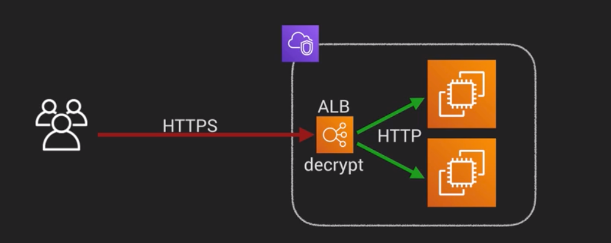

# Data Protection with VPCs

- VPCs consist of IGWs (or Virtual Private Gateways), route tables, network access control lists, subnets, and security groups
- 1 subnet = 1 AZ
- Security Groups are Stateful, NACLs are stateless 
- No transitive peering
- Steps to Create a VPC:
    1. Create the VPC
    2. Create Subnets for the VPC
        - Tip:  Include CIDR Address range and region in name
        - First 4 and last IP addresses in each subnet are not available for use
    3. Create IGW for public subnets
        - You can only have 1 IGW per VPC
    4. Setup route table for public out traffic
        - Tip:  Don't use main route table since it gets associated by default to all new subnets
        - add a route to use IGW for all outgoing traffic:  0.0.0.0/0
    5.  Test access to this point by launching an instance in both the public and private subnets
- When you create a new VPC the following get created:
    - Default Route Table
    - Default NACL
    - Default Security Group
- Security Groups don't span VPCs, they only exist in one VPC
- 

## NAT instances
- When creating a NAT instance, disable source/destination check on the instance
- NAT instances must be in a public subnet
- There must be a route out of the private subnet to the NAT instance, in order for this to work.
- The amount of traffic that NAT instances can support depends on the instance size.  If you are bottlenecking, increase the instance size
- You can crete high availability using Autoscaling Groups, multiple subnets in different AZs, and a script to automate failover
- Are always behind a Security Group

## NAT Gateways
- Preferred by the enterprise
- Scale automatically up to 10GBps
- No need to patch
- Not associated with security groups
- Automatically assigned a public IP address
- Remember to update your route tables
- No need to disable Source/Destination checks
- More secure than a NAT instance

## Network ACLs
- Your VPC automatically comes with a default network ACL, and by default it allows all outbound and inbound traffic
- You can create custom NACLs.  By default, each custom NACL denies all inbound and outbound traffic until you add rules
- Each subnet in your VPC must be associated with a NACL.  If you don't explicitly associate a subnet with a NACL, the subnet is automatically associated with the default NACL
- You can associate a NACL with multiple subnets, however, a subnet can be associated with only one network ACL at a time.  When you associate a network ACL with a subnet, the previous assoctiation is removed.
- Network ACLs contain a numbered list of rules that is evaluated in order, starting with the lowest numbered rule
- Network ACLs have separate inbound and outbound rules, and each rule can either allow or deny traffic
- Network ACLs are stateless; responses to allowed inbound traffic are subject to the rule for outbound traffic (and vice versa)
- Block IP addresses using NACLs, you can't do it with Security Groups

## ALBs
0 You will need at least 2 public subnets in order to deploy an ALB

## Elastic Load Balancers and TLS/SSL Termination
- When using an ELB, you have the choice to either terminate TLS/SSL connections either on the Load Balancer or on your EC2 instance
- When we terminate TLS/SSL on the Load Balancer, this means the ELB decrypts the encryped request and sends it on to your application servers as plain text over the local private network inside your VPC
- For best use of your EC2 compute resources, terminate TLS/SSL on the Elastic Load Balancer
- If there is a requirement to ensure traffic is encrypted all the way to the EC2 instance, terminate TLS/SSL on the EC2 instance
- The ALB only supports TLS/SSL termination on the Load Balancer and only supports https
- If you need to terminate traffic at the EC2 instance, then you'll need to use the TCP protocol with a Network or Classic Load Balancer
- Application Load Balancer is http/https only, for other protocols like TCP, use network or Classic Load Balancer
- 

## VPC Flow Logs
- VPC Flow Logs is a feature that enables you to capture information about the IP traffic going to and from network interfaces (ENIs) to your VPC.
- Flow log data is stored in Amazon Cloudwatch Logs
- After you've created a flow log, you can view and retrieve its data in Amazon Cloudwatch Logs
- Flow Logs can be created at 3 levels:
    1. VPC
    2. Subnet
    3. Network Interface Level
- Flow Logs can be streamed to AWS Lambda or to Amazon Elasticsearch service
- You cannot enable flow logs for VPCs that are peered with your VPC unless the peer VPC is in your account
- You cannot tag a flow log
- After you've created a flow log, you cannot cahnge its configuration; for example, you can't associated a different IAM role with the flow log
- The following IP traffic is not monitored:
    - Traffic generated by instances when they contact the Amazon DNS Server.  If you use your own DNS server then all traffic to that DNS server is logged
    - Traffic generated by a Windows instance for Amazon Windows license activation
    - Traffic to/from:  169.254.169.254 for instance metadata
    - DHCP traffic
    - Traffic to the reserved IP addresses for the default VPC router

- NATs vs Bastion Servers
    - NAT Instances are always behind a security group whereas NAT Gateways are security-group independent
    - One Bastion per public subnet with ASG for HA
    - A NAT instance is used to provide internet traffic to EC2 instances in private subnets.
    - A bastion is used to securely administer EC2 instances (using SSH or RDP) in private subnets.

- VPC Endpoints
    - A VPC endpoint enables you to create a private connection between your VPC and another AWS service without requiring access over the Internet, through a NAT device, a VPN connection, or AWS Direct Connect.
    - An interface endpoint is powered by PrivateLink, and uses an elastic network interface (ENI) as an entry point for traffic destined to the service.
    - A gateway endpoint serves as a target for a route in your route table for traffic destined for the service.
    - You need to add the VPC endpoint entry to the route table(s)

## Amazon DNS and Custom VPCs
- When you create a VPC, they automatically create an Amazon DNS Server
- Used for DNS hostname resolution for instances in your VPC
- The Amazon DNS server uses one of the reserved IP addresses, eg. 10.0.0.2
- If you want to disable it and use your own DNS server instead, you can easily do it in the settings of your VPC, go to DNS Resolution and uncheck the box
- Create a new DHCP options set to define your own DNS server and associate that to your VPC

## TODOS 
- Read DDOS whitepaper
    - https://d0.awsstatic.com/whitepapers/Security/DDoS_White_Paper.pdf
