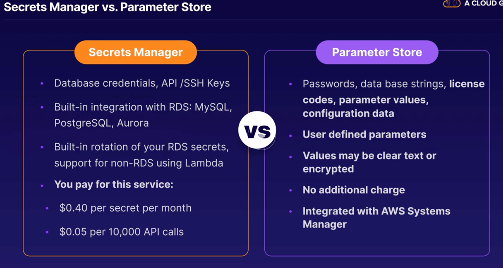
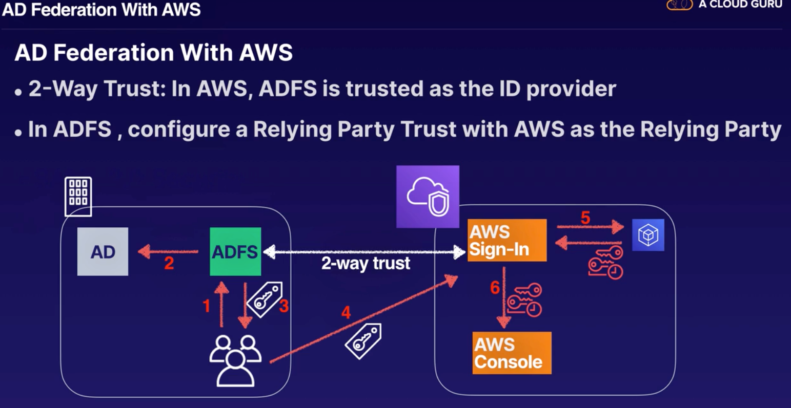

# Updates for 2019

## Introduction to Macie
- PII:  Personal Identifiable Information
    - Personal data used to establish an individual's identity
    - Ex:  Home address, email address, SSN, passport number, driver's license number, DOB, phone number, bank account...
- Amazon Macie is a security service that uses machine learning to automatically discover, classify, and protect sensitive data in AWS. Amazon Macie recognizes sensitive data such as personally identifiable information (PII) or intellectual property, and provides you with dashboards and alerts that give visibility into how this data is being accessed or moved. 
- Presently it is available to protect data stored in Amazon S3, with support for additional AWS data stores coming later this year.
- Can also analyze data in cloudtrail logs for suspicious API activity
- Includes dashbaords, reports and alerting
- Great for PCI-DSS compliance and preventing ID Theft
- Macie classifies your data by 4 different domains:
    1. By Content type
        - json, pdf, excel, tar, xml, etc.
    2. By theme
        - AMex, MasterCard credit card keywords, banking or financial keywords
    3. By file extension
    4. By regular expression
        - aws secret keys, SWIFT codes, CISCO router config, etc.
- 

## Introduction to GuardDuty
- Threat detection service which uses ML to continuosly monitor for malicious behaviour
- Example of unusual behavior:
    - Unusual API calls, calls from a known malicious IP
    - Attempts to disable cloudtrail logging
    - Unauthorized deployments
    - Compromised instances
    - Reconnaissance by would be attackers
    - Port scanning, failed loging
- Features:
    - Alerts appear in the Guardduty console & cloudwatch events
    - Receives feeds from third parties like proofpoint, crowdstrike and AWS security (know malicious domains/IP addresses)
    - Monitors cloudtrail logs, VPC flow logs, DNS logs
        - DNS logs are activated from route53
    - Centralize threat detection across multiple AWS accounts
    - Automated response using Cloudwatch events and lambda (lambda can isolate compromised instance by updating security groups of instance, capture snapshot for forensics analysis and terminate it)
    - Machine learning and anomaly detection
- Setting up:
    - 7-14 days to set a baseline to understand the normal behavior on your account

## Secrets Manager
- Secret which securely stores, encrypts, and rotates your DB credentials and other secrets
- Features:
    - Encryption in-transit and at rest using KMS
    - Automatically rotates credentials
    - Apply fine grained access control using IAM policies
    - Your application makes an API call to Secrets Manager to retrieve the secret programatically
    - Reduces the risk of credentials being compromised
- What secrets can be stored in Secrets Manager:
    - RDS Credentials
    - Credentials for non-RDS databases
    - Any other type of secret provided you can store it as a key value pair (SSH keys, API keys)
- 
- IMPORTANT:  If you enable rotation, Secrets Manager immediately rotates the secret once to test the configuration.
    - Ensure that all of your applications that use these credentials are updated to retrieve the credentials from this secret using Secrets Manager.

## SES:  Simple Email Service
- Is a cloud-based email service, which supports both sending and receiving email
- Can be used to send marketing emails, transaction emails and email notifications from your applications
- It uses a standard SMTP interface and can also be accessed using an API to allow you to integrate with existing applications
- All connections to the SMTP endpoint must be encrypted in transit using TLS
- Configuring Access to SES for EC2 instances:
    - Configure the SG associated with your EC2 instances to allow connections to the SES SMTP endpoint
    - Port 25 is the default but EC2 throttles email traffic over port 25
    - To avoid timeouts use either port 587 or 2587

## Network Packet Inspection
- It inspects packet headers and data content of the packet
- Also known as Deep Packet Inspection (DPI)
- Filters non-compliant protocols, viruses, spam, intrusions
- Takes action by blocking, re-routing or logging
- Equivalent to:  IDS/IPS (Intrusion Detection + Intrusion Prevention) combined with a traditional firewall
- What tools are provided in AWS to protect our network:
    - VPC Flow Logs
        - Capture network flow for a VPC, subnet or network interface, storing the data in cloudwatch logs, can be used for troubleshooting and profiling network flow
    - AWS WAF
        - Protects web applications against known exploits like SQL injection and Cross-Site Scripting but doesn't inspect the network packets
    - Host-based Firewalls
        - Exs:
            - IpTables
                - Firewall in linux
            - Windows Firewall
        - Filter traffic based on ports and protocols but don't inspect network traffic
- Alternative:  Use a Third Party Solution
    - Vendors:
        - Alert Logic
        - Trend Micro
        - McAfee
- https://aws.amazon.com/marketplace

## Active Directory Federation with AWS
- AWS allows federated sign-in to AWS using AD credentials
- AD Federation Terminology:
    - ADFS:  Active Directory Federation Services, SSO and Id Broker Solution.  Acts as an identity broker between AWS and your Active Directory.
    - SAML 2.0:  Open Standard for exchanging identity and security information between identity providers and applications.  Enables SSO for AWS accounts.
- 
    - Steps:
        1. Corporate user accesses the Corporate ADFS portal sign-in and provides their AD username and password
        2. ADFS authenticates the user against AD
        3. AD returns user's information including group membership
        4. ADFS sends a SAML token to the user's browser which sends the token to the AWS sign-in endpoint
        5. The AWS Sign-in endpoint makes an STS AssumeRoleWithSAML request and STS returns temporary credentials
        6. The User is authenticated and allowed access to the AWS management console
    - AD users can assume roles in AWS based on their group membership in AD

## AWS Artifact
- Central resource for compliance & security related information
- You can download copies of the documents
- Useful to demonstrate compliance to regulators
- Covers widely used industry standards like PCI-DSS and ISO 27001, etc.

