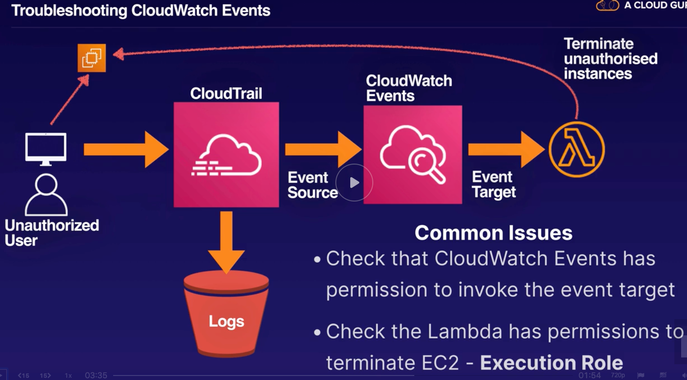
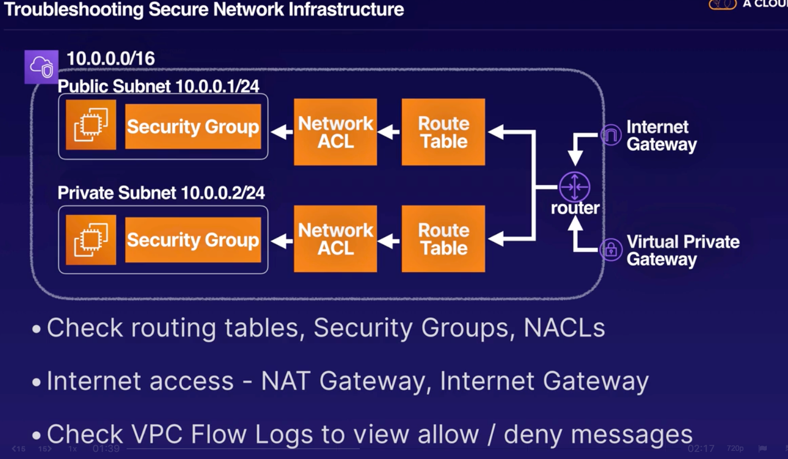
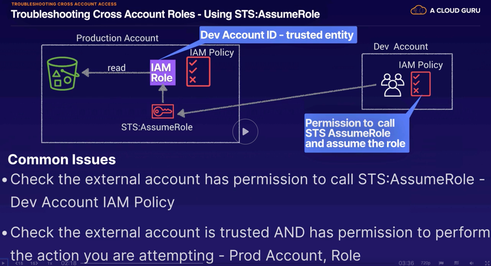
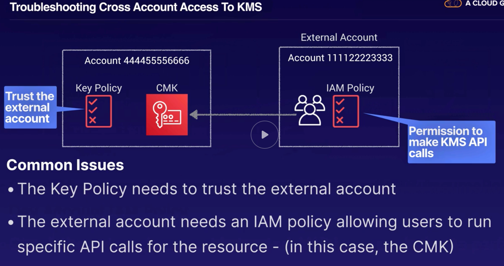
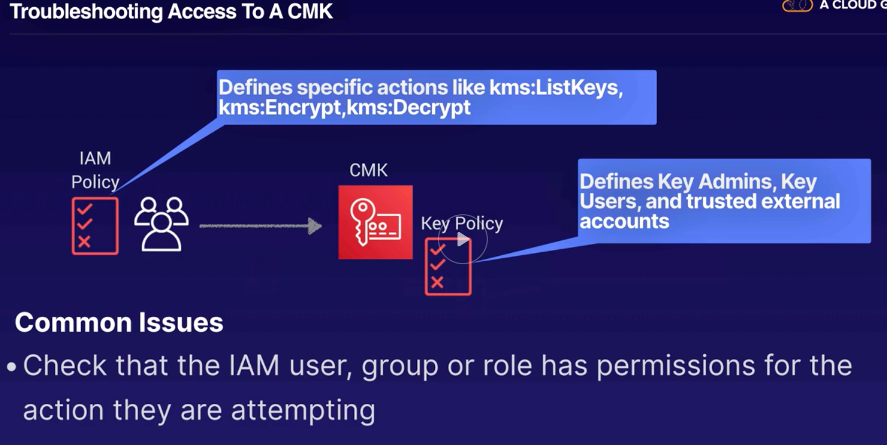

# Troubleshooting scenarios

## Troubleshooting Security Monitoring & Alerting
- Common Scenarios:
    - Does the IAM user have the correct permissions to allow them to read the Cloudwatch dashbnoard?
    - Is the Cloudwatch agent installed?
    - Is the Cloudwatch agent running?
    - Does the instance role have permission to write to Cloudwatch Logs?
    - If lambda is supposed to terminate a malicious EC2 instance and not working check that Cloudwatch Events has permission to invoke the event target and check that the lambda has permissions to terminate the EC2 (Execution Role).
    - 

## Lambda Lab
- Function Policy defines which AWS resources are allowed to invoke your function
- Execution Role defines which AWS resources your lambda function can access

## Troubleshooting Logging
- Cloudtrail logs not appearing in S3?  Check the CloudTrail is enabled
- Important to remember that S3 and Lambda Data Events are high volume so they are not enabled by default
- Check you have provided the correct S3 bucket name
- Trouble accessing the CloudTrail logs?  Check your user has read access to CloudTrail:  AWSCloudTrailReadOnlyAccess Policy

## Troubleshooting Secure Network Infrastructure
- 
- Check routing tables, Security Groups, NACLs
- Remember NACLs are stateless - you need to configure both inbound and outbound rules
- Security Groups deny by default, use NACL to explicitly deny
- If you are peering 2 VPCs, remember to configure routing tables in both VPCs
- internet access - NAT Gateway, Internet Gateway
- Check VPC Flow Logs to view allo/denu messages

## Troubleshhoting Authentication and Authorization
- Troubleshooting Conflicting Policies:
    - Least Privilege - all actions are denied by default.  You need to explicitly allow permissions for actions you want users to perform.
    - Explicit deny will always override an allow.
    - With multiple policies in play e.g IAM Policy, S3 bucket policy, S3 ACL, Key Policy...an action will only be allowed if no method explicitly denies and at least one method explicitly allows access.
    - If you are using AWS Organizations - check in case there is a SCP (Service Control Policies)
- Troubleshooting Identity Federation:
    - Use the Correct API for the Job:
        - STS:AssumeRoleWithWebIdentity
            - Authenticated by a Web Identity Provider - Facebook, etc.
        - STS:AssumeRoleWithSAML
            - Authenticated by a SAML Compliant ID Provider - AD
        - STS:AssumeRole
            - Authenticated by AWS

## Troubleshhoting Cross Account Access
- 
    - The Development account would need to add a policy to the user to enable sts:AssumeRole to the Production Account role.
    - The Production Account would need to add a trust relationship to the role that has the desired access (the sts:AssumeRole Action would need to include the account that is going to be given the role access, which in the example is the Dev Account)
- 
    - Under the KMS key policy add the other AWS account that will be given access to this CMK
    - Add a Policy in the external account with the required Actions in KMS to the CMK resource in the other account

## Troubleshhoting Lambda Access Issues
- Lambda cannot perform some action e.g write to S3, log to Cloudwatch, Terminate Instances, use a CMK, use secrets Manager, etc. - Check the `Lambda Execution Role` has the correct permissions.
- Remember that some services have their own resource-based policies which also impact who or what can access them - S3 bucket policies, key policies.
- If Cloudwatch Events or some other event source cannot invoke a Lambda function, double check that the `Function Policy` allows it

## Troubleshooting Access to KMS/CMKs
- 
