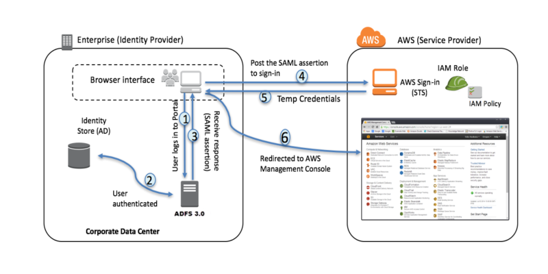

- SCP:  Service Control Policies for Organizations
    - https://docs.aws.amazon.com/organizations/latest/userguide/SCP_strategies.html

- trusted advisor vs AWS Config

- Review auto-scaling groups

- Active Directory integration with Organizations, Federation

## Incident Response
-You can configure CloudTrail to deliver log files from multiple regions to a single S3 bucket for a single account. When a new region launches in the aws partition, CloudTrail automatically creates a trail for you in the new region with the same settings as your original trail.

- Your CTO has asked you to design an automated incident response system which will detect and proactively remediate security weaknesses in your AWS account. Which of the following approaches meets the requirement?
    - Use AWS Config rules to monitor for deviations against your desired configurations, send alerts to CloudWatch events and use Lambda to automatically remediate security weaknesses

- Your Network team informs you that your application servers located in a particular subnet are being targeted by malicious actors attempting to intercept packets in your network. The activity is coming from a specific range of IP addresses. Which of the following steps can you take to quickly block this malicious activity?
    - Create a Network ACL to deny access to any traffic coming from this IP range

- If you suspect that your account is compromised, do the following: Change your AWS account root user password. Delete or rotate all root and AWS Identity and Access Management (IAM) access keys. Delete any potentially compromised IAM users, and change the password for all other IAM users. Delete any resources on your account you didn't create, such as EC2 instances and AMIs, EBS volumes and snapshots, and IAM users. Respond to any notifications you received from AWS Support through the AWS Support Center.

- You have recently fallen victim to a malicious attack which resulted in some of your EC2 instances being compromised. As part of your Incident Response Plan, one of the critical steps is to isolate any compromised instances so that they cannot communicate with any other instances in your VPC or with any third party command and control server. Your Head of Security has asked you to recommend a way to do this automatically. What do you recommend?
    - Create a restrictive Security Group which only allows SSH from a single forensic workstation. Use Lambda to replace the existing Security Group with the newly created restrictive Security Group as soon as the instance is detected as being compromised. You cannot apply a Network ACL to an instance because ACLs apply to the whole subnet.

- You can configure multiple AWS accounts to send their CloudTrail logs to the same S3 bucket. Use Athena to run SQL queries on data stored in S3.

## Data Protection
- You are working for a company which runs a financial investments blog. Your researchers work with a number of different partners to gather insights into the financial markets. You have engaged a company called TopInsights to provide a series of market research reports which they are committed to completing over the next 6 months. You have asked them to provide the completed reports in pdf format and save them to an S3 bucket that you own. TopInsights already use S3 to store all of their internal documentation. What will you need to do to enable TopInsights to deliver their reports to your S3 bucket?
    - Create an IAM role with write permission to the S3 bucket. Configure a trust relationship between your AWS account and the AWS account belonging to TopInsights.
        - When third parties require access to your organization's AWS resources, you can use roles to delegate access to them. An IAM role provides a mechanism to allow a third party to access your AWS resources without needing to share long-term credentials.

- You are working for an investment bank which is designing a new application to analyse historical trading data, and use machine learning to predict stock market performance. The application is running in AWS and needs to access the historical data stored in a proprietary time series database located in your data center. This information is highly confidential and could cause serious repercussions if any data was ever leaked to the public or your competitors. The application itself is extremely sensitive to network inconsistencies and during testing it frequently crashes if the network is not reliable. How should you configure the network connectivity for this application?
    - Configure a VPN between your VPC and the data center over a Direct Connect connection
        - With AWS Direct Connect plus VPN, you can combine one or more AWS Direct Connect dedicated network connections with the Amazon VPC VPN. This combination provides an IPsec-encrypted private connection that also reduces network costs, increases bandwidth throughput, and provides a more consistent network experience than internet-based VPN connections.
            - https://docs.aws.amazon.com/whitepapers/latest/aws-vpc-connectivity-options/network-to-amazon-vpc-connectivity-options.html

- You are designing a workflow that will handle very confidential healthcare information. You are designing a loosely coupled system comprised of different services. One service handles a decryption activity using a CMK stored in AWS KMS. To meet very strict audit requirements, you must demonstrate that you are following the Principle of Least Privilege dynamically--meaning that processes should only have the minimal amount of access and only precisely when they need it. Given this requirement and AWS limitations, what method is the most efficient to secure the Decryption service?
    - In the step right before the Decryption step, programmatically apply a grant to the CMK that allows the service access to the CMK key. In the step immediately after the decryption, explicitly revoke the grant.
        - Grants in KMS are useful for dynamically and programmatically allowing a process the ability to use the key then revoking after the need is over. This is more efficient than manipulating IAM roles or policies.

- You are using Glacier to store historical data which you need to keep for 7 years according to your company's security policy. A vault lock policy is in place to prevent the data from being tampered with. A new Head of Security has started at your company and they are in the process of updating many of the existing security policies, including reducing the retention policy for these historical files to only 5 years. You have been asked to implement the new retention policy this week, what is the best way of approaching this?
    - It is not possible to implement this. You cannot change the vault lock once it is activated

- CloudFormation, Lambda and EC2 (amongst others) all natively support the Systems Manager Parameter Store. RDS doesn't have native support for Parameter Store but you may be able to utilise Lambda in association with RDS to fulfil your requirements, indeed you could utilise Lambda in addition with any service that doesn't natively support Parameter Store.

- You have an application running in AWS which needs to import a large amount of data stored on legacy systems in your on premises data center. Your CEO has requested that you make sure the network connection is private, with reasonably consistent performance to prevent the application timing out. Which of the following approaches do you recommend?
    - Use Direct Connect

- You are planning to use KMS to encrypt data in your AWS account. According to company policy, you need to be able to rotate the CMK every three months. Which type of key should you use?
    - Use a CMK managed by you
        - You can rotate keys according to your own schedule using a customer managed CMK. An AWS managed or AWS owned CMK does not give you the option to rotate according to your own schedule. AWS managed keys automatically rotate once every three years.

- A number of users are trying to access objects in your S3 bucket, however they are receiving the error : HTTP 403: Access Denied. You have already checked the bucket ACLs and bucket policy and they look fine. You checked the IAM permissions of the users and they all have read access to the bucket. What else could be the problem?
    - The users permissions are being restricted by a Service Control Policy (AWS Organizations service control policies)
    - The objects are encrypted using KMS and the users do not have permission to decrypt them

- You are working for a large software company, developing machine learning algorithms for the healthcare industry. Your department stores the majority of its data in S3 and all data in S3 must be encrypted at rest using SSE-KMS using a CMK that you manage. Your Head of Security has just asked to you to implement controls to ensure that the same encryption key is not used for longer than 3 months. Which of the following options is the best approach?
    - Use a CloudWatch scheduled event to trigger a Lambda function to create a new CMK every three months. Keep the old key.

- Automatic key rotation is not available for CMKs that have imported key material, you will need to do this manually

- If you delete the key material, the CMK's key state changes to pending import, and the CMK becomes unusable. To use the CMK again, you must reimport the same key material. You cannot import the key material into a different key or import different key material, this will not work.

- With grants you can programmatically delegate the use of KMS CMK to other AWS principals. You can use them to allow access, but not deny it. Grants are typically used to provide temporary permissions or more granular permissions.

- Macie doesn't automatically prevent data from leaving protected zones but you can receive notifications when that happens.

- Which statements about Amazon Macie are true?
    - It can identify PII in S3 buckets
    - It can detect when large quantities of business-critical documents are shared - both internally and externally.
    - It uses NLP methods to understand data.

- You are working for a government agency and your team would like to store confidential documents in S3. Your department head agrees but insists that you design an automated approach to making sure all S3 buckets remains private. How can you ensure that this policy is adhered to in an automated way?
    - Use AWS Config to report on any changes to the public access permissions on any of your S3 buckets. Use CloudWatch Events rule to trigger a Lambda function to remove public access permissions for any S3 buckets found to be publicly accessible.
        - AWS Config enables continuous monitoring of your AWS resources, making it simple to assess, audit, and record resource configurations and changes. If AWS Config finds a policy violation, it can trigger an Amazon CloudWatch Event rule to trigger an AWS Lambda function which either corrects the S3 bucket ACL

- A client has asked you to review their system architecture in advance of a compliance audit. Their production environment is setup in a single AWS account that can only be accessed through a monitored and audited bastion host. Their EC2 Linux instances currently use AWS-encrypted EBS volumes and the web server instances sit in a private subnet behind an ALB that terminates TLS using a certificate from ACM. All their web servers share a single Security Group, and their application and data layer servers similarly share one Security Group each. Their S3 objects are stored with SSE-S3. The auditors will require all data to be encrypted at rest and will expect the system to secure against the possibility that TLS certificates might be stolen by would-be spoofers. How would you help this client pass their audit in a cost effective way?
    - Leave the S3 objects alone.
    - Make no changes to the EBS volumes.
    - Continue to use the ACM for the TLS certificate.

- Cryptographic best practices discourage extensive reuse of encryption keys. Many organizations rotate CMKs yearly, however the frequency of key rotation is highly dependent upon local laws, regulations, and corporate policies. You can minimize the blast radius of a compromised key by using different keys for different purposes rather than a single key for everything. Deleting a key must be very carefully thought out. Data can’t be decrypted if the corresponding CMK has been deleted. Once a CMK is deleted, it’s gone forever. Please read the KMS Best Practices Whitepaper for more details.

## Identity and Access Management Questions
- You have a number of AWS accounts, one for each department in your company. Your Head of Security has asked you to make sure that nobody has access to disable CloudTrail in any of your accounts. How should you do this?
    - Create a new AWS Organization, group the accounts under a single OU and use a Service Control Policy to restrict any account in the OU from stopping CloudTrail
        - Service control policies (SCPs) are one type of policy that you can use to manage your organization. SCPs offer central control over the maximum available permissions for all accounts in your organization, allowing you to ensure your accounts stay within your organization’s access control guidelines.

- You are reviewing the Key policy attached to one of your CMKs and you notice the following statement: { "Effect": "Deny", "Principal": { "AWS": "arn:aws:iam::111122223333:user/betty" }, "Action": [ "kms:Encrypt" ], "Resource": "*", "Condition": { "StringEquals": { "kms:ViaService": [ "lambda.us-west-2.amazonaws.com" ] What does this mean?
    - The first part of the statement denies Betty access to use the CMK to perform encrypt operations. The second part of the statement adds the condition that in order for the policy to take effect, the request must come from Lambda. Therefore the policy prevents the CMK from being used by betty for encrypt operations when the request comes from AWS Lambda.

- You are working as a Security Architect for an investment bank. Your client wants help setting up a way to manage access to the AWS Console and various services on AWS for their employees. They are starting out small but expect to provide AWS-hosted services to their 20,000 employees within the year. They currently have Active Directory on-premises, use VMware to host their VMs. They want something that will allow for minimal administrative overhead. Which option is best for them?
    - Connect the multiple accounts with AWS Organizations. Configure Active Directory Federation Services in the on-premises data center and configure a two way trust. Direct the users to the ADFS sign-in web page.
        - To streamline the administration of user access in AWS, organizations can utilize a federated solution with an external directory, allowing them to minimize administrative overhead. Benefits of this approach include leveraging existing passwords and password policies, roles and groups.
        - You can use federation to centrally manage access to multiple AWS accounts using credentials from your corporate directory. Federation is the practice of establishing trust between a system acting as an identity provider and other systems, often called service providers, that accept authentication tokens from that identity provider. Amazon Web Services (AWS) supports open federation standards, including Security Assertion Markup Language (SAML) 2.0, to make it easier for the systems and service providers to interact.

- Your Lambda function needs to write to the ev_charge_stations, ev_networks and ev_plugs DynamoDB tables. From a security perspective, select the best answer that describes the most suitable policy.
    - For the resource value, specify all 3 tables individually, e.g. 'arn:aws:dynamodb:region:account-ID:table/ev_charge_stations' and use 'dynamodb:PutItem' as the policy's action value.
        - Serverless applications should always follow the principle of 'least privilege'. In this case, this can be achieved by spelling out the exact actions on the specific resources.

- You need to allow users in your corporate Active Directory to access the AWS console. Which of the following configuration are valid configuration steps?
    - You will need to install ADFS, configure Active Directory as an Identity provider in AWS. ADFS federation occurs with the participation of two parties, the owner of the identity repository, which in this case is AD and the relying party, which is another application that wishes to outsource authentication to the identity provider, in this case Amazon Secure Token Service. You will need to create an IAM role which can be assumes by users once they have authenticated, using STS AssumeRoleWith SAML. You do not need to create duplicate user in AWS to match the user in AD.
    - https://aws.amazon.com/blogs/security/aws-federated-authentication-with-active-directory-federation-services-ad-fs/
    - 

- You need to allow another AWS account access to resources in your AWS account, what is the recommended mechanism to configure this?
    - Configure cross account access by creating a role in your account which has permission to access only the resources they need. Allow the third party account to assume the role based on their account ID and unique external ID
        - Roles are the primary way to grant cross-account access. With IAM roles, you can grant third parties access to your AWS resources without sharing your AWS security credentials. Instead, the third party can access your AWS resources by assuming a role that you create in your AWS account.

- You have configured your AWS account to enable federation with your corporate Active Directory environment located in your own data center. Which of the following best describes the user authentication process?
    - Corporate user accesses the corporate Active Directory Federation Services portal sign-in page and provides Active Directory authentication credentials. AD FS authenticates the user against Active Directory. Active Directory returns the user’s information, including AD group membership information. Temporary credentials are returned using STS AssumeRoleWithSAML. The user is authenticated and provided access to the AWS management console.

- You have added the following statement to your S3 bucket policy, to give a user access to all items in the bucket called mys3bucket: { "Effect": "Allow", "Action": "*", "Resource":"arn:aws:s3:::myS3bucket" } However when you try to add the policy, you get the following error: Action does not apply to any resource(s) in statement. What do you need to do resolve this?
    - Change the resource section to: "Resource":"arn:aws:s3:::myS3bucket/*"

## Infrastructure Security
- Your web application is running on an auto-scaling group of EC2 instances behind an Elastic Load Balancer. You are receiving reports of multiple malicious requests which are attempting to perform a SQL injection attack. The requests are coming from a group of IP addresses in the same range. Which of the following could you do to block these requests to prevent them from impacting your application?
    - AWS WAF is a web application firewall that helps protect web applications from attacks by allowing you to configure rules that allow, block, or monitor web requests based on conditions that you define. These conditions include IP addresses, HTTP headers, HTTP body, URI strings, SQL injection and cross-site scripting. Security Groups cannot be configured to deny access to a group of servers. GuardDuty is a Threat Detection service and cannot be used to block traffic. Inspector assesses applications for exposure, vulnerabilities, and deviations from best practices, it cannot be used to block traffic.

- You are trying to help a customer figure out a puzzling issue they recently experienced during a Resiliency verification test. They wanted to test the failover capability of their Multi-AZ RDS instance. They initiated a reboot with failover for the instance and expected only a short outage while the standby instance was promoted and the DNS path was updated. Unfortunately after the failover, they could not reach the database from their on-prem network despite the database being in an "Available" state. Only when they initiated a second reboot with failover were they again able to access the database. What is the most likely cause for this?
    - The subnets in the subnet group did not have the same routing rules. The standby subnet did not have a valid route back to the on-prem network so the database could not be reached despite being available.
        - The routes for all subnets in an RDS subnet group for a Multi-AZ deployment should be the same to ensure all master and stand-by units can be reached in the event of a failover. 

- You have been asked to design a solution to perform deep packet inspection, which of the following can you use?
    - AWS acknowledge that they do not provide any kind of deep packet inspection capability. Instead they suggest that third-party software can be used to provide additional functionality such as deep packet inspection, IPS/IDS, or network threat protection.

- You have configured a bastion host to enable your systems administrators to log in to their Linux systems from their corporate workstations. Which of the following security group rules will you need to configure to allow the team to securely access the bastion?
    - Create an inbound rule allowing access on port 22 for the corporate workstations
        - Security Groups are stateless, so no corresponding outbound rule is required.

- Your company website uses an S3 bucket configured as a website endpoint behind a CloudFront distribution, using a custom domain name. Users are only allowed to access the website using HTTPS. You want to ensure that the traffic is encrypted end-to-end between your users and the S3 bucket. Which of the following are valid steps that you will you need to do in order to configure this?
    - If using a custom domain name, you will need to provide a custom SSL certificate when creating the CloudFront web distribution. For end-to-end encryption in transit, it is not necessary to configure SSE-KMS or SSE-S3 as these are Server Side Encryption options. You cannot use the default CloudFront certificate with a custom domain name.

- You have been asked to investigate whether unrestricted SSH access is enabled to any of your EC2 instances. How should you approach this?
    - Trusted Advisor checks security groups for rules that allow unrestricted access to specific ports. AWS Config can alert you to any modifications to a security group but will not perform a check for unrestricted access.

- Which of the following services can AWS WAF be deployed with?
    - AWS WAF can be deployed on Amazon CloudFront, the Application Load Balancer, and Amazon API Gateway.  As part of Amazon CloudFront it can be part of your Content Distribution Network protecting your resources and content at the Edge locations. As part of the Application Load Balancer it can protect your origin web servers running behind the ALBs. As part of Amazon API Gateway, it can help secure and protect your REST APIs.

- You are working as a Security Architect at a large retail bank, designing a new secure website which will enable customers to apply for a personal loan online. You would like to protect your application from attacks such as SQL injection and cross-site scripting. Which of the following AWS services would you consider using when planning this website?
    - CloudFront
    - Application Load Balancer
    - AWS WAF

- Your application servers need to connect to a third party partner to access stock market data using TCP port 8194 and the following IP address: 90.10.52.154. Your subnet CIDR range is 10.0.1.0/24 and network traffic is controlled using Security Groups and Network Access Control Lists. Which of the following configurations will enable this connectivity?
    - A security group outbound rule to 90.10.52.154 on port 8194, a Network ACL outbound rule to 90.10.52.154 on port 8194 and a Network ACL inbound rule from 90.10.52.154 using ephemeral ports
        - Security Groups are stateful, so only an outbound rule is required. Network ACLs are stateful, so both an inbound and outbound rule is required. The third party will not reply using the same port, instead it will use ephemeral ports. So the Network ACL will need to allow the reply to come through using ephemeral ports.

- Your application is running on an EC2 instance in a private subnet. You have added a number of image files to an S3 bucket and you now want to your application to be able to access the files. you have configured an IAM role with permission to read files in the S3 bucket and associated this role with your EC2 instance. This is a secure internal application and your CEO has already informed you that the system must be as secure as possible. How can you configure the communication between your EC2 instance and the S3 bucket in the most secure way?
    - Create an S3 Endpoint and access the bucket using the S3 Endpoint
        - A VPC endpoint enables you to privately connect your VPC to supported AWS services and VPC endpoint services powered by PrivateLink without requiring an internet gateway, NAT device, VPN connection, or AWS Direct Connect connection. Instances in your VPC do not require public IP addresses to communicate with resources in the service. Traffic between your VPC and the other service does not leave the Amazon network.

- Your company website uses a combination of EC2 instances and S3. Your Head Of Security has asked you to implement a solution to help protect the website from DDoS attacks. Which of the following AWS Services would you recommend?
    - AWS WAF
    - CloudFront
    - AWS Shield
    - When attempting to protect your application against DDoS attacks, services such as Route 53, Amazon CloudFront, Elastic Load Balancing, and AWS WAF can all be used to control and absorb traffic, and deflect unwanted requests. AWS Shield is a managed Distributed Denial of Service (DDoS) protection service that safeguards applications running on AWS.

- You are working as a Security Architect at a large pharmaceutical company. You are responsible for the security of a large fleet of EC2 instances which run a proprietary data processing algorithm. This is a mission critical system which has taken your data scientists many years to develop. Your CISO is extremely concerned about intellectual property theft from industry competitors and has asked you to come up with a solution to protect your application from unauthorized and malicious activity and detect compromised instances. Which of the following is the best approach?
    - Use Amazon GuardDuty to report on any unusual API calls and detect compromised EC2 instances
        - AWS GuardDuty is the best option as it uses Machine Learning to detect unusual behaviour on your account including unusual API activity and it can be used to report on evidence of compromised instances.

- You are trying to connect to your Linux EC2 instance, however you have lost your private key. Which of the following steps do you need to perform in order to access your instance again?
    - If you lose the private key for an EBS-backed instance, you can regain access to your instance. You must stop the instance, detach its root volume and attach it to another instance as a data volume, modify the authorized_keys file, move the volume back to the original instance, and restart the instance.

- You are helping a client migrate over an internal application from on-prem to AWS. The application landscape on AWS will consist of a fleet of EC2 instances behind an Application Load Balancer. The application client is an in-house custom application that communicates to the server via HTTPS and is used by around 40,000 users globally across several business units. The same exact application and landscape will be deployed in US-WEST-2 as well as EU-CENTRAL-1. Route 53 will then be used to redirect users to the closest region. When the application was originally built, they chose to use a self-signed 2048-bit RSA X.509 certificate (SSL/TLS server certificate) and embedded the self-signed certificate information into the in-house custom client application. Regarding the SSL certificate, which activities are both feasible and minimize extra administrative work?
    - Import the existing certificate and private key into Certificate Manager in both regions. Assign that imported certificate to the Application Load Balancers using their respective regionally imported certificate.
        - You can import private certificates into Certificate Manager and assign them to all the same resources you can with generated certificates, including an ALB. Also note that Certificate Manager is a regional service so certificates must be imported in each region where they will be used. 
        - The imported certificate in ACM 

- You are designing a bastion host to enable your systems administrators to securely access your Linux EC2 instances. You need to explain to the provisioning team how you want them to configure the system. Which of the following options will you recommend?
    - Access to bastion hosts should be locked down to known CIDR ranges for ingress. Ports should be limited to allow only the necessary access to the bastion hosts. For Linux bastion hosts, TCP port 22 for SSH connections is typically the only port allowed. Bastion hosts are deployed in the public subnets of the VPC.

## Logging and Monitoring
- An external auditor has been commissioned to review activity in your AWS account. She has asked to review all the API events in your account over the next two weeks. Your department currently has 7 AWS accounts and the auditor will need to assess each one. Which of the following options is the best way to configure this?
    - You can have CloudTrail deliver log files from multiple AWS accounts into a single Amazon S3 bucket. Turn on CloudTrail in the account where the destination bucket will belong, Update the bucket policy on your destination bucket to grant cross-account permissions to CloudTrail, turn on CloudTrail in the other accounts you want, configure CloudTrail in these accounts to use the same bucket belonging to the account that you specified in step 1.

- You are running your web application on a number of EC2 instances behind an Application Load Balancer. You have configured the application to send error logs and security logs to CloudWatch logs. Persistent data generated by the application is stored in DynamoDB and website images and static content is stored in S3. Over the weekend the application crashed a number of times, causing a serious system outage. The application support team managed to get the system back online, but on Monday morning when they tried to access the logs to analyze what went wrong, they discover that no logs exist for this application. What might be the problem?
    - The CloudWatch Logs agent is not installed
    - The Instance role does not have permission to write to CloudWatch Logs
    - The CloudWatch Logs agent is not running

- You would like to analyse the API activity in your AWS account and have the ability to isolate activity by attributes, such as source IP address and user. Which of the following AWS services can you use to do this?
    - CloudTrail is used to record all API activity in your account. Using Athena with CloudTrail logs is a powerful way to enhance your analysis of AWS service activity. For example, you can use standard SQL queries to identify trends and further query activity by attributes, such as source IP address or user.

- You are supporting an in-house developed online credit checking application which generates a large amount of logging data, including security alerts and critical warnings. The application is mission critical for your company and your CEO wants to be informed immediately if the logs generate any security related messages. How can you configure this?
    - Configure the application to deliver the logs to CloudWatch Logs, then use a custom metric filter to trigger alarms and notifications
        - You can use CloudWatch Logs to monitor applications and systems using log data. For example, you can monitor application logs for specific literal terms, or count the number of occurrences of a literal term at a particular position in log data. When the term you are searching for is found, CloudWatch Logs reports the data to a CloudWatch metric that you specify.

- You have been asked to make sure that insecure protocols like Telnet and FTP are disabled on all of your EC2 instances. You would like to perform a regular automated review of your environment. Which of the following solutions will meet this requirement?
    - Use CloudWatch Events to schedule Amazon Inspector to complete a Runtime Behaviour Analysis check on every EC2 instance.
        - You can configure Amazon Inspector as a target for CloudWatch Events. The runtime behaviour package checks for insecure protocols like Telnet, FTP, HTTP, IMAP, rlogin etc. Neither the AWS Config restricted-common-ports check or Trusted Advisor will give you this information.

- You are responsible for the security profile of a number of mission critical applications at a large global telecommunications company. Your team lead asks you to propose a solution to trace all changes made to the AWS infrastructure. You must also prevent any evidence from tampering or deletion by malicious actors attempting to conceal unauthorized activities. Which of the following approaches do you propose?
    - Enable CloudTrail in all AWS regions and send logs to a dedicated S3 bucket. Grant read only access to the Security Team members who need to review the logs.
    - Only allow the Security Team permission to make changes in CloudTrail.
    - AWS CloudTrail is a web service that records activity made on your account and delivers log files to your Amazon S3 bucket. It is recommended to use a dedicated S3 bucket for CloudTrail logs. When you apply a trail to all regions, CloudTrail uses the trail that you create in a particular region to create trails with identical configurations in all other regions in your account. To determine whether a log file was modified, deleted, or unchanged after CloudTrail delivered it, you can use CloudTrail log file integrity validation.

- You are working on a strictly confidential project and your Chief Information Security Officer has mandated that you must make sure that none of the EC2 instances, which are being used for your project, have a public IP address. You have been told that you are responsible for enforcing this and project funding will be withdrawn if the team does not comply. How can you enforce this?
    - Use CloudWatch Events to trigger a Lambda function to remove any public IP addresses
    - Use IAM policies to deny your administrators the ability to add a public IP address
    - Use AWS Config to monitor for compliance
    - Use AWS Config to evaluate the configuration settings of your AWS resources. You do this by creating AWS Config rules, which represent your ideal configuration settings. For example, when an EC2 volume is created, AWS Config can evaluate the volume against a rule that requires volumes to be encrypted. If the volume is not encrypted, AWS Config flags the volume and the rule as noncompliant. Amazon CloudWatch Events help you to respond to state changes in your AWS resources. When your resources change state, they automatically send events into an event stream. You can create rules that match selected events in the stream and route them to your AWS Lambda function to take action.

- You are using CloudTrail to log data and management events in your account. However not everyone in the security department needs to be able to read both data and management logs. The Security Administration team need to be able to read the data events, and the Internal Audit Team need to review any management related API calls. What is the best way to configure this so that everyone gets the access they need on a least privilege basis?
    - You are using CloudTrail to log data and management events in your account. However not everyone in the security department needs to be able to read both data and management logs. The Security Administration team need to be able to read the data events, and the Internal Audit Team need to review any management related API calls. What is the best way to configure this so that everyone gets the access they need on a least privilege basis?

- Your application consists of a number of EC2 instances, behind an Application Load Balancer. You would like to capture information about the IP traffic going to and from the network interfaces in your VPC. Which of the following tools can you use?
    - Use VPC Flow Logs

- Your CTO has asked you to make sure all EC2 instances are using encryption at rest for their data volumes. You have been tasked with configuring an automated notification system to send a notification if there are any EC2 instances with EBS volumes that are not protected by encryption. Which of the following is the best approach?
    - Use an AWS Config rule to check for unencrypted volumes and send an SNS notification

- You have noticed some unusual activity in your AWS account you suspect that at least one of your instances has been compromised and is being controlled by a malicious third party. You need to quickly assess the situation, understand the extent of the problem and would like to continually monitor your infrastructure so that you can be alerted about similar attacks. Which AWS tool can you use?
    - Use GuardDuty and check if any of your instances are exhibiting unusual behavior
        - GuardDuty is a continuous security monitoring service that analyzes and processes the following data sources: VPC Flow Logs, AWS CloudTrail event logs, and DNS logs. It uses threat intelligence feeds, such as lists of malicious IPs and domains, and machine learning to identify malicious activity. For example, GuardDuty can detect unusual behaviour like sending spam emails, querying a domain name associated with a known command and control server, generating a large volume of outbound TCP traffic - all signs that the instance is being controlled by a malicious actor.

- Your CTO has asked you to monitor all S3 bucket ACLs and policies for violations which allow public read or public write access. You have also been asked to automatically remediate the violation and send a notification reporting the finding to the Security Team. Which of the following services can you use to do this?
    - AWS Config enables continuous monitoring of your AWS resources, making it simple to assess, audit, and record resource configurations and changes. If AWS Config finds a policy violation, it can trigger an Amazon CloudWatch Event rule to trigger an AWS Lambda function which either corrects the S3 bucket ACL, or notifies you via Amazon Simple Notification Service.

- You are attempting to access the CloudTrail logs to investigate a suspected security breach. However you are unable to access the logs. You have checked your IAM permissions and your user account definitely has permission to describe CloudTrail logs and look up events. What could be the problem?
    - You do not have permission to use the CMK to decrypt the logs
    - You do not have read permission for the S3 bucket

## Terms 
- LUKS:  Linux Unified Key Setup is a disk ecnryption specification.  It is the standard for Linux hard disk encryption. By providing a standard on-disk-format, it does not only facilitate compatibility among distributions, but also provides secure management of multiple user passwords.
