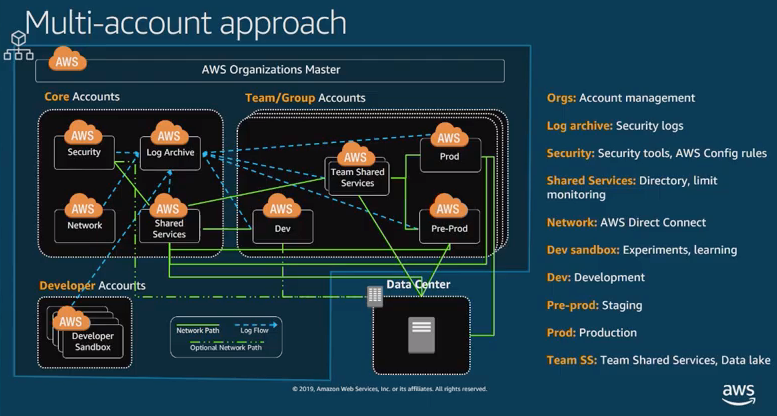
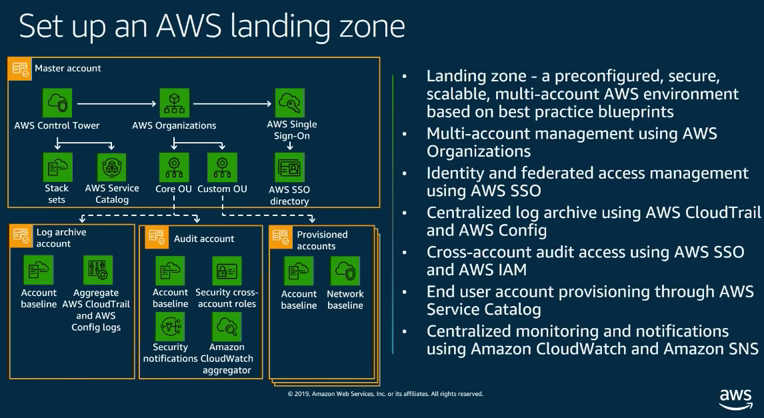

- ```AWS recommends all new landing zones start with AWS Control Tower; to build out an initial prescriptive landing zone configuration, utilize out-of-the-box guardrails and blueprints, and create new accounts using CT Account Factory.```

## Implementing your Landing Zone
- AWS account is the bet isolation boundary (API limits and throttling, billing separation, etc.)
- Account Models:
    - One Account
    - Thousands of accounts
- Goals:
    - Automated
    - Scalable
    - Self-service
    - Guardrails not blockers
    - Auditable
        - What happened?
        - Who did what?
        - When?
    - Flexibility
- Account Security considerations
    - Baseline requirements:
        - Lock
            - Root Account
        - Enable
            - AWS CloudTrail
            - Amazon GuardDuty
        - Define
            - Map enterprise roles and permissions
        - Federate
            - Use identity solutions
        - Establish
            - Infosec cross-account roles
        - Identify
            - Actions and conditions to enforce governance 
- multi-account approach
    - 
    - Think small

## The AWS Landing Zone Solution
- Launched in 2018
- Easy-to-deploy solution that automates the setup of new AWS multi-account environments
- Cloudformation template
    - Setups an AWS CodePipeline
    - Creates an Account Vending Machine
        - Account creation factory
        - User interface to create new accounts
        - Account baseline versioning
        - Launch constraints
        - Free, accessible via account manager from AWS

## Control Tower
- Managed Service version of AWS Landing Zone Solution
- Easiest way to setup and govern AWS at scale
- Account Vending Machine is called:  `Account Factory`
- Comes with 30 guard rails
- Needs to be launched in a new account which doesn't have Organizations enabled yet
- free service where you only pay for the resources it launches

## AWS Landing Zone vs AWS Control Tower
- [Comparison of AWS Landing Zone vs AWS Control Tower](images/aws_landing_zone_vs_control_tower.png)


## Terms
- landing zone:
    - A configured, secure, scalable, multi-account AWS environment based on AWS best practices
    - A starting point for net new development and experimentation
    - A starting point for migrating applications
    - An environment that allows for iteration and extension over time
    - Goal is isolation and to limit `blast radius` if something goes wrong
    - 
- AWS Landing Zone:
    - Implementation of a landing zone based on multi-account strategy guidance
- AWS Control Tower:
    - AWS Service version of AWS Landing Zone
- Cloud Center of Excellence (CCoE)
    - The primary duty of the CCoE team is to accelerate cloud adoption through cloud-native or hybrid solutions. 
    - The objective of the CCoE is to: Help build a modern IT organization through agile approaches to capture and implement business requirements.

## References
- AWS re:Inforce 2019: Using AWS Control Tower to Govern Multi-Account AWS environments
    - https://www.youtube.com/watch?v=2t-VkWt0rKk
- AWS re:Inforce 2019:  Implementing your Landing Zone
    - https://www.youtube.com/watch?v=nNy5UjzejNc