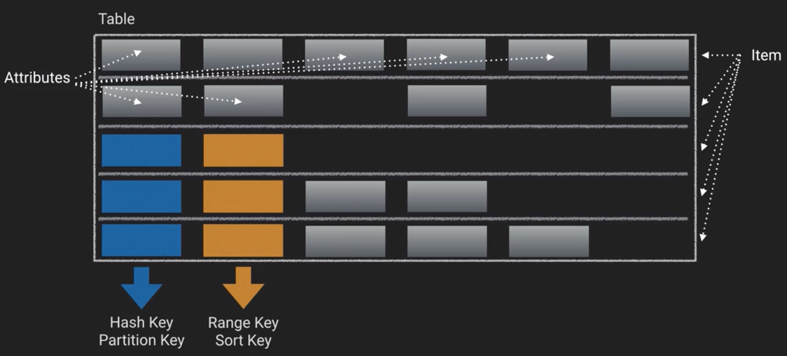
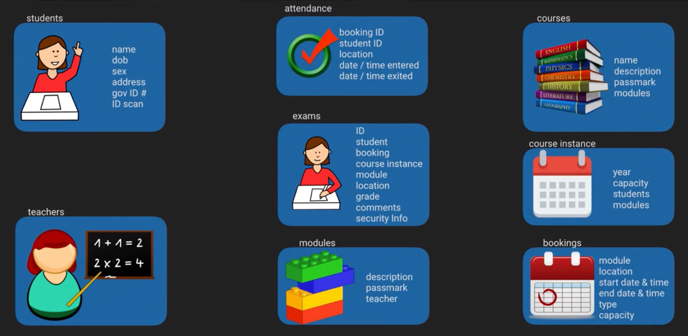
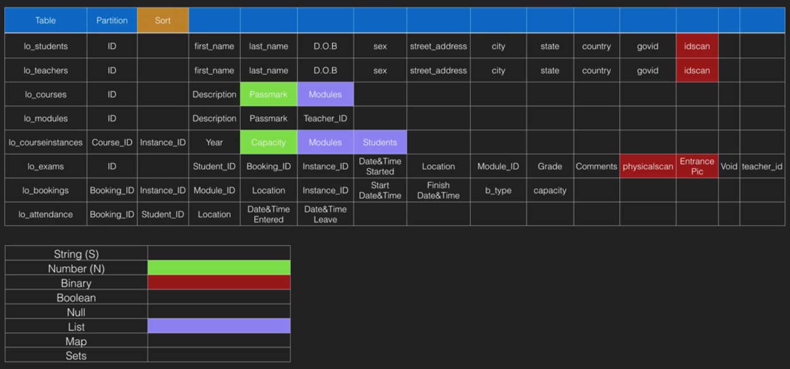
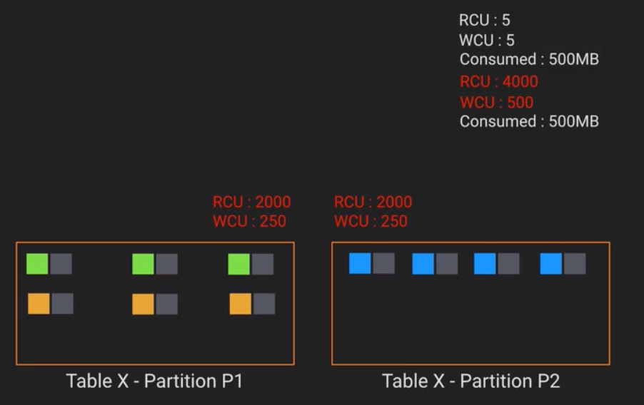

## Introduction
- A fully managed, NoSQL Database Service
- Predictable, fully managed performance with seamless scalability
- No visible servers
- No practical storage limitations
- Fully resilient and highly available
- Performance scales in a consistent, logical and linear way
- Full and deep integration with AWS IAM - rich security model
- DynamoDB is a collection of Tables
- Tables are the highest level structure within a Database
- Table names have to be unique within each account+region.
- Performance is managed at a table level
- DynamoDB uses the performance directive and the data model to manage underlying resource provisioning
- *DynamoDB Table Components*
- Local Secondary Indexes can only be created when the table is created 
- 3 main types of attributes:
    - Scalar
        - String
        - Number
        - Binary
        - Boolean
    - Set (ordered is not enforced)
        - String Set
        - Number Set
        - Binary Set
    - Document
        - List (Ordered set of values, can contain different data types)
        - Map (JSON)
- Max size of dynamoDB item it 400kB

## DynamoDB Consistency Model
- DynamoDB uses SSD Storage
- Consistent, reliable low latency reads and writes
- Every data block is stored 3 times
- Eventual Consistency
- If you need strong consistency you can issue a strongly consistent read, which will return the latest data.
    - Strongly consistent reads is more expensive, since each read needs to check multiple data locations

## Controlling Table Performance
- Note:  When AWS talks about capacity they're not talking about volume of data but about performance
- Capacity is defined per table
- Separate Read and Write controls
- Changeable at Any Time - it is an async operation
- Be deliberate & cautious when changing since it does things
- Be especially cautious of More than 3,000 RCU or 1,000 WCU
- Try and limit use to `Long Term` requirements
    - More than 3-4 changes per year is a bad model design syntom
- `Four` decreases per table per calendar day (UTC)
    - However you can increase performance as often as you'd like
- Read Capacity Units - `RCU` - 1 RCU is `up to 4 kB` data (smaller amounts get rounded to 4 kB)
- Write Capacity Units - `WCU` - 1 WCU is `up to 1 kB` data (smaller amounts get rounded to 1 kB)
- Both are allocated on a `per second` basis
- Examples:  
    - 10 RCU means 10 read operations in one second each of which can be 4 kB in size or less, total of 40 kB/sec of read
    - 3kB read = 3kB/4kB = 0.75 = 1 RCU (Always round to the next highest boundary)
    - 6kB read = 6kB/4kB = 1.5 = 2 RCU (Always round to the next highest boundary)
    - 1.5kB write = 1.5kB/1kB = 1.5 = 2 WCU
- Eventually consistent reads use `Half` of the above RCU
- Minimum RCU or VCU on a table is "1"
- The default is eventual consistent reads setup
- To calculate the item size of a table you have to consider:
    - The attribute `VALUES` of the item (encoded size)
    - The attribute `NAMES` of the item (encoded size)
    - PRO TIP:  Use short attribute names

## Data Model Design - v1
- Questions to answer before design:
    - What `data groups` exist in the system...how `large` are they?
    - `When` will the data be accessed?
        - Uniform vs Non-uniform access...
    - What `access patterns` will the data have?
    - How will the data `grow` over time?
    - Will all data in the time series have `equal access`?
        - Immediate, recent, semi-recent, older archived
    - `What operations` will be run against the data?
        - Business processes?
        - Formally plan the flow of data before writing code
    - Are `different perspectives` on data needed
        - This influeces index design
    - What are the `batch processing` needs?
    - Does the system have any `real-time` needs?
- Learning online Case Study
    - High level system overview:
        - Online Education Provider - 80 countries, 20,000 staff, 100 million students
        - 25,000 courses available
        - 100,000 Exams daily - Real, Mock, Classroom
        - System manages students, teachers, exams, attendance, courses, facilities bookings and more...
    - Design decisions
        - Group data together based on usage and type
        - one table for Students and another one for Teachers since access patterns may be different
    - *Online Learning Class Data Elements*
    - *Online Learning Model V1*
- Pro Tip:  namespace your tables to identify the application to which they belong since in dynamodb there's no notion of database
- Pro Tip:  When modeling datetimes it is better to use Number type and represent them as Unix epoch numbers

## Working with Items
- The partition key and the sort key form the composite primary key and the combination has to be unique
- There's no schema restriction in dynamodb at the item level
- `put-item` is idempotent and either does an insert, an update or nothing if the item already exists
- `update-item` is more efficient for updating data since it can all be done in one operation
- `delete-item` is idempotent and does not require you to validate that item exists
    - Still consumes WCU even if deleted item had already been deleted
- `get-item`
    - input partition key value and sort key value (if defined) for an item
    - By default retuns `eventually consistent` data
    - Cannot be used against an index (global or local)
- `query`
    - input P-key value OR 
        - P-key value AND a S-key value, or `range of values` (using operators such as `<`, `>`, `BETWEEN`, etc.)
        - Returns all or the set of specified attributes in the query
        - if not results it returns a results block, with no items
        - By default returns eventually consistent data but can specify parameter `--consistent-read`
        - Can filter on `Non key values`
            - Any discarded values are `still charged for`, capacity wise
            - output includes `count` which represents the returned results and `scan` which represents the scanned results, you get billed based on the scanned results
        - Can query indexes (local or global)
- `scan`
    - input is table name
    - output is by default `all items & attributes in the table`
    - Filtering is possible but still `ALL DATA` is read
    - By default returns eventually consistent data (can be changed specifying `--consistent-read`)
    - Try to avoid this command, only when you need to search on NON key/indexed attributes
    - They're very expensive!

## Partitions
- Underlying `storage` and `processing` nodes of dynamodb
- Initially `One table` equals `One partition`
- You can't `directly see` the number of partitions
- You don't `directly control` the number of partitions
- A partition can store `10 GB` of data
- A partition can deliver `3000 RCU` or `1000 WCU`
- There is a Relationship between `performance required`, `data stored` and the `number of partitions`
- When `> 10 GB` or `> 3000 RCU` or `> 1000 WCU` required a `new partition is added` and the `data is spread between them` over time
- You have an indirect mechanism to control the number of partitions via the data stored or the performance required
- *Example table performance distribution with partitions*

## Batch Operations
- `BatchGetItem`
    - 1 or `max 100` items, from 1 or more tables, `max 16 MB`
    - Providing the whole key (Partition or Partition/Sort)
    - `ValidatioException` occurs if you ask for more than 100 items
    - `ProvisionedThroughputExceededException` if all Items fail
    - More than 16MB of data will return part & unprocessed keys
    - Items are atomic, the batch is not
    - Items retrived in parallel but also `unordered`
    - Non-existent items `consume 1 or .5 RCU`
    - AttributesToGet - allows filtering of results (you are still billed)
    - Generally used in a loop
- `BatchWriteItem`
    - Up to 25 items, 400kB item limit, 16MB total request limit
    - Each item is written separately - still have the per/item waste
    - Each item is atomic, all of it works or doesn't
    - BatfchWriteItem isn't atomic, it can be partially successful
    - Any unprocessed items are returned
    - If all items fail then the operation fails
    - Used in loops, with exponential backoff
    - 1 or more tables
    - Put and Delete
    - `Parallel`, lower `latency`, better `performance`
    - Even if parallel, individual WCU's consumed
    - Deletes cost 1 WCU, even if item doesn't exist
    - 1 Operation type per item, more and entire operation fails
    - If key attributes don't match, entire operation fails
    - > 25 items make entire operation fail

## Conditional & Update Expressions
- Ask dynamodb to perform server-side manipulation
- Conditional write expresisons are available to the `Put, Update, and Delete` Item Operations
- Do `something` only if `condition`
- Examples of Conditions:
    - Attribute `Exists` or `Not_Exists` 
    - Attribute `Type`
    - Attribute `begins_with`, `contains`, or has `size x
    - Uses traditional scalar comparators (`-, =, <>, <, >, <=, >=`)
    - Also support `Between` or `In`
- `Update-item`
    - `Atomic Counters`
    - `ReturnValues``
    - `No Cost`..small time overhead but no RCU consumed
    - `Strongly` consistent

## DynamoDB sample Commands
- ```$ aws dynamodb list-tables```
- ```$ aws dynamodb describe-table --table-name weatherstation_data```
- ```$ aws dynamodb create-table --cli-input-json [file]```
- ```$ aws dynamodb create-table --generate-cli-skeleton```
    - Generate json skeleton for creating a dynamoDB table
- ```$ aws dynamodb wait table-exists --table weatherstation_data```
    - Waits in the background until the table exists, the table can be created somewhere else, either in the console or terminal 
- ```$ aws dynamodb put-item help```
    - Get help on the put-item command
- ```aws dynamodb get-item --table-name weatherstation_data --key '{"station_id" : {"S" : "1"}, "dateandtime" :{"S" : "201601030743"}}'```


## CAP Theorem
- Analogous to product iron triangle:  Scope, Cost and Time
- Consistency, Availability and Partition Tolerance

## References
- Course resources:
    - https://github.com/ACloudGuru/DynamoDB-B2P