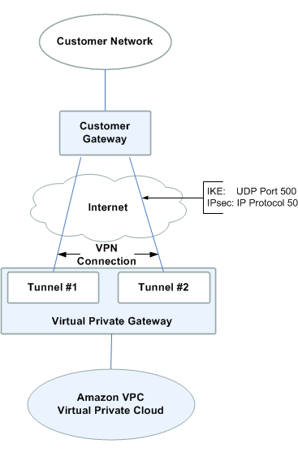

# VPC
- Build your own VPC from memory before the exam
- Virtual Data Center in the cloud
- You can create a hardware VPN connection between your corporate datacenter and your VPC and leverage the AWS cloud as an extension of your corporate datacenter
- Collection of internet gateways, virtual private gateways (for VPNs), route tables, network ACLS, security groups, EC2 instances, public subnets and private subnets.
- Internet Assigned Numbers Authority (IANA) has 3 different sets of IP addresses reserved for private IP address ranges (RFC 1918):
    - 10.0.0.0-10.255.255.255 (10/8 prefix)
    - 172.16.0.0-172.31.255.255 (172.16/12 prefix)
    - 192.168.0.0-192.168.255.255 (192.168/16 prefix)
- CIDR:  Classless Inter-Domain Routing)
    - https://www.dougv.com/2016/12/quick-simple-guide-cidr-ip4-address-ranges/
    - The /XX number in CIDR notation tells me the netmask I want to use. So, using our example:
        10.0.0.0/16
        I can subtract that netmask from the total number of available addresses in IP4, to get the number of addresses specified by the CIDR notation: 2^{32 - 16} = 2^{16} = 65,536
        10.0.0.0/28
        I find that 2^{32 - 28} = 2^{4} = 16; there are 16 addresses in that range.
    - cidr.xyz
- 10.0.0.0/16 is the largest subnet that you can use within your VPC
- /28 is smallest subnet that you're allowed to have in a VPC
- What can we do with a VPC?
    - Launch instances into a subnet of our choosing
    - Assign custom IP address ranges in each subnet
    - Configure route tables between subnets
    - Create internet gateway and attach it to our VPC
    - We get better security controls over our AWS resources
    - Instance security groups
    - subnet network access control lists (ACLS)
- Default VPC vs custom VPC
    - Default VPC is user friendly, allowing you to immediately deploy instances
    - All Subnets in default VPC have a route out to the internet
    - Each EC2 instance has both a public and private IP address
- VPC Peering
    - Allows you to connect one VPC to another via a direct network route using private IP addresses
    - Instances behave as if they were on the same private network
    - You can peer VPC's with other AWS accounts as well as with other VPCs in the same account
    - Peering is in star configuration, ie 1 central VPC peers with 4 others, the 4 other don't peer between themselves (no transitive peering)
        - ex:  VPCA peers with VPCB and VPCC, for VPCB to see instances in VPCC a separate VPC peering between them is required
    - You can peer between regions
- 1 subnet = 1 AZ
    - 1 subnet cannot spread across multiple AZs, you can have multiple subnets in one AZ
- Security Groups are stateful, ACLs are stateless
    - In ACLs when you open a port on inbound it doesn't automatically open on outbound, you have to add a separate rule for outbound as well
- VPC CIDR sizes must be between a /16 netmask and /28 netmask.
- When we create a new VPC it doesn't create any subnets
- If a subnet's traffic is routed to an internet gateway, the subnet is known as a public subnet
- If a subnet doesn't have a route to the internet gateway, the subnet is known as a private subnet
- If a subnet doesn't have a route to the internet gateway, but has its traffic routed to a virtual private gateway for a Site-to-Site VPN connection, the subnet is known as a VPN-only subnet.
- https://docs.aws.amazon.com/vpc/latest/userguide/VPC_Subnets.html
- 5 IP addresses are reserved by subnet:
    - Network Address
    - VPC Router
    - Reserved by AWS (DNS server of VPC)
    - Reserved by AWS
    - Network broadcast address
    - NOTE:  The reserved IP addresses are the first 4 and the last one 
- Always keep main route table as private and then have separate route tables for the public and private subnets
- Any subnet is automatically going to be associated with the main route table
- In route tables 0.0.0.0/0 means, effectively, all-wild-card. So traffic going anywhere is re-directed to the Internet Gateway. Which is exactly what you want to access the internet :).  Means "everything else" other than what is already specified in your routing table.
- Security groups do not span VPCs
- The AZ's are randomized, US-Eas-1A in your AWS account can be a completely AZ to US-East-1A in another AWS account
- A route table can be associated with multiple subnets; however, a subnet can only be associated with one route table at a time. Any subnet not explicitly associated with a table is implicitly associated with the main route table by default.
- To be able to ping an instance you need to allow ICMP traffic in the security group associated to it
- By default, custom VPCs does not have DNS Hostnames enabled. So when you launch an EC2 instance in custom VPC, you do not have a public DNS name. You should go to VPC actions and Edit DNS Hostnames and enable it to have DNS hostnames for the resources within VPC.
- Steps to Create Custom VPC:
    1. Create VPC
        - Data elements:
            - Name
            - CIDR Block
        - Defaults:
            - The VPC main route table is created 
            - A default Network ACL is created allowing inbound traffic from everywhere and outbout traffic everywhere
            - A default SG is created allowing all inbound traffic
    2.  Create subnets
        - For each subnet:
            - Specify AZ (only one option per subnet)
            - Define CIDR Range (has to be smaller than the VPC's)
            - If want to include public IP addresses in subnet edit option:  `Enable Auto-assign public IPv4 address`
    3.  Create an Internet Gateway and attach it to the VPC
        - 1 IGW per VPC
    4.  Create a separate route table for the public subnet and leave the main route table for the private subnet
        - Add a route to the IGW using 0.0.0.0/0 (everything) or ::/0 (IPv6)
    5.  Create EC2 instances and assign them to subnets
    6.  Create NAT Gateway in the public subnet with an EIP
    7.  Create a route in the main route table (private subnet) using 0.0.0.0/0 to the NAT Gateway
    8.  Create NACLs for each subnet
        - New NACLs by default block everything
    9. Create SG and associate them to instances
        - For new SGs all inbound traffic is blocked by default
- bespoke VPC
    - Same as non-default or custom
    - A VPC that you setup yourself    

## Route Tables
- Every route table contains a local route for communication within the VPC over IPv4. If your VPC has more than one IPv4 CIDR block, your route tables contain a local route for each IPv4 CIDR block. If you've associated an IPv6 CIDR block with your VPC, your route tables contain a local route for the IPv6 CIDR block. You cannot modify or delete these routes.
- For any route table, the local route cannot be edited or deleted.
- Whenever a subnet is created by default, it is associated with the main route table. We need to explicitly associate the subnet to the custom route table if different routes are required for main and custom route tables
- You can associate secondary IPv4 CIDR blocks with your VPC. When you associate a CIDR block with your VPC, a route is automatically added to your VPC route tables to enable routing within the VPC (the destination is the CIDR block and the target is local).

## Internet Gateway
- You can only have 1 IGW per VPC
    - AWS designed IGW to be HA (Highly Available)

## NAT Instances and NAT Gateways
- NAT instances are individual EC2 instances
    - Each EC2 instance performs source/destination checks by default. This means that the instance must be the source or destination of any traffic it sends or receives. However, a NAT instance must be able to send and receive traffic when the source or destination is not itself. Therefore, you must disable source/destination checks on the NAT instance.
    - Problem is that it becomes a single point of failure as well as a bottleneck for outbount internet traffic
- NAT Gateway is a HA (Highly Available) Gateway that allows you to have your private subnets communicate out to the internet without becoming public
- When creating the NAT gateway it has to be placed in the subnet that is public

## NAT Instances
- Getting deprecated but still appear on the exam
- When creating a NAT instance, disable Source/Destination Check on the instance
    - Source/destination check means that the instance must be the source or destination of any traffic it sends or receives.
    - a NAT instance must be able to send and receive traffic when the source or destination is not itself
- NAT instances must be in a public subnet
- There must be a route out of the private subnet to the NAT instance, in order for this to work
- The amount of traffic that NAT instances can support depend on the instance size.  If you are bottlenecking, increase the instance size to a larger instance type
- You can create HA using Autoscaling Groups, multiple subnets in different AZs, and a script to automate failover
- Are always behind a Security Group

## NAT Gateways
- Redundant inside the AZ
- They cannot span AZs
    - You can only have one NAT Gateway inside one AZ
- Start with throughput of 5Gbps and scale currently to 45Gbps
    - They scale automatically
- No need to patch OS
- Not associated with any SG (Security Groups)
- Automatically assigned a public IP address
- Remember to update your route tables
- No Need to disable source/destination checks
- To create an AZ-independent architecture, create a NAT gateway in each AZ and configure your routing to ensure that resources use the NAT gateway in the same AZ
- The NAT gateway sends the traffic to the internet gateway using the NAT gateway’s Elastic IP address as the source IP address.
- You can't share NAT gateways across VPCs
- When creating NAT Gateway, there is an option to select subnet in which NAT Gateway will be created. This must be a public subnet which has a route to internet through Internet Gateway.
    - If a private subnet is selected when creating NAT Gateway, it cannot route traffic to internet and hence the requests would fail.
- NAT Gateway cannot be created without an elastic IP address. During the creation of NAT Gateway, Elastic IP Allocation ID is a mandatory field without which we cannot proceed to create NAT Gateway.

## Network Access Control List (NACLs)
- Ephemeral ports:
    - Short-lived transport protocol port for Internet Protocol (IP) communications.
    - NAT Gateways uses ports 1024-65535
    - When a client initiates a request it chooses a random source port (ephemeral port) from a predefined range and "expects a response only at that port". 
- Your VPC automatically comes with a default network ACL, and by default it allows all outbound and inbound traffic
- You can create custom network ACLs.  By default, each custom network ACL denies all inbound and outbound traffic until you add rules.
- Each subnet in your VPC must be associated with a network ACL.  If you don't explicitly associate a subnet with a network ACL, the subnet is automatically associated with the default network ACL.
- You can block IP addresses using network ACLs, not with Security Groups
- You can associate a network ACL with multiple subnets, however, a subnet can only be associated with only one netwwork ACL at a time.  When you associate a network ACL with a subnet, the previous association is removed
- Network ACLs contain a numbered list of rules that is evaluated in order, starting with the lowest numbered rule
- Network ACLs have separate inbound and outbound rules, and each rule can either allow or deny traffic
- Network ACLs are stateless; responses to allowed inbound traffic are subject to the rules for outbound traffic (and vice versa)
- Network ACLs get evaluated before Security Groups

## Custom VPCs and ELBs
- Load balancers are created from within EC2 dashboard
- 3 types:
    - Application Load Balancer
    - Network Load Balancer
    - Classic Load Balancer
- You cannot create an internet-facing load balancer and associate it to a subnet without an Internet Gateway (private)
- At least 2 public subnets must be specified when creating an internet-facing load balancer

## VPC Flow Logs
- Feature that enables you to capture information about the IP traffic going to/from network interfaces in your VPC
- Flow log data is stored using Amazon Cloudwatch Logs
- Flow Logs can be created at 3 levels:
    - VPC
    - Subnet
- You can log all traffic, Accepted, or Rejected only
- Flow log record syntax:  <version> <account-id> <interface-id> <srcaddr> <dstaddr> <srcport> <dstport> <protocol> <packets> <bytes> <start> <end> <action> <log-status>
- You cannot enable flow logs for VPCs that are peered with your VPC unless the peer VPC is in your account
- You cannot tag a flow log
- After you create a flow log you cannot change its configuration, for example you can't associate a different IAM role with the flow log
- Not all IP traffic is monitored, the following is not monitored:
    - Traffic generated by instances when they contact the Amazon DNS server
    - Traffic generated by a Windows instance for Amazon Windows license activation
    - Traffic to/from:  169.254.169.254 for instance metadata
    - DHCP traffic
    - Traffic to the default IP addresses for the default VPC router
- They are not PCI compliant

## Bastions
- SSH for linux
- RDP for Windows
- Used to securely administer EC2 instances 
- You cannot use a NAT Gateway as a bastion host

## Direct Connect
- Cloud service solution that makes it easy to establish a dedicated network connection from your premises to AWS
- Useful for high throughput workloads (ie lots of network traffic)
- If you need a stable and reliable secure connection

## VPC Endpoints
- Enables you to privately connect your VPC to supported AWS services and VPC endpoint services powered by PrivateLink without requiring an internet gateway, NAT device, VPN Connection, or AWS Direct Connect connection.
- Instances in your VPC do not require public IP addresses to communicate with resources in the service
- Traffic between your VPC and the other service does not leave the Amazon network
- Virtual Devices
- Horizontally scaled, redundant, and highly available
- 2 types of VPC endpoints:
    - Interface Endpoints
        - Elastic Network Interface (ENI) with a private IP address that serves as an entry point for traffic destined to a suppoted service
        - This ENI is attached to EC2 instance and that will allow to communicate to supported services using the Amazon internal network 
    - Gateway endpoints
        - Supported for:
            - S3 
            - DynamoDB
- In order for EC2 instance to communicate with S3 a role is required and the new role can be associated to a running instance
    - right click + isntance settings + Attach/Replace IAM Role
- VPC Endpoint always takes precedence over NAT Gateway or Internet Gateway.
- VPC endpoint has a policy which by default allows all actions on all S3 bucket when using an S3 Gateway endpoint.
- Gateway endpoint limitations:
    - Endpoint connections cannot be extended out of a VPC. Resources on the other side of a VPN connection, VPC peering connection, AWS Direct Connect connection, or ClassicLink connection in your VPC cannot use the endpoint to communicate with resources in the endpoint service.
    - You must enable DNS resolution in your VPC, or if you're using your own DNS server, ensure that DNS requests to the required service (such as Amazon S3) are resolved correctly to the IP addresses maintained by AWS

## VPC Peering
- For Destination, enter the IPv4 address range to which the network traffic in the VPC peering connection must be directed. You can specify the entire IPv4 CIDR block of the peer VPC, a specific range, or an individual IPv4 address, such as the IP address of the instance with which to communicate. For example, if the CIDR block of the peer VPC is 10.0.0.0/16, you can specify a portion 10.0.0.0/28, or a specific IP address 10.0.0.7/32.
- To send private IPv4 traffic from your instance to an instance in a peer VPC, you must add a route to the route table that's associated with your subnet in which your instance resides. The route points to the CIDR block (or a portion of the CIDR block) of the peer VPC in the VPC peering connection.
- The owner of the other VPC in the peering connection must also add a route to their subnet's route table to direct traffic back to your VPC. For more information about supported route table configurations for VPC peering connections.
- If either VPC in a peering relationship has one of the following connections, you cannot extend the peering relationship to that connection (edge to edge routing through a gateway or private connection is not supported):
    - A VPN connection or an AWS Direct Connect connection to a corporate network
    - An internet connection through an internet gateway
    - An internet connection in a private subnet through a NAT device
    - A VPC endpoint to an AWS service; for example, an endpoint to Amazon S3.
    - (IPv6) A ClassicLink connection. You can enable IPv4 communication between a linked EC2-Classic instance and instances in a VPC on the other side of a VPC peering connection. However, IPv6 is not supported in EC2-Classic, so you cannot extend this connection for IPv6 communication

## VPC VPN Connections
- An Amazon VPC VPN connection links your data center (or network) to your Amazon Virtual Private Cloud (VPC). A customer gateway is the anchor on your side of that connection. It can be a physical or software appliance. 
- The anchor on the AWS side of the VPN connection is called a virtual private gateway.
- VPN Connection Diagram:
    - 
- You must have a VPC with Hardware VPN Access, an on-premise Customer Gateway, and a Virtual Private Gateway to make the VPN connection work.

## Questions and Answers
- Are you permitted to conduct your own vulnerability scans on your own VPC without alerting AWS first?
    - Depends on the type of scan and the service being scanned.  Some scans can be performed without alerting AWS, some require you to alert.  
- In a custom VPC with new subnets in each AZ, there is a route that supports communication across all subnets/AZs. Plus a default SG with an allow rule 'All traffic, all protocols, all ports, from anything using this default SG'.
- You can only have one Internet Gateway per VPC
- You may peer a VPC to another VPC that's in your same account, or to any VPC in any other account.
- An application load balancer must be deployed into at least two subnets.
- Which of the following is a chief advantage of using VPC endpoints to connect your VPC to services such as S3?
    - Traffice between your VPC and the other service does not leave the Amazon network
- In a default VPC, all Amazon EC2 instances are assigned two IP addresses at launch. What are they?
    - A private IP address & public IP address
- When I create a new security group, all outbound traffic is allowed by default.
- By default, how many VPCs am I allowed in each AWS region?
    - 5
- In Amazon EC2, the private IP addresses only returned to Amazon EC2 when the instance is stopped or terminated
    - So in Amazon VPC, an instance retains its private IP

